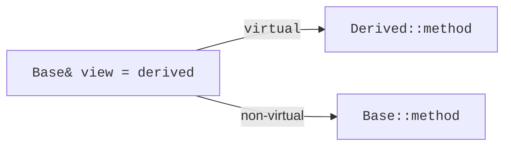
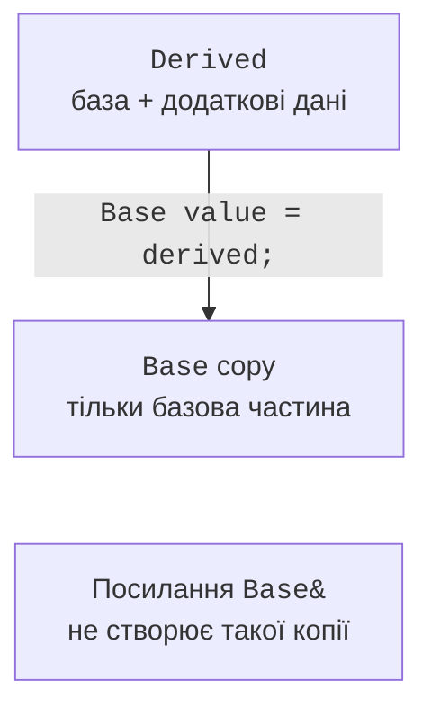

# protected та ієрархія винятків

## Доступ, protected та повторне використання

За публічного наслідування публічні члени бази лишаються публічними,
захищені – захищеними. Закриті члени бази існують у підоб’єкті,
але похідний клас не отримує прямого доступу до них. Він користується
дозволеним інтерфейсом так само, як інші учасники контракту.

`protected` дозволяє доступ похідним класам, але не всім користувачам.
Захищений метод часто кращий за захищене поле: метод зберігає
перевірку, а поле дозволяє похідному коду довільно порушувати інваріант.
У прикладі працівника захищена функція повертає базову оплату;
оклад лишається закритим.

За protected-наслідування публічні й захищені члени бази стають
захищеними в похідному класі; за private-наслідування – закритими.
Ці форми не виражають звичайне зовнішнє «є»: користувач не завжди
може неявно перетворити похідний об’єкт на базове посилання.
Для повторного використання реалізації композиція часто простіша.

Ключове слово `final` може завершити окреме заміщення або весь клас.
Воно документує, що подальша зміна цього поліморфного контракту
не передбачається. Це не заміна інкапсуляції та не гарантія
загальної безпеки: приватні поля й перевірки аргументів залишаються
потрібними незалежно від заборони подальшого наслідування.

Побудову показано на рис. 10.5.



Рис. 10.5. Статичний і динамічний вибір функції {.caption}

### Приклад 3. Оплата працівників

**Умова.** Додати премію через похідний клас без відкриття поля окладу.

```cpp
#include <cassert>
#include <print>
#include <stdexcept>
class Employee {
    int salary_;
protected:
    int basePay() const { return salary_; }
public:
    explicit Employee(int n) : salary_(n) {
        if (n < 0 || n > 1'000'000)
            throw std::invalid_argument("salary");
    }
    virtual ~Employee() = default;
    virtual int pay() const { return basePay(); }
};
class BonusEmployee final : public Employee {
    int bonus_;
public:
    BonusEmployee(int salary, int bonus)
        : Employee(salary), bonus_(bonus) {
        if (bonus < 0 || bonus > 100'000)
            throw std::invalid_argument("bonus");
    }
    int pay() const override { return Employee::pay() + bonus_; }
};
int main() {
    BonusEmployee worker{1000, 200};
    const Employee& view = worker;
    assert(view.pay() == 1200);
    Employee zero{0}; assert(zero.pay() == 0);
    try { BonusEmployee bad{10, -1}; assert(false); }
    catch (const std::invalid_argument&) {}
    std::println("Навчальна виплата: {}", view.pay());
}
```

Похідний клас доповнює базову формулу. Оклад закритий, доступ до нього опосередкований. Це навчальна модель умовних одиниць без реальних податкових правил.

Результат виконання:

```text
Навчальна виплата: 1200
```


Рис. 10.6. Невідповідна сигнатура override {.caption}

## Ієрархія винятків та перехоплення

Винятки також утворюють ієрархію типів. Базовий `AppError` дозволяє
перехопити всі помилки застосунку, а `ValidationError` та
`NotFoundError` відокремлюють причини. Користувач вирішує, на якому
рівні йому потрібна реакція: повторити введення чи припинити сценарій.

Перехоплюйте поліморфні винятки за константним посиланням.
Перехоплення за значенням створює копію оголошеного типу й може
зрізати похідну частину. Порядок обробників важливий: конкретні
похідні типи мають стояти до загальної бази, інакше загальна гілка
перехопить їх першою.

Успадкування конструкторів записом `using Base::Base` дозволяє
використати конструктори бази для створення похідного об’єкта
за відповідними мовними правилами. Воно не копіює готовий об’єкт
і не гарантує перевірки нових полів, які додано в похідному класі.
Якщо з’являється новий інваріант, часто потрібен власний конструктор.

Для навчального прикладу текст `what()` лише пояснює помилку.
Логіка програми не повинна розрізняти типи порівнянням цього тексту:
повідомлення може змінитися чи бути локалізованим. Розрізнення
через тип винятку є точнішим і перевіряється компілятором.

Побудову показано на рис. 10.7.



Рис. 10.7. Копія базового значення втрачає похідну частину {.caption}

### Приклад 4. Власні винятки

**Умова.** Розрізнити помилковий ідентифікатор та відсутній запис за типом винятку.

```cpp
#include <cassert>
#include <print>
#include <stdexcept>
struct AppError : std::runtime_error {
    using std::runtime_error::runtime_error;
};
struct ValidationError : AppError { using AppError::AppError; };
struct NotFoundError : AppError { using AppError::AppError; };
void findRecord(int id) {
    if (id <= 0) throw ValidationError("positive id required");
    if (id != 7) throw NotFoundError("record missing");
}
int main() {
    int validation = 0, missing = 0;
    for (int id : {0, 3, 7}) {
        try { findRecord(id); std::println("Знайдено: {}", id); }
        catch (const ValidationError&) { ++validation; }
        catch (const NotFoundError&) { ++missing; }
        catch (const AppError&) { assert(false); }
    }
    assert(validation == 1 && missing == 1);
    std::println("Валідація: {}; відсутні: {}", validation, missing);
}
```

Спеціалізовані обробники стоять перед загальним. Наслідування конструкторів переносить можливість задавати повідомлення, але логіка вибору причини міститься у findRecord.

Результат виконання:

```text
Знайдено: 7
Валідація: 1; відсутні: 1
```
