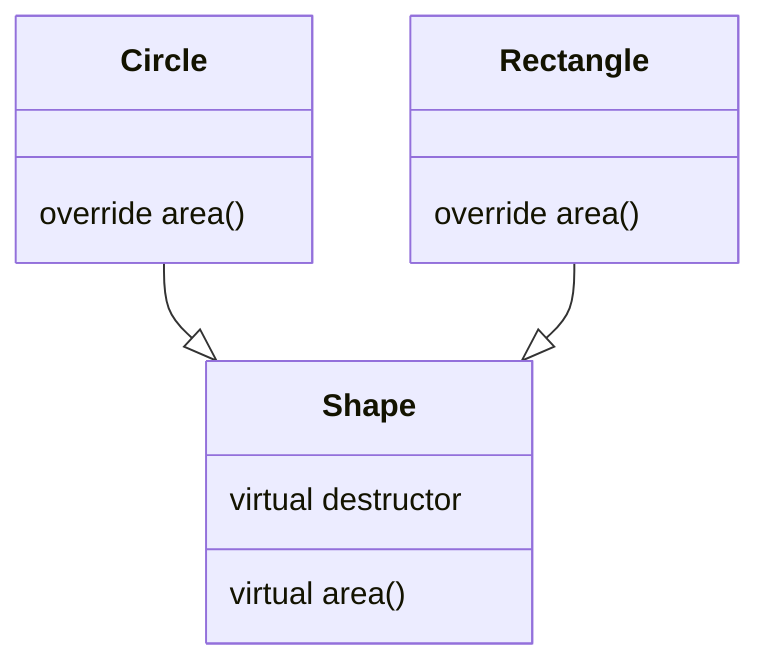
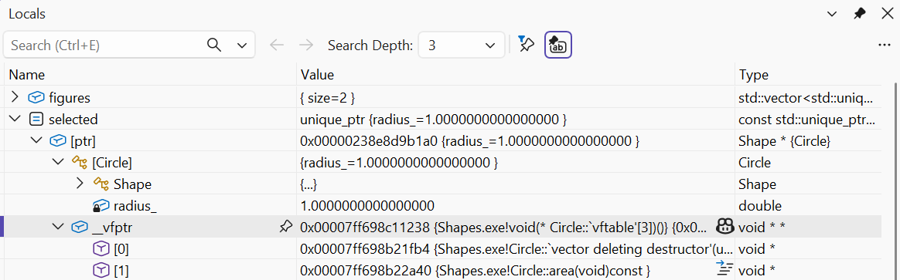
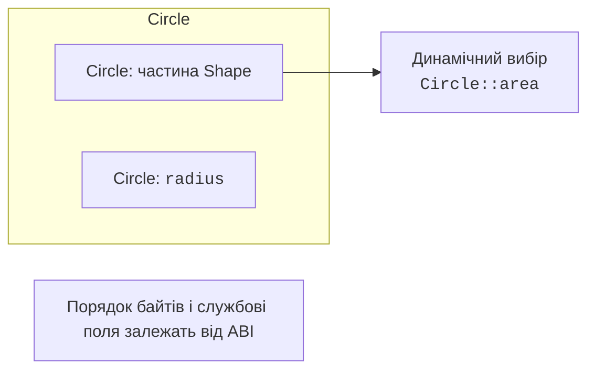
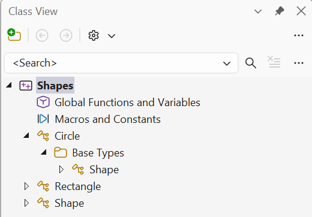

# Відношення «є» та ієрархія

## Відношення «є» та контракт базового типу

**Наслідування** (*inheritance*) створює похідний клас на основі базового.
Публічне наслідування виражає відношення «є різновидом»: коло є фігурою,
а погодинний працівник є працівником у межах обраної моделі. Самої
схожості полів недостатньо. Похідний об’єкт має бути придатним там,
де користувач очікує контракт базового типу.

Якщо базова операція обіцяє приймати будь-яку невід’ємну кількість
годин, похідна реалізація не повинна раптом вимагати рівно вісім,
не змінюючи контракту. Таке посилення передумови порушує можливість
підстановки. Аналогічно користувач базового типу має отримувати
гарантований результат, незалежно від конкретного різновиду.

Для фігур спільною операцією є `area() const`. Коло й прямокутник
обчислюють площу по-різному, але обидва повертають скінченну
невід’ємну площу для перевірених розмірів. Користувач колекції не
повинен вручну питати «це коло чи прямокутник», щоб вибрати формулу.
Саме це є практичною користю динамічного поліморфізму.

У прикладі базова фігура має нейтральну реалізацію площі нуль.
У наступній темі перетворимо подібний контракт на абстрактний клас,
який взагалі не дозволяє створити «фігуру без конкретного виду».
Це окреме дизайнерське рішення; сьогодні важливо побачити заміщення
поведінки через спільне посилання чи вказівник.

Побудову показано на рис. 10.1.



Рис. 10.1. Спільний контракт площі та різні реалізації {.caption}

### Приклад 1. Геометричні фігури

**Умова.** Зібрати різні фігури в колекцію єдиних власників та обчислити суму площ.

```cpp
#include <cassert>
#include <cmath>
#include <memory>
#include <numbers>
#include <print>
#include <stdexcept>
#include <vector>
class Shape {
public:
    virtual ~Shape() = default;
    virtual double area() const { return 0; }
};
class Circle final : public Shape {
    double radius_;
public:
    explicit Circle(double r) : radius_(r) {
        if (!std::isfinite(r) || r <= 0 || r > 1000)
            throw std::invalid_argument("radius");
    }
    double area() const override {
        return std::numbers::pi * radius_ * radius_;
    }
};
class Rectangle final : public Shape {
    double width_, height_;
public:
    Rectangle(double w, double h) : width_(w), height_(h) {
        if (!std::isfinite(w) || !std::isfinite(h) ||
            w <= 0 || h <= 0 || w > 1000 || h > 1000)
            throw std::invalid_argument("sides");
    }
    double area() const override { return width_ * height_; }
};
int main() {
    std::vector<std::unique_ptr<Shape>> figures;
    figures.push_back(std::make_unique<Circle>(1));
    figures.push_back(std::make_unique<Rectangle>(2, 3));
    double sum = 0;
    for (const auto& figure : figures) sum += figure->area();
    assert(std::abs(sum - (6 + std::numbers::pi)) < 1e-12);
    try { Circle bad{0}; assert(false); }
    catch (const std::invalid_argument&) {}
    std::println("Сума площ: {:.3f}", sum);
}
```

Цикл не розрізняє види фігур. Власник unique_ptr знищує похідний об’єкт через віртуальний деструктор. Перевірки скінченності й верхньої межі відхиляють некоректні розміри.

Результат виконання:

```text
Сума площ: 9.142
```



Рис. 10.2. Поліморфний об’єкт у Locals {.caption}

## Конструювання та знищення ієрархії

Похідний об’єкт містить базовий підоб’єкт. Спочатку конструюється
база, потім поля похідного класу, потім виконується тіло його
конструктора. Якщо база потребує аргументів, похідний конструктор
передає їх у списку ініціалізації. Присвоїти базу в тілі вже пізно:
її життя почалося раніше.

Знищення йде у зворотному напрямку: тіло деструктора похідного
класу, його поля, базовий підоб’єкт. Для трьох рівнів A, B, C
послідовність конструкторів A–B–C і деструкторів C–B–A не залежить
від того, який текст повідомлень обрано. Трасування робить правило
видимим і допомагає зрозуміти частково побудований об’єкт.

Під час виконання конструктора бази похідна частина ще не готова.
Віртуальний виклик з конструктора бази тому не переходить до
майбутньої похідної реалізації. Аналогічно у деструкторі бази
похідна частина вже знищується або знищена. Не використовуйте такі
виклики як спосіб запуску повної поведінки найпохіднішого класу.

Виклик методу після завершеного створення має іншу ситуацію:
динамічний тип уже повний. Якщо потрібна дія, що залежить від
похідної реалізації, організуйте її як явний наступний крок
або через фабрику зі зрозумілим контрактом, а не як прихований
виклик із конструктора бази.

Побудову показано на рис. 10.3.



Рис. 10.3. Концептуальна модель похідного об’єкта {.caption}

### Приклад 2. Порядок конструювання

**Умова.** Показати три рівні й віртуальний виклик усередині базового конструктора.

```cpp
#include <print>
struct A {
    A() { std::println("A()"); who(); }
    virtual ~A() { std::println("~A()"); }
    virtual void who() const { std::println("A::who"); }
};
struct B : A {
    B() { std::println("B()"); }
    ~B() override { std::println("~B()"); }
    void who() const override { std::println("B::who"); }
};
struct C final : B {
    C() { std::println("C()"); }
    ~C() override { std::println("~C()"); }
    void who() const override { std::println("C::who"); }
};
int main() {
    C value;
    const A& base = value;
    base.who();
}
```

З конструктора A викликається A::who. Після повного створення виклик через A& доходить до C::who. Трасування демонструє правило, але для робочого дизайну краще уникати поведінкових віртуальних викликів у конструкторах.

Результат виконання:

```text
A()
A::who
B()
C()
C::who
~C()
~B()
~A()
```



Рис. 10.4. Базовий і похідні класи {.caption}
