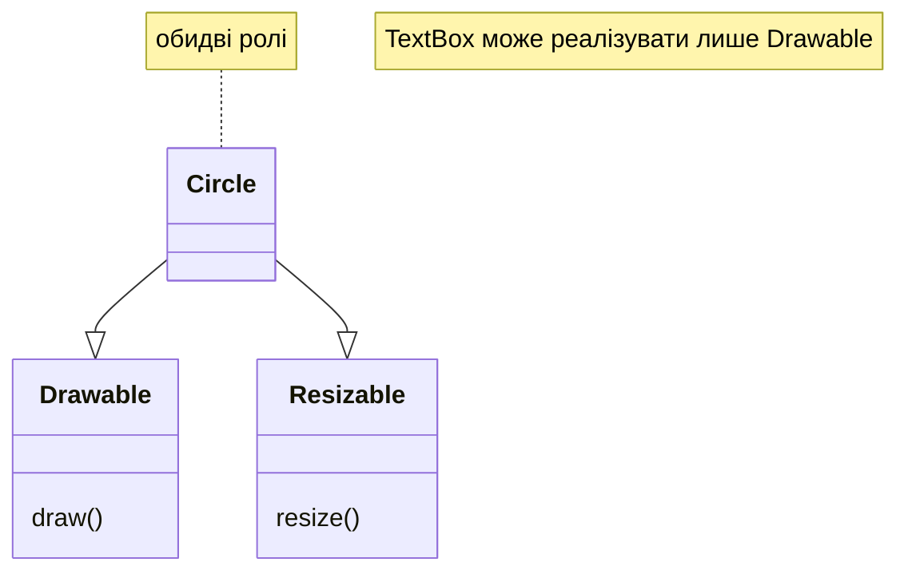
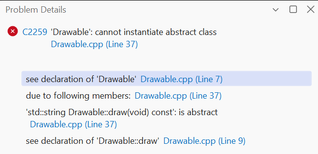
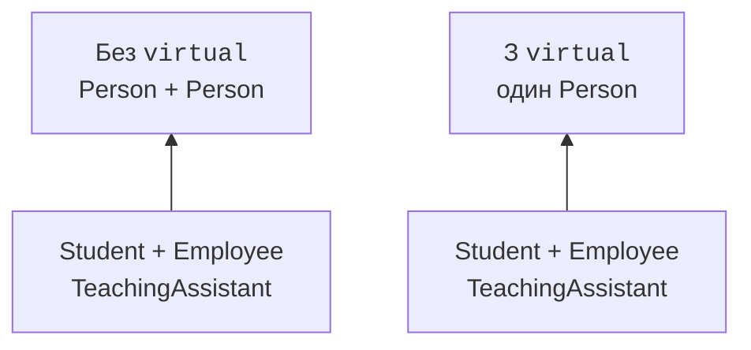
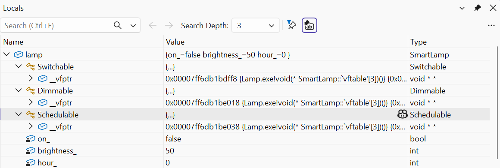

# Абстрактні класи та NVI

## Абстрактний клас та чисто віртуальна операція

**Абстрактний клас** (*abstract class*) має принаймні одну чисто
віртуальну функцію, для якої в цьому класі немає конкретного
кінцевого заміщення. Запис `virtual void draw() const = 0`
задає обов’язок похідних реалізацій. Створити об’єкт такого
класу не можна, але посилання й вказівники на нього потрібні
для роботи зі спільним контрактом.

Абстрактність не забороняє полів, конструктора або готових
невіртуальних методів. Базовий клас може перевіряти ім’я,
зберігати спільний стан і реалізовувати частину алгоритму.
Відмінність від звичайного класу полягає у незавершеній
поведінці, яку має визначити конкретний похідний тип.

У C++ інтерфейс зазвичай представляють абстрактним класом
із невеликим набором операцій. Спеціальне ключове слово
`interface` для стандартної мови не потрібне. Назва Drawable
описує здатність малювати, Resizable – змінювати розмір.
Клас може підтримувати одну здатність без іншої.

У прикладі Shape об’єднує Drawable зі спільною вимогою площі,
а Circle також реалізує Resizable. Клієнт, який лише друкує
опис малювання, приймає Drawable&, тому не залежить від
радіуса чи способу масштабування. Вузька залежність робить
його придатним також для текстового поля або іншого виду.

Побудову показано на рис. 11.1.



Рис. 11.1. Окремі ролі малювання та зміни розміру {.caption}

### Приклад 1. Фігури на полотні

**Умова.** Поєднати інтерфейси малювання й масштабування та абстрактну вимогу площі.

```cpp
#include <cassert>
#include <cmath>
#include <numbers>
#include <print>
#include <stdexcept>
#include <string>

struct Drawable {
    virtual ~Drawable() = default;
    virtual std::string draw() const = 0;
};

struct Resizable {
    virtual ~Resizable() = default;
    virtual void resize(double factor) = 0;
};

struct Shape : Drawable {
    virtual double area() const = 0;
};

class Circle final : public Shape, public Resizable {
    double radius_;
public:
    explicit Circle(double r) : radius_(r) {
        if (!std::isfinite(r) || r <= 0 || r > 1000)
            throw std::invalid_argument("radius");
    }

    void resize(double k) override {
        if (!std::isfinite(k) || k <= 0 ||
            k > 1000 / radius_ || radius_ * k == 0)
            throw std::invalid_argument("factor");
        radius_ *= k;
    }

    double area() const override {
        return std::numbers::pi * radius_ * radius_;
    }

    std::string draw() const override { return "Circle"; }
};

int main() {
    Circle c{1};
    Resizable& sizing = c; sizing.resize(2);
    const Drawable& drawing = c;
    assert(std::abs(c.area() - 4 * std::numbers::pi) < 1e-12);
    try { sizing.resize(0); assert(false); }
    catch (const std::invalid_argument&) {}
    std::println("{}: {:.3f}", drawing.draw(), c.area());
}
```

Кожен клієнт бачить потрібну роль. Перевірка коефіцієнта передує зміні радіуса; розміри обмежені навчальним діапазоном. Малювання тут є текстовим описом, а не GUI.

Результат виконання:

```text
Circle: 12.566
```



Рис. 11.2. Заборона створення абстрактного об’єкта {.caption}

## NVI: стабільна оболонка та змінний крок

Ідіома **NVI** (*Non-Virtual Interface*) надає публічний
невіртуальний метод, який організує алгоритм, і закритий
віртуальний крок, який можна змінювати. Наприклад, generate
перевіряє вхід, додає заголовок, викликає body і додає завершення.
Похідний тип змінює лише формат основної частини звіту.

Публічний метод є єдиною точкою входу для користувача. Завдяки
цьому перевірка розміру й загальні правила виконуються для
кожного різновиду. Якби кожен похідний клас сам перевизначав
увесь generate, він міг би випадково забути перевірку або
спільну частину оформлення.

Закритий віртуальний метод може бути заміщений похідним класом:
право прямого виклику й право override є різними мовними
питаннями. Зовнішній код не може обійти оболонку викликом
body. Похідний клас визначає крок, але алгоритм бази керує
його місцем у послідовності.

Це приклад шаблону «Шаблонний метод», а не шаблонів C++ із
`template`. Слово «шаблон» тут означає повторювану структуру
дизайну. Узагальнені функції та класи мови C++ вивчатимуться
окремо в наступній темі.

Побудову показано на рис. 11.3.



Рис. 11.3. Різниця кількості підоб’єктів у ромбі {.caption}

### Приклад 2. Звіт через NVI

**Умова.** Залишити перевірку і заголовок спільними, дозволити заміну лише тіла звіту.

```cpp
#include <cassert>
#include <print>
#include <stdexcept>
#include <string>
#include <vector>

class Report {
    virtual std::string body(const std::vector<int>& x) const = 0;
public:
    virtual ~Report() = default;

    std::string generate(const std::vector<int>& values) const {
        if (values.size() > 100)
            throw std::invalid_argument("too many rows");
        return "Report\n" + body(values) + "End\n";
    }
};

struct ListReport final : Report {
private:
    std::string body(const std::vector<int>& x) const override {
        std::string result;
        for (int n : x) result += "- " + std::to_string(n) + "\n";
        return result;
    }
};

int main() {
    ListReport report;
    const Report& view = report;
    assert(view.generate({}) == "Report\nEnd\n");
    assert(view.generate({2}) == "Report\n- 2\nEnd\n");
    try { view.generate(std::vector<int>(101)); assert(false); }
    catch (const std::invalid_argument&) {}
    std::print("{}", view.generate({2, 5}));
}
```

Публічний generate невіртуальний. Похідний клас заміщує private body, але користувач не може викликати його в обхід перевірки. Порожній звіт має визначений результат.

Результат виконання:

```text
Report
- 2
- 5
End
```



Рис. 11.4. Один пристрій і кілька базових ролей {.caption}
