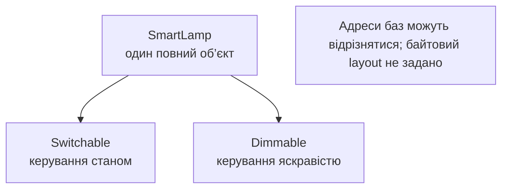
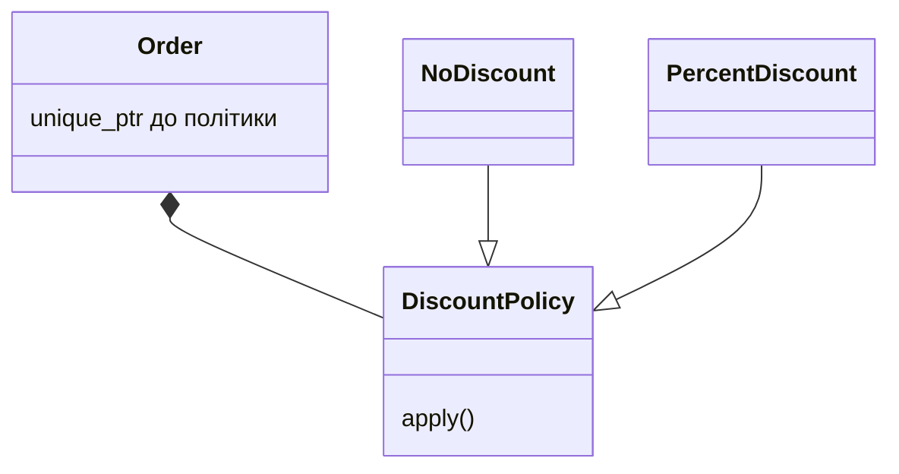

# Віртуальна база та стратегія

## Ромб і віртуальна база

Ромб виникає, коли Student та Employee походять від Person,
а TeachingAssistant походить від обох. За звичайного
наслідування всередині асистента є два підоб’єкти Person.
Вони можуть мати два різні імені. Доступ до `name` без
уточнення неоднозначний, і це не просто примха компілятора.

Кваліфікація `Student::name` вибирає один шлях, але не
об’єднує два стани. Якщо предметна модель каже, що асистент
є однією людиною з двома ролями, потрібне спільне подання.
Віртуальне наслідування на обох шляхах до Person забезпечує
один спільний підоб’єкт цієї бази.

Віртуальну базу ініціалізує найпохідніший клас. Тому саме
TeachingAssistant передає справжнє ім’я в Person, коли
створюється повний об’єкт асистента. Конструктори Student
та Employee також можуть містити ініціалізатор Person для
випадків, коли вони самі є найпохіднішими об’єктами.

Віртуальне наслідування та віртуальна функція вирішують
різні задачі. Перше керує кількістю спільних підоб’єктів
бази, друге – вибором поведінки під час виклику. Наявність
одного не робить автоматично потрібним або достатнім інше.

Побудову показано на рис. 11.5.



Рис. 11.5. Підоб’єкти ролей одного пристрою {.caption}

### Приклад 3. Асистент викладача

**Умова.** Перевірити єдину віртуальну базу Person через обидва шляхи ромба.

```cpp
#include <cassert>
#include <print>
#include <string>
#include <utility>
struct Person {
    std::string name;
    explicit Person(std::string value) : name(std::move(value)) {}
};
struct Student : virtual Person {
    Student() : Person("student") {}
};
struct Employee : virtual Person {
    Employee() : Person("employee") {}
};
struct TeachingAssistant final : Student, Employee {
    explicit TeachingAssistant(std::string name)
        : Person(std::move(name)), Student(), Employee() {}
};
int main() {
    TeachingAssistant assistant{"Олена"};
    Person* viaStudent = static_cast<Student*>(&assistant);
    Person* viaEmployee = static_cast<Employee*>(&assistant);
    assert(viaStudent == viaEmployee);
    assert(assistant.name == "Олена");
    viaStudent->name = "Марія";
    assert(viaEmployee->name == "Марія");
    std::println("Спільна людина: {}", assistant.name);
}
```

Person ініціалізує найпохідніший TeachingAssistant. Рядки student та employee не стають іменем асистента. Обидва коректні перетворення вказують на той самий підоб’єкт.

Результат виконання:

```text
Спільна людина: Марія
```


Рис. 11.6. Неоднозначність невіртуального ромба {.caption}

## Стратегія через композицію

Шаблон **«Стратегія»** (*Strategy*) відокремлює змінний алгоритм
від об’єкта, який його використовує. Замовлення володіє
DiscountPolicy, а конкретна політика обчислює суму після
знижки. Щоб змінити правило, не потрібно наслідувати саме
замовлення для кожного відсотка чи кампанії.

Володіння політикою через unique_ptr означає, що одне
замовлення контролює її життя. Конструктор відхиляє
порожній вказівник, бо total завжди очікує доступну
стратегію. Це інваріант композиції, а не перевірка,
яку слід дублювати перед кожним викликом.

Стратегія отримує суму в копійках і повертає копійки.
Процентна політика явно задає округлення вниз для
невід’ємних навчальних сум. Обмеження суми й відсотка
не дають проміжному добутку переповнитися. Різні політики
мають той самий контракт аргументів та діапазону результату.

Якщо політика змінюється під час життя замовлення,
потрібна операція заміни з перевіркою нового власника.
Якщо вона незмінна, конструктор достатній. Не додавайте
setter без сценарію: кожен додатковий перехід збільшує
простір станів, який доведеться перевіряти.

Побудову показано на рис. 11.7.



Рис. 11.7. Контекст володіє змінним алгоритмом {.caption}

### Приклад 4. Політика знижки

**Умова.** Передати політику замовленню через unique_ptr та порівняти відсутність знижки з 10 відсотками.

```cpp
#include <cassert>
#include <memory>
#include <print>
#include <stdexcept>
#include <utility>
struct DiscountPolicy {
    virtual ~DiscountPolicy() = default;
    virtual long long apply(long long cents) const = 0;
};
struct NoDiscount final : DiscountPolicy {
    long long apply(long long cents) const override {
        return cents;
    }
};
class PercentDiscount final : public DiscountPolicy {
    int percent_;
public:
    explicit PercentDiscount(int n) : percent_(n) {
        if (n < 0 || n > 100) throw std::invalid_argument("rate");
    }
    long long apply(long long cents) const override {
        return cents * (100 - percent_) / 100;
    }
};
class Order {
    std::unique_ptr<DiscountPolicy> policy_;
public:
    explicit Order(std::unique_ptr<DiscountPolicy> policy)
        : policy_(std::move(policy)) {
        if (!policy_) throw std::invalid_argument("policy");
    }
    long long total(long long cents) const {
        if (cents < 0 || cents > 1'000'000'000)
            throw std::invalid_argument("sum");
        return policy_->apply(cents);
    }
};
int main() {
    Order plain{std::make_unique<NoDiscount>()};
    Order sale{std::make_unique<PercentDiscount>(10)};
    assert(plain.total(1000) == 1000);
    assert(sale.total(1000) == 900 && sale.total(0) == 0);
    try { Order bad{nullptr}; assert(false); }
    catch (const std::invalid_argument&) {}
    try { sale.total(-1); assert(false); }
    catch (const std::invalid_argument&) {}
    std::println("Зі знижкою: {} коп.", sale.total(1000));
}
```

Клієнт політики – Order, який перевіряє спільну передумову діапазону. Безпосередній виклик apply також має дотримуватися цієї документованої передумови; це не універсальна функція для довільного long long.

Результат виконання:

```text
Зі знижкою: 900 коп.
```
