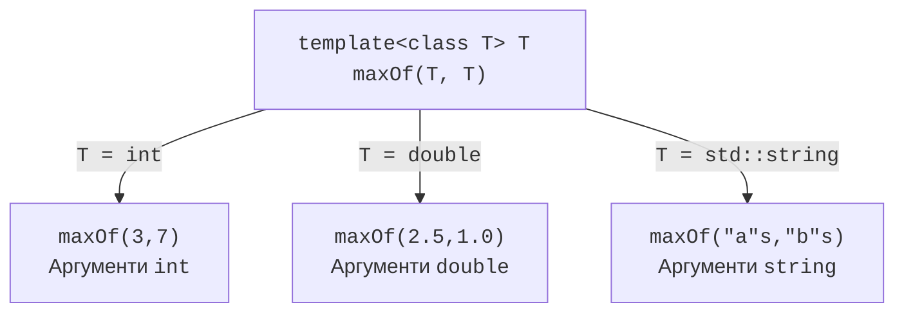

# Шаблони функцій і концепти

## Узагальнення як збереження правил

Якщо обчислення середнього для `int` і `double` відрізняється лише типом
елемента, копіювання функції створює два місця для виправлення однієї помилки.
Шаблон дає змогу описати спільний алгоритм один раз. Проте «працює для всіх
типів» не є корисною вимогою. Середнє потребує числової інтерпретації, стек
потребує зберігання елементів, а пошук мінімуму потребує порядку. Спочатку
визначають операції та їхню семантику, після цього записують параметри.

Шаблон не виконує пошук типу під час роботи програми. Компілятор отримує
аргументи й утворює потрібні спеціалізації. Виклики для двох типів можуть
мати різний машинний код; оптимізатор також може вбудувати виклик чи
об’єднати однаковий код. Тому навчальна схема інстанціювання показує
типізовані функції, а не гарантує три окремі блоки байтів у виконуваному файлі.

Розв’язок через `void*` прибирає інформацію про тип. Для читання об’єкта
потрібні правильний приведений вказівник, розмір і домовленість про час життя.
Це доречно в деяких низькорівневих інтерфейсах, але не покращує звичайний
типобезпечний алгоритм. Віртуальний метод вирішує іншу задачу: вибирає
реалізацію через базовий інтерфейс під час виконання. Шаблон не потребує
спільного базового класу, зате тип конкретного виклику має бути відомий
під час компіляції. Ці способи можна поєднувати в одному проєкті.



Рис. 12.1. Один шаблон і три типізовані виклики {.caption}

## Параметри функції та виведення типів

У `template<class T>` слова `class` і `typename` рівнозначні: `T` може
позначати фундаментальний тип, а не лише клас. Оголошення параметра шаблону
не створює об’єкт. Параметри звичайної функції `a` і `b` мають значення
під час виконання; `T` задає тип цих значень ще під час перекладу.

Фрагмент нижче повертає копію більшого аргументу. Це обмежує застосування
типами, для яких існують порівняння й потрібне копіювання. Посилання на
локальну змінну повертати не можна. Варіант із посиланнями потребує окремого
аналізу часу життя, особливо коли один з аргументів є тимчасовим об’єктом.

```cpp
template<class T>
T maxOf(T a, T b)
{
    return a < b ? b : a;
}
```

Виклик `maxOf(3, 7)` виводить `T = int`. Для `maxOf(3, 7.5)` одна позиція
пропонує `int`, друга – `double`; компілятор не обирає автоматично зручний
спільний тип. Явний виклик `maxOf<double>(3, 7.5)` спочатку фіксує `T`,
після чого звичайні перетворення аргументів дозволяють виклик. Інший дизайн –
два параметри типів і явно обраний тип результату. Таку зміну потрібно
обґрунтувати, бо приховане звуження може зіпсувати великі цілі значення.

За передавання за значенням верхній `const` не стає частиною виведеного
типу. Масив у багатьох таких викликах перетворюється на вказівник.
Передавання `const T&` може зберегти відомості про розмір масиву, але
тепер функція працює з позиченим об’єктом. Сигнатура є частиною контракту,
а не косметичною відмінністю між двома записами.

Скорочений шаблон C++20 `auto twice(auto value)` також утворює шаблон.
Кожен незалежний `auto` у списку параметрів є окремим параметром типу.
Тому `void f(auto a, auto b)` дозволяє різні типи, на відміну від
`template<class T> void f(T a, T b)`. Для зв’язку типів використовують
іменований параметр або обмеження `std::same_as`.

## Концепт числового типу та повний приклад

Концепт є предикатом часу компіляції над аргументами шаблону. Наш `Numeric`
приймає цілі й дійсні фундаментальні типи. Зокрема, `bool` задовольняє
`std::integral`: для статистики логічних ознак середнє може означати частку
істинних значень, але для фізичних вимірювань його варто заборонити окремо.
Концепт не перевіряє, чи кількість спостережень додатна; це властивість
значень конкретного виклику, яку перевіряємо під час виконання.

`std::span<const T>` позичає неперервну послідовність і не володіє пам’яттю.
Масиви в `main` живуть протягом виклику, тому посилання чинні. При виведенні
типів перетворення масиву на `span` не допомагає вивести параметр усередині
`span<const T>`; саме тому виклики нижче містять явні `<int>` і `<double>`.
Ця деталь показує різницю між виведенням аргументів шаблону і звичайним
перетворенням аргументів уже відомої функції.

### Статистика для будь-яких чисел

**Умова.** Обчислити середнє двох заданих вибірок та діагностувати порожню.

```cpp
#include <concepts>
#include <print>
#include <span>
#include <stdexcept>

template<class T>
concept Numeric = std::integral<T>
    || std::floating_point<T>;

template<Numeric T>
double mean(std::span<const T> values)
{
    if (values.empty())
        throw std::invalid_argument("empty sample");
    double sum = 0;
    for (T value : values)
        sum += static_cast<double>(value);
    return sum / static_cast<double>(values.size());
}

int main()
{
    const int counts[]{2, 4, 9};
    const double lengths[]{1.5, 2.0, 4.0};
    std::println("counts: {:.2f}", mean<int>(counts));
    std::println("lengths: {:.2f}", mean<double>(lengths));
    try { mean<int>({}); }
    catch (const std::invalid_argument& e) {
        std::println("error: {}", e.what());
    }
}
```

Результат виконання:

```text
counts: 5.00
lengths: 2.50
error: empty sample
```

Суму накопичуємо в `double`, щоб уникнути цілочислового ділення.
Це навчальна політика точності: дуже великі цілі числа можуть втратити
точність при перетворенні. Для фінансових значень потрібна інша політика.
Обробник перехоплює саме очікувану помилку порожньої вибірки; довільні
помилки не приховуються повідомленням про правильне середнє.

Перевірте вибірку з одного елемента, від’ємні числа та порожній `span`.
Для `{2, 4, 9}` контрольна сума дорівнює 15, кількість – 3. Спочатку
перевіряйте числовий результат, потім формат із двома десятковими знаками.
Якщо замінити `int` на клас без числових операцій, відмова повинна виникнути
на межі концепту, а не після запуску програми.
