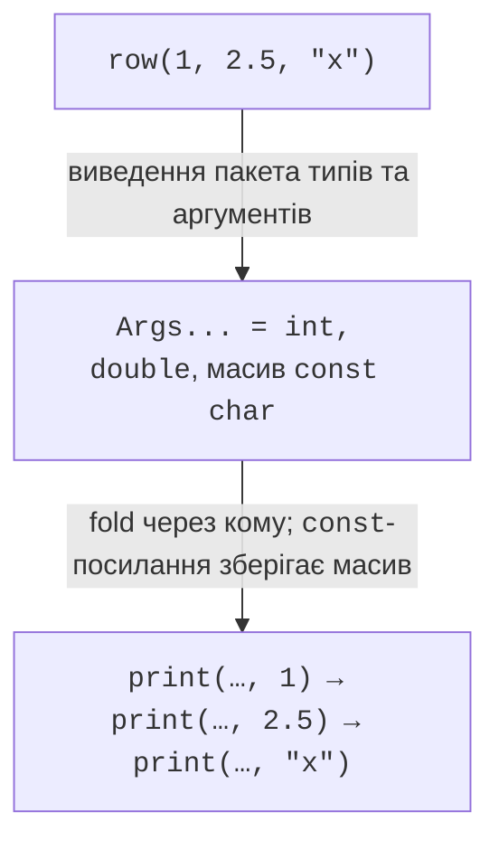
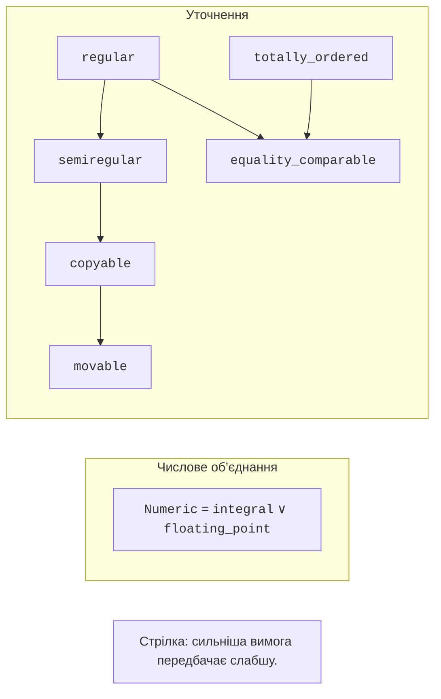
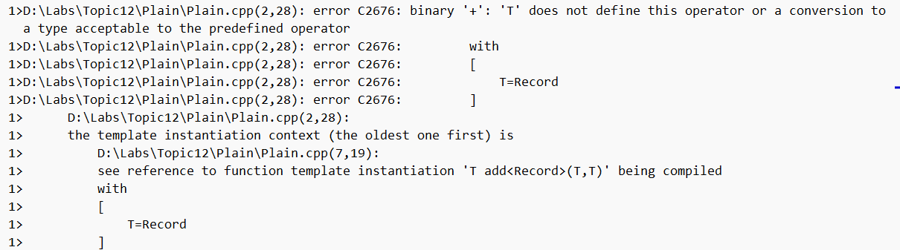

# Пакети параметрів і requires

## Пакети параметрів і fold-вирази

Пакет `Args...` позначає послідовність типів, а `args...` – відповідні
параметри функції. Пакет не є контейнером часу виконання: він може містити
різні типи і не має методу `push_back`. `sizeof...(Args)` дає кількість
аргументів як константне значення. Розгортання утворює повторення певного
шаблону виразу для кожного елемента пакета.

Fold-вираз із комою виконує послідовні операції виведення. Порожній
пакет для унарного fold через кому допустимий; для складання через `+`
потрібно або заборонити порожній пакет, або задати початкове значення
бінарного fold. Початковий `0` також задає початковий тип накопичення,
і це може бути важливо для змішаних числових аргументів.



Рис. 12.2. Від пакета аргументів до послідовних операцій {.caption}

### Рядок таблиці довільної довжини

**Умова.** Надрукувати заголовок, змішаний рядок і рядок без полів.

```cpp
#include <print>

template<class... Args>
void row(const Args&... args)
{
    std::print("|");
    ((std::print(" {:>8} |", args)), ...);
    std::println();
}

int main()
{
    row("item", "count", "price");
    row("pen", 3, 12.5);
    row();
}
```

Результат виконання:

```text
|     item |    count |    price |
|      pen |        3 |     12.5 |
|
```

Усі аргументи передаються через `const&`; функція не зберігає посилань
після повернення. Кожен тип має підтримувати форматування. Мінімальна
ширина 8 не обрізає довгий текст, тому рядок із довгою назвою розширить
таблицю. Для гарантованої ширини потрібна окрема політика обрізання або
перенесення; її не слід непомітно додавати до універсального друку.

Пересилання за допомогою `Args&&...` і `std::forward<Args>(args)...`
зберігає категорії значень у шаблонній обгортці. Але безумовне
переміщення з кожного аргументу зіпсувало б виклики з lvalue.
Forwarding reference виникає за конкретних правил виведення типу;
`const T&&` не є forwarding reference. У функції друку пересилання
не дає необхідної переваги, тому прості `const&` точніше виражають намір.

Індексація пакетів `Ts...[0]` належить до можливостей C++26 і не замінює
цикл часу виконання. Перед використанням перевіряють `__cpp_pack_indexing`
та компіляцію окремого малого прикладу. У навчальному рішенні цієї теми
вона не є обов’язковою; звичайне розгортання працює без неї.

## requires-речення, requires-вираз та стандартні концепти

Речення `requires` приєднує обмеження до шаблону. Вираз `requires`
перевіряє коректність зазначених вимог у залежному контексті й дає
логічний результат. Усередині переліку можна перевіряти існування
виразу, вкладеного типу, властивість результату та відсутність винятків.
Параметри такого виразу є умовними і не створюють об’єктів під час роботи.

```cpp
template<class T>
concept Addable = requires(T a, T b) {
    { a + b } -> std::same_as<T>;
};
template<Addable T>
T add(T a, T b) { return a + b; }
```

Перевірка `same_as<T>` вимагає саме такий тип результату. Для двох
`short` результат додавання зазвичай має тип `int`, отже цей концепт
відхиляє `short`. Якщо контракт допускає перетворення, можна використати
`convertible_to<T>`, але це не гарантує відсутності звуження або втрати
значення. Обмеження слід читати як точну умову, а не як приблизну назву.

`std::invocable<F, Args...>` перевіряє можливість виклику; він не обіцяє,
що функція не змінює стан або завжди повертає однаковий результат.
`std::totally_ordered` перевіряє синтаксис порівнянь і має семантичні
вимоги, які компілятор не доводить за довільним кодом. Значення NaN
у дійсних числах особливо важливі: доступність операторів не робить
усі можливі значення впорядкованими в потрібному для задачі сенсі.

Концепти комбінують `&&` і `||`. Наш `Numeric` є об’єднанням двох груп,
а не уточненням кожної з них. У схемі стрілки уточнення спрямовані
від сильнішої вимоги до слабшої. `regular` включає `semiregular`
та порівняння на рівність; сама копійованість не гарантує змістовної рівності.



Рис. 12.3. Композиція вимог і напрямок уточнення {.caption}

## Діагностика і негативні тести

Концепт переносить повідомлення про помилку ближче до інтерфейсу.
Без обмеження компілятор може зайти глибоко в тіло і повідомити про
відсутній оператор. З обмеженням він спочатку відхилить кандидата,
а деталізація пояснить, яка вимога не виконана. Це не означає, що
будь-яке повідомлення з концептом коротке: композиція багатьох
перевантажень також потребує читання повного журналу збирання.



Рис. 12.4. Відмова під час інстанціювання необмеженого шаблону {.caption}


Рис. 12.5. Відмова через невиконаний Addable {.caption}

`static_assert` корисний для властивостей, які мають виконуватися
безумовно в обраній спеціалізації. Концепт натомість бере участь
у виборі кандидата. Наприклад, перевантаження для цілих і дійсних
чисел природно розділити концептами; виклик недопустимої місткості
вже обраного класу можна пояснити власним `static_assert`.
Трейти `<type_traits>` на кшталт `is_trivially_copyable_v<T>`
описують окремі технічні властивості. Не слід підміняти ними
повний контракт серіалізації або володіння ресурсом.

Негативний тест має бути окремим файлом, який очікувано не збирається.
Не залишайте помилковий виклик у робочому `main` і не оголошуйте
успішною перевірку лише тому, що рядок закоментовано. Запишіть тип
помилки, потрібне обмеження й команду, яка відтворює відмову.

## Статичний поліморфізм і підсумковий вибір

Функція, обмежена концептом `Shape`, може викликати `area()` різних
непов’язаних класів. Це статичний поліморфізм: вибір відомий під час
інстанціювання. Він не створює автоматично один контейнер різнорідних
фігур. Для такого контейнера доречні віртуальний інтерфейс, `variant`
або інша явно обрана форма стирання типу.

CRTP передає похідний клас як параметр базового, наприклад
`Base<Derived>`. Базовий клас може звернутися до реалізації похідного
без віртуального виклику. Але це створює сильнішу залежність між
класами і потребує обережності під час конструювання та знищення.
У цій темі CRTP є оглядом; вільна функція з концептом часто простіша.
Оптимізацію слід доводити вимірюванням, а не самою відсутністю `virtual`.


Рис. 12.6. Редактор шаблону з конкретними аргументами {.caption}
