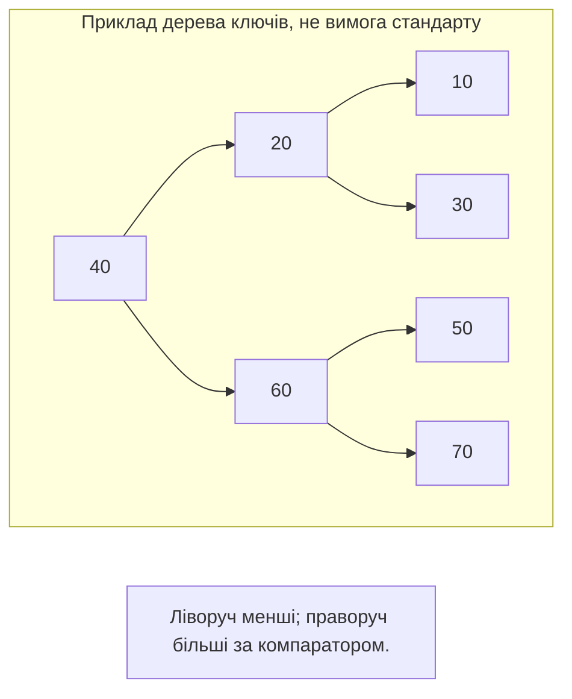
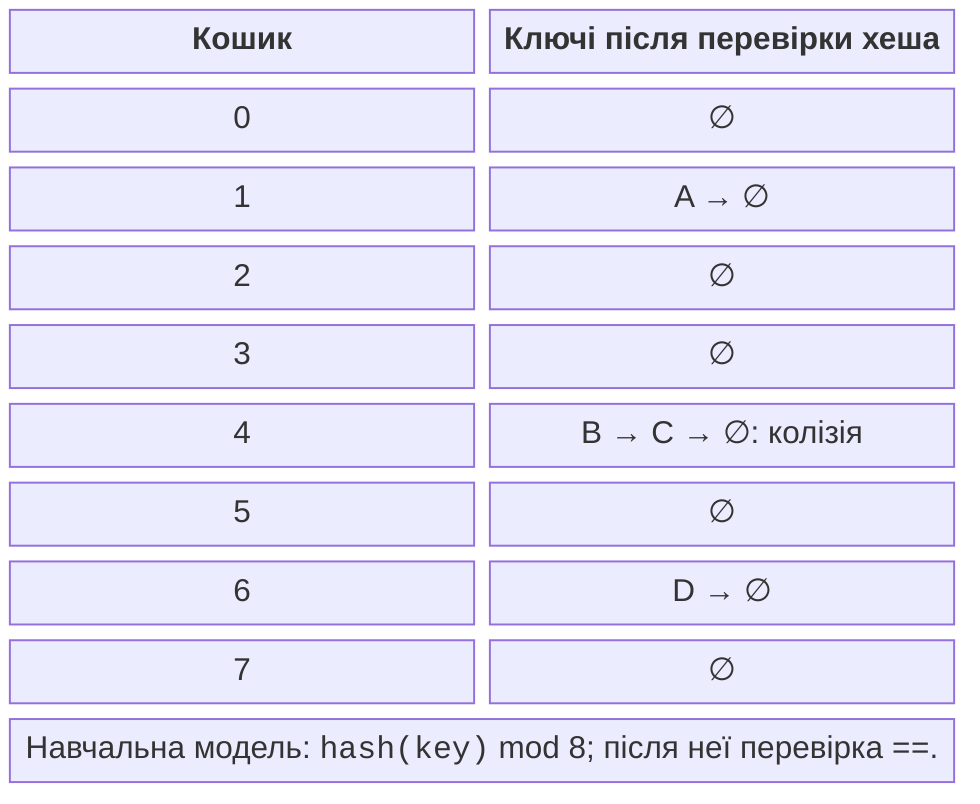

# Асоціативні та хеш-контейнери

## set і map: унікальність через порядок

`set` зберігає ключі, `map` – пари ключ-значення. Унікальність
визначається еквівалентністю компаратора: якщо ні `a < b`, ні `b < a`,
контейнер вважає ключі еквівалентними. Це може відрізнятися від
оператора ==, наприклад для регістронезалежного порівняння.
Компаратор має задавати строгий слабкий порядок; `<=` для цього
не підходить, бо істинне для однакового значення.

`multiset` і `multimap` дозволяють еквівалентні ключі.
`lower_bound(k)` знаходить перший елемент, який не менший за k
відповідно до компаратора. `equal_range(k)` дає пару меж усієї
групи еквівалентних ключів. Це напіввідкритий діапазон: права межа
не належить результату. Не розіменовуйте end, навіть якщо пошук
є єдиною операцією перед ним.



Рис. 13.4. Приклад збалансованого дерева ключів {.caption}

У методів доступу різні наслідки. `map[key]` додає відсутній ключ
із типовим значенням. Це доречно для лічильника, але змінює словник
при «читанні». `at(key)` не вставляє, а кидає `out_of_range`.
`find` повертає ітератор або end, `contains` – лише bool.
Для const map оператор [] відсутній саме через можливу вставку.

`insert` не замінює значення наявного ключа. `insert_or_assign`
явно виконує заміну. `try_emplace` не конструює mapped-значення
з переданих аргументів усередині контейнера, якщо ключ уже є;
однак самі вирази-аргументи виклику все одно обчислюються.
Не пишіть дорогу функцію в аргументі з припущенням, що її не викличуть.

### Телефонний довідник

**Умова.** Додати контакти, не затерти номер повторною вставкою, знайти та видалити запис.

```cpp
#include <map>
#include <print>
#include <string>

int main()
{
    std::map<std::string, std::string> phoneBook;
    phoneBook.try_emplace("Olena", "101");
    auto [it, added] = phoneBook.try_emplace("Olena", "999");
    std::println("added: {}, phone: {}", added, it->second);
    phoneBook.insert_or_assign("Taras", "202");
    if (auto found = phoneBook.find("Taras");
        found != phoneBook.end())
        std::println("found: {}", found->second);
    phoneBook.erase("Taras");
    for (const auto& [name, phone] : phoneBook)
        std::println("{}: {}", name, phone);
    std::println("missing: {}", phoneBook.contains("Ira"));
}
```

Результат виконання:

```text
added: false, phone: 101
found: 202
Olena: 101
missing: false
```

Повернений ітератор при невдалій вставці вказує на наявний запис. Імена виводяться в порядку ключів, а не порядку додавання. Навчальні номери є рядками: арифметика над ними не потрібна, а початкові нулі слід зберігати.


Рис. 13.5. Упорядкований словник у Watch {.caption}

## unordered-контейнери та хешування

Хеш-функція перетворює ключ на число для вибору кошика. Різні
ключі можуть мати однаковий хеш: це колізія, а не помилка рівності.
Після вибору кошика контейнер використовує порівняння на рівність.
Ключі, які вважаються рівними, обов’язково повинні мати однаковий хеш.
Зворотне твердження не вимагається, інакше хеш мав би бути унікальним
кодом усіх можливих об’єктів.



Рис. 13.6. Хеш, кошики та перевірка рівності {.caption}

`load_factor` є відношенням кількості елементів до кількості кошиків.
`max_load_factor` задає політику для зростання. `reserve(n)` планує
місце для очікуваної кількості елементів відповідно до цієї політики.
Перехешування перебудовує розміщення в кошиках і робить ітератори
недійсними, але не посилання чи вказівники на невидалені елементи.
Порядок обходу не стабільний між реалізаціями, запусками або rehash.

Словник частот природно використовує `++counts[word]`: відсутнє
значення int ініціалізується нулем. Для друку відтворюваного звіту
переносимо результат у vector і впорядковуємо окремо. Змінювати
контейнер лише заради бажаного порядку виведення не завжди потрібно.

### Частота слів

**Умова.** Порахувати слова у заданому рядку та надрукувати звіт за абеткою.

```cpp
#include <algorithm>
#include <print>
#include <sstream>
#include <string>
#include <unordered_map>
#include <utility>
#include <vector>

int main()
{
    std::istringstream input("red blue red green blue red");
    std::unordered_map<std::string, int> wordCount;
    for (std::string word; input >> word;)
        ++wordCount[word];
    std::vector<std::pair<std::string, int>> report;
    for (const auto& item : wordCount)
        report.push_back(item);
    std::sort(report.begin(), report.end());
    for (const auto& [word, count] : report)
        std::println("{}: {}", word, count);
}
```

Результат виконання:

```text
blue: 2
green: 1
red: 3
```

Роздільником тут є пробільні символи; регістр і пунктуація не нормалізуються. Для українського тексту побайтовий tolower не забезпечує Unicode-нормалізацію. Визначте правила слова до написання складнішого аналізатора. Сортування пар спочатку порівнює перше поле, що відповідає ключу звіту.


Рис. 13.7. Логічний і сирий вигляд хеш-словника {.caption}

## Власний ключ і узгоджений хеш

У власному типі Point рівність порівнює обидві координати.
Хеш також використовує обидві, але його арифметика не є доказом
відсутності колізій. Перевірка контейнера повинна містити повторний
ключ, відсутній ключ і різні ключі. В окремому тесті корисно
навмисно використати сталий хеш: правильність збережеться, хоча
пошук стане повільнішим. Це відокремлює правильність від якості хеша.

Замість спеціалізації `std::hash<Point>` можна передати власний
функтор другим аргументом `unordered_set`, як у прикладі. Так політика
видима в типі контейнера й не потребує відкривати namespace std.
Якщо спеціалізація std::hash все ж потрібна, вона має стосуватися
дозволеного користувацького типу й відповідати вимогам бібліотеки.
Не додавайте довільні нові функції до namespace std.

### Точки у хеш-множині

**Умова.** Зберегти дві різні точки, відкинути повторну та перевірити пошук.

```cpp
#include <cstddef>
#include <functional>
#include <print>
#include <unordered_set>

struct Point {
    int x, y;
    bool operator==(const Point&) const = default;
};

struct PointHash {
    std::size_t operator()(const Point& p) const noexcept {
        auto hx = std::hash<int>{}(p.x);
        auto hy = std::hash<int>{}(p.y);
        return hx ^ (hy + 0x9e3779b9u + (hx << 6)
            + (hx >> 2));
    }
};

int main()
{
    std::unordered_set<Point, PointHash> points;
    points.reserve(8);
    points.insert({1, 2}); points.insert({1, 2});
    points.insert({2, 1});
    std::println("size: {}", points.size());
    std::println("found: {}", points.contains({1, 2}));
    std::println("missing: {}", points.contains({9, 9}));
}
```

Результат виконання:

```text
size: 2
found: true
missing: false
```

Операції змішування виконуються з unsigned `size_t`, де переповнення має визначену модульну арифметику. Це не криптографічний хеш і не захист від навмисно підібраних ключів. Координати елемента множини не змінюють на місці: потрібно вилучити старий ключ і вставити новий.
