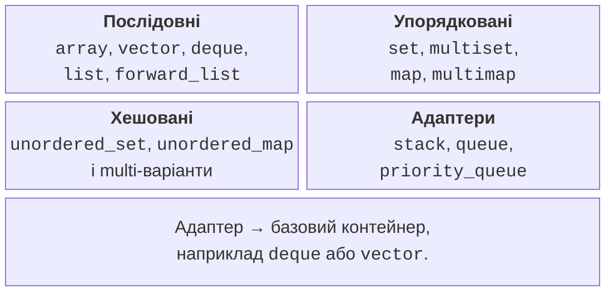
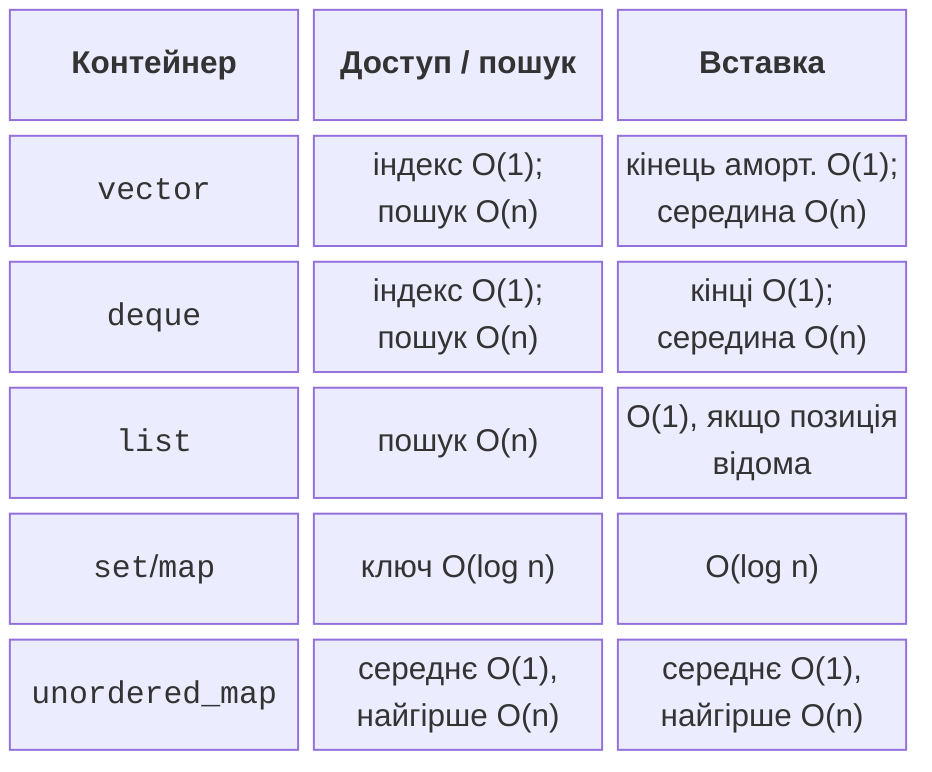
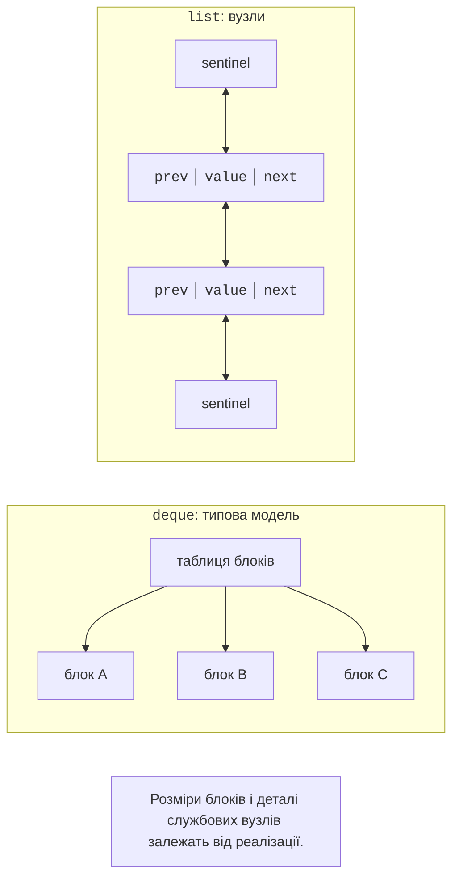

# Послідовні контейнери

## Контейнер як модель доступу

Контейнер володіє набором елементів і підтримує визначені операції
над ним. Його вибирають не за знайомою назвою, а за питаннями до даних:
чи потрібні індекси, пошук за ключем, збережений порядок, дублікати,
стабільні адреси, часті вставки. Той самий набір студентів можна подати
вектором, словником за ID або множиною рейтингів, але витрати оновлення
й правила унікальності будуть різними.

Стандарт задає спостережувану поведінку й вимоги до складності,
а не одну обов’язкову внутрішню реалізацію. Упорядковані асоціативні
контейнери часто реалізовані збалансованими деревами, проте стандарт
не вимагає саме червоно-чорного дерева. Аналогічно схема блоків deque
є корисною моделлю, але розмір блока та службова таблиця залежать
від реалізації. У програмі спираються на інтерфейс і гарантії.

Рис. 13.1. Групи контейнерів та адаптерів {.caption}

Більшість контейнерів мають `empty` і `size`, але не весь інтерфейс
є однаковим: `forward_list` не має `size`, а `array` не має `clear`
для зміни кількості елементів. Адаптери `stack` і `queue` навмисно
не відкривають ітератори. Узагальнений код повинен вимагати лише
ті операції, які використовує, а не уявний «інтерфейс будь-якого контейнера».

Цикл `for (const auto& item : values)` не копіює кожен елемент.
Запис `auto item` копіює, якщо тип це дозволяє. Для великих рядків
різниця може бути суттєвою, а для `unique_ptr` копіювання заборонене.
Використовуйте посилання для читання та змінюване посилання лише там,
де зміну елемента передбачено алгоритмом.

## Складність і фактична вартість

Позначення O(n) описує зростання кількості операцій із розміром задачі.
Воно не є часом у мілісекундах. Лінійний обхід неперервного вектора
може бути швидшим за формально дешевші переходи між вузлами списку
на невеликому наборі. Виділення пам’яті, кеш процесора та вартість
копіювання елемента не зникають із програми лише тому, що таблиця
містить O(1).

Для `vector::push_back` гарантія є амортизованою: більшість додавань
дешеві, а зрідка потрібно перенести всі елементи до нової пам’яті.
Для хеш-таблиці пошук у середньому сталий, але найгірший випадок
лінійний. Для `list` вставка стала лише тоді, коли вже є ітератор
потрібної позиції; пошук цієї позиції за номером залишається лінійним.

Рис. 13.2. Складність з явними передумовами {.caption}

Перед вибором вимірювання запишіть сценарій: кількість елементів,
частку пошуків і вставок, тип ключа, розподіл значень. Порівнювати
Debug із Release чи один контейнер із зарезервованою пам’яттю,
а інший без неї – означає порівнювати різні умови. Для лабораторного
дослідження потрібні однакові дані, повтори й окрема перевірка результатів.

## vector, array та span

`vector` зберігає елементи неперервно. `size` – кількість живих
елементів, `capacity` – місткість виділеної пам’яті. `reserve(100)`
не створює сто елементів, тому доступ за індексом 99 після одного
лише reserve некоректний. `resize(100)` змінює кількість елементів
і може вимагати ініціалізації за замовчуванням.

`push_back` додає готове значення; `emplace_back` передає аргументи
конструктору на місці. Останній не є безумовною оптимізацією:
перевиділення пам’яті все одно може перемістити попередні елементи.
Крім того, пряме конструювання через emplace може дозволити явний
конструктор, який не використовувався б при неявному перетворенні.
Вибирайте запис, який чіткіше виражає потрібний об’єкт.

`vector<unique_ptr<T>>` володіє вказівниками, а кожен указівник –
окремим об’єктом. При зростанні вектора переміщуються самі `unique_ptr`;
адреса об’єкта T зазвичай залишається сталою, поки його власник не
видалений. Адреса елемента-вказівника у векторі при цьому може змінитися.
Не плутайте вказівник на T із вказівником на комірку `unique_ptr`.

`array<T,N>` має фіксований розмір, є власником елементів і не
виділяє окремий динамічний блок самостійно. `span<T>` – невласний
вигляд неперервної пам’яті. Після знищення масиву або перевиділення
вектора span не стає автоматично порожнім: він стає небезпечним
для використання. Потрібно забезпечити час життя власника.

Для вилучення за умовою з вектора зручно використовувати `std::erase_if`.
Це не робить видалення з середини сталим: елементи переміщуються.
У наступній темі розглядатиметься erase-remove та точні правила
ітераторів; поки що не зберігайте старі посилання на елементи через
структурну зміну вектора без перевірки гарантій.

## deque, list та `forward_list`

`deque` підтримує швидкі додавання з обох кінців і доступ за
індексом. Його елементи не утворюють один гарантовано неперервний
масив, тому з deque не можна створити span на весь вміст так,
як із vector. Додавання на кінцях має особливі правила: посилання
на наявні елементи залишаються чинними, але ітератори можуть
стати недійсними. Посилання та ітератор – не однакова гарантія.

`list` є двозв’язною послідовністю. Вставка поруч із відомою
позицією не переносить усі інші елементи. За це платимо окремими
вузлами, службовими вказівниками й переходами пам’яттю.
`forward_list` зберігає лише наступне посилання: операції називаються
`insert_after`, `erase_after`, а позиція перед першим елементом
подається `before_begin`. Випадковий доступ `list[i]` відсутній.

Рис. 13.3. Блочна послідовність і вузловий список {.caption}

Метод `list::splice` переносить вузли між списками без копіювання
значень. Потрібно дотримуватися вимог до алокаторів та допустимості
діапазонів. Сортування списку здійснюють його методом `sort`,
а не `std::sort`, якому потрібен довільний доступ. Метод `remove_if`
справді вилучає вузли; він відрізняється від однойменного алгоритму
`std::remove_if`, який лише переставляє значення в діапазоні.

Список виправданий, коли програма довго зберігає позиції та переносить
вузли. Якщо кожна операція спершу шукає п’ятисотий елемент від початку,
теоретична перевага вставки губиться. Починайте з опису операцій,
а не з припущення, що часті вставки автоматично означають list.

## pair, tuple та структуровані прив’язки

`pair<A,B>` об’єднує два значення, `tuple` – довільну фіксовану
кількість. Вони зручні для технічних груп результатів, наприклад
ітератора та ознаки успішної вставки. Для доменного запису з багатьма
полями власна структура з іменами часто читається краще за `get<3>`.
Кількість компонентів tuple визначається під час компіляції.

`auto [it, inserted] = map.try_emplace(...)` розкладає пару результату.
Під час обходу словника запис `const auto& [key,value]` позичає пару,
а `auto [key,value]` копіює її. Ключ у map зберігається як const-частина
пари: довільна зміна ключа порушила б інваріант дерева. Значення
за ключем можна змінити, якщо сам контейнер не const.

Структурована прив’язка не створює нової структури з незалежним
часом життя. Коли вона посилається на елемент контейнера, видалення
цього елемента робить відповідні посилання недійсними. Повертаючи
дані з функції, явно вирішіть: повертається копія чи позичений доступ.
