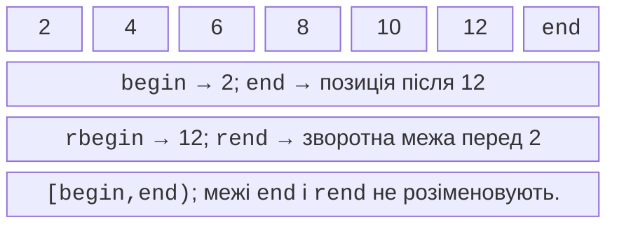
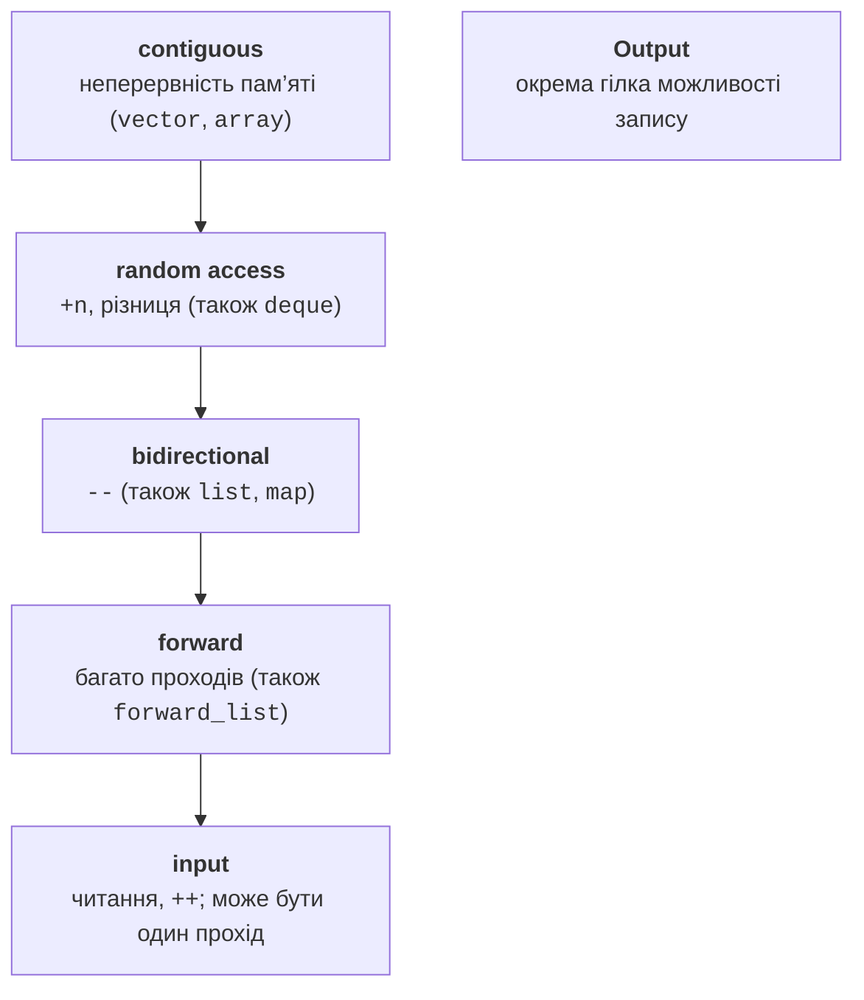
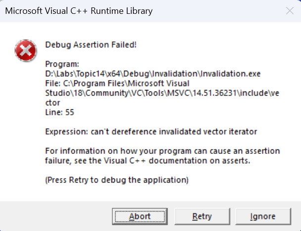
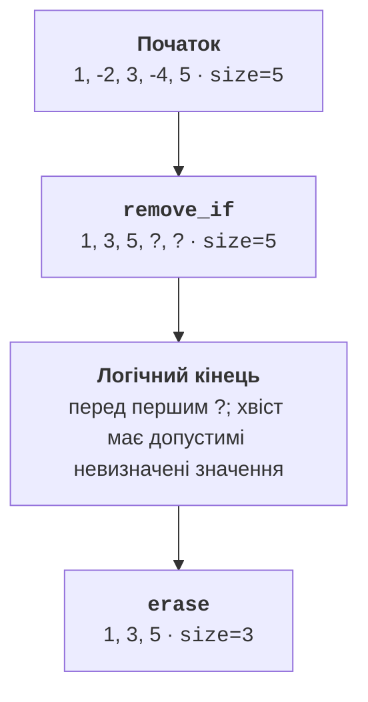

# Ітератори та недійсність

## Позиція замість прив’язки до контейнера

Алгоритм пошуку не повинен окремо знати будову vector і list.
Ітератор дає інтерфейс позиції: прочитати поточне значення,
перейти до наступного і порівняти з межею. Реалізація переходу
може бути збільшенням вказівника або переходом між вузлами.
Доступність операції не означає однакову її вартість.

Діапазон `[first,last)` включає first і виключає last. Порожній
діапазон має однакові межі. Такий запис дозволяє послідовно
склеювати піддіапазони й не потребує спеціальної адреси останнього
елемента порожнього контейнера. Ітератор end служить межею,
а не значенням; розіменування end не стає допустимим навіть
тоді, коли контейнер непорожній.



Рис. 14.1. Напіввідкриті межі й зворотний обхід {.caption}

`begin` і `end` змінюваного контейнера зазвичай дають доступ
до зміни елементів. `cbegin` і `cend` дають const-ітератори.
Сам const-ітератор можна пересувати; const стосується елемента,
який через нього доступний. Натомість const-змінна звичайного
ітератора не може бути пересунута, хоча її елемент може залишатися
змінюваним. Це два різні рівні незмінності.

Зворотний ітератор представляє позицію через базовий ітератор
після відповідного елемента: `rbegin().base() == end()`.
Тому перетворення позиції для erase потребує обережності.
`rend` так само не розіменовують. Для звичайного зворотного
обходу краще використовувати готові rbegin/rend або views::reverse,
а не вручну переходити перед початок масиву.

## Категорії та вимоги алгоритмів

Input-ітератор дає читання однопрохідної послідовності, як
потік. Копія такого ітератора не обіцяє незалежного повторного
обходу. Forward додає багатопрохідність, bidirectional – рух
назад, random access – переходи на відстань і різницю позицій.
Contiguous додатково гарантує відповідність порядку пам’яті.
Output-ітератори утворюють окрему групу для запису, а не сходинку
вкладеного ланцюжка читання.



Рис. 14.2. Уточнення категорій ітераторів {.caption}

`std::next(it,n)` не змінює початкову змінну it, а повертає
пересунуту копію. Для list він виконає n переходів; для vector
може використати сталу арифметику. `std::distance(first,last)`
аналогічно може бути лінійним. Викликати distance від початку
списку на кожній ітерації – спосіб випадково отримати квадратичний
алгоритм з на вигляд простого циклу.

`std::sort` потребує довільного доступу. Для list слід застосувати
метод list::sort, а не сподіватися, що будь-які begin/end достатні.
У ranges ці передумови виражені концептами. Власний ітератор
не стає random access лише від оголошення відповідного тегу:
він повинен реалізувати операції, складність і семантичні закони.

Sentinel може мати інший тип, ніж ітератор. Він відповідає на
питання «чи досягнуто кінця», але не зобов’язаний вміти читати
елемент. Це зручно для генераторів і потоків. Для алгоритму,
що вимагає однакових типів меж, інколи потрібне common-подання;
краще спершу перевірити, чи є відповідний ranges-алгоритм.

## Недійсність: зміна структури змінює позиції

Перевиділення vector робить недійсними всі ітератори, посилання
та вказівники на його елементи. Без перевиділення вставка все
одно може порушити позиції на місці вставки й після нього.
Видалення зміщує хвіст; старий end також не варто використовувати.
Reserve допомагає контролювати перевиділення, але не лікує
всі форми недійсності.

Вузли list і map зазвичай переживають вставку інших елементів.
Видалення конкретного вузла робить недійсними посилання на нього.
Deque має окремі правила для кінців і середини: додавання
на кінці не руйнує посилань на старі елементи, але ітератори
стають недійсними. Unordered-контейнери при rehash втрачають
ітератори, хоча посилання на невидалені елементи зберігаються.

Найбезпечніша початкова стратегія – не змінювати структуру
під час range-for. Якщо потрібне видалення, використовуйте
`erase_if` або явний цикл із поверненим erase ітератором.
Зберігання індексу замість ітератора не вирішує задачу автоматично:
після видалення індекс може позначати вже інший елемент.



Рис. 14.3. Діагностика порушення гарантії ітератора в Debug {.caption}

Debug-перевірки реалізації корисні, але не є переносимою
семантикою стандарту. В Release помилка може не проявитися
повідомленням і все одно залишатися некоректною. Не використовуйте
відсутність аварії як доказ чинності ітератора. Негативні приклади
тримайте окремо від виконуваних навчальних програм.

## remove, erase та вихідні ітератори

Алгоритм `remove_if` переміщує елементи, які залишаються, на
початок заданого діапазону і повертає нову логічну межу.
Він не знає, як змінити size довільного контейнера. У хвості
залишаються живі об’єкти з допустимими, але не визначеними
для цієї мети значеннями. Це не неініціалізована пам’ять.



Рис. 14.4. Логічний відбір і фізичне скорочення вектора {.caption}

```cpp
auto last = std::remove_if(values.begin(), values.end(),
    [](int x) { return x < 0; });
values.erase(last, values.end());
```

Для підтримуваних стандартних контейнерів C++20
`std::erase_if(values,predicate)` виражає цей намір коротше.
Метод list::`remove_if` сам видаляє вузли, тому не слід механічно
переносити на нього пояснення алгоритму `remove_if`.

Алгоритми копіювання потребують достатнього місця призначення.
`copy` до begin порожнього vector не створює елементів і
призводить до некоректного запису. `std::back_inserter(target)`
перетворює запис на `push_back`. Для відомого розміру можна
спершу resize, але reserve самого по собі недостатньо.
Потокові ітератори дозволяють читати або писати послідовно,
проте одноразовість input-потоку обмежує повторні проходи.
