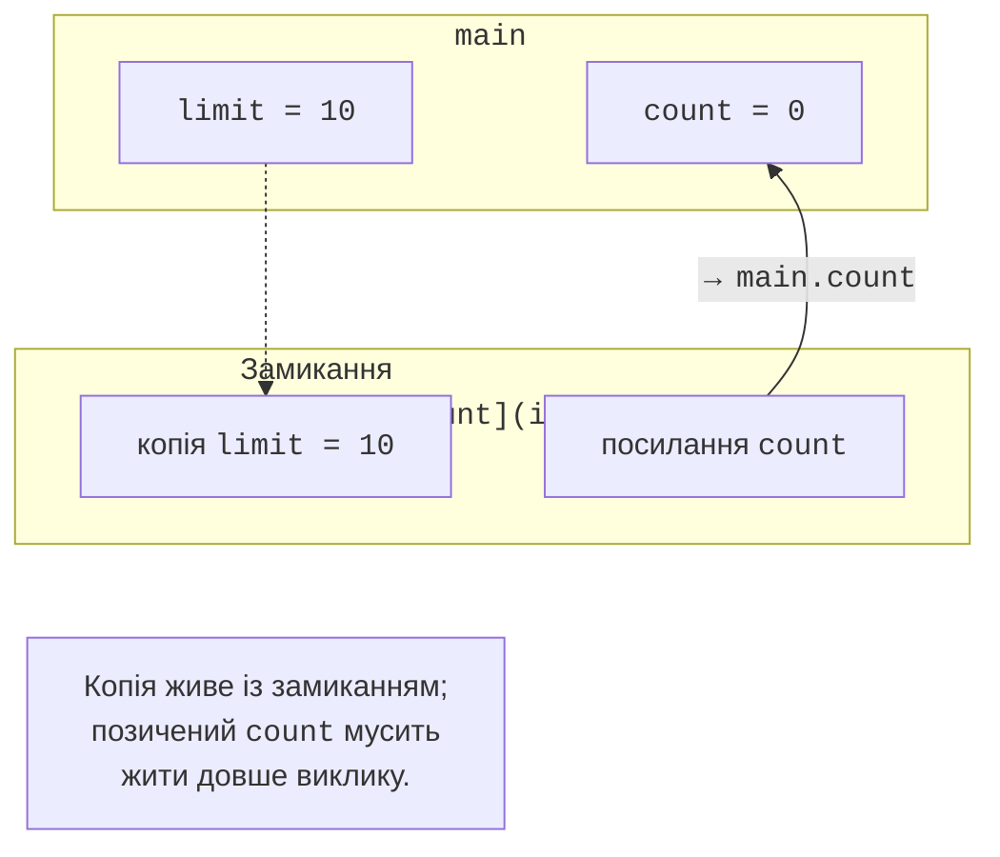
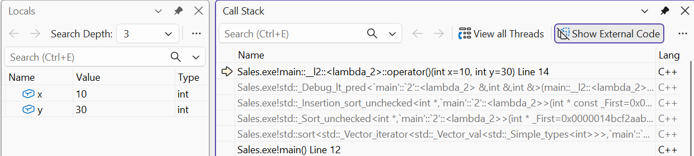

# Лямбда-вирази та функтори

## Лямбда як об’єкт із станом

Лямбда-вираз створює об’єкт замикання з оператором виклику.
Параметри в круглих дужках надходять під час виклику, захоплення
у квадратних дужках формуються при створенні об’єкта. Захоплена
копія є знімком значення на той момент; подальша зміна вихідної
змінної не змінює копію.

`[limit,&count]` копіює limit і позичає count. Для позиченої
змінної слід гарантувати час життя. `[=]` і `[&]` є типовими
політиками, але явні імена полегшують перегляд залежностей.
Захоплення `[this]` зберігає вказівник, а не копію всього об’єкта;
після знищення об’єкта воно небезпечне. `[ *this ]` має іншу
семантику копіювання об’єкта, яку теж потрібно обґрунтовувати.



Рис. 14.5. Копія та позичене посилання в замиканні {.caption}

`mutable` дозволяє змінювати захоплені за значенням поля через
оператор виклику. Воно не робить зовнішню змінну змінюваною
через її копію. Ініціалізувальне захоплення `[p=std::move(ptr)]`
передає володіння об’єкту лямбди; така лямбда може бути move-only.
Звичайний std::function вимагає копійованої цільової функції,
тому не кожну лямбду можна покласти в нього.

Узагальнена лямбда з `auto` параметром має шаблонний оператор
виклику. Її зручно передавати в алгоритм, якщо контракт
справді однаковий для кількох типів. Повернення лямбди з функції
є безпечним, коли потрібний стан належить самій лямбді.
Захоплене за посиланням локальне число після повернення функції
вже не існує, навіть якщо сама лямбда збережена в std::function.

### Генератор незалежних лічильників

**Умова.** Повернути лічильник зі станом, скопіювати й порівняти три незалежні копії.

```cpp
#include <functional>
#include <print>

auto makeCounter(int start)
{
    return [value = start]() mutable { return value++; };
}
int main()
{
    auto count = makeCounter(10);
    int first = count();
    int second = count();
    auto copy = count;
    std::function<int()> erased = copy;
    std::println("{} {}", first, second);
    std::println("original: {}", count());
    std::println("copy: {}", copy());
    std::println("function: {}", erased());
}
```

Результат виконання:

```text
10 11
original: 12
copy: 12
function: 12
```

Копіювання замикання копіює поточне значення поля. Три подальші виклики не ділять один лічильник. Виклики винесено в окремі вирази, щоб порядок обчислення аргументів функції друку не визначав послідовність чисел. Для спільного стану потрібна інша явно описана модель володіння.

## Функтори, invoke та алгоритмічні предикати

Іменований клас з operator() зручний для повторно використовуваної
політики з документацією й тестами. Лямбда добре підходить для
короткої локальної умови. std::function стирає конкретний тип
виклику за фіксованою сигнатурою, але може додати непрямий виклик
і виділення пам’яті. Якщо тип відомий у шаблоні, зберігати
саме його часто простіше, ніж додавати type erasure без потреби.

`std::invoke` узгоджує звичайні виклики та виклики через
вказівник на член. Стандартні функтори less, greater, plus
можна передавати замість власної лямбди з тією самою поведінкою.
Предикат відбору має повертати значення, інтерпретоване як bool.
Компаратор сортування має задавати строгий слабкий порядок;
випадковий результат або порівняння через &lt;= порушує контракт.

Не використовуйте змінний зовнішній лічильник порівнянь для
визначення самого порядку. Алгоритм може копіювати функціональний
об’єкт і виконувати порівняння не в очікуваній послідовності.
Лічильник для вимірювання допустимий за окремих умов, але
результат компаратора має залишатися узгодженим для тих самих
аргументів протягом сортування.



Рис. 14.6. Лямбда в стеку викликів алгоритму {.caption}
