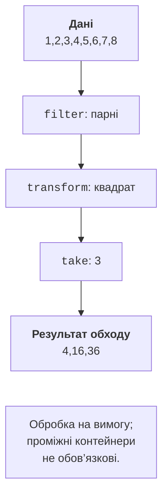

# Ranges та подання

## Ranges-алгоритми та проєкції

Ranges-алгоритм може приймати контейнер без ручного
передавання begin/end, що зменшує ризик випадково змішати
межі різних контейнерів. Він також підтримує концепти
та проєкцію: спосіб отримати ключ із повного елемента.
`&Student::grade` дозволяє сортувати цілі записи за балом,
не створюючи тимчасового вектора самих балів.

Проєкція не визначає додаткового критерію нічиєї. Якщо
потрібен порядок за балом, потім ім’ям, використайте
компаратор повних записів або проєкцію до пари. Не
покладайтеся на випадкову поведінку sort для рівних балів.

### Рейтинг студентів

**Умова.** Впорядкувати записи за балом і показати перші два з балом не нижче 85.

```cpp
#include <algorithm>
#include <functional>
#include <print>
#include <ranges>
#include <string>
#include <vector>

struct Student { std::string name; int grade; };

int main()
{
    std::vector<Student> students{
        {"Ira", 80}, {"Oleh", 95}, {"Anna", 90}, {"Max", 60}};
    std::ranges::sort(students, std::greater{},
        &Student::grade);
    auto best = students
        | std::views::filter([](const Student& s) {
            return s.grade >= 85;
        }) | std::views::take(2);
    for (const auto& s : best)
        std::println("{}: {}", s.name, s.grade);
}
```

Результат виконання:

```text
Oleh: 95
Anna: 90
```

Подання best позичає students. Контейнер живе довше за цикл; після створення подання структура не змінюється. Порядок операцій важливий: take до filter означав би перевірку лише перших двох усіх студентів, а не відбір перших двох придатних.

## Подання, лінивість та матеріалізація

Подання описує спосіб обходу. `filter` пропускає невідповідні
елементи, `transform` обчислює значення на запит, `take`
обмежує кількість, `drop` пропускає початок. `reverse`
вимагає достатньої категорії обходу. `iota` може створювати
послідовність без зберігання всіх чисел. Нескінченний
діапазон слід обмежити до алгоритму, що потребує кінця.



Рис. 14.7. Лінивий відбір квадратів парних чисел {.caption}

Лінивість не означає, що кожну функцію викличуть рівно
один раз на елемент. Повторне розіменування transform
може повторити обчислення, а filter може кешувати початок.
Тому функції конвеєра краще робити чистими; побічні ефекти
перетворюють кількість проходів на приховану залежність.
Після структурних змін власника подання слід перебудувати,
а не вважати його кеші автоматично узгодженими.

`keys` і `values` вибирають компоненти пар. `enumerate`
додає індекс, `zip` поєднує позиції кількох діапазонів
і закінчується на найкоротшому. Якщо предметна задача
вимагає однакової довжини імен та оцінок, перевірте це
окремо: тихе обрізання не є перевіркою даних.

`chunk(n)` утворює послідовні групи, остання може бути
коротшою; n має бути додатним. `split` ділить за роздільником
і не є повним CSV-парсером із лапками та екрануванням.
`std::ranges::to` матеріалізує результат у власний контейнер,
коли його потрібно зберегти незалежно від початкової пам’яті.

### Розбір простого списку кольорів

**Умова.** Розділити рядок за комами, зберігши порожнє поле, та отримати незалежні рядки.

```cpp
#include <print>
#include <ranges>
#include <string>
#include <vector>

int main()
{
    std::string source = "red,blue,,green";
    auto words = source | std::views::split(',')
        | std::views::transform([](auto part) {
            return std::string(part.begin(), part.end());
        }) | std::ranges::to<std::vector>();
    for (const auto& word : words)
        std::println("[{}] length={}", word, word.size());
    source.clear();
    std::println("owned words: {}", words.size());
}
```

Результат виконання:

```text
[red] length=3
[blue] length=4
[] length=0
[green] length=5
owned words: 4
```

Кожен піддіапазон перетворено на std::string, тому очищення source після матеріалізації безпечне. Якби зберігали `string_view`, слова залежали б від source. Програма не підтримує коми всередині лапок; її формат навмисно простий.

## Час життя й власний діапазон

Не всі подання обов’язково позичають. Деякі адаптери
можуть прийняти тимчасовий контейнер через `owning_view`.
Але повернення view на локальний lvalue-контейнер з функції
залишається помилкою. Потрібно читати конкретний тип
власності, а не правило «будь-який тимчасовий завжди поганий».

Ranges-алгоритми можуть повертати спеціальний dangling
замість небезпечного ітератора для тимчасового невласного
результату. Це допомагає в окремих інтерфейсах, але не
доводить безпеку всіх захоплених посилань і вкладених views.
Захоплений у предикаті `string_view` також має власний
ланцюг залежностей часу життя.

Власний діапазон має надати begin/end, а його ітератор –
потрібні операції та пов’язані типи. У лабораторному
прикладі Фібоначчі значення обчислюються, а не лежать
у масиві; ітератор повертає число за значенням. Чесна
категорія input достатня для take. Заявляти contiguous
для такого генератора було б неправильно.

Нові C++26 views, зокрема concat, залежать від підтримки
реалізації. У перевіреній MSVC потрібні C++23 enumerate,
chunk, zip і to доступні; concat не є обов’язковою
частиною цієї роботи. Перевіряйте окремий feature-test
макрос, а не лише загальне значення режиму C++.
