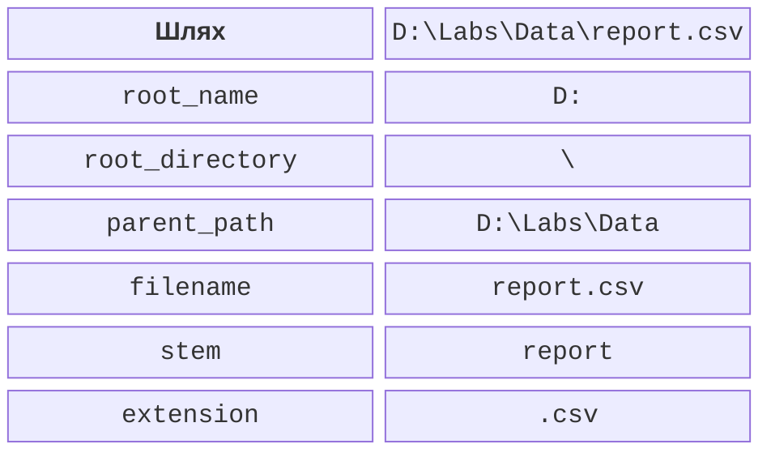
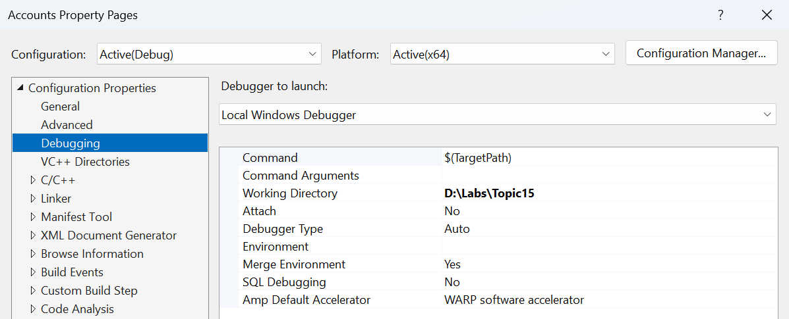

# std::filesystem

## Шлях є структурою, а не рядком зі слешами

filesystem::path знає складові шляху: корінь, каталог,
ім’я та розширення. Оператор / поєднує компоненти з
правилами платформи. Якщо праворуч передати абсолютний
шлях, результат може замінити попередню основу, тому
це не автоматична перевірка «залишатися всередині папки».
Для обробки недовірених шляхів потрібні окремі перевірки.



Рис. 15.6. Складові Windows-шляху {.caption}

Відносний шлях інтерпретується від поточного робочого
каталогу процесу, а не обов’язково від місця main.cpp
чи exe. Запуск із Visual Studio, термінала та тестового
середовища може мати різні `current_path`. Для діагностики
спочатку виведіть абсолютний шлях, із яким справді працює
програма, і лише після цього шукайте проблему в парсері.



Рис. 15.7. Робочий каталог під час налагодження {.caption}

`filename` повертає останню компоненту, `stem` – ім’я
без останнього розширення, `extension` – розширення з
крапкою. Файл може не мати розширення або містити кілька
крапок. `exists` і `is_directory` відповідають на різні
питання; існування шляху не гарантує, що його можна
відкрити як звичайний файл.

## UTF-8: вміст і імена файлів

Ключ /utf-8 налаштовує кодування початкового тексту та
вузьких літералів у MSVC. Він не змінює довільний файл,
який уже лежить на диску. UTF-8 BOM може з’явитися
на початку текстового файла; простий парсер повинен
або явно підтримати його, або задокументувати відсутність.
Інакше перше ім’я чи число міститиме зайві початкові байти.

На Windows path використовує native представлення,
пов’язане з широкими символами. `u8string()` повертає
UTF-8 у `std::u8string`, тобто з `char8_t`, і це не
тотожний тип std::string. Не приводьте вказівники
навмання лише для того, щоб задовольнити перевантаження
виведення. Узгоджене перетворення має бути явним.

У всіх обов’язкових прикладах імена файлів ASCII,
щоб відділити потокову логіку від перетворень шляхів.
Кириличний вміст можна зберігати як UTF-8. Розширення
на кириличні імена перевіряйте окремим тестом Windows
із path, а не твердженням, що string автоматично
означає UTF-8 у всіх файлових API.

## Обхід дерева й обробка помилок

`directory_iterator` обходить один каталог, `recursive_directory_iterator`
входить у підкаталоги. Порядок не визначений як алфавітний.
Для відтворюваного звіту накопичте дані й упорядкуйте
їх окремо. Під час обходу каталог може змінитися іншим
процесом; перевірка існування перед операцією не робить
саму операцію гарантовано успішною.

Багато функцій мають форму з винятком `filesystem_error`
і форму з `error_code`. Для другої потрібно перевіряти ec
після кожного виклику. Якщо кілька викликів поспіль
перезапишуть той самий ec, причина першої відмови
може загубитися. У циклі перевіряють не лише `file_size`,
але й створення ітератора та increment.

Символічні посилання потребують політики: слідувати
за ними чи ні, як уникати циклів та подвійного рахунку.
Пропуск `permission_denied` не означає, що обхід повний.
Чесний звіт зазначає пропущені записи або завершується
з помилкою. Навчальна фікстура нижче не містить посилань
і зупиняється при будь-якій файловій помилці.

### Розмір навчального каталогу

**Умова.** Створити три файли, обійти підкаталог та підсумувати байти за розширенням.

```cpp
#include <filesystem>
#include <fstream>
#include <map>
#include <print>
#include <string>
#include <system_error>

namespace fs = std::filesystem;
int main()
{
    const fs::path root = "directory-demo";
    fs::create_directories(root / "sub");
    for (const auto& [name, data] :
        std::map<std::string, std::string>{
        {"a.cpp", "abc"}, {"b.txt", "hello"},
        {"sub/c.cpp", "1234567"}}) {
        std::ofstream out(root / name, std::ios::binary);
        out << data;
        out.close();
        if (!out) return 1;
    }
    std::map<std::string, std::uintmax_t> totals;
    std::error_code ec;
    fs::recursive_directory_iterator it(root, ec), end;
    if (ec) { std::println("open: {}", ec.message()); return 1; }
    while (it != end) {
        bool regular = it->is_regular_file(ec);
        if (ec) { std::println("type: {}", ec.message()); return 1; }
        if (regular) {
            auto size = it->file_size(ec);
            if (ec) return 1;
            totals[it->path().extension().string()] += size;
        }
        it.increment(ec);
        if (ec) { std::println("next: {}", ec.message()); return 1; }
    }
    for (const auto& [ext, bytes] : totals)
        std::println("{}: {} bytes", ext, bytes);
}
```

Результат виконання:

```text
.cpp: 10 bytes
.txt: 5 bytes
```

Для точного повторення запускайте в чистому навчальному каталозі: генератор створює три задані файли, але не видаляє сторонні. Наявні додаткові файли в directory-demo теж увійдуть до підсумку. Це логічний розмір даних, а не кількість зайнятих кластерів диска. Виведення впорядковане завдяки map.


Рис. 15.8. Справжній підсумок розмірів за розширенням {.caption}

## Запис у тимчасовий файл і публікація

Під час прямого перезапису результату невдача посеред
операції може залишити обірваний файл. Інша схема:
створити тимчасовий файл у тому самому каталозі,
записати повний вміст, закрити з перевіркою і лише
після цього перейменувати в остаточне ім’я. Проте
деталі заміни наявного файла залежать від платформи
та файлової системи, а flush не гарантує фізичної
стійкості при втраті живлення.

Приклад нижче навмисно підтримує лише створення нового
результату в приватному навчальному каталозі. Якщо
остаточний або тимчасовий шлях уже є, він відмовляє.
Це не загальний конкурентний алгоритм атомарної заміни:
між exists і відкриттям інший процес може створити
файл. Для спільного каталогу потрібні платформні
механізми ексклюзивного створення та інша модель загроз.

### Публікація нового звіту

**Умова.** Записати новий звіт через тимчасовий файл і відмовити при повторному запуску.

```cpp
#include <filesystem>
#include <fstream>
#include <print>
#include <system_error>

namespace fs = std::filesystem;
int main()
{
    const fs::path target = "published-demo.txt";
    const fs::path temporary = "published-demo.tmp";
    std::error_code ec;
    bool exists = fs::exists(target, ec);
    if (ec || exists) {
        std::println("refused: target exists or is inaccessible");
        return 1;
    }
    if (fs::exists(temporary, ec) || ec) {
        std::println("refused: temporary path unavailable");
        return 1;
    }
    std::ofstream out(temporary, std::ios::binary);
    out << "verified report\n";
    out.close();
    if (!out) { std::println("write failed"); return 1; }
    fs::rename(temporary, target, ec);
    if (ec) {
        std::println("rename failed: {}", ec.message());
        return 1;
    }
    std::println("published: {}", target.string());
}
```

Результат виконання:

```text
published: published-demo.txt
```

Після першого успішного запуску final містить verified report та переведення рядка. Повторний запуск очікувано повертає код 1 і повідомлення refused. Програма не видаляє старий результат для імітації успіху. Після невдалого rename тимчасовий файл залишається для діагностики; його долю вирішують явно.

## Перевірка формату та відмов

Для тексту створіть порожній файл, правильний рядок,
рядок без роздільника, зайве поле, число поза діапазоном,
рядок без завершального переведення та неочікуваний BOM.
Окремо перевірте невідкриваний шлях. Синтаксична помилка
і неможливість читання ресурсу потребують різних повідомлень.

Для двійкового файла перевірте правильну довжину,
обрізаний останній запис, номер запису поза межами,
неправильну версію та нереалістичну кількість елементів
у заголовку. Не виділяйте пам’ять за неперевіреним
числом із файла. Якщо запис має фіксовані поля,
виведіть карту зміщень і перевірте її окремими байтами.

Для каталогів перевірте порожню теку, відсутню теку,
вкладені теки, файл без розширення та неможливість
запису результату. Операції remove/`remove_all` у цій
темі не є необхідними для демонстрації читання;
утиліти очищення починають з пробного звіту й працюють
лише в явно визначеній навчальній папці.

Обгортка std::expected може повертати або результат,
або структуровану помилку зі шляхом і причиною.
Вона не перетворює помилку на успішне порожнє значення.
Порожній каталог є валідним результатом, а недоступний
каталог – окремим станом. Не зводьте їх до однакової
порожньої таблиці без пояснення.

Форматування path у C++26 перевіряють окремо; у
прикладах використано `.string()` лише для ASCII-шляхів.
Це свідоме обмеження демонстрації, а не універсальна
обіцянка правильного показу будь-якої Windows-назви.
