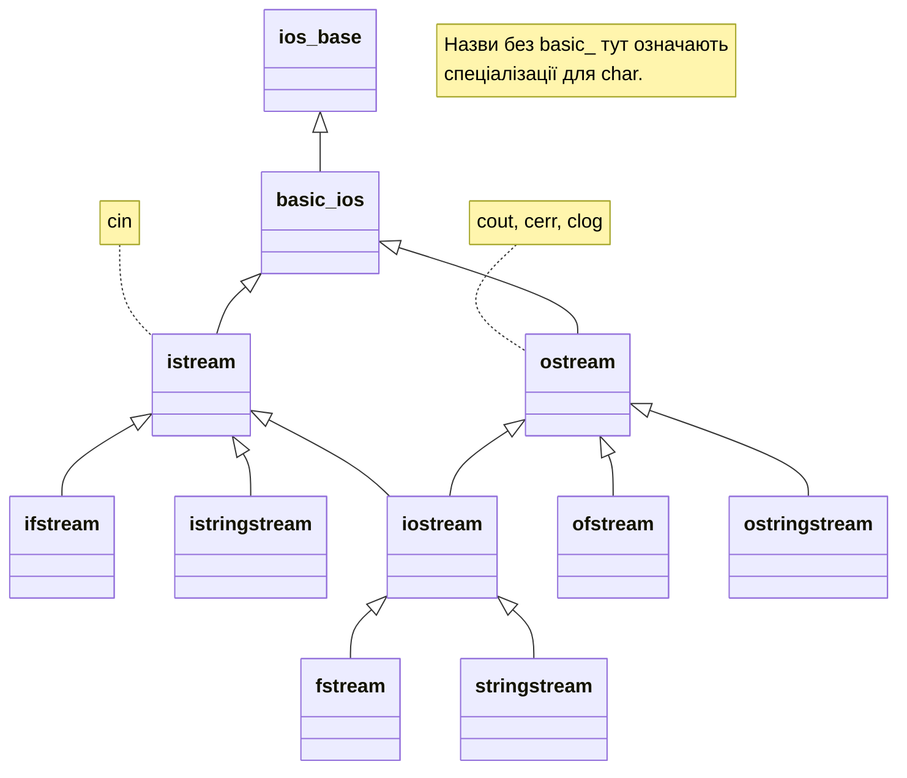

# Потоки та їхні стани

## Потік як послідовність операцій

Потік пов’язує джерело або приймач байтів з операціями читання
чи запису, станом помилок та параметрами форматування. Консоль,
файл і рядок мають різні ресурси, але для них можна використовувати
спільні принципи. `istream` надає введення, `ostream` – виведення,
`iostream` – обидва напрями. Файлові класи додають зв’язок із
файлом, рядкові – з пам’яттю рядка.

Назви ifstream і ostream є зручними спеціалізаціями шаблонів
для char. Широкосимвольний потік не стає автоматично універсальним
рішенням Unicode. Для навчальних файлів використовуємо UTF-8
і явно визначений формат; для назв файлів – filesystem::path.
Кодування вмісту й представлення шляху є різними питаннями.

Рис. 15.1. Ієрархія потоків і стандартні об’єкти {.caption}

`cin` читає стандартний ввід, `cout` пише стандартний вивід,
`cerr` і `clog` використовують стандартний потік помилок із
різними типовими властивостями буферизації. Перенаправлення
stdout у файл не означає автоматичного перенаправлення stderr.
Діагностику варто відділяти від машинозчитуваного результату,
щоб повідомлення про помилку не стало випадковим рядком CSV.

Потік володіє буфером або пов’язаний із ним. Успішне виконання
оператора `<<` ще не завжди означає, що всі байти вже записані
на носій. Буфер може спорожнитися пізніше; саме тому перевірка
лише відкриття файла не є повною перевіркою запису.

## Стани: good, eof, fail та bad

`goodbit` означає відсутність установлених прапорців помилки.
`eofbit` повідомляє, що операція досягла кінця джерела.
`failbit` означає невдале логічне читання або операцію, а
`badbit` – серйознішу помилку обміну з ресурсом. Прапорці
можуть бути встановлені одночасно. Перетворення потоку на
bool перевіряє відсутність fail/bad, а не тотожне виклику good.

Правильний цикл читає в умові: `while (std::getline(file,line))`.
Перевірка `while (!file.eof())` помилкова, бо eof стає відомим
після спроби читання. Вона може додати повтор попереднього
значення або обробити неуспішний результат. Після циклу треба
відрізнити нормальне закінчення файла від badbit чи іншої відмови.

Таблиця 15.1. Стани потоку не слід трактувати як один код результату {.caption}

| Стан | Інтерпретація для наступного кроку |
| --- | --- |
| good | Остання операція не повідомила стану помилки. |
| eof | Досягнуто кінця; це не передбачення наступного читання. |
| fail | Потрібна реакція на невдалу операцію або неправильний формат. |
| bad | Порушено низькорівневе читання чи запис. |
| clear() | Скидає прапорці, але не виправляє дані й не повертає позицію. |

Якщо після читання до кінця потрібен повторний прохід,
виконайте clear і seekg до початку, перевіривши результат.
Сам clear не знищує неправильний символ у рядку й не
повертає втрачений файл. Для помилки формату потрібно
спожити або відхилити некоректний фрагмент, інакше наступна
спроба натрапить на ті самі дані.

Метод exceptions дозволяє перетворити вибрані прапорці
на винятки `ios_base`::failure. Це інша політика повідомлення,
а не автоматичне виправлення. Якщо ввімкнути виняток на failbit,
звичайне читання до EOF також може потребувати обробки.
У прикладах використано явні перевірки, щоб кожна відмова
була видимою для початківця.

## Відкриття, режими й час життя

ifstream зазвичай відкриває для читання, ofstream – для
запису з обрізанням старого вмісту. `app` примушує запис
у кінець, а `ate` лише встановлює початкову позицію в кінці
після відкриття. `trunc` явно обрізає файл. Плутати app і
ate небезпечно для довільного оновлення записів.

RAII закриває файловий ресурс при знищенні потоку, включно
з виходом через виняток. Але деструктор не є зручним місцем
для повідомлення про помилку остаточного запису. Для важливого
результату явно close, потім перевірте стан і лише після
цього повідомляйте про успіх. Ручне close не скасовує RAII:
воно дає точку, в якій можна обробити відмову.

Усі завершені приклади створюють власні демонстраційні
файли в окремому навчальному каталозі запуску. Не запускайте
їх у папці з однойменними важливими файлами: генератори
grades-demo.csv і accounts-demo.dat навмисно відтворюють
фікстуру та перезаписують саме ці навчальні імена. Вхідні
файли не потрібно шукати або завантажувати окремо.
