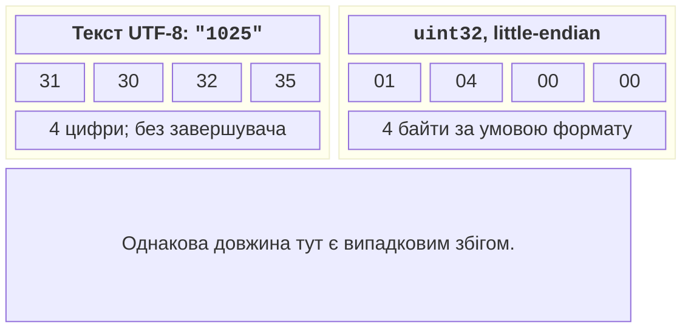
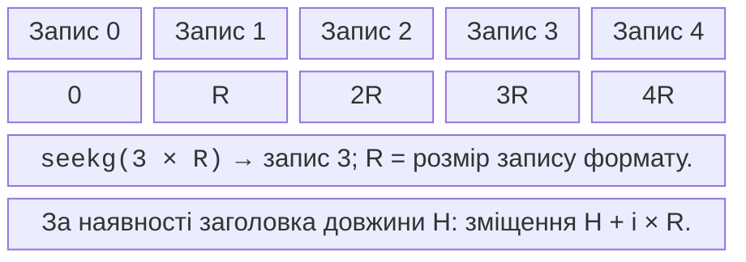

# Текстові та двійкові файли

## Текстовий формат і повний розбір рядка

Формат визначає не лише роздільник, а й дозволені символи,
пропущені поля, пробіли, кодування, діапазони чисел та
реакцію на неправильний рядок. Розділення комою не є
повним CSV, якщо не підтримуються лапки та коми всередині
поля. У прикладі ім’я не містить ком, а після оцінки
дозволені лише пробільні символи.

istringstream дає окремий стан розбору для кожного рядка.
Помилка одного запису не робить основний файловий потік
непридатним до читання наступного. Перевірка зайвого token
після числа відхиляє `90abc` та `90,extra`. Без неї
успішне читання числа могло б прийняти неправильний запис.

Для числових полів `from_chars` є альтернативою без
потокового форматування; слід перевірити код помилки
та те, що повернений вказівник дорівнює кінцю поля.
Саме повне споживання відрізняє правильне число від
коректного префікса неправильного рядка.

### Журнал оцінок у простому CSV

**Умова.** Згенерувати чотири рядки, прийняти лише оцінки 0..100, записати звіт і обчислити середнє.

```cpp
#include <fstream>
#include <print>
#include <sstream>
#include <string>

int main()
{
    {
        std::ofstream seed("grades-demo.csv");
        seed << "Anna,90\nOleh,75\nBad,abc\nIra,101\n";
        seed.close();
        if (!seed) return 1;
    }
    std::ifstream input("grades-demo.csv");
    std::ofstream report("grades-report.txt");
    if (!input || !report) return 1;
    int accepted = 0, rejected = 0, sum = 0;
    for (std::string line; std::getline(input, line);) {
        std::istringstream row(line);
        std::string name, tail;
        int grade = 0;
        if (!std::getline(row, name, ',') || name.empty()
            || !(row >> grade) || (row >> tail)
            || grade < 0 || grade > 100) {
            ++rejected;
            continue;
        }
        ++accepted; sum += grade;
        report << name << ": " << grade << '\n';
    }
    if (input.bad()) return 1;
    report.close();
    if (!report) return 1;
    std::println("accepted: {}, rejected: {}",
        accepted, rejected);
    if (accepted != 0)
        std::println("mean: {:.2f}",
            static_cast<double>(sum) / accepted);
}
```

Результат виконання:

```text
accepted: 2, rejected: 2
mean: 82.50
```

Файл grades-report.txt містить рядки Anna: 90 і Oleh: 75. Сума 165, кількість 2, тому контрольне середнє 82.50. Для реального журналу варто також повідомляти номер і причину відхилення, не виводячи зайвих персональних даних. Порожній набір не повинен породжувати ділення на нуль.


Рис. 15.2. Згенерований текстовий звіт поруч із кодом {.caption}

## Форматування не змінює значення

setw задає мінімальну ширину наступного поля, тоді як
fixed і setprecision зберігаються в стані потоку для
наступних операцій. Після fixed точність означає кількість
цифр після крапки; без нього правила інші. Якщо допоміжна
функція змінює формат зовнішнього потоку, їй слід відновити
попередній стан або чітко документувати цю зміну.

std::format створює рядок, який можна записати в ofstream.
std::print і std::println мають перевантаження для ostream
у відповідному заголовку та для C FILE*; ці типи не є
взаємозамінними. Не передавайте ofstream у позицію FILE*.
Вибирайте один зрозумілий шлях: сформований рядок у потік
або підтримуване перевантаження, і перевіряйте помилку запису.

Для файлу обміну локаль часто потрібно зафіксувати.
Число `12,5` і кома як роздільник без лапок конфліктують.
У прикладах простого формату використовуються ASCII-цифри
та крапка для дробової частини, а назви файлів – латиниця.
Український інтерфейс програми не зобов’язує машинний
формат використовувати регіональний десятковий роздільник.

## Текст проти двійкових байтів

Текстове число 1025 містить символи 1,0,2,5. Двійкове
подання залежить від обраного типу та порядку байтів.
Для явно заданого 32-бітового unsigned little-endian
це чотири байти 01 04 00 00. Збіг довжини з чотирма
символами випадковий: число 7 у тексті має одну цифру.



Рис. 15.3. Явно задане текстове та 32-бітове подання 1025 {.caption}

Прапорець binary вимикає текстові перетворення потоку,
але не створює переносимого формату автоматично. Сирий
запис структури включає padding, залежить від розмірів,
вирівнювання й порядку байтів. Тривіальна копійованість
є технічною передумовою такого копіювання представлення,
а не гарантією обміну між компіляторами чи версіями.

Структуру зі string, vector або вказівником не можна
зберегти простим write(sizeof object): записані адреси
не відновлять символів або виділеної пам’яті після запуску.
Потрібно серіалізувати логічні поля: довжини, значення,
байти рядків, версію формату та перевірки розмірів.

std::endian допомагає описати native порядок, byteswap
переставляє байти підтримуваних цілих типів. Але додавання
byteswap до сирої структури не прибирає padding і не
вирішує формат рядків. Надійний файл описує кожне поле
окремо, а не повторює випадковий макет пам’яті.

## Довільний доступ до навчальних записів

seekg змінює позицію читання, seekp – позицію запису.
tellg і tellp повертають позиції, які теж можуть означати
помилку. Для двійкового файла фіксованих записів без
заголовка зміщення запису i дорівнює `i * record_size`.
Якщо є заголовок, його довжину додають. Не підставляйте
номер запису напряму як байтове зміщення.



Рис. 15.4. Позиція запису залежить від розміру формату {.caption}

При переході між читанням і записом у fstream виконуємо
явне позиціювання й перевіряємо стан. Після EOF спершу
скидаємо потрібні прапорці через clear. read очікує
задану кількість байтів; короткий запис наприкінці –
ознака обрізаного файла, якщо формат вимагає повний запис.
Метод gcount дозволяє дізнатися фактично прочитану кількість.

### Навчальні рахунки в локальному двійковому файлі

**Умова.** Записати два рахунки й збільшити другий залишок на 500 мінімальних одиниць.

```cpp
#include <cstdint>
#include <fstream>
#include <print>
#include <type_traits>

struct Record { std::uint32_t id; std::int64_t cents; };
static_assert(std::is_trivially_copyable_v<Record>);
int main()
{
    Record rows[]{{1, 1000}, {2, 2500}};
    {
        std::ofstream out("accounts-demo.dat",
            std::ios::binary | std::ios::trunc);
        out.write(reinterpret_cast<const char*>(rows),
            sizeof rows);
        out.close();
        if (!out) return 1;
    }
    std::fstream file("accounts-demo.dat",
        std::ios::in | std::ios::out | std::ios::binary);
    if (!file) return 1;
    auto offset = static_cast<std::streamoff>(sizeof(Record));
    file.seekg(offset);
    Record item{};
    if (!file.read(reinterpret_cast<char*>(&item),
        sizeof item)) return 1;
    item.cents += 500;
    file.seekp(offset);
    file.write(reinterpret_cast<const char*>(&item),
        sizeof item);
    file.flush();
    if (!file) return 1;
    file.seekg(offset);
    if (!file.read(reinterpret_cast<char*>(&item),
        sizeof item)) return 1;
    std::println("id: {}, cents: {}", item.id, item.cents);
    file.close();
    return file ? 0 : 1;
}
```

Результат виконання:

```text
id: 2, cents: 3000
```

Формат призначений лише для повторного читання цією самою збіркою на цій платформі. sizeof(Record) може включати padding; це не обіцяні 12 байтів і не формат для обміну. Для виробничого файлу потрібні явні кодування ID і суми, перевірка довжини, заголовок та версія. Тут важливі seekg/seekp і перевірка кожної операції.


Рис. 15.5. Сире подання згенерованого файла {.caption}
