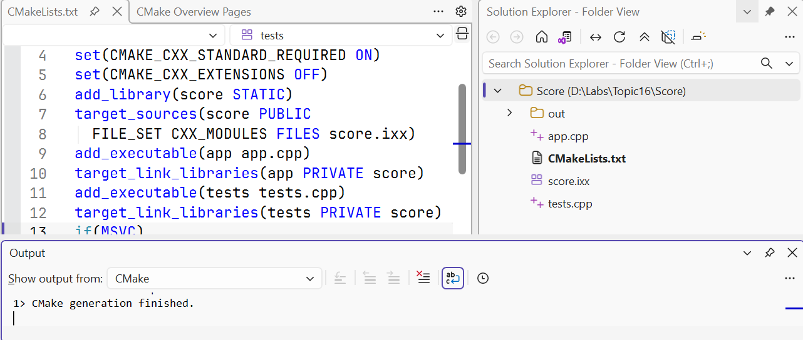
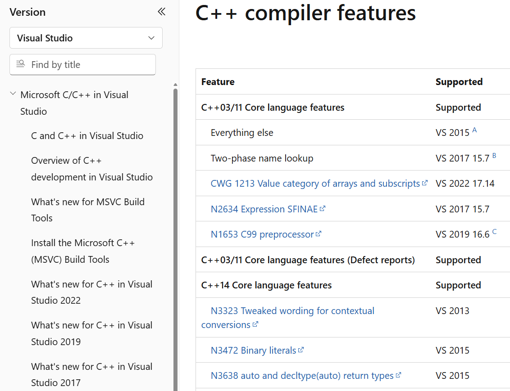

# CMake та C++26

## CMake та відтворюваний опис збирання

Файл проєкту IDE зберігає багато налаштувань, проте ручне повторення
кроків на кожному комп’ютері легко призводить до відмінностей.
**CMake** читає опис цілей і залежностей та генерує файли для обраної
системи збирання. Саме компілятор і відповідний build tool створюють машинний код.
Додавання `CMakeLists.txt` не замінює встановлення MSVC та Windows SDK.

Основна одиниця CMake – **ціль** (*target*): бібліотека або виконуваний файл.
`add_library` і `add_executable` створюють цілі, а `target_link_libraries`
описує використання бібліотеки клієнтом. Для інтерфейсів модулів застосовують
набір файлів типу `CXX_MODULES`; система може просканувати імпорти
й установити потрібний порядок компіляції.

Робочий приклад із ціллю `score` наведено в лабораторній роботі.
У цій темі перевірено CMake 4.4.3 і генератор *Visual Studio 18 2026*.
Опис вимагає CMake не нижче 4.2, оскільки саме з цієї версії наявний
цей генератор. Власні модулі прикладу використовують `<print>` у клієнті.
Для CMake автоматичне збирання `import std` має окремі обмеження й
експериментальні налаштування; не переносіть на нього налаштування MSBuild
за аналогією. Перевіряйте матрицю обраного генератора:
<https://cmake.org/cmake/help/latest/manual/cmake-cxxmodules.7.html>.

У навчальному каталозі команди мають чіткі ролі:

```powershell
cmake -S . -B build -G "Visual Studio 18 2026" -A x64
cmake --build build --config Debug
ctest --test-dir build -C Debug --output-on-failure
```

Перший крок конфігурує та генерує проєкт, другий збирає вибрану
конфігурацію, третій запускає зареєстровані тести. `-S` визначає каталог
початкових файлів, `-B` – окремий каталог результатів. Для багатоконфігураційного
генератора Visual Studio вибір Debug/Release відбувається під час збирання.
`CMAKE_BUILD_TYPE` не є його заміною.



Рис. 16.10. Проєкт CMake, відкритий у Visual Studio {.caption}

*File → Open → Folder* дозволяє працювати з каталогом CMake-проєкту в IDE.
Для команди важливо, що та сама конфігурація відтворюється з термінала.
Параметри повторних конфігурацій можна зберігати в `CMakePresets.json`.
Командні пресети належать репозиторію, локальні абсолютні шляхи й особисті
налаштування – окремому `CMakeUserPresets.json`, який зазвичай ігнорують.

vcpkg може керувати сторонніми залежностями, але тут зовнішніх пакетів немає.
Не вводьте менеджер пакетів лише заради одного власного модуля.
За появи залежностей фіксуйте маніфест і базову версію пакетів та
відрізняйте вимоги вашого проєкту від особливостей локального кешу.

## C++26: можливість мови та доступність реалізації

Рік у назві редакції стандарту не означає, що встановлений компілятор
підтримує всі її можливості. Потрібно окремо враховувати версію компілятора,
стандартної бібліотеки, режим стандарту та систему збирання.
У цій темі `/std:c++latest` перевірений у MSVC 19.51.36257.
Число `_MSVC_LANG` дорівнює `202400`; це значення режиму цього набору засобів,
а не сертифікат повної відповідності C++26.

Огляд Microsoft: <https://learn.microsoft.com/cpp/overview/visual-cpp-language-conformance>.
Для інших реалізацій перевіряйте їхні власні таблиці:
<https://gcc.gnu.org/projects/cxx-status.html> і
<https://clang.llvm.org/cxx_status.html>.
Позитивний результат у GCC не доводить доступності тієї самої можливості в MSVC.



Рис. 16.11. Перевірка підтримки можливостей у документації компілятора {.caption}

**Статична рефлексія** відкриває для коду відомості про структуру програми
під час компіляції. Позначення на зразок `^^T`, бібліотека `std::meta`
та сплайсинг `[: ... :]` стосуються цієї моделі. Її можливі застосування –
генерація серіалізації, перевірок і таблиць опису типів. Вона не є
синонімом виконуваного `typeid` і не потребує пошуку полів об’єкта в пам’яті навмання.

**Контракти** описують перевірювані умови коректного використання коду:
передумови `pre`, післяумови `post` і `contract_assert`.
Це не заміна перевірки некоректного введення користувача через звичайний API
помилок. Відомості про підтримку, режими й реакцію на порушення необхідно
перевіряти для конкретної реалізації. Лабораторні роботи цього курсу
не залежать від підтримки синтаксису контрактів.

Нові засоби `std::execution` для **відправників і приймачів**
(*senders/receivers*) описують асинхронні обчислення та їх композицію.
Вони відрізняються від політик `std::execution::par` алгоритмів,
відомих із попередніх редакцій. Наявність `<execution>` або макросу
зі старим значенням не доводить підтримки нової моделі.

### Невеликі нововведення та межі застосовності

Таблиця 16.1. Огляд напрямів розвитку C++26 {.caption}

| Можливість | Призначення і застереження |
| --- | --- |
| Індексація пакетів | Прямий доступ до елемента пакета шаблонних аргументів; потребує підтримки синтаксису компілятором. |
| Ім’я `_` | Можливість позначати деякі значення як непотрібні; не означає, що будь-яке ім’я `_` у старому коді має новий зміст. |
| Структурована прив’язка в умові | Поєднання декомпозиції результату та перевірки умови; перевіряйте правила допустимого типу. |
| `#embed` | Включення двійкових ресурсів під час трансляції; не замінює зчитування змінного файла під час виконання. |
| `= delete("причина")` | Пояснення забороненого виклику в діагностиці; звичайне `= delete` залишається базовим прийомом. |
| `std::inplace_vector` | Динамічний розмір із фіксованою максимальною місткістю без виділення окремого буфера; межу все одно потрібно враховувати. |
| Насичена арифметика | Операції на межі діапазону повертають граничне значення; їхня семантика відрізняється від звичайної арифметики. |
| `std::text_encoding` | Опис кодування; сам по собі не є універсальним перетворювачем Unicode. |
| Посилені перевірки бібліотеки | Діагностика деяких порушень передумов; не замінює контроль меж і часу життя у програмі. |

У встановленому наборі відсутні заголовки `<inplace_vector>`, `<hive>`
та `<debugging>`. Макрос індексації пакетів не визначений.
Це підстава не робити ці можливості обов’язковими для виконання варіантів.
Водночас `<flat_map>` уже наявний: можливості бібліотеки розвиваються
нерівномірно, тому загальна фраза «C++26 не підтримується» теж неточна.

### Приклад 4. Звіт про можливості встановлених засобів

Програма для MSVC не вводить жодних даних. Вона друкує версію компілятора,
режим і наявність вибраних можливостей. Макроси бібліотеки перевіряються
після включення `<version>`, а `__has_include` використано лише в директиві
препроцесора. Не викликайте його як звичайну функцію C++.

```cpp
#include <print>
#include <version>

int main()
{
    std::println("MSVC={}, mode={}", _MSC_VER, _MSVC_LANG);
#ifdef __cpp_lib_flat_map
    std::println("flat_map={}", __cpp_lib_flat_map);
#else
    std::println("flat_map: unavailable");
#endif
#ifdef __cpp_lib_execution
    std::println("execution={}", __cpp_lib_execution);
#endif
#if __has_include(<inplace_vector>)
    std::println("inplace_vector header: present");
#else
    std::println("inplace_vector header: absent");
#endif
#ifdef __cpp_pack_indexing
    std::println("pack indexing={}", __cpp_pack_indexing);
#else
    std::println("pack indexing: unavailable");
#endif
}
```

Для перевіреного набору результат такий:

```text
MSVC=1951, mode=202400
flat_map=202511
execution=201902
inplace_vector header: absent
pack indexing: unavailable
```

Значення макросу порівнюють із мінімальною потрібною редакцією можливості,
а не тільки з фактом його визначення. Макрос `execution=201902` у цьому
звіті стосується старіших політик виконання, а не senders/receivers C++26.
Наявність заголовка також слабша за успішну компіляцію потрібного виклику.
Після перевірки макросу зберіть маленький цільовий приклад і запустіть тести.

Код із новим синтаксисом, який компілятор ще не розуміє, не завжди можна
сховати в звичайну гілку `if constexpr`. Синтаксичний аналіз цієї гілки
все одно може виконуватися. Для непідтримуваної граматики застосовують
умови препроцесора або окремі файли, що не входять до поточного збирання.

## Організація навчального репозиторію

На верхньому рівні зручно зберігати `README.md`, опис збирання, `.gitignore`
та каталоги `src`, `include`, `tests`, `data`. Конкретні назви не є правилом
мови. Важливо, щоб інша людина могла знайти джерела, відтворити приклади
та відрізнити початкові дані від результатів виконання.

README повинен указувати потрібні версії засобів, команди конфігурації,
збирання й тестування, формат введення, приклади запуску та очікувані
коди завершення. Для командного інтерфейсу додайте `--help`, повідомлення
про некоректні аргументи й ненульовий код помилки. Не вимагайте
ручного редагування абсолютного шляху всередині коду.

Не включайте до Git каталоги `build`, `.vs`, файли `.obj`, `.ifc`, `.exe`
та проміжні `.lib`. Початкові файли модулів, заголовки, тести й опис
конфігурації потрібно зберігати. Перед захистом перевірте збирання
з нової копії репозиторію в іншому каталозі. Це виявляє залежність
від випадкового локального файла, яку не видно під час повторного запуску IDE.

Тести мають звертатися до тієї самої бібліотеки, що й застосунок.
Копія формули в тесті може повторити помилку реалізації. Натомість
обирайте незалежно відомі результати, граничні значення та
інваріанти: нульова площа, неможливий розмір, правильний стан після відмови.
Перевіряйте конфігурації Debug і Release: `assert` може бути вимкнений
через `NDEBUG`, тому для обов’язкових перевірок потрібний явний результат тесту.

## Типові помилки

Таблиця 16.2. Діагностика багатофайлових проєктів {.caption}

| Симптом | Що перевірити |
| --- | --- |
| LNK2019 | Чи є визначення потрібної функції серед файлів або бібліотек; чи збігаються сигнатура і простір імен. |
| LNK2005 | Чи не визначено звичайну зовнішню змінну або функцію в заголовку; чи не додано реалізацію до двох цілей. |
| Модуль не знайдено | Наявність інтерфейсу, порядок збирання, ім’я модуля та правильне зіставлення IFC. |
| Застарілий IFC | Версія компілятора та однакові параметри; чисте збирання в новому каталозі. |
| Успішний import, помилка компонування | Чи передано об’єктні файли інтерфейсу та реалізації; чи один файл не перезаписав інший. |
| CMake не знаходить компілятор | Встановлені C++ tools, SDK, вибраний генератор і його доступ до Visual Studio. |
| Працює лише на власному ПК | Абсолютні шляхи, незбережені джерела, випадкові файли в кеші; відтворення з чистої копії. |
