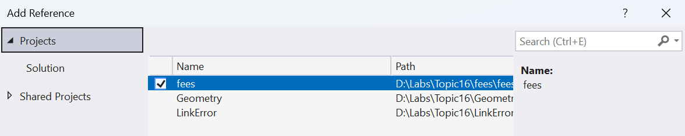
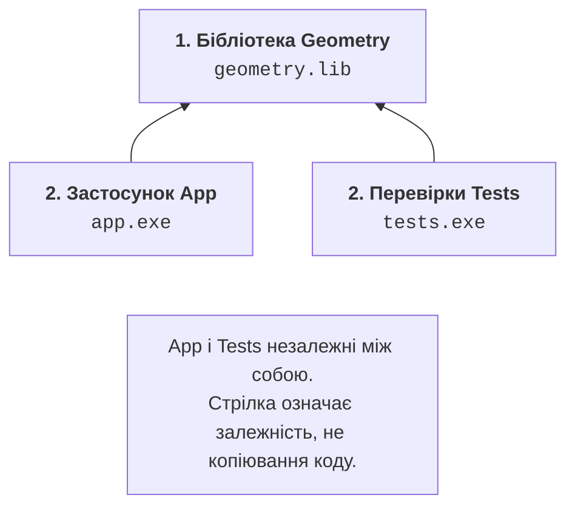
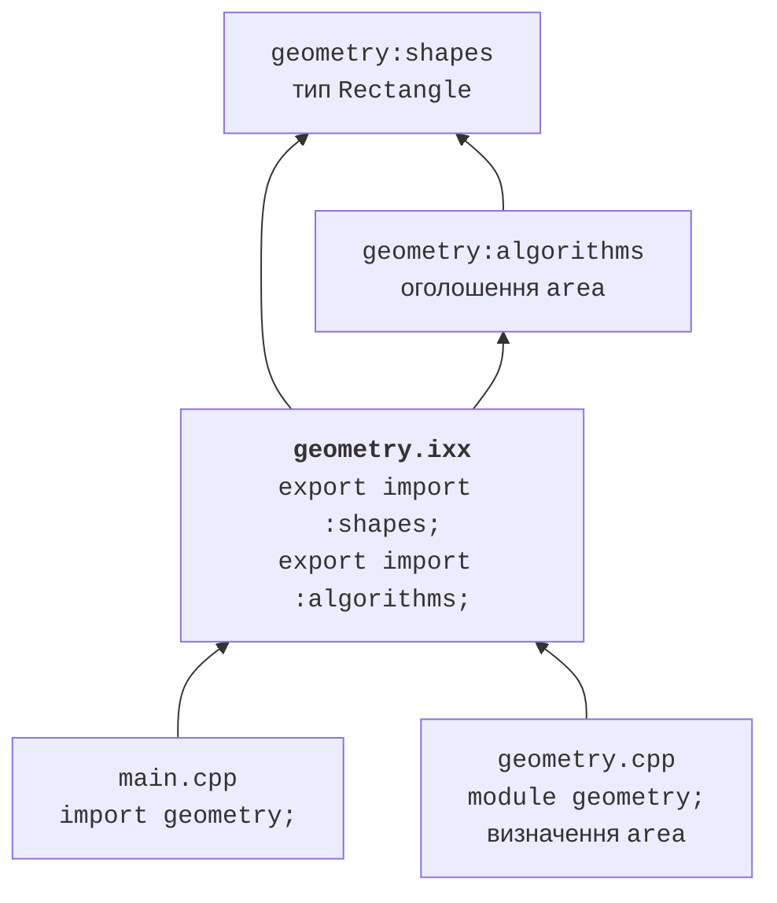
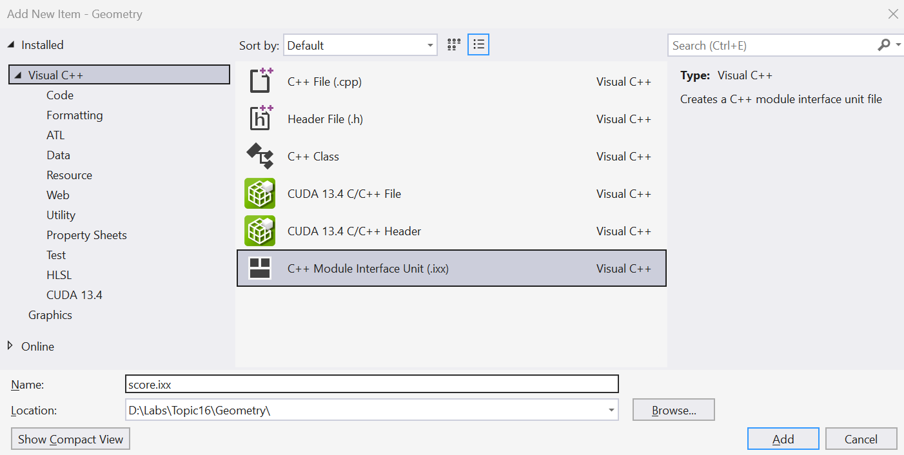
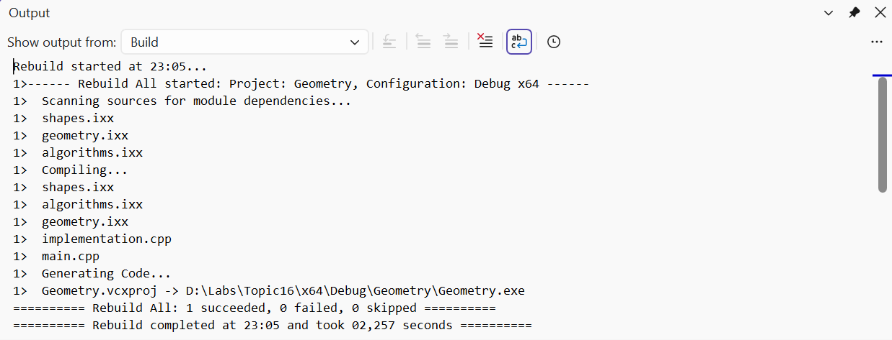

# Бібліотеки та модулі

## Статичні та динамічні бібліотеки

**Статична бібліотека** (*static library*) у MSVC є архівом об’єктних файлів
з розширенням `.lib`. Компонувальник бере з неї потрібні визначення для
виконуваного файла. Заголовок або модульний інтерфейс усе одно потрібний
компілятору клієнта: бібліотека машинного коду не замінює опис API.

Для першого геометричного прикладу виконайте в каталозі `headers`:

```powershell
cl /nologo /std:c++latest /EHsc /W4 /c geometry.cpp
lib /nologo /out:geometry.lib geometry.obj
cl /nologo /std:c++latest /EHsc /W4 main.cpp geometry.lib
.\main.exe
```

Опція `/c` зупиняє процес після компіляції, без створення `.exe`.
Команда `lib` створює архів. Остання команда компілює клієнта та компонуватиме
його з архівом. Результат залишається `Area: 12.0`; виведення не залежить
від того, чи функція потрапила до компонувальника як `.obj` або з `.lib`.

У Visual Studio створіть рішення з проєктами **Geometry** типу *Static Library*
та **App** типу *Console App*. Заголовок і реалізацію додайте до Geometry,
а `main.cpp` – до App. Налаштуйте шлях до заголовків та посилання App на Geometry.
Не копіюйте `geometry.cpp` також до App: інакше легко отримати два визначення.


Рис. 16.4. Створення проєкту статичної бібліотеки {.caption}



Рис. 16.5. Посилання застосунку на проєкт бібліотеки {.caption}

Посилання на проєкт описує залежність збирання й передавання бібліотеки
компонувальнику. Воно не завжди замінює налаштування каталогу заголовків.
Перевіряйте *C/C++ → General → Additional Include Directories* для активної
конфігурації. Усі проєкти мають узгоджувати платформу, режим стандарту
та параметри бібліотеки часу виконання. Наявність готового `.lib` на диску
ще не означає, що він створений для потрібної архітектури.



Рис. 16.6. Бібліотека та два незалежні клієнти у рішенні {.caption}

**Динамічна бібліотека** (*dynamic-link library*, DLL) завантажується під час
виконання. Для звичайного неявного зв’язування клієнт використовує імпортну
`.lib`, а під час запуску потребує `.dll`. У MSVC `__declspec(dllexport)`
позначає експорт із DLL, а `__declspec(dllimport)` – використання імпортованої
сутності клієнтом. Це розширення платформи, а не спосіб експорту з модуля C++.

Модуль C++ і DLL розв’язують різні задачі. Модуль організує видимість
і залежності на етапі компіляції. DLL є одиницею розгортання машинного коду.
Модуль може входити до статичної або динамічної бібліотеки. Ключове слово
`export` перед декларацією модуля не робить функцію експортом Windows DLL.

За межами навчального прикладу слід узгодити ABI, виділення та звільнення
пам’яті, обробку помилок і версії середовища виконання. Довільні C++-класи
не стають стабільним бінарним контрактом лише завдяки `dllexport`.
У цій роботі DLL є оглядовою темою; для варіантів достатньо статичної бібліотеки.
Офіційний навчальний матеріал:
<https://learn.microsoft.com/cpp/build/walkthrough-creating-and-using-a-dynamic-link-library-cpp>.

## Іменовані модулі C++20

Модуль має ім’я, наприклад `geometry`, та визначає, які оголошення доступні
клієнтам. **Первинна одиниця інтерфейсу** починається з `export module geometry;`.
Клієнт пише `import geometry;`. Ім’я модуля не є шляхом до файла:
його зв’язок із файлами визначає система збирання.

Компілятор створює скомпільоване представлення інтерфейсу. У MSVC це `.ifc`;
загальний термін – BMI (*built module interface*). Окремо може створюватися
об’єктний файл `.obj` із кодом. IFC потрібний під час компіляції клієнта,
а об’єктний файл – під час компонування. Забутий `.obj` може спричинити
невизначений символ навіть тоді, коли `import` успішний.

Не додавайте `.ifc` до Git як заміну початковому коду. Такі артефакти
залежать від компілятора, його версії та параметрів. Їх перебудовують
із файлів інтерфейсу. Після зміни набору засобів старий IFC може стати
несумісним; правильна дія – чисте збирання в окремому каталозі.

Офіційні матеріали: <https://learn.microsoft.com/cpp/cpp/modules-cpp>
та <https://learn.microsoft.com/cpp/cpp/tutorial-named-modules-cpp>.

### Приклад 3. Модуль geometry з розділами

Перенесемо геометричну операцію до модуля. Тип прямокутника та оголошення
алгоритму розмістимо в окремих **розділах** (*partitions*). Це поділ одного
модуля, а не незалежні бібліотеки для довільного зовнішнього імпорту.
Клієнт імпортуватиме первинний інтерфейс `geometry`.

**`geometry-shapes.ixx`:**
```cpp
export module geometry:shapes;

export namespace geometry {
    struct Rectangle { double width; double height; };
}
```

**`geometry-algorithms.ixx`:**
```cpp
export module geometry:algorithms;
import :shapes;

export namespace geometry {
    double area(Rectangle value);
}
```

**`geometry.ixx`:**
```cpp
export module geometry;
export import :shapes;
export import :algorithms;
```

Інтерфейс повторно експортує обидва розділи через `export import`.
Звичайний `import` робить оголошення доступними поточній одиниці,
але сам по собі не є повторним експортом клієнтам.

**`geometry.cpp`:**
```cpp
module;
#include <stdexcept>

module geometry;

double geometry::area(Rectangle value)
{
    if (value.width < 0 || value.height < 0) {
        throw std::invalid_argument("negative side");
    }
    return value.width * value.height;
}
```

Рядок `module;` починає **глобальний фрагмент модуля**. Традиційний заголовок
`<stdexcept>` включено до нього, перед `module geometry;`.
Так його оголошення не приєднуються випадково до іменованого модуля.
Не вставляйте великі системні заголовки навмання після декларації модуля.

**`main.cpp`:**
```cpp
#include <print>
import geometry;

int main()
{
    std::println("Area: {:.1f}", geometry::area({3, 4}));
}
```



Рис. 16.7. Залежності інтерфейсу, розділів і реалізації модуля {.caption}

Для ручної перевірки відкрийте Developer PowerShell у каталозі `modules`.
Параметри в масиві однакові для всіх одиниць. Це важливо: IFC, створений
з одним набором параметрів, не слід змішувати з клієнтом, що має інші.

```powershell
$opts = '/nologo','/std:c++latest','/EHsc','/utf-8','/W4'
cl @opts /c geometry-shapes.ixx
cl @opts /c geometry-algorithms.ixx `
  /reference geometry:shapes=geometry-shapes.ifc
cl @opts /c geometry.ixx `
  /reference geometry:shapes=geometry-shapes.ifc `
  /reference geometry:algorithms=geometry-algorithms.ifc
cl @opts /c geometry.cpp /Fo:geometry-impl.obj `
  /reference geometry=geometry.ifc
cl @opts main.cpp geometry.obj geometry-impl.obj `
  geometry-shapes.obj geometry-algorithms.obj `
  /reference geometry=geometry.ifc
.\main.exe
```

Результат: `Area: 12.0`. Зворотний апостроф наприкінці рядка є
продовженням команди PowerShell; після нього не повинно бути пробілів.
Параметр `/Fo:geometry-impl.obj` зберігає реалізацію окремо від
`geometry.obj`, створеного з інтерфейсу. Без різних назв один результат
міг би перезаписати інший. Помилка не стосується синтаксису самого модуля.

### Залежності та налаштування IDE

Інтерфейс розділу має бути готовий до компіляції його споживача.
Тому порядок визначає граф `import`, а не алфавіт файлів. Циклічні імпорти
між такими одиницями не можна виправити випадковим порядком команд:
потрібно змінити структуру, наприклад винести спільні типи в нижчий модуль.

У Visual Studio додайте елемент *C++ Module Interface Unit* з розширенням
`.ixx`. У властивостях C/C++ перевірте сканування залежностей модулів
(*Scan Sources for Module Dependencies*), режим стандарту та те,
що всі одиниці реалізації включені до проєкту. Назви категорій можуть
відрізнятися між випусками IDE; шукайте також властивість за її англійською назвою.



Рис. 16.8. Додавання одиниці інтерфейсу модуля {.caption}



Рис. 16.9. Сканування залежностей та збирання модуля {.caption}

Червоне підкреслення IntelliSense та результат компілятора – різні сигнали.
Спочатку відкрийте *Output → Build* і знайдіть першу реальну помилку.
Якщо проєкт компілюється, але редактор не бачить імпорту, перевірте активну
конфігурацію, індексацію й версію розширень. Не змінюйте коректний API
лише для усунення застарілої підказки редактора.

## Стандартна бібліотека як модуль

Іменовані модулі є мовною можливістю C++20, а стандартний модуль `std`
належить до C++23. Він експортує бібліотечні оголошення, що потрібні
користувацькому коду. `std.compat` додатково надає сумісність із глобальними
іменами бібліотеки C. Це не означає, що будь-який старий заголовок чи
макрос можна механічно замінити імпортом.

Модулі не експортують препроцесорні макроси так само, як текстове включення.
Для перевірки бібліотечних макросів включайте `<version>`.
Для `assert` потрібний заголовок `<cassert>`; один `import std;` не
повинен розглядатися як спосіб одержання всіх макросів.

Наступна повна програма сортує три числа. Її слід збирати в каталозі
`stdmodule`, окремо від попереднього `main.cpp`.

```cpp
import std;

int main()
{
    std::vector values{4, 1, 3};
    std::ranges::sort(values);
    for (int value : values) std::print("{} ", value);
    std::println();
}
```

Для ручного збирання використайте модуль із **встановленого** набору MSVC.
Не копіюйте чужий `std.ifc` з іншої машини.

```powershell
$opts = '/nologo','/std:c++latest','/EHsc','/utf-8','/W4'
$stdSource = "$env:VCToolsInstallDir/modules/std.ixx"
cl @opts /c $stdSource
cl @opts main.cpp std.obj /reference std=std.ifc
.\main.exe
```

Результат: `1 3 4` із пробілом після останнього числа та переходом на новий
рядок. У проєкті MSBuild стандартний модуль можна підготувати властивістю
*Build ISO C++23 Standard Library Modules*. Інструкція й обмеження:
<https://learn.microsoft.com/cpp/cpp/tutorial-import-stl-named-module>.

Заголовкові одиниці, наприклад імпорт заголовка, є ще одним механізмом.
Вони не тотожні іменованому модулю `std`. Їх підготовка залежить від
компілятора та системи збирання; у лабораторній роботі вони не потрібні.
Не використовуйте змішування трьох механізмів як універсальний спосіб
виправлення повідомлення «module not found».
