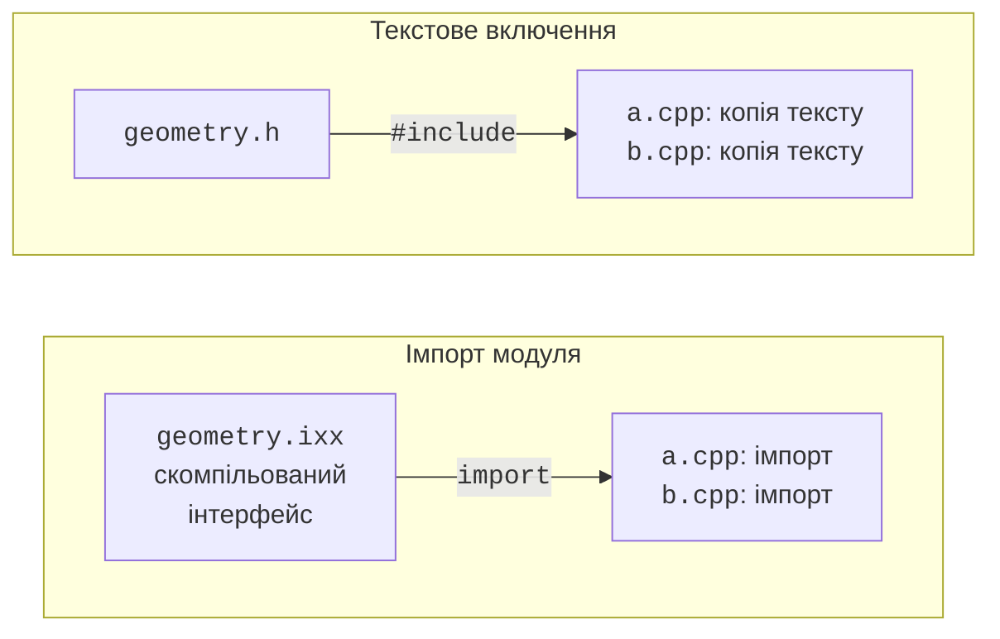
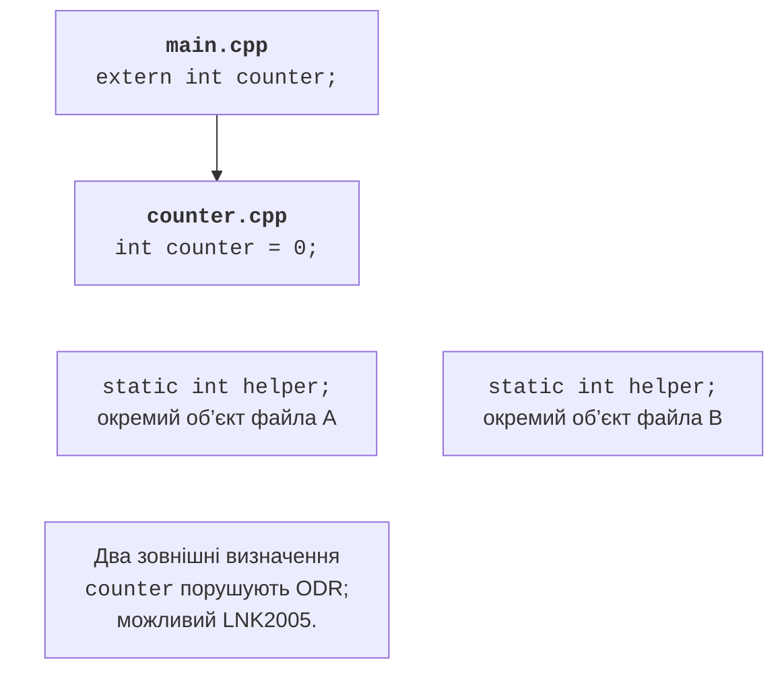

# Багатофайлові проєкти та ODR

## Від однієї програми до проєкту

У попередніх темах програма часто містилася в одному файлі, щоб було видно
весь алгоритм. Коли код росте, такий файл змішує модель даних, читання команд,
форматування звіту й роботу зі сховищем. Зміна одного правила змушує шукати
пов’язані місця серед багатьох несумісних деталей. Поділ на файли потрібний
насамперед для зрозумілих меж відповідальності.

**Інтерфейс** (*interface*) повідомляє клієнтові, які операції він може викликати.
**Реалізація** (*implementation*) визначає, як ці операції виконуються.
Наприклад, клієнт геометричної бібліотеки знає назву функції, типи її аргументів,
одиниці вимірювання та реакцію на від’ємну довжину. Спосіб обчислення площі
йому не потрібний. Проте самі типи аргументів ще не описують весь контракт:
умови припустимості даних слід пояснити текстом і перевірити тестами.

Межа файла не тотожна межі класу. Невелика бібліотека може містити кілька
пов’язаних класів, а реалізація великого компонента – кілька файлів.
Поділ кожної функції на окремий файл не робить архітектуру кращою.
Добрий критерій: файли, які доводиться змінювати разом, представляють одну
відповідальність; незалежні зміни не повинні вимагати перебудови всього застосунку.

Компілятор зазвичай обробляє кожну **одиницю трансляції** окремо. Для традиційної
програми це `.cpp` із текстом включених заголовків після препроцесування.
Він не переглядає довільні сусідні файли в пошуках потрібного визначення.
Успішна компіляція `main.cpp` ще не гарантує успішного компонування.
Компонувальник має отримати об’єктний код усіх використаних операцій.

Довідник Microsoft про одиниці трансляції та зв’язування:
<https://learn.microsoft.com/cpp/cpp/program-and-linkage-cpp>.
Порівняння двох способів організації інтерфейсу наведено на рис. 16.1.



Рис. 16.1. Текстове включення заголовка та імпорт інтерфейсу модуля {.caption}

## Приклад 1. Геометрична бібліотека з заголовком

Створимо програму, яка обчислює площу прямокутника 3 на 4. Від’ємні сторони
вважаємо помилкою, нульову сторону дозволяємо. Усі три файли зберігаємо
в окремому каталозі `headers`. Наведені далі проєкти з іншими версіями
геометричної бібліотеки потрібно зберігати окремо: вони не збираються разом.

**Файл `geometry.h`.** Тут міститься оголошення функції, тобто її ім’я,
параметри та тип результату. Клієнтові не потрібний текст її тіла.

```cpp
#ifndef COURSE_GEOMETRY_H
#define COURSE_GEOMETRY_H
namespace geometry {
    double rectangle(double width, double height);
}
#endif
```

**Файл `geometry.cpp`.** Реалізація включає власний заголовок першою.
Це дає компілятору змогу виявити невідповідність оголошення і визначення.

```cpp
#include "geometry.h"
#include <stdexcept>
double geometry::rectangle(double width, double height)
{
    if (width < 0 || height < 0) {
        throw std::invalid_argument("negative side");
    }
    return width * height;
}
```

**Файл `main.cpp`.** Клієнт включає заголовок і використовує повне ім’я
`geometry::rectangle`. Числа в прикладі задані в коді; клавіатурного введення немає.

```cpp
#include "geometry.h"
#include <print>
int main()
{
    std::println("Area: {:.1f}", geometry::rectangle(3, 4));
}
```

У Developer PowerShell, відкритій у каталозі цих файлів, виконайте:

```powershell
cl /std:c++latest /EHsc /utf-8 /W4 main.cpp geometry.cpp
.\main.exe
```

Результат: `Area: 12.0`. У цій команді компілюються дві одиниці трансляції,
а потім запускається компонувальник. Якщо вилучити `geometry.cpp` з команди,
виклик у `main.cpp` залишиться синтаксично правильним, але визначення функції
не буде серед об’єктних файлів. Це типова причина LNK2019.


Рис. 16.2. Невизначений зовнішній символ під час компонування {.caption}

### Захист від повторного включення

Умовні директиви `#ifndef`, `#define` та `#endif` утворюють **захист заголовка**
(*include guard*). Після першого включення макрос визначений, тому повторне
включення в ту саму одиницю трансляції пропускає вміст. Назва макросу має бути
унікальною для проєкту. Не використовуйте зарезервовані імена з двома підкресленнями.

MSVC також підтримує `#pragma once`: файл включається не більше одного разу
в одну одиницю трансляції. Це зручне розширення реалізації. Захист заголовка
не забороняє включати його в різні `.cpp`; саме для цього заголовок і створено.
Він також не усуває дубльовані зовнішні визначення в різних одиницях трансляції.

Заголовок має включати те, що потрібно для його власних оголошень.
Якщо він використовує `std::string`, не покладайтеся на те, що клієнт
раніше включить `<string>`. Перевірка самодостатності проста: створіть порожній
`.cpp`, включіть у ньому лише цей заголовок та скомпілюйте.
Водночас не додавайте до заголовка бібліотеки, потрібні лише реалізації.

## Правило одного визначення та зв’язування

**Оголошення** (*declaration*) вводить ім’я й описує сутність.
**Визначення** (*definition*) додатково надає її реалізацію або створює об’єкт.
Прототип функції з крапкою з комою є оголошенням; та сама функція з тілом
є визначенням. Рядок `extern int counter;` оголошує змінну, а
`int counter = 0;` визначає її. `extern` з ініціалізатором уже є визначенням.

**Правило одного визначення** (*one definition rule, ODR*) має кілька частин.
У межах однієї одиниці трансляції не можна повторно визначати ту саму сутність.
Для звичайної зовнішньої функції чи змінної, яку програма використовує,
потрібне одне визначення в програмі. Класи, шаблони та `inline`-сутності
можуть мати визначення в кількох одиницях за визначених стандартом умов.
Вони не дають дозволу на довільно різні тіла однієї функції.

Зокрема, однакові визначення повинні узгоджуватися не лише візуально:
імена в них мають знаходити відповідні сутності. Порушення ODR не завжди
діагностується компонувальником. Тому «програма зібралася» не доводить,
що всі визначення коректні. У навчальних проєктах корисно тримати спільні
визначення в одному заголовку, а не копіювати їх вручну.

**Зв’язування** (*linkage*) описує, чи можуть оголошення в різних місцях
позначати ту саму сутність. Воно відрізняється від області видимості:
область видимості визначає, де ім’я можна знайти в тексті програми.
Простір імен групує назви, але сам по собі не приховує реалізацію від компонування.



Рис. 16.3. Одна зовнішня змінна та незалежні внутрішні об’єкти {.caption}

### Приклад 2. Спільний лічильник без дублювання

Цей невеликий приклад демонструє механізм зв’язування, а не рекомендує глобальний
змінний стан як основний спосіб проєктування. Файли зберігаються в каталозі `odr`.

**`counter.h`:**
```cpp
#pragma once
namespace demo {
    extern int counter;
    void increment();
    inline constexpr int step = 2;
}
```

**`counter.cpp`:**
```cpp
#include "counter.h"
int demo::counter = 0;
void demo::increment() { counter += step; }
```

**`main.cpp`:**
```cpp
#include "counter.h"
#include <print>
int main()
{
    demo::increment();
    demo::increment();
    std::println("Counter: {}", demo::counter);
}
```

```powershell
cl /std:c++latest /EHsc /W4 main.cpp counter.cpp
.\main.exe
```

Результат: `Counter: 4`. У заголовку є лише оголошення `counter`.
Визначення розміщене в `counter.cpp`, тому обидві одиниці звертаються
до одного об’єкта. Стала `step` є `inline constexpr`, отже її визначення
можна розміщувати в заголовку й включати в кілька одиниць.

Для контрольованого експерименту в копії проєкту замініть оголошення
`extern int counter;` на `int counter = 0;`, а визначення з `.cpp` вилучіть.
Тепер заголовок створить зовнішнє визначення в обох одиницях. MSVC повідомить
LNK2005 і LNK1169. Поверніть початкові файли та перевірте успішне збирання.
Не «виправляйте» дублювання опцією примусового компонування.

### Внутрішнє зв’язування та inline

Функції й змінні на рівні простору імен, оголошені `static`, мають внутрішнє
зв’язування. Анонімний простір імен у `.cpp` також дозволяє зробити допоміжні
сутності локальними для одиниці трансляції. Вони не є деталями публічного API.
Не плутайте це зі статичним членом класу: у нього інший контекст і правила.

Якщо визначити `static int counter` у заголовку, кожен `.cpp` отримає власний
лічильник. Помилка компонування зникне, але поведінка вже не відповідатиме
вимозі спільного стану. Такий прийом приховує проблему, а не розв’язує її.

Ключове слово `inline` не наказує оптимізатору підставляти тіло функції.
Його важлива мовна властивість – дозвіл узгоджених визначень у різних одиницях.
Компілятор сам вирішує, чи замінити виклик тілом. Малий розмір функції,
`constexpr` та оптимізація пов’язані з цим рішенням, але не є гарантіями.
Функції, визначені всередині класу в звичайному заголовку, зазвичай неявно `inline`;
для іменованих модулів не варто механічно переносити це правило без перевірки.

## Простори імен та бібліотечний інтерфейс

Власний простір імен, наприклад `course::geometry`, зменшує ризик конфлікту
з функцією `area` іншої бібліотеки. Вкладений запис `namespace course::geometry`
дозволяє визначити його компактно. Псевдонім `namespace geo = course::geometry;`
скорочує звернення в клієнтському `.cpp`, не створюючи нової бібліотеки.

Директива `using namespace std;` у заголовку впливає на пошук імен у всіх
клієнтів, які його включили. Через це зміна стороннього заголовка може
зробити раніше однозначний виклик неоднозначним. У публічних заголовках
пишіть кваліфіковані імена. Локальне `using std::swap;` у тілі функції
може бути обґрунтованим прийомом; це не те саме, що відкрити весь простір імен.

Форма інтерфейсу має підтримувати тестування без консолі. Функція обчислення
площі повертає число або повідомляє помилку, а не читає `std::cin` і не друкує
меню. Тоді її може використати консольний застосунок, тест або інший інтерфейс.
Залежність спрямована від інтерфейсу користувача до предметної логіки.
