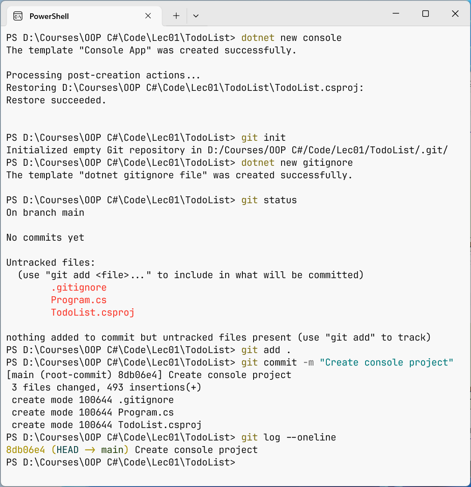

# Коміти та скасування змін

## Базовий цикл роботи: перші коміти

Розглянемо базовий цикл на прикладі консольної програми «Список справ». Створимо проєкт у папці `D:\Courses\OOP C#\Code\Lec01\TodoList` і **репозиторій** командою `git init`:

```
PS> dotnet new console
PS> git init
Initialized empty Git repository in D:/Courses/OOP C#/Code/Lec01/TodoList/.git/
```

Команда `git init` створює приховану папку `.git`; видалення цієї папки знищує всю історію. Команда `git status` – головний інструмент: вона показує поточну гілку, стан файлів і підказує наступні команди. Якщо виконати її одразу, у списку нових файлів буде й папка `obj/` з проміжними файлами збірки, яку не можна додавати в репозиторій. Тому спочатку створимо файл `.gitignore` зі стандартного шаблону .NET (його вміст розглянуто в наступному розділі):

```
PS> dotnet new gitignore
The template "dotnet gitignore file" was created successfully.
```

```
PS> git status
On branch main

No commits yet

Untracked files:
  (use "git add <file>..." to include in what will be committed)
        .gitignore
        Program.cs
        TodoList.csproj

nothing added to commit but untracked files present (use "git add"
to track)
```

### Додавання в індекс і коміт

Команда `git add` додає файли в індекс: `git add Program.cs` – один файл, `git add .` – усі зміни в поточній папці та вкладених папках. Команда `git commit -m "повідомлення"` створює коміт:

```
PS> git add .
PS> git commit -m "Create console project"
[main (root-commit) 8db06e4] Create console project
 3 files changed, 493 insertions(+)
 create mode 100644 .gitignore
 create mode 100644 Program.cs
 create mode 100644 TodoList.csproj
```

Рядок `[main (root-commit) 8db06e4]` означає: коміт створено в гілці `main`, він перший (кореневий), його скорочений хеш – `8db06e4`. Увесь цикл у Windows Terminal показано на рис. 1.4.



Рис. 1.4. Створення репозиторію та перший коміт у Windows Terminal {.caption}

### Перегляд змін: `git diff`

Змінимо `Program.cs`, щоб програма виводила список справ. Тепер `git status` покаже файл у розділі *Changes not staged for commit* (`modified: Program.cs`), а `git diff` – **що саме** змінилося порівняно з індексом. Рядки з `-` видалено, з `+` – додано, заголовок `@@ -1 +1,9 @@` означає «рядок 1 старої версії замінено рядками 1–9 нової»:

```
PS> git diff
diff --git a/Program.cs b/Program.cs
index 1bc52a6..02934f8 100644
--- a/Program.cs
+++ b/Program.cs
@@ -1 +1,9 @@
-Console.WriteLine("Hello, World!");
+Console.OutputEncoding = System.Text.Encoding.UTF8;
+
+List<string> tasks = ["Купити хліб", "Здати лабораторну роботу"];
+
+Console.WriteLine("Список справ:");
+for (int i = 0; i < tasks.Count; i++)
+{
+    Console.WriteLine($"{i + 1}. {tasks[i]}");
+}
```

Після `git add` команда `git diff` нічого не виводить, бо робочий файл збігається з індексом; зміни, підготовлені до коміту, показує `git diff --staged`.

```
PS> git add Program.cs
PS> git commit -m "Show task list"
[main af456b3] Show task list
 1 file changed, 9 insertions(+), 1 deletion(-)
```

Додамо введення нової справи з клавіатури: після першого рядка вставимо `Console.InputEncoding = System.Text.Encoding.UTF8;`, а перед виведенням списку – фрагмент, наведений нижче. Ключ `-a` команди `git commit` автоматично додає в індекс усі **відстежувані** змінені файли, тому окремий `git add` не потрібен (нові файли так не додаються).

```cs
Console.Write("Нова справа (Enter – пропустити): ");
string? text = Console.ReadLine();
if (!string.IsNullOrWhiteSpace(text))
{
    tasks.Add(text.Trim());
}
```

```
PS> git commit -am "Add task from keyboard"
[main 0fec855] Add task from keyboard
 1 file changed, 8 insertions(+)
```

```
PS> dotnet run
Нова справа (Enter – пропустити): Прочитати розділ про Git
Список справ:
1. Купити хліб
2. Здати лабораторну роботу
3. Прочитати розділ про Git
```

### Перегляд історії: `git log` і `git show`

Команда `git log` виводить коміти від найновішого; ключ `--oneline` скорочує кожен коміт до одного рядка, `--graph` малює граф гілок, `--all` показує всі гілки, а `-3` – лише три останні коміти (<https://git-scm.com/docs/git-log>). Якщо історія довга, Git показує її посторінково: прокручування – **Пробіл**, вихід – **Q**. Тут і далі три крапки позначають пропущені рядки виводу.

Повний формат `git log` для кожного коміту показує хеш, автора, дату й повідомлення:

```
PS> git log --oneline
0fec855 Add task from keyboard
af456b3 Show task list
8db06e4 Create console project
```

Команда `git show` показує один коміт (за замовчуванням – `HEAD`) разом зі змінами, наприклад `git show af456b3`; ключ `--stat` замінює рядки змін статистикою за файлами.

### Повідомлення комітів

Один коміт має містити одну логічну зміну, після якої проєкт збирається. Перший рядок повідомлення – короткий (до 50–72 символів) підсумок у наказовому способі без крапки: `Add task from keyboard`, а не `added stuff` чи `зміни`. У команді використовують одну мову повідомлень, найчастіше англійську.

## Файли `.gitignore` і `.gitattributes`

### Ігнорування файлів

У репозиторії зберігають лише **вихідні** файли: код, файли проєкту, ресурси. Не зберігають результати збірки (`bin/`, `obj/`), особисті налаштування IDE (`.vs/`, `*.user`), секрети (паролі, ключі API, рядки підключення) і файли, які можна отримати іншим способом (пакети NuGet відновлює `dotnet restore`).

Шаблони таких файлів записують у файл `.gitignore` у корені репозиторію. Кожен рядок – шаблон: `bin/` – папка на будь-якому рівні, `*.log` – файли з розширенням, `!important.log` – виняток, `#` – коментар (<https://git-scm.com/docs/gitignore>). Шаблон `dotnet new gitignore` містить майже 400 рядків для .NET і Visual Studio, зокрема `[Bb]in/`, `[Oo]bj/`, `.vs/` і `.env`. Команда `git check-ignore -v` пояснює, яке правило ігнорує файл:

```
PS> git check-ignore -v bin/Debug/net10.0/TodoList.dll
.gitignore:33:[Bb]in/   bin/Debug/net10.0/TodoList.dll

PS> git check-ignore -v obj/project.assets.json
.gitignore:34:[Oo]bj/   obj/project.assets.json
```

`.gitignore` діє лише на **невідстежувані** файли. Якщо папку `bin` уже закомічено, додавання її в `.gitignore` нічого не змінить: спочатку її треба прибрати з індексу командою `git rm -r --cached bin obj` (файли на диску залишаються) і зробити коміт. Цей випадок розглянуто в прикладах лабораторної роботи.

::: tip Увага
Пароль чи ключ, який потрапив у коміт, залишається в історії назавжди, навіть якщо наступним комітом видалити файл. Такий секрет вважають скомпрометованим: його потрібно негайно змінити. Секрети зберігають поза репозиторієм, наприклад у змінних середовища.
:::

### Кінці рядків і `.gitattributes`

У Windows рядки текстових файлів закінчуються парою символів CR LF, а в Linux і macOS – одним LF. Якщо не домовитися про формат, кожен коміт із «чужого» комп’ютера змінює всі рядки файлу, і `git diff` стає непридатним. Git розв’язує це **нормалізацією**: у репозиторії текстові файли зберігаються з LF, а в робочому каталозі Windows – з CRLF.

Параметр `core.autocrlf true` вмикає нормалізацію лише на вашому комп’ютері. Надійніше записати правила в сам репозиторій, у файл `.gitattributes`, щоб вони діяли в усіх учасників (<https://git-scm.com/docs/gitattributes>). Його створює шаблон `dotnet new gitattributes`; основні правила: `* text=auto` – Git сам визначає текстові файли та нормалізує кінці рядків; `*.cs text diff=csharp` – файли C# текстові, а `git diff` показує в заголовку фрагмента назву методу; `*.sln text eol=crlf` – файли рішень завжди з CRLF; `*.png binary` – двійковий файл без нормалізації. Попередження `LF will be replaced by CRLF the next time Git touches it` – не помилка: Git лише повідомляє, що змінить кінці рядків у робочому файлі.

## Скасування змін

Git дозволяє скасувати майже будь-яку дію. Головне правило: **спосіб залежить від того, чи опубліковано коміт**, тобто чи бачили його інші учасники (табл. 1.1).

Таблиця 1.1. Команди скасування змін {.caption}

| **Команда** | **Що робить** |
| --- | --- |
| `git restore <файл>` | повертає робочий файл до стану з індексу; **незбережені зміни втрачаються** |
| `git restore --staged <файл>` | прибирає файл з індексу, зміни на диску залишаються |
| `git commit --amend` | замінює останній коміт новим (виправити повідомлення, додати забутий файл) |
| `git revert <коміт>` | створює **новий** коміт, що скасовує зміни вказаного; історія не переписується |
| `git reset --soft <коміт>` | переміщує гілку на коміт; зміни скасованих комітів залишаються в індексі |
| `git reset --mixed <коміт>` | те саме, але зміни залишаються лише в робочому каталозі (режим за замовчуванням) |
| `git reset --hard <коміт>` | переміщує гілку та **видаляє** всі незакомічені зміни |
| `git stash` | тимчасово ховає незакомічені зміни, щоб повернути їх пізніше |

### Зміни в робочому каталозі та індексі

Ключ `--short` виводить стан коротко: `M` у другій колонці – файл змінено, у першій – зміни в індексі, `??` – невідстежуваний файл. Випадково зіпсований `Program.cs` повертає до останнього збереженого стану `git restore Program.cs`, а зайвий файл прибирає з індексу `git restore --staged notes.txt` (сам файл на диску залишається):

```
PS> git status --short
 M Program.cs
```

### Виправлення останнього коміту

Коміт із помилкою в повідомленні або без потрібного файлу виправляють ключем `--amend`: Git створює **новий** коміт замість останнього (зверніть увагу, що хеш змінився). Перед `--amend` можна виконати `git add` для забутих файлів.

```
PS> git commit -am "Sortt tasks"
[main 6c52215] Sortt tasks
 1 file changed, 1 insertion(+)

PS> git commit --amend -m "Sort tasks by name"
[main 6a861bd] Sort tasks by name
 Date: Thu Sep 17 10:26:38 2026 +0300
 1 file changed, 1 insertion(+)
```

### Відміна опублікованого коміту: `git revert`

Команда `git revert` не видаляє коміт, а додає новий, що робить протилежні зміни. Історія лише доповнюється, тому цей спосіб безпечний для комітів, які вже є в інших учасників. Ключ `--no-edit` приймає стандартне повідомлення без відкриття редактора:

```
PS> git revert --no-edit HEAD
[main 3452baa] Revert "Sort tasks by name"
 Date: Thu Sep 17 10:26:38 2026 +0300
 1 file changed, 1 deletion(-)
```

### Переміщення гілки: `git reset`

Команда `git reset` переміщує покажчик поточної гілки на вказаний коміт, і наступні коміти зникають з історії гілки. Режими `--soft`, `--mixed` і `--hard` визначають, що станеться зі змінами (табл. 1.1). Нижче `--hard` прибирає коміт відміни, а `--soft` скасовує коміт сортування, але залишає його зміни в індексі (`M` у першій колонці):

```
PS> git reset --hard HEAD~1
HEAD is now at 6a861bd Sort tasks by name

PS> git reset --soft HEAD~1
PS> git status --short
M  Program.cs
```

Коміт після `reset` не знищується одразу: Git записує кожне переміщення `HEAD` у **журнал посилань** (*reflog*) приблизно на 90 днів. За ним можна повернути «втрачений» коміт:

```
PS> git reflog -4
0fec855 HEAD@{0}: reset: moving to HEAD~1
6a861bd HEAD@{1}: reset: moving to HEAD~1
3452baa HEAD@{2}: revert: Revert "Sort tasks by name"
6a861bd HEAD@{3}: commit (amend): Sort tasks by name

PS> git reset --hard "HEAD@{1}"
HEAD is now at 6a861bd Sort tasks by name
```

У PowerShell фігурні дужки мають спеціальне значення, тому запис `HEAD@{1}` беруть у лапки.

::: tip Правило
`git reset`, `git commit --amend` і `git rebase` **переписують історію**: замість старих комітів з’являються нові з іншими хешами. Використовуйте їх лише для локальних комітів, які ще не надіслано у спільний репозиторій. Для опублікованих комітів використовуйте `git revert`.
:::

### Тимчасове збереження: `git stash`

Буває, що робота не завершена, а потрібно терміново перейти на іншу гілку. Незакомічені зміни можна сховати в **схованку** (*stash*), а пізніше повернути (<https://git-scm.com/docs/git-stash>):

```
PS> git stash push -m "Show task count"
Saved working directory and index state On main: Show task count

PS> git stash list
stash@{0}: On main: Show task count
```

Після `git stash push` робочий каталог чистий. Команда `git stash pop` повертає зміни й видаляє запис зі схованки, `git stash apply` – повертає, але залишає запис, `git stash drop` – видаляє запис без повернення. Нові файли ховаються лише з ключем `-u` (`--include-untracked`).
