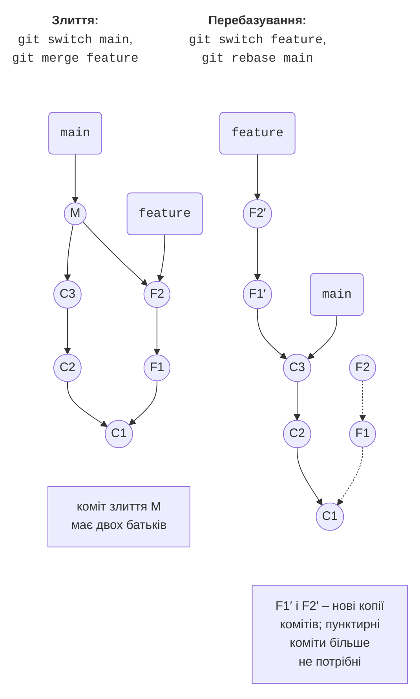

# Гілки, злиття та конфлікти

## Гілки, злиття та перебазування

Гілки дозволяють розробляти нову функцію окремо від робочої версії. Типовий порядок: від `main` створюють **гілку функції** (*feature branch*) з назвою на кшталт `feature/miles`, роблять у ній коміти, а коли функцію завершено й перевірено, зливають гілку назад у `main`.

Розглянемо програму «Конвертер відстаней» (`D:\Courses\OOP C#\Code\Lec01\UnitConverter`), яка переводить кілометри в метри. Історія вже містить два коміти:

```cs
Console.OutputEncoding = System.Text.Encoding.UTF8;
Console.InputEncoding = System.Text.Encoding.UTF8;

Console.Write("Відстань, км: ");
double km = double.Parse(Console.ReadLine() ?? "0");

Console.WriteLine($"{km} км = {km * 1000} м");
```

### Створення гілки та злиття fast-forward

Команда `git switch -c <назва>` створює гілку від поточного коміту і перемикається на неї, `git switch <назва>` – перемикається на наявну гілку, `git branch` – виводить список гілок (зірочка позначає поточну) (<https://git-scm.com/docs/git-switch>). Під час перемикання Git замінює файли робочого каталогу вмістом гілки, тому перед перемиканням зміни слід закомітити або сховати.

У гілці `feature/miles` додамо рядок `Console.WriteLine($"{km} км = {km / 1.609344:F3} милі");` і зробимо коміт:

```
PS> git switch -c feature/miles
Switched to a new branch 'feature/miles'

PS> git commit -am "Add miles"
[feature/miles d7f9c46] Add miles
 1 file changed, 1 insertion(+)

PS> git switch main
Switched to branch 'main'
```

```
PS> git merge feature/miles
Updating 994e248..d7f9c46
Fast-forward
 Program.cs | 1 +
 1 file changed, 1 insertion(+)

PS> git branch -d feature/miles
Deleted branch feature/miles (was d7f9c46).
```

Команда `git merge <гілка>` зливає вказану гілку в **поточну**. Поки гілка існувала, у `main` не з’явилося нових комітів, тому Git просто пересунув покажчик `main` уперед на коміт `d7f9c46`. Таке злиття називається **перемотуванням** (*fast-forward*): нового коміту не створюється. Злиту гілку видаляють командою `git branch -d`; незлиту гілку Git видалити не дасть – для цього потрібен ключ `-D`.

### Тристороннє злиття

Складніший випадок – коли обидві гілки розвивалися паралельно. Створимо гілку `feature/feet` з рядком для футів, а тим часом у `main` замінимо `double.Parse` перевіркою введення `double.TryParse` з повідомленням про помилку:

```
PS> git switch -c feature/feet
Switched to a new branch 'feature/feet'

PS> git commit -am "Add feet"
[feature/feet dfb633b] Add feet
 1 file changed, 1 insertion(+)

PS> git switch main
Switched to branch 'main'
```

```
PS> git commit -am "Validate distance"
[main adca857] Validate distance
 1 file changed, 5 insertions(+), 1 deletion(-)
```

Гілки розійшлися після коміту `d7f9c46`. Перемотування тут неможливе, тому Git виконує **тристороннє злиття** (*three-way merge*): порівнює обидві останні версії з їхнім спільним предком і створює **коміт злиття** з двома батьками (рис. 1.5, угорі). Зміни в різних місцях файлу Git об’єднує автоматично:

```
PS> git merge --no-edit feature/feet
Auto-merging Program.cs
Merge made by the 'ort' strategy.
 Program.cs | 1 +
 1 file changed, 1 insertion(+)
```

```
PS> git log --oneline --graph
*   9ae4f9a Merge branch 'feature/feet'
|\
| * dfb633b Add feet
* | adca857 Validate distance
|/
* d7f9c46 Add miles
* 994e248 Convert kilometres to metres
* 4826ae3 Create console project
```

```
PS> git branch -d feature/feet
Deleted branch feature/feet (was dfb633b).
```

Без `--no-edit` Git відкриває редактор із повідомленням `Merge branch 'feature/feet'`: його можна змінити або просто зберегти й закрити файл. `ort` – назва стандартної стратегії злиття.



Рис. 1.5. Злиття та перебазування гілок {.caption}

### Перебазування: `git rebase`

**Перебазування** (*rebase*) – інший спосіб отримати зміни з `main`: Git бере коміти гілки, які відсутні в `main`, і **заново застосовує** їх поверх останнього коміту `main` (рис. 1.5, унизу). Результат – лінійна історія без коміту злиття, але коміти гілки отримують нові хеші (<https://git-scm.com/docs/git-rebase>).

У гілці `feature/yards` додано ярди, а в `main` тим часом – заголовок програми. Перебазуємо гілку на `main`; після цього `git switch main` і `git merge feature/yards` зливають її перемотуванням:

```
PS> git switch feature/yards
Switched to branch 'feature/yards'

PS> git rebase main
Successfully rebased and updated refs/heads/feature/yards.
```

```
PS> git log --oneline --graph --all -4
* b0a4ec3 Add yards
* 40d0f1c Show program title
*   9ae4f9a Merge branch 'feature/feet'
|\
```

Коміт `Add yards` до перебазування мав хеш `336b5ca`, а після нього – `b0a4ec3`. Тому діє правило попереднього розділу: **не перебазовуйте гілки, які вже отримали інші учасники**. Для власних локальних гілок `rebase` робить історію простішою для читання. Якщо під час перебазування виникає конфлікт, його розв’язують так само, як конфлікт злиття, а потім виконують `git rebase --continue` (або `git rebase --abort`, щоб скасувати перебазування).

### Перенесення окремих комітів: `git cherry-pick`

Іноді з іншої гілки потрібен лише один коміт, наприклад виправлення, зроблене в експериментальній гілці. Команда `git cherry-pick <коміт>` копіює зміни коміту в поточну гілку як новий коміт (<https://git-scm.com/docs/git-cherry-pick>). У гілці `experiment/table` є коміти `df794e9 Print table header` і `f22b758 Explain input format`; у `main` потрібен лише другий:

```
PS> git switch main
Switched to branch 'main'

PS> git cherry-pick f22b758
Auto-merging Program.cs
[main e043f6d] Explain input format
 Date: Thu Sep 17 10:27:43 2026 +0300
 1 file changed, 1 insertion(+), 1 deletion(-)
```

У `main` потрапив лише коміт `Explain input format` (з новим хешем `e043f6d`), а невдала спроба таблиці залишилася в гілці `experiment/table`, яку потім видаляють командою `git branch -D experiment/table`.

## Конфлікти злиття

Git автоматично зливає зміни в різних рядках. Якщо ж обидві гілки змінили **той самий фрагмент** файлу, Git не може вирішити, яка версія правильна, і повідомляє про **конфлікт злиття** (*merge conflict*).

Розглянемо програму «Калькулятор знижок» (`D:\Courses\OOP C#\Code\Lec01\DiscountCalculator`). У `main` вона надає знижку 5 % на покупки від 1000 грн:

```cs
decimal discount = sum >= Threshold ? sum * 0.05m : 0;
```

У гілці `feature/discount` цей рядок замінено ступінчастою знижкою (10 % від 5000 грн), а в `main` тим часом знижку збільшено до 7 %. Спроба злиття зупиняється:

```
PS> git merge feature/discount
Auto-merging Program.cs
CONFLICT (content): Merge conflict in Program.cs
Automatic merge failed; fix conflicts and then commit the result.
```

```
PS> git status
On branch main
You have unmerged paths.
  (fix conflicts and run "git commit")
  (use "git merge --abort" to abort the merge)

Unmerged paths:
  (use "git add <file>..." to mark resolution)
        both modified:   Program.cs

no changes added to commit (use "git add" and/or "git commit -a")
```

Вигляд цих повідомлень у терміналі показано на рис. 1.6. Файли без конфліктів Git уже злив, а у файл `Program.cs` вставив **маркери конфлікту**:


Рис. 1.6. Повідомлення про конфлікт злиття {.caption}

```cs
<<<<<<< HEAD
decimal discount = sum >= Threshold ? sum * 0.07m : 0;
=======
decimal rate = sum switch
{
    >= 5000m => 0.10m,
    >= Threshold => 0.05m,
    _ => 0m
};
decimal discount = Math.Round(sum * rate, 2);
>>>>>>> feature/discount
Console.WriteLine($"Знижка: {discount:N2} грн");
```

- між `<<<<<<< HEAD` і `=======` – версія поточної гілки (`main`);
- між `=======` і `>>>>>>> feature/discount` – версія гілки, що зливається.

### Розв’язання конфлікту

Щоб розв’язати конфлікт, відкривають кожен файл зі списку *Unmerged paths*, залишають правильний код (одну з версій або їх поєднання) і **видаляють усі маркери**. Тут потрібні обидві зміни: ступінчаста знижка з гілки і нова ставка 7 % з `main`. Потім програму збирають і перевіряють, позначають конфлікт розв’язаним командою `git add` і завершують злиття командою `git commit`.

Після редагування фрагмент має такий вигляд:

```cs
decimal rate = sum switch
{
    >= 5000m => 0.10m,
    >= Threshold => 0.07m,
    _ => 0m
};
decimal discount = Math.Round(sum * rate, 2);
```

```
PS> git add Program.cs
PS> git status
On branch main
All conflicts fixed but you are still merging.
  (use "git commit" to conclude merge)

Changes to be committed:
        modified:   Program.cs
```

```
PS> git commit --no-edit
[main a73de7b] Merge branch 'feature/discount'
```

```
PS> git log --oneline --graph
*   a73de7b Merge branch 'feature/discount'
|\
| * 90bcc96 Add discount tiers
* | dcd4bda Increase discount to 7%
|/
* 3df4eb6 Calculate 5% discount
* ea033df Create console project
```

Якщо розв’язувати конфлікт зараз невчасно, команда `git merge --abort` повертає репозиторій до стану перед злиттям. Маркери, забуті в коді, компілятор C# знаходить сам: збірка завершується помилкою CS8300 *Merge conflict marker encountered*. Розв’язання конфлікту в редакторі злиття Visual Studio розглянуто в розділі «Git у Visual Studio 2026».

::: tip Порада
Конфліктів менше, якщо робити невеликі коміти, часто зливати `main` у свою гілку (або перебазовувати її) і не змінювати без потреби форматування чужого коду.
:::
