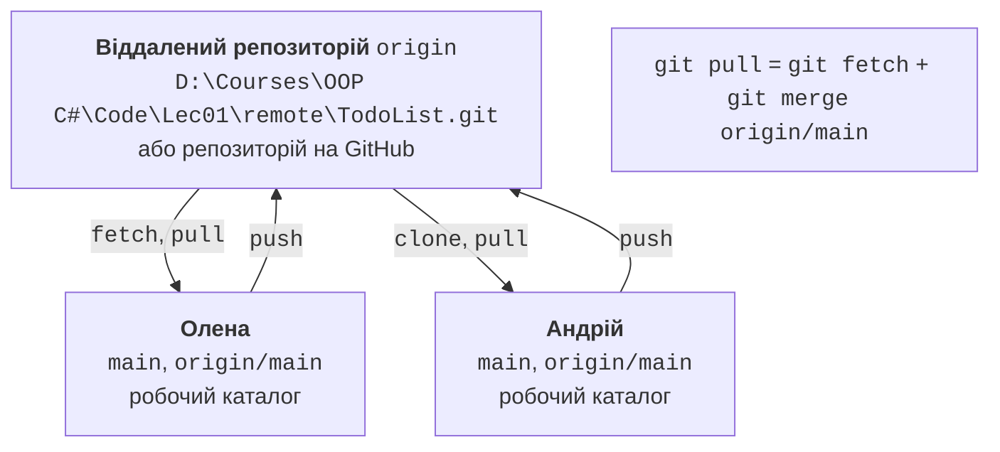
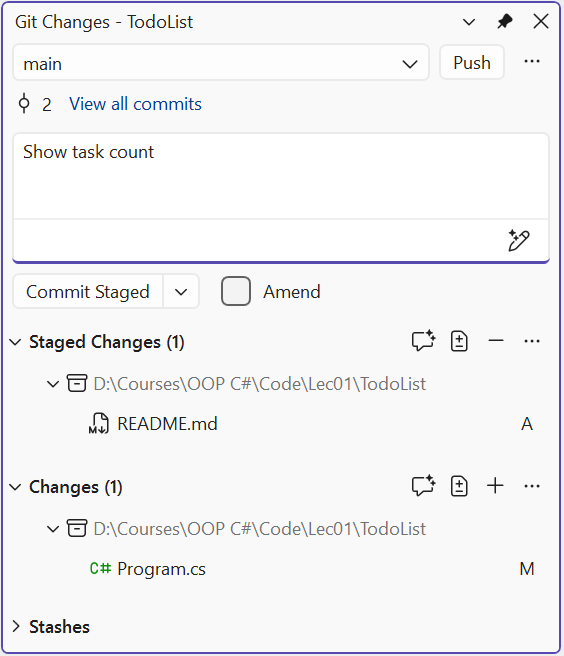
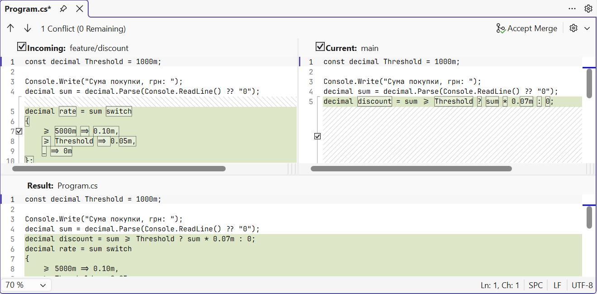

# Історія та робота в команді

## Теги, пошук в історії та хуки

### Теги

**Тег** (*tag*) – постійна позначка коміту, зазвичай номер версії. На відміну від гілки, тег не рухається. **Анотований** тег (ключ `-a`) зберігає автора, дату й опис і рекомендований для випусків (<https://git-scm.com/docs/git-tag>):

```
PS> git tag -a v1.0 -m "Version 1.0: metres, miles, feet"
PS> git tag
v1.0
```

Команда `git show v1.0` виводить автора й опис тегу та коміт, на який він указує.

Тег можна використовувати замість хешу: `git diff --stat v1.0 v1.1` порівнює дві версії, `git show v1.0:Program.cs` показує файл у версії 1.0, а `git switch --detach v1.0` тимчасово переводить робочий каталог у цю версію (повернення – `git switch main`). Для номерів версій зазвичай використовують **семантичне версіювання** `MAJOR.MINOR.PATCH` (<https://semver.org>): `v1.0.1` – виправлення помилок, `v1.1.0` – нові можливості, `v2.0.0` – несумісні зміни. Разом із тегом часто ведуть файл `CHANGELOG.md` з переліком змін кожної версії.

### Пошук в історії

Git відповідає на запитання «коли і ким змінено цей код»:

- `git log -S "текст"` – коміти, які додали або видалили вказаний текст;
- `git log --grep "слово"` – коміти, у повідомленні яких є слово;
- `git log -- Program.cs` – коміти, що змінювали файл;
- `git blame <файл>` – для кожного рядка файлу останній коміт, автор і дата (<https://git-scm.com/docs/git-blame>).

```
PS> git log --oneline -S "3280.84"
dfb633b Add feet

PS> git log --oneline --grep "feet"
9ae4f9a Merge branch 'feature/feet'
dfb633b Add feet
```

### Пошук коміту з помилкою: `git bisect`

Після кількох комітів у конвертері милі почали рахуватися неправильно: 1,609344 км має дорівнювати рівно одній милі, а програма виводить 1,505. У версії `v1.1` помилки не було. Команда `git bisect` знаходить коміт, що вніс помилку, **двійковим пошуком**: Git по черзі перемикає робочий каталог на коміт посередині проміжку, а розробник перевіряє програму і повідомляє результат командою `git bisect good` або `git bisect bad` (<https://git-scm.com/docs/git-bisect>):

```
PS> git bisect start
PS> git bisect bad
PS> git bisect good v1.1
Bisecting: 1 revision left to test after this (roughly 1 step)
[6c393a56b034d1918afdaac2bbf27fd860631a2e] Align output lines
```

Після `dotnet run` цей коміт виводить 1,505 милі, тому відповідаємо `git bisect bad`; наступний (`Add centimetres`) виводить 1,000 милі – відповідаємо `git bisect good`:

```
PS> git bisect good
6c393a56b034d1918afdaac2bbf27fd860631a2e is the first 'bad' commit
...
PS> git bisect reset
```

(Команди `start`, `bad` і `reset` також виводять короткі повідомлення про стан.) Для 100 комітів достатньо приблизно 7 перевірок. Команда `git bisect reset` повертає на гілку. Далі `git show 6c393a5` показує, що в коміті «вирівнювання» випадково змінено сталу `1.609344` на `1.069344`; `git blame Program.cs` для цього рядка теж указує на коміт `6c393a56`. Помилку виправляє команда `git revert --no-edit 6c393a5`. Якщо перевірку можна виконати командою, що повертає код 0 для правильної версії, пошук автоматизують: `git bisect run <команда>`.

### Хуки Git

**Хук** (*hook*) – сценарій, який Git автоматично запускає під час певної події (<https://git-scm.com/docs/githooks>). Приклади хуків, які виконуються на комп’ютері розробника: `pre-commit` (перед створенням коміту), `commit-msg` (перевірка повідомлення), `pre-push` (перед надсиланням). Якщо хук завершується з ненульовим кодом, Git скасовує дію. Хуки на сервері (`pre-receive`, `update`) можуть відхиляти надіслані зміни.

За замовчуванням хуки лежать у папці `.git/hooks` (там є приклади з розширенням `.sample`), але ця папка не потрапляє в коміти. Щоб хуки були в усіх учасників, їх зберігають у папці репозиторію, наприклад `.githooks`, і вказують її параметром `core.hooksPath`. Git for Windows виконує хуки вбудованою оболонкою `sh`, тому сценарій записують мовою оболонки, а перший рядок `#!/bin/sh` обов’язковий. Файл `.githooks/pre-commit` (без розширення), який не дає закомітити код, що не збирається:

```bash
#!/bin/sh
# Перед комітом перевірити, що проєкт збирається.
echo "pre-commit: dotnet build"
if ! dotnet build -v q -tl:off --nologo \
        -p:GenerateFullPaths=false -clp:ShowProjectFile=false; then
    echo "Збірка не вдалася, коміт скасовано." >&2
    exit 1
fi
```

Ключі `-v q` і `-tl:off` роблять вивід збірки коротким, а два останні параметри скорочують шляхи у повідомленнях про помилки. Перевіримо хук на коді з пропущеною крапкою з комою:

```
PS> git config core.hooksPath .githooks
PS> git commit -am "Shorten output"
pre-commit: dotnet build
Program.cs(20,48): error CS1002: ; expected

Build FAILED.
...
Збірка не вдалася, коміт скасовано.
```

Коміт не створено. Після виправлення помилки хук пропускає коміт (`Build succeeded.`), а ключ `git commit --no-verify` пропускає перевірку. Параметр `core.hooksPath` зберігається в `.git/config`, тому кожен учасник після клонування задає його один раз.

## Віддалені репозиторії та робота в команді

**Віддалений репозиторій** (*remote*) – інша копія репозиторію, з якою обмінюються комітами. Зазвичай він розміщений на GitHub чи іншому хостингу, але це може бути й папка на диску або в локальній мережі. Для обміну використовують команди (рис. 1.7):

- `git clone <адреса>` – створити локальну копію віддаленого репозиторію;
- `git remote add origin <адреса>` – зареєструвати віддалений репозиторій під іменем `origin`;
- `git push` – надіслати свої коміти;
- `git fetch` – отримати нові коміти, не змінюючи робочих гілок;
- `git pull` – отримати та злити нові коміти в поточну гілку (`fetch` + `merge`).



Рис. 1.7. Взаємодія локальних і віддаленого репозиторіїв {.caption}

### Локальний «сервер»: порожній репозиторій

Щоб навчитися працювати з віддаленим репозиторієм, не потрібні ні обліковий запис, ні мережа. Роль сервера виконує **порожній** (*bare*) репозиторій – папка лише з історією, без робочого каталогу. У нього можна надсилати коміти, як на GitHub. Створимо його для «Списку справ» і надішлемо гілку `main`:

```
PS> git init --bare "D:\Courses\OOP C#\Code\Lec01\remote\TodoList.git"
Initialized empty Git repository in D:/Courses/OOP C#/Code/Lec01/remote/TodoList.git/

PS> git remote add origin "D:\Courses\OOP C#\Code\Lec01\remote\TodoList.git"
PS> git remote -v
origin  D:\Courses\OOP C#\Code\Lec01\remote\TodoList.git (fetch)
origin  D:\Courses\OOP C#\Code\Lec01\remote\TodoList.git (push)
```

```
PS> git push -u origin main
To D:\Courses\OOP C#\Code\Lec01\remote\TodoList.git
 * [new branch]      main -> main
branch 'main' set up to track 'origin/main'.
```

Ключ `-u` пов’язує локальну гілку `main` з віддаленою `origin/main` (*upstream*), тому далі достатньо писати `git push` і `git pull` без параметрів. `origin/main` – **гілка стеження** (*remote-tracking branch*): локальна копія стану гілки `main` на сервері на момент останнього `fetch`, `pull` чи `push`.

### Два учасники

Другого учасника, Андрія, імітує ще один клон у папці `D:\Courses\OOP C#\Code\Lec01\team`. У клоні слід задати його ім’я без `--global`, щоб коміти мали іншого автора: `git config user.name "Andrii Bondar"`.

```
PS> git clone "D:\Courses\OOP C#\Code\Lec01\remote\TodoList.git" TodoList
Cloning into 'TodoList'...
done.
```

Андрій додає файл `README.md`, комітить (`Add README`) і надсилає коміт командою `git push`. Тим часом Олена у своєму репозиторії зробила коміт `Show task count`. Сервер не приймає її надсилання, бо на ньому є коміт, якого Олена ще не отримала:

```
PS> git push
To D:\Courses\OOP C#\Code\Lec01\remote\TodoList.git
 ! [rejected]        main -> main (fetch first)
error: failed to push some refs to 'D:\Courses\OOP C#\Code\Lec01\remote\TodoList.git'
hint: Updates were rejected because the remote contains work that you
hint: do not have locally. ...
```

Спочатку отримаємо чужі коміти й подивимося на граф:

```
PS> git fetch
...
PS> git log --oneline --graph --all -4
* e41525f Show task count
| * 93dadd9 Add README
|/
* 6a861bd Sort tasks by name
* 0fec855 Add task from keyboard
```

Гілки розійшлися, тому `git pull` виконує злиття (параметр `pull.rebase false`), після чого надсилання проходить. Андрій потім отримує результат командою `git pull` (перемотуванням):

```
PS> git pull --no-edit
Merge made by the 'ort' strategy.
 README.md | 4 ++++
 1 file changed, 4 insertions(+)
 create mode 100644 README.md

PS> git push
To D:\Courses\OOP C#\Code\Lec01\remote\TodoList.git
   93dadd9..456ac5b  main -> main
```

### Перегляд гілки перед злиттям

У командах зміни зазвичай не надсилають одразу в `main`, а готують у гілці, яку інший учасник переглядає (*code review*) і лише потім зливає. Андрій створює гілку `feature/summary`, робить у ній коміт і надсилає її командою `git push -u origin feature/summary`. Олена отримує гілку і переглядає її **без перемикання**: запис `main..origin/feature/summary` у `git log` означає «коміти гілки, яких немає в `main`», а `main...origin/feature/summary` (три крапки) у `git diff` – «зміни гілки від точки розходження з `main`»:

```
PS> git fetch
From D:\Courses\OOP C#\Code\Lec01\remote\TodoList
 * [new branch]      feature/summary -> origin/feature/summary

PS> git log --oneline main..origin/feature/summary
b15fe6e Print tasks in one line
```

```
PS> git diff main...origin/feature/summary
...
 tasks.Sort();
+Console.WriteLine("Готово: " + string.Join(", ", tasks));
...
```

Якщо зміни прийнято, гілку зливають, надсилають `main`, видаляють гілку на сервері та позначають випуск тегом. Теги не надсилаються автоматично, тому їх надсилають окремо:

```powershell
git merge --no-edit origin/feature/summary
git push
git push origin --delete feature/summary
git tag -a v1.0 -m "Version 1.0"
git push origin v1.0
```

Учасники прибирають посилання на видалені гілки командою `git fetch --prune`. Щоб захистити `main` у порожньому репозиторії від переписування та видалення, у ньому вмикають параметри `receive.denyNonFastForwards` і `receive.denyDeletes`: тоді `git push --force` і видалення `main` сервер відхиляє.

## GitHub (для самостійного ознайомлення)

Лабораторні роботи цієї теми виконуються з локальними репозиторіями, тому цей розділ необов’язковий. Проте більшість проєктів з відкритим кодом і багато компаній використовують **GitHub** (<https://github.com>): він зберігає віддалені репозиторії та додає інструменти спільної роботи. Документація: <https://docs.github.com/en/get-started/using-git>.

### Публікація репозиторію та автентифікація

Щоб опублікувати локальний репозиторій, на GitHub створюють новий репозиторій (*New repository*) без README, `.gitignore` і ліцензії, бо вони вже є локально, і виконують команди, які GitHub показує на його сторінці:

```powershell
git remote add origin https://github.com/<user>/TodoList.git
git push -u origin main
```

Якщо `origin` уже вказує на локальну папку, адресу змінюють командою `git remote set-url origin <адреса>`. GitHub не приймає пароль облікового запису для операцій Git. Для адрес `https://` використовують **Git Credential Manager**, який входить до Git for Windows: під час першого `push` відкривається браузер для входу, а токен зберігається в диспетчері облікових даних Windows (<https://docs.github.com/en/get-started/git-basics/caching-your-github-credentials-in-git>). Альтернатива – **ключ SSH** (`ssh-keygen -t ed25519`) і адреси `git@github.com:<user>/TodoList.git`; публічну частину ключа додають у *Settings → SSH and GPG keys* (<https://docs.github.com/en/authentication/connecting-to-github-with-ssh/generating-a-new-ssh-key-and-adding-it-to-the-ssh-agent>). Приватний ключ і токени не передають нікому й не зберігають у репозиторії.

### Запити на злиття та GitHub Flow

**Запит на злиття** (*pull request*, PR) – пропозиція злити гілку в іншу, яку учасники обговорюють і переглядають у вебінтерфейсі: коментують рядки коду, схвалюють або просять змінити. Це той самий перегляд гілки, що й `git log main..feature` і `git diff main...feature`, але з історією обговорення (<https://docs.github.com/en/pull-requests>). Порядок роботи **GitHub Flow** (<https://docs.github.com/en/get-started/using-github/github-flow>): створити гілку від `main`; робити коміти й надсилати гілку; створити pull request; виправити зауваження перегляду новими комітами; злити pull request у `main`; видалити гілку.

Для проєктів без права запису спочатку створюють **форк** (*fork*) – власну копію репозиторію на GitHub – і надсилають pull request з нього. GitHub також створює **випуски** (*releases*) на основі тегів і дозволяє **захистити гілку** (*branch protection*), наприклад заборонити зміни в `main` без схваленого pull request.

## Git у Visual Studio 2026

Visual Studio 2026 має вбудовану підтримку Git: усі операції попередніх розділів можна виконати у вікнах IDE. Команди Git зібрано в меню *Git*, а поточну гілку показано в рядку стану (<https://learn.microsoft.com/visualstudio/version-control/>). Visual Studio використовує ті самі репозиторії та налаштування, що й термінал, тож способи можна поєднувати.

### Створення репозиторію

Для відкритого рішення без репозиторію оберіть *Git → Create Git Repository*. У діалозі *Create a Git repository* у групі *Other* оберіть *Local only*, перевірте шлях і шаблон `.gitignore` та натисніть *Create and Push*. Для локального репозиторію нічого не надсилається: виконуються дії `git init`, створення `.gitignore` і перший коміт. Якщо репозиторій уже створено в терміналі, Visual Studio розпізнає його автоматично.

### Вікно *Git Changes*

Вікно *Git Changes* (*View → Git Changes*) замінює команди `status`, `add` і `commit` (рис. 1.8). У списку *Changes* показано змінені файли; подвійне клацання відкриває порівняння з попередньою версією (`git diff`). Кнопка **+** біля файлу додає його в індекс (список *Staged Changes*), кнопка **−** прибирає. Після введення повідомлення *Commit Staged* створює коміт з індексу, а *Commit All* – з усіх змін (`git commit -a`); прапорець *Amend* замінює останній коміт. Кнопки *Fetch*, *Pull*, *Push* і *Sync* обмінюються комітами з віддаленим репозиторієм.



Рис. 1.8. Вікно *Git Changes* {.caption}

### Гілки та історія

Нову гілку створюють командою *Git → New Branch*: у діалозі *Create a new branch* задають назву, у полі *Based on* – гілку, від якої вона починається, прапорець *Checkout branch* одразу перемикає на нову гілку. Перемикатися між гілками зручно в рядку стану або у вікні *Git Changes*.

Вікно *Git Repository* (*View → Git Repository*, **Ctrl+0, Ctrl+R**) показує гілки й теги (*Branches / Tags*) та граф комітів вибраної гілки (рис. 1.9). Подвійне клацання на коміті відкриває його зміни. Контекстне меню гілки, відмінної від поточної, містить *Merge 'feature' into 'main'* (злити вибрану гілку `feature` у поточну `main`) і *Rebase 'feature' onto 'main'* (перебазувати поточну `feature` на вибрану `main`); меню коміту – *Cherry-Pick*, *Revert* і *Reset → Delete Changes (--hard)*; у деталях коміту можна створити тег.


Рис. 1.9. Історія комітів у вікні *Git Repository* {.caption}

### Розв’язання конфліктів у редакторі злиття

Якщо злиття зупинилося через конфлікт, файли з конфліктами з’являються у вікні *Git Changes* у списку *Unmerged Changes*. Подвійне клацання на файлі (або посилання *Open Merge Editor* у відкритому файлі) відкриває **редактор злиття** (*Merge Editor*) (рис. 1.10). Він показує версії *Incoming* (гілка, що зливається) і *Current* (поточна гілка) та панель *Result*, яку можна редагувати вручну. Прапорці біля фрагментів додають у результат рядки відповідної версії, а кнопки *Take Incoming* (**F10**) і *Take Current* (**F11**) приймають усі зміни однієї сторони. Коли конфлікти файлу розв’язано, натисніть *Accept Merge* і завершіть злиття комітом у вікні *Git Changes*.



Рис. 1.10. Розв’язання конфлікту в редакторі злиття Visual Studio 2026 {.caption}

### Автор рядка: *Blame (Annotate)*

Аналог `git blame` – команда контекстного меню редактора *Git → Blame (Annotate)*: ліворуч від кожного рядка з’являються автор, дата й коміт останньої зміни. Історію окремого файлу показує команда *Git → View History* контекстного меню файлу в *Solution Explorer*. Ім’я та пошту автора в IDE можна перевірити в *Git → Settings*.
