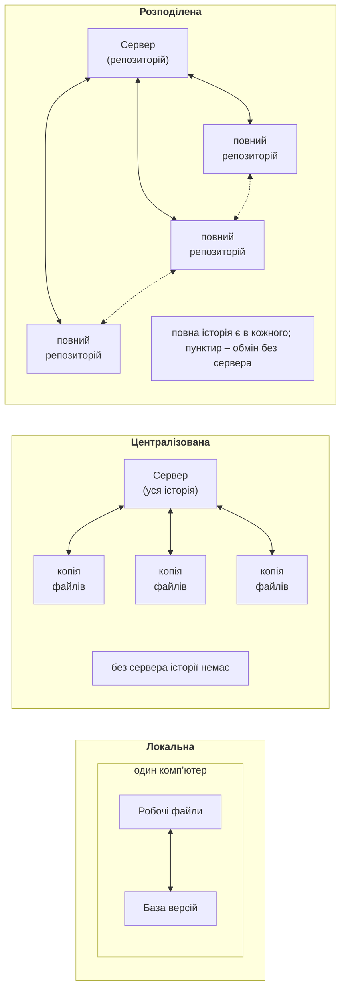
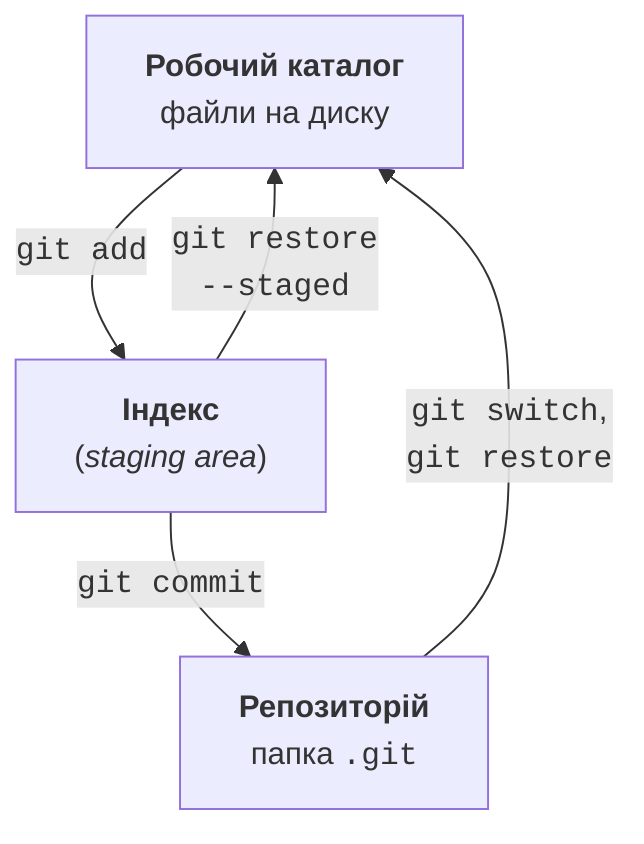
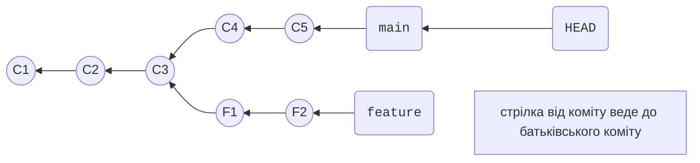

# Git і його налаштування

## Системи керування версіями

Програма змінюється щодня: додаються функції, виправляються помилки, хтось випадково видаляє потрібний код. Щоб можна було повернутися до будь-якого попереднього стану, дізнатися, хто і навіщо змінив рядок, і працювати над проєктом кільком людям одночасно, використовують **систему керування версіями** (*version control system*, VCS). Вона зберігає **історію** змін файлів проєкту: послідовність знімків разом з автором, датою та поясненням кожної зміни.

Системи керування версіями бувають трьох видів (рис. 1.1):

- **локальні** – база версій лежить на тому самому комп’ютері, що й файли. Найпростіший варіант (копії папки `Проєкт_старий`, `Проєкт_новий`) не дає працювати разом і легко губиться;
- **централізовані** (Subversion, TFVC) – історія зберігається на одному сервері, а розробники мають лише робочі копії файлів. Без зв’язку із сервером не можна зробити коміт чи переглянути історію, а втрата сервера означає втрату історії;
- **розподілені** (Git, Mercurial) – кожен розробник має **повну копію репозиторію** з усією історією. Більшість операцій виконується локально й миттєво, а сервер потрібен лише для обміну змінами. Будь-яка копія може відновити втрачений сервер.



Рис. 1.1. Локальна, централізована та розподілена системи керування версіями {.caption}

**Git** – розподілена система керування версіями, яку 2005 року створив Лінус Торвальдс для розробки ядра Linux. Сьогодні це стандарт галузі: у Git зберігають код Windows, .NET, Visual Studio Code і більшість проєктів з відкритим кодом. Git – вільна програма, яка працює на Windows, Linux і macOS (<https://git-scm.com>). Офіційна книга «Pro Git» доступна українською мовою: <https://git-scm.com/book/uk/v2>.

Git не слід плутати з **GitHub**. Git – програма, що працює на вашому комп’ютері. GitHub, Azure DevOps, GitLab – **хостинги** (*hosting services*), які зберігають копії репозиторіїв на сервері та додають вебінтерфейс для спільної роботи: запити на злиття, обговорення, автоматичну збірку. Git повністю працює без хостингу: у лабораторних роботах цієї теми достатньо локального репозиторію, а роль сервера виконує звичайна папка на диску (розділ «Віддалені репозиторії та робота в команді»).

## Встановлення та налаштування Git

Для Windows Git розповсюджується як **Git for Windows**: до нього входять сам Git, командна оболонка Git Bash і менеджер облікових даних Git Credential Manager. У вересні 2026 року актуальна версія – 2.55.0 (сторінка завантаження: <https://git-scm.com/install/windows>). Git можна встановити інсталятором або з PowerShell командою:

```powershell
winget install --id Git.Git -e --source winget
```

На сторінках інсталятора для курсу підходять значення за замовчуванням. Після встановлення відкрийте **новий** термінал (Windows Terminal з PowerShell) і перевірте версію.

У лекції команди наведено так, як їх вводять у PowerShell: рядок `PS>` позначає запрошення терміналу (у справжньому терміналі перед `>` показано поточну папку, наприклад `PS D:\Courses\OOP C#\Code\Lec01\TodoList>`), а рядки без нього – відповідь програми.

### Початкове налаштування

Кожен коміт підписується іменем і поштою автора, тому перед першим комітом їх потрібно задати. Параметри з ключем `--global` зберігаються у файлі `.gitconfig` у папці користувача (`C:\Users\<ім’я>\.gitconfig`) і діють для всіх репозиторіїв:

```
PS> git --version
git version 2.55.0.windows.5
```

```
PS> git config --global user.name "Olena Koval"
PS> git config --global user.email "olena.koval@example.com"
PS> git config --global init.defaultBranch main
PS> git config --global core.autocrlf true
PS> git config --global core.editor notepad
PS> git config --global pull.rebase false
PS> git config --global --list
user.name=Olena Koval
user.email=olena.koval@example.com
init.defaultbranch=main
core.autocrlf=true
core.editor=notepad
pull.rebase=false
```

Параметри `user.name` і `user.email` задають автора комітів (для GitHub – пошту облікового запису). `init.defaultBranch main` – назва першої гілки нових репозиторіїв, як на GitHub і в Visual Studio. `core.autocrlf true` зберігає рядки в репозиторії з кінцями LF, а у файлах Windows – з CRLF (див. розділ про `.gitattributes`). `core.editor notepad` – редактор для повідомлень комітів злиття: після редагування файл зберігають і **закривають** Блокнот. `pull.rebase false` означає, що `git pull` об’єднує розбіжні гілки злиттям; без цього параметра Git 2.55 відмовляється виконувати такий `pull` і просить обрати спосіб. Параметр окремого репозиторію задають без `--global` (файл `.git/config`). Довідку показує `git help <команда>` або сайт <https://git-scm.com/docs>.

## Як Git зберігає історію

Git зберігає не різниці між версіями файлів, а **знімки** (*snapshots*): кожен коміт містить посилання на повний стан усіх файлів проєкту. Незмінені файли не копіюються, а посилаються на вже збережений вміст, тому репозиторій залишається компактним.

Кожен об’єкт Git (вміст файлу, каталог, коміт) має **хеш** – 40-символьний шістнадцятковий ідентифікатор SHA-1, обчислений з його вмісту, наприклад `0fec8555b41061786652b6be58d41d306ef3df75`. Зазвичай достатньо перших 7 символів: `0fec855`. Хеш залежить від вмісту, автора, часу та батьківського коміту, тому **у вас хеші будуть іншими**, ніж у прикладах лекції. Змінити збережений коміт непомітно неможливо: зміниться його хеш і хеші всіх наступних комітів.

Крім знімка, коміт містить автора, дату, повідомлення та посилання на **батьківський** коміт (у першого коміту його немає, у коміту злиття їх два).

### Три області Git

Файли проєкту перебувають у трьох областях (рис. 1.2):

- **робочий каталог** (*working tree*) – звичайні файли на диску, які ви редагуєте;
- **індекс** (*index*, *staging area*) – «чернетка» наступного коміту: сюди командою `git add` додають зміни, які мають увійти в коміт;
- **репозиторій** – прихована папка `.git` з усіма комітами. Команда `git commit` створює новий коміт зі вмісту індексу.



Рис. 1.2. Робочий каталог, індекс і репозиторій {.caption}

Індекс дозволяє робити **логічні** коміти: якщо ви одночасно виправили помилку і почали нову функцію, можна додати в індекс лише виправлення і зафіксувати його окремо.

### Гілки та покажчик HEAD

**Гілка** в Git – це лише рухомий покажчик на коміт. Коли ви робите коміт, покажчик поточної гілки переміщується на новий коміт. Спеціальний покажчик **HEAD** показує, де ви зараз перебуваєте: зазвичай він вказує на поточну гілку (рис. 1.3). Коміти утворюють **граф**: кожен коміт посилається на батьківський, а гілки розходяться від спільного коміту. Запис `HEAD~1` означає «батьківський коміт HEAD», `HEAD~2` – «дідівський» і так далі.



Рис. 1.3. Граф комітів, гілки та покажчик HEAD {.caption}
