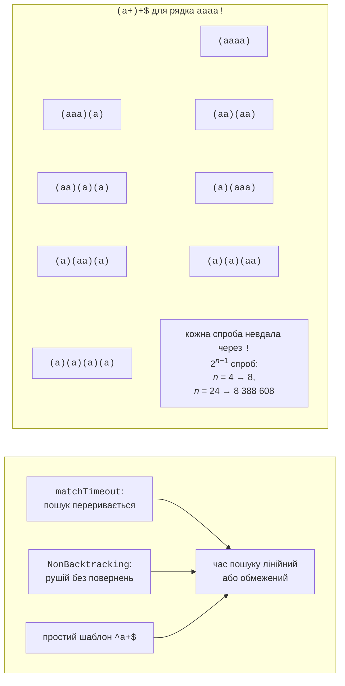
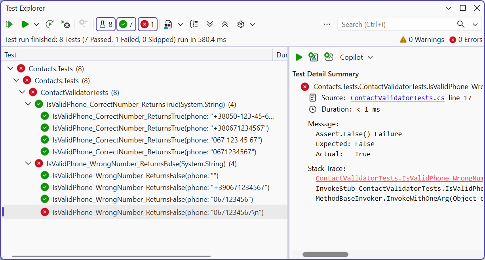

# Продуктивність, генерація та тести

## Продуктивність і безпека

### Повернення та катастрофічне повернення

Стандартний рушій .NET працює з **поверненнями** (*backtracking*): якщо продовження шаблону не вдалося, рушій повертається до останнього місця, де мав вибір (скільки символів захопити квантифікатором, яку гілку альтернації взяти), і пробує інший варіант. Зазвичай це швидко. Але якщо в шаблоні є **вкладені квантифікатори**, як-от `(a+)+`, кількість варіантів розбиття рядка росте експоненційно (рис. 2.7). Для рядка з *n* літер `a` і символу `!` в кінці рушій перебирає 2<sup>*n*−1</sup> розбиттів, і кожне завершується невдачею. Це явище називають **катастрофічним поверненням** (*catastrophic backtracking*) (<https://learn.microsoft.com/dotnet/standard/base-types/backtracking-in-regular-expressions>).



Рис. 2.7. Катастрофічне повернення та способи захисту {.caption}

Якщо такий шаблон перевіряє дані з мережі, зловмисник може надіслати спеціально підібраний рядок і завантажити сервер. Така атака називається **ReDoS** (*Regular expression Denial of Service*). Захистів три:

- **тайм-аут** (*match timeout*): параметр `matchTimeout` конструктора або статичного методу. Якщо один пошук триває довше, виникає виняток `RegexMatchTimeoutException` з властивостями `Pattern`, `Input` і `MatchTimeout`. За замовчуванням тайм-аут дорівнює `Regex.InfiniteMatchTimeout`, тобто пошук не обмежений у часі;
- параметр `RegexOptions.NonBacktracking` (.NET 7+): рушій без повернень гарантує час, лінійний щодо довжини тексту. Він не підтримує перегляд уперед і назад, зворотні посилання та атомарні групи (конструктор спричиняє `NotSupportedException`), а також не поєднується з параметрами `RightToLeft` і `ECMAScript`;
- **простіший шаблон** без вкладених квантифікаторів, рівносильний початковому: `^a+$` замість `^(a+)+$`, `^\w+(\s\w+)*\s?$` замість `^(\w+\s?)+$`.

### Вимірювання часу пошуку

Програма вимірює час пошуку за шаблоном `^(a+)+$` для рядків різної довжини, а потім перевіряє рядок із 40 літер трьома способами захисту.

```cs
using System.Diagnostics;
using System.Text.RegularExpressions;

Console.OutputEncoding = System.Text.Encoding.UTF8;

const string Pattern = @"^(a+)+$";

// 1. Час пошуку зростає вдвічі з кожним новим символом.
for (int n = 18; n <= 24; n += 2)
{
    string input = new string('a', n) + "!";
    var watch = Stopwatch.StartNew();
    bool found = Regex.IsMatch(input, Pattern);
    Console.WriteLine(
        $"n = {n}: {found}, {watch.ElapsedMilliseconds} мс");
}

string attack = new string('a', 40) + "!";

// 2. Тайм-аут обмежує час одного пошуку.
var limited = new Regex(Pattern, RegexOptions.None,
    TimeSpan.FromMilliseconds(100));
var timer = Stopwatch.StartNew();
try
{
    limited.IsMatch(attack);
}
catch (RegexMatchTimeoutException ex)
{
    double limit = ex.MatchTimeout.TotalMilliseconds;
    Console.WriteLine($"Тайм-аут {limit} мс для {ex.Pattern}, " +
        $"минуло {timer.ElapsedMilliseconds} мс");
}

// 3. Рушій без повернень: час лінійний.
var linear = new Regex(Pattern, RegexOptions.NonBacktracking);
timer.Restart();
bool result = linear.IsMatch(attack);
Console.WriteLine($"NonBacktracking: {result}, " +
    $"{timer.ElapsedMilliseconds} мс");

// 4. Рівносильний шаблон без вкладених квантифікаторів.
timer.Restart();
result = Regex.IsMatch(attack, "^a+$");
Console.WriteLine($"^a+$: {result}, " +
    $"{timer.ElapsedMilliseconds} мс");
```

Результат на комп’ютері автора (час залежить від процесора). Кожні два нові символи збільшують час учетверо, тож для рядка з 40 літер пошук без захисту тривав би близько 18 годин (2<sup>16</sup> секунд):

```
n = 18: False, 24 мс
n = 20: False, 65 мс
n = 22: False, 258 мс
n = 24: False, 990 мс
Тайм-аут 100 мс для ^(a+)+$, минуло 122 мс
NonBacktracking: False, 10 мс
^a+$: False, 0 мс
```

::: tip Порада
Тайм-аут і `NonBacktracking` захищають від «важкого» **тексту**, але не від шаблону, який задає зловмисник. Рушій .NET вважає шаблони довіреними, тому не будуйте шаблон із введення користувача без `Regex.Escape` (<https://learn.microsoft.com/dotnet/standard/base-types/best-practices-regex>).
:::

За замовчуванням шаблон **інтерпретується**. Параметр `RegexOptions.Compiled` перетворює його під час виконання на IL-код: пошук стає швидшим, але створення об’єкта – значно повільнішим. У сучасному коді замість `Compiled` використовують генератор джерел.

## Генератор джерел `[GeneratedRegex]`

Починаючи з .NET 7, SDK містить **генератор джерел** (*source generator*) для регулярних виразів. Атрибут `[GeneratedRegex]` ставлять на `partial`-метод або (з .NET 9) `partial`-властивість типу `Regex` у `partial`-класі. Під час **компіляції** генератор розбирає шаблон і створює код C#, що виконує пошук, та кешує єдиний екземпляр `Regex` (<https://learn.microsoft.com/dotnet/standard/base-types/regular-expression-source-generators>). Третій параметр атрибута задає тайм-аут у мілісекундах. Оголошення методу та властивості з атрибутом показано в прикладі 4.

Переваги генератора:

- помилка в шаблоні стає **помилкою компіляції**, а не винятком під час виконання;
- немає витрат на розбір і компіляцію шаблону під час запуску, а швидкість пошуку не гірша, ніж із `Compiled`;
- код можна переглянути та налагодити: у *Solution Explorer* – вузол *Dependencies → Analyzers → System.Text.RegularExpressions.Generator*, файл `RegexGenerator.g.cs` (рис. 2.8). Над кожним методом генератор пише коментар із поясненням шаблону англійською.

Якщо шаблон відомий під час компіляції, використовуйте генератор. Visual Studio сама пропонує перетворити виклик `new Regex("…")` на `[GeneratedRegex]` (діагностика SYSLIB1045, <https://learn.microsoft.com/dotnet/fundamentals/syslib-diagnostics/syslib1040-1049>). Параметр `Compiled` генератор ігнорує.

![Код, згенерований атрибутом [GeneratedRegex]](./images/04-vs-generated-regex-source.png)

Рис. 2.8. Код, згенерований атрибутом `[GeneratedRegex]` {.caption}

### Пошук без виділення пам’яті

Кожен об’єкт `Match` і кожен рядок `Value` – це виділення пам’яті в купі. Для обробки великих обсягів тексту .NET 7+ має метод `EnumerateMatches`: він приймає `ReadOnlySpan<char>` і повертає структури `ValueMatch` лише з властивостями `Index` і `Length`. Саму частину тексту отримують зрізом `text.Slice(m.Index, m.Length)`. Аналогічно `IsMatch` і `Count` приймають `ReadOnlySpan<char>`.

### Приклад 4. Цензор повідомлень

Програма приховує в повідомленнях чату образливі слова (залишаючи першу літеру) і контакти, якими користувачі намагаються обійти модерацію. Обидва шаблони створює генератор джерел, а позиції слів знаходить `EnumerateMatches` без створення рядків.

```cs
using System.Text.RegularExpressions;

Console.OutputEncoding = System.Text.Encoding.UTF8;

string[] messages =
{
    "Ти ДУРЕНЬ чи що? Пиши на ivan.petrenko@example.com",
    "Ну й бовдури... Дзвоніть: +380 67 123 45 67",
    "Дурниці! Звичайне повідомлення без порушень.",
};

foreach (string message in messages)
{
    Console.Write("Позиції слів:");
    var matches = Censor.BadWord().EnumerateMatches(message);
    foreach (ValueMatch m in matches)
        Console.Write($" {m.Index}+{m.Length}");
    Console.WriteLine();

    string clean = Censor.Clean(message, out int count);
    Console.WriteLine($"{clean} (замін: {count})");
}

static partial class Censor
{
    // Корені слів і будь-які закінчення; регістр не важливий.
    [GeneratedRegex(@"\b(дур(ень|н[іяю])|бовдур|йолоп)\p{L}*",
        RegexOptions.IgnoreCase | RegexOptions.CultureInvariant)]
    public static partial Regex BadWord();

    // E-mail або номер телефону з пробілами чи дефісами.
    [GeneratedRegex(@"[\w.+-]+@[\w-]+(\.[\w-]+)+|\+?\d[\d -]{8,}\d")]
    private static partial Regex Contact { get; }

    public static string Clean(string text, out int count)
    {
        int replaced = 0;
        string result = BadWord().Replace(text, m =>
        {
            replaced++;
            return m.Value[0] + new string('*', m.Length - 1);
        });
        result = Contact.Replace(result, m =>
        {
            replaced++;
            return "[контакт приховано]";
        });
        count = replaced;
        return result;
    }
}
```

Генератор вимагає, щоб клас `Censor` був `partial`. Лямбда-вираз не може змінювати параметр `out`, тому лічильник накопичується в локальній змінній `replaced`. Корінь `дур` з обмеженими закінченнями `(ень|н[іяю])` не зачіпає нейтрального слова «дурниці». Результат:

```
Позиції слів: 3+6
Ти Д***** чи що? Пиши на [контакт приховано] (замін: 2)
Позиції слів: 5+7
Ну й б******... Дзвоніть: [контакт приховано] (замін: 2)
Позиції слів:
Дурниці! Звичайне повідомлення без порушень. (замін: 0)
```

## Валідація введення та модульні тести шаблонів

### Коли регулярний вираз не підходить

Регулярні вирази добре перевіряють **формат** короткого рядка: телефон, поштовий індекс, код товару, номер автомобіля. Проте для багатьох задач є кращі інструменти:

- **дати, числа, IP-адреси, URL** – методи `DateOnly.TryParseExact`, `decimal.TryParse`, `IPAddress.TryParse`, `Uri.TryCreate`: вони перевіряють і **значення**, і діапазон;
- **e-mail** – повний стандарт адреси настільки складний, що жоден розумний шаблон його не охоплює. Достатньо простої перевірки форми (або `MailAddress.TryCreate`), а справжня перевірка – лист із посиланням для підтвердження;
- **HTML, XML, JSON, CSV із лапками** – вкладені структури, які регулярні вирази не можуть коректно розібрати. Використовують парсери: `System.Text.Json`, `XDocument`, бібліотеки CSV.

Практичне правило: перевіряйте регулярним виразом форму, а значення – методами `TryParse` або бізнес-правилами, як у прикладі 3.

### Модульні тести для шаблонів

Шаблон легко зламати, додаючи новий формат, тому його перевіряють **модульними тестами** (*unit tests*) на наборі правильних і неправильних рядків. Для таких тестів зручні **параметризовані тести**: у фреймворку xUnit.net це атрибут `[Theory]`, а кожен набір даних задається атрибутом `[InlineData]` (<https://learn.microsoft.com/dotnet/core/testing/unit-testing-csharp-with-xunit>).

Актуальна версія фреймворку – xUnit.net v3 (<https://xunit.net/docs/getting-started/v3/getting-started>). Вбудований у .NET SDK 10.0.401 шаблон `dotnet new xunit` досі створює проєкт на попередній версії xUnit v2, тому шаблони v3 встановлюють окремо. Шаблон `xunit3` за замовчуванням обирає .NET 8, тож цільову платформу вказують явно. Перенесемо клас `ContactValidator` із прикладу 1 в бібліотеку класів і створимо до неї тестовий проєкт:

```powershell
dotnet new install xunit.v3.templates
dotnet new sln -n Contacts
dotnet new classlib -o Contacts.Core
dotnet new xunit3 -f net10.0 -o Contacts.Tests
dotnet sln add Contacts.Core Contacts.Tests
dotnet add Contacts.Tests reference Contacts.Core
```

Тестовий проєкт посилається на пакет `xunit.v3.mtp-v2` і запускає тести через Microsoft Testing Platform: для цього шаблон створює поруч із рішенням файл `global.json`. У бібліотеці шаблон телефону оголошено через генератор джерел, а клас зроблено `public`:

```cs
using System.Text.RegularExpressions;

namespace Contacts.Core;

public static partial class ContactValidator
{
    [GeneratedRegex(@"^(\+38)?0\d{2}[ -]?\d{3}([ -]?\d{2}){2}$")]
    private static partial Regex Phone { get; }

    public static bool IsValidPhone(string text) =>
        Phone.IsMatch(text);
}
```

Тести перевіряють чотири правильні й чотири неправильні номери. Кожен рядок `[InlineData]` стає окремим тестом:

```cs
using Contacts.Core;

namespace Contacts.Tests;

public class ContactValidatorTests
{
    [Theory]
    [InlineData("+380671234567")]
    [InlineData("0671234567")]
    [InlineData("067 123 45 67")]
    [InlineData("+38050-123-45-67")]
    public void IsValidPhone_CorrectNumber_ReturnsTrue(string phone)
    {
        Assert.True(ContactValidator.IsValidPhone(phone));
    }

    [Theory]
    [InlineData("")]
    [InlineData("067123456")]
    [InlineData("+390671234567")]
    [InlineData("0671234567\n")]
    public void IsValidPhone_WrongNumber_ReturnsFalse(string phone)
    {
        Assert.False(ContactValidator.IsValidPhone(phone));
    }
}
```

Команда `dotnet test` у папці рішення знаходить одну помилку (шляхи скорочено, довгий рядок перенесено):

```
Running tests from …\Contacts.Tests.dll (net10.0|x64)
failed Contacts.Tests.ContactValidatorTests
  .IsValidPhone_WrongNumber_ReturnsFalse(phone: "0671234567\n") (1ms)
  from …\Contacts.Tests.dll (net10.0|x64)
  Assert.False() Failure
  Expected: False
  Actual:   True
…
Test run summary: Failed!
  total: 8
  failed: 1
  succeeded: 7
  skipped: 0
```

Тест виявив описану вище особливість якоря `$`: він допускає завершальний `\n`. Після заміни `$` на `\z` у шаблоні всі тести проходять: `Test run summary: Passed!`, `succeeded: 8`.

У Visual Studio тести запускають у вікні *Test → Test Explorer*: параметризований тест розгортається в окремі рядки даних, а для невдалого показується повідомлення та стек викликів (рис. 2.9).



Рис. 2.9. Результати тестів регулярного виразу у вікні *Test Explorer* {.caption}
