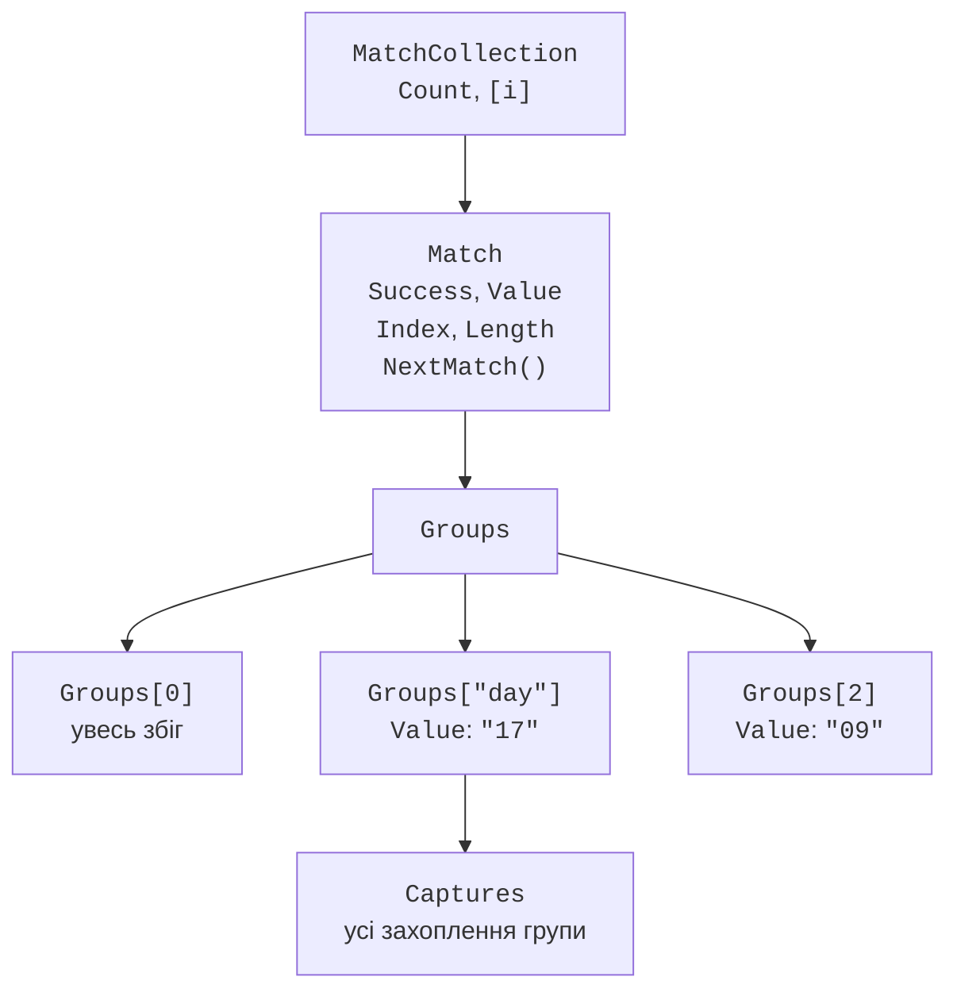
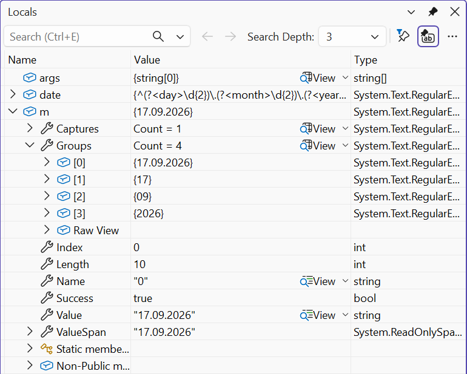

# Клас Regex і групи

## Клас `Regex` і результати пошуку

Клас `Regex` має **статичні** методи, яким шаблон передається параметром, та **екземплярні** методи об’єкта, створеного конструктором `new Regex(pattern)` (табл. 2.3). Під час створення об’єкта шаблон розбирається та перевіряється. Помилка в шаблоні спричиняє виняток `RegexParseException` (нащадок `ArgumentException`) з описом і позицією помилки: для `"(abc"` – `Invalid pattern '(abc' at offset 4. Not enough )'s.` (<https://learn.microsoft.com/dotnet/api/system.text.regularexpressions.regex>).

Таблиця 2.3. Основні методи класу `Regex` {.caption}

| **Метод** | **Результат** |
| --- | --- |
| `IsMatch(input)` | `bool`: чи є в тексті хоча б один збіг |
| `Match(input)` | перший збіг – об’єкт `Match` |
| `Matches(input)` | усі збіги – колекція `MatchCollection` |
| `Count(input)` | кількість збігів (.NET 7 і новіші) |
| `Replace(input, replacement)` | новий рядок, у якому збіги замінено |
| `Split(input)` | масив частин, на які збіги ділять текст |
| `EnumerateMatches(span)` | збіги без створення об’єктів (див. нижче) |

Статичні методи зручні для одноразового пошуку. Щоб не розбирати шаблон щоразу, .NET зберігає останні 15 шаблонів статичних викликів у кеші (властивість `Regex.CacheSize`). Якщо шаблон використовується багато разів, створюють один об’єкт `Regex` і зберігають його в полі або застосовують генератор джерел (розділ «Генератор джерел `[GeneratedRegex]`»).

Результат пошуку описує клас `Match` (рис. 2.4):

- `Success` – чи знайдено збіг;
- `Value`, `Index`, `Length` – текст збігу, його позиція та довжина;
- `NextMatch()` – наступний збіг після поточного;
- `Groups` – групи, про які йдеться в наступному розділі.

Метод `Match` ніколи не повертає `null`: якщо збігу немає, він повертає об’єкт із `Success == false` і порожнім `Value`, тому перевірку `Success` не можна пропускати.

```cs
string text = "Замовлення 1045 від 12.09, 1046 від 15.09.";
var regex = new Regex(@"\b\d{4}\b");

Match m = regex.Match(text);
while (m.Success)
{
    Console.WriteLine($"{m.Value} [{m.Index}, {m.Length}]");
    m = m.NextMatch();
}
Console.WriteLine(regex.Count(text));   // 2
```

```
1045 [11, 4]
1046 [27, 4]
2
```

Той самий обхід коротше записується циклом `foreach (Match m in regex.Matches(text))`. Колекція `MatchCollection` заповнюється поступово, під час перебору.



Рис. 2.4. Структура результату пошуку {.caption}

### Приклад 1. Перевірка контактів

Програма читає файл `contacts.txt` (або файл, указаний аргументом командного рядка) і для кожного рядка визначає, чи це український номер телефону, адреса e-mail або помилка. Правила перевірки зібрано в статичному класі `ContactValidator`.

```cs
using System.Text.RegularExpressions;

Console.OutputEncoding = System.Text.Encoding.UTF8;

string path = args.Length > 0 ? args[0] : "contacts.txt";
int phones = 0, emails = 0, errors = 0, number = 0;

foreach (string line in File.ReadLines(path))
{
    number++;
    string value = line.Trim();
    string kind;
    if (ContactValidator.IsValidPhone(value))
    {
        kind = "телефон";
        phones++;
    }
    else if (ContactValidator.IsValidEmail(value))
    {
        kind = "e-mail";
        emails++;
    }
    else
    {
        kind = "помилка";
        errors++;
    }
    Console.WriteLine($"{number,2}. {value,-26} {kind}");
}
Console.WriteLine($"Телефонів: {phones}, e-mail: {emails}, " +
    $"помилок: {errors}");

static class ContactValidator
{
    // 0XX XXX XX XX, код країни +38, пробіли або дефіси.
    const string PhonePattern =
        @"^(\+38)?0\d{2}[ -]?\d{3}([ -]?\d{2}){2}$";

    // ім’я@домен.зона, зона – щонайменше дві літери.
    const string EmailPattern =
        @"^[\w.+-]+@[\w-]+(\.[\w-]+)*\.\p{L}{2,}$";

    public static bool IsValidPhone(string text) =>
        Regex.IsMatch(text, PhonePattern);

    public static bool IsValidEmail(string text) =>
        Regex.IsMatch(text, EmailPattern);
}
```

Шаблон телефону складається з необов’язкового коду країни `(\+38)?`, коду оператора `0\d{2}` і груп цифр 3–2–2, між якими може стояти один пробіл або дефіс (`[ -]?`). Якорі `^` і `$` не дозволяють зайвих символів, тому номер із 13 цифр відхиляється. Шаблон e-mail вимагає символи імені, `@`, домен і зону з літер; оскільки `\w` і `\p{L}` охоплюють Юнікод, адреса з кириличним доменом `.укр` також проходить. Результат для файлу з десяти рядків:

```
 1. +380671234567              телефон
 2. 067 123 45 67              телефон
 3. +38050-123-45-67           телефон
 4. 0671234567890              помилка
 5. +44 20 7946 0958           помилка
 6. olena.koval@example.com    e-mail
 7. ivan+labs@example.org      e-mail
 8. student@localhost          помилка
 9. петро@пошта.укр            e-mail
10. mail@@example.com          помилка
Телефонів: 3, e-mail: 3, помилок: 4
```

## Групи та зворотні посилання

Круглі дужки об’єднують частину шаблону в **групу** (*group*). Група дозволяє застосувати квантифікатор до кількох символів (`(\d{2}\.){2}`) і **захоплює** (*captures*) текст, що їй відповідає. Захоплені значення доступні через колекцію `Match.Groups` (<https://learn.microsoft.com/dotnet/standard/base-types/grouping-constructs-in-regular-expressions>):

- **нумеровані групи** `( … )` нумеруються за порядком відкривних дужок з 1, а `Groups[0]` – це весь збіг;
- **іменовані групи** `(?<name> … )` доступні за ім’ям: `Groups["name"]`; код із ними зрозуміліший і не ламається, коли в шаблон додають нову групу;
- **незахоплювальні групи** `(?: … )` лише групують, нічого не зберігаючи.

```cs
var date = new Regex(
    @"^(?<day>\d{2})\.(?<month>\d{2})\.(?<year>\d{4})$");
Match m = date.Match("17.09.2026");
Console.WriteLine(m.Groups["year"].Value);   // 2026
Console.WriteLine(m.Groups[1].Value);        // 17 – перша група
Console.WriteLine(m.Groups.Count);           // 4 – разом із Groups[0]
int year = int.Parse(m.Groups["year"].ValueSpan);   // 2026
```

Властивість `ValueSpan` повертає значення групи як `ReadOnlySpan<char>` без створення нового рядка. Якщо необов’язкова група не брала участі в збігу, її `Success` дорівнює `false`, а `Value` – порожній рядок. Групи зручно розглядати у вікні *Locals* налагоджувача (рис. 2.5).



Рис. 2.5. Групи збігу у вікні *Locals* налагоджувача {.caption}

### Зворотні посилання

**Зворотне посилання** (*backreference*) `\1` або `\k<name>` вимагає, щоб у цьому місці повторився текст, **уже захоплений** групою. Так знаходять слова-повтори або парні теги:

```cs
string text = "Це це дуже дуже важливо, так так.";
foreach (Match m in Regex.Matches(text, @"\b(\w+)\s+\1\b",
             RegexOptions.IgnoreCase))
    Console.WriteLine(m.Value);    // Це це, дуже дуже, так так

Regex.IsMatch("<b>текст</b>", @"<(?<tag>\w+)>.*</\k<tag>>");  // True
Regex.IsMatch("<b>текст</i>", @"<(?<tag>\w+)>.*</\k<tag>>");  // False
```

### Колекція `Captures`

Якщо група стоїть під квантифікатором, вона захоплює текст кілька разів. `Group.Value` зберігає лише **останнє** захоплення, а всі захоплення доступні в колекції `Group.Captures`:

```cs
Match list = Regex.Match("10,20,30", @"^(?:(?<n>\d+),?)+$");
Console.WriteLine(list.Groups["n"].Value);          // 30
foreach (Capture c in list.Groups["n"].Captures)
    Console.Write(c.Value + " ");                   // 10 20 30
```

### Приклад 2. Аналіз журналу вебсервера

Вебсервери записують кожен запит у журнал у поширеному форматі *Common Log Format*: IP-адреса клієнта, дата й час, рядок запиту, код відповіді та розмір відповіді в байтах. Файл `access.log` (кінці рядків Windows `\r\n`) містить один пошкоджений рядок:

```
10.0.0.5 - - [17/Sep/2026:10:15:32 +0300] "GET / HTTP/2" 200 5120
10.0.0.7 - - [17/Sep/2026:10:15:40 +0300] "GET /news HTTP/2" 200 812
10.0.0.5 - - [17/Sep/2026:10:16:02 +0300] "POST /login HTTP/2" 302 -
10.0.0.9 - - [17/Sep/2026:10:16:11 +0300] "GET /admin HTTP/2" 403 199
10.0.0.5 - - [17/Sep/2026:10:17:45 +0300] "GET /logo HTTP/2" 200 9480
10.0.0.9 - - [17/Sep/2026:10:18:03 +0300] "GET /.env HTTP/2" 404 153
пошкоджений рядок журналу
10.0.0.7 - - [17/Sep/2026:10:19:27 +0300] "GET /api/v1 HTTP/2" 500 97
```

Програма знаходить усі записи одним викликом `Matches`, виводить помилкові запити (коди 4xx і 5xx), кількість записів за кодами відповіді, обсяг переданих даних і найактивнішу IP-адресу.

```cs
using System.Text.RegularExpressions;

Console.OutputEncoding = System.Text.Encoding.UTF8;

// IP - - [час] "метод шлях протокол" код розмір
var regex = new Regex("""
    ^(?<ip>\S+)\s\S+\s\S+\s
    \[(?<time>[^\]]+)\]\s
    "(?<method>[A-Z]+)\s(?<path>\S+)\s[^"]*"\s
    (?<status>\d{3})\s(?<size>\d+|-)\r?$
    """,
    RegexOptions.Multiline | RegexOptions.IgnorePatternWhitespace);

string log = File.ReadAllText("access.log");
MatchCollection records = regex.Matches(log);
int lines = log.Split('\n',
    StringSplitOptions.RemoveEmptyEntries).Length;

var byStatus = new SortedDictionary<string, int>();
var byIp = new Dictionary<string, int>();
long bytes = 0;

foreach (Match m in records)
{
    string status = m.Groups["status"].Value;
    byStatus[status] = byStatus.GetValueOrDefault(status) + 1;
    string ip = m.Groups["ip"].Value;
    byIp[ip] = byIp.GetValueOrDefault(ip) + 1;
    if (long.TryParse(m.Groups["size"].ValueSpan, out long size))
        bytes += size;
    if (status[0] is '4' or '5')
    {
        Console.WriteLine($"{m.Groups["time"].Value[12..20]} " +
            $"{status} {m.Groups["method"].Value} " +
            $"{m.Groups["path"].Value}");
    }
}

Console.WriteLine($"Записів: {records.Count} з {lines}, " +
    $"передано {bytes:N0} байтів");
foreach (var (status, count) in byStatus)
    Console.WriteLine($"  {status}: {count}");
var top = byIp.MaxBy(pair => pair.Value);
Console.WriteLine($"Найактивніший IP: {top.Key} ({top.Value})");
```

Довгий шаблон записано в необробленому рядковому літералі на кількох рядках. Це можливо завдяки параметру `IgnorePatternWhitespace`: пробіли й кінці рядків у шаблоні ігноруються, а справжні пробіли в тексті позначено `\s`. Параметр `Multiline` змушує `^` і `$` працювати для кожного рядка файлу, а `\r?` перед `$` пропускає символ `\r` кінця рядка Windows. Розмір `-` (відповідь без тіла) не є числом, тому `TryParse` його пропускає. Результат:

```
10:16:11 403 GET /admin
10:18:03 404 GET /.env
10:19:27 500 GET /api/v1
Записів: 7 з 8, передано 15 861 байтів
  200: 3
  302: 1
  403: 1
  404: 1
  500: 1
Найактивніший IP: 10.0.0.5 (3)
```
