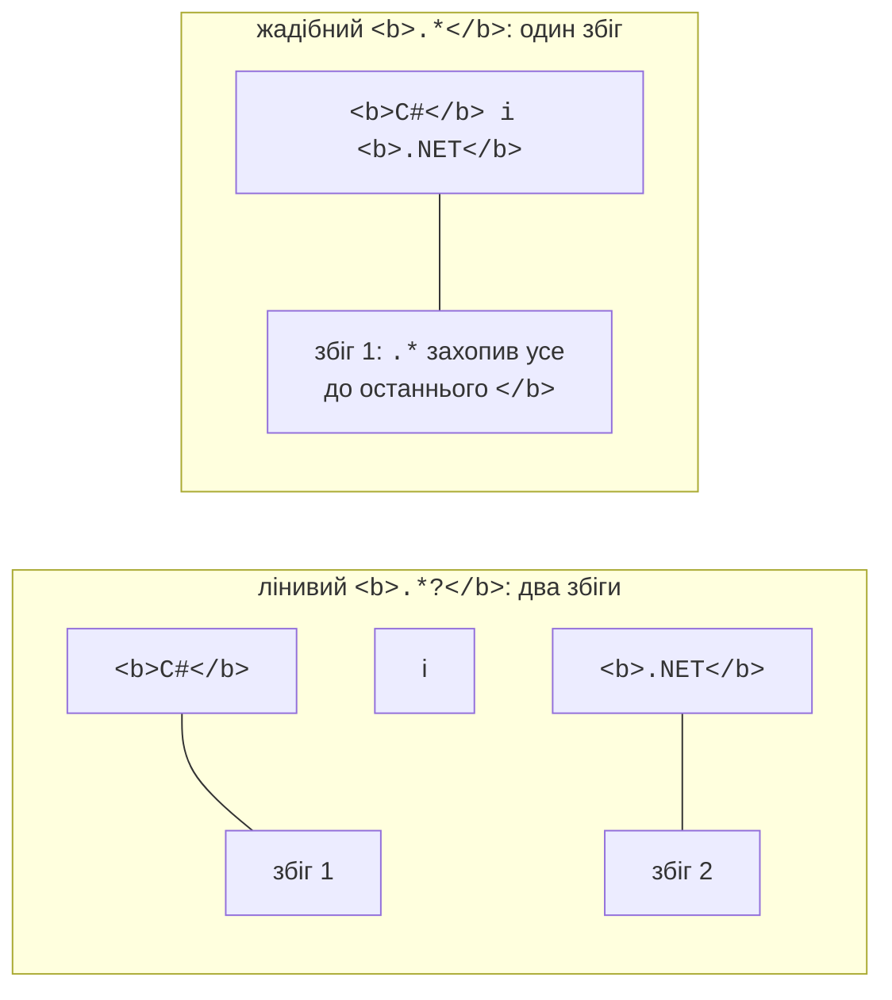
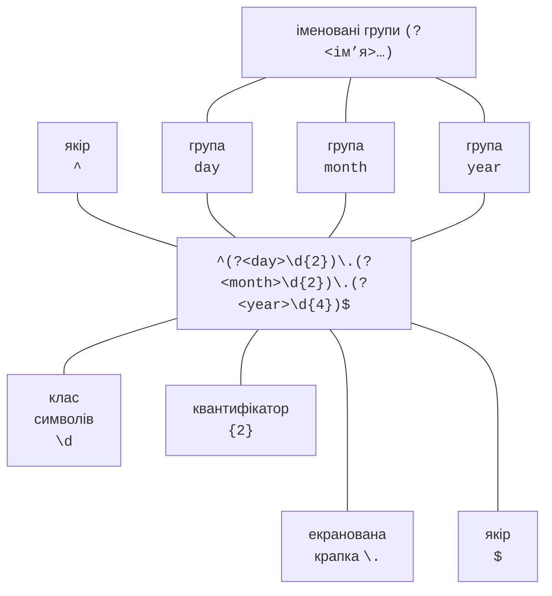

# Синтаксис регулярних виразів

## Регулярні вирази в .NET

Програми постійно обробляють текст: перевіряють введені телефони та адреси e-mail, шукають помилки в журналах, витягують суми з чеків, перетворюють дати з одного формату в інший. Методи класу `string` розв’язують лише найпростіші з цих задач. `Contains` і `IndexOf` шукають **конкретний** фрагмент, `Split` ділить рядок за **конкретними** символами. Але як знайти в тексті «усі номери телефонів», якщо кожен записано по-своєму: `+380671234567`, `050-123-45-67`?

**Регулярний вираз** (*regular expression*, скорочено *regex*) – це **шаблон** (*pattern*), який описує множину рядків: «плюс, потім цифри й дефіси, щонайменше десять символів». Рушій регулярних виразів (*regex engine*) шукає в тексті фрагменти, що відповідають шаблону, – **збіги** (*matches*). У .NET усі типи для роботи з регулярними виразами розміщено в просторі імен `System.Text.RegularExpressions`, головний із них – клас `Regex` (<https://learn.microsoft.com/dotnet/standard/base-types/regular-expressions>).

```cs
using System.Text.RegularExpressions;

string text = "Телефони: +380671234567, 050-123-45-67; рік 2026.";
foreach (Match m in Regex.Matches(text, @"\+?\d[\d-]{8,}\d"))
    Console.WriteLine(m.Value);
```

Шаблон `\+?\d[\d-]{8,}\d` читається так: необов’язковий плюс, цифра, щонайменше вісім цифр або дефісів, цифра. Число 2026 має лише чотири цифри, тому не підходить:

```
+380671234567
050-123-45-67
```

Регулярні вирази – окрема маленька мова зі своїм синтаксисом. Її діалекти в різних мовах програмування дуже схожі, тому шаблони з цієї лекції з невеликими змінами працюють і в Java, Python чи JavaScript. Далі розглядається діалект .NET; повний довідник елементів мови – <https://learn.microsoft.com/dotnet/standard/base-types/regular-expression-language-quick-reference>.

### Запис шаблонів у коді C#

Шаблони містять багато зворотних скісних рисок `\`, а в звичайному рядку C# цей символ починає керувальну послідовність (`\n`, `\t`). Тому шаблон `\d+\.\d+` у звичайному рядку доведеться записати як `"\\d+\\.\\d+"`. Зручніше використовувати два інші види рядкових літералів:

- **буквальний рядок** (*verbatim string*) `@"\d+\.\d+"` – зворотна риска в ньому звичайний символ, а лапку записують двічі: `@"<a href=""x"">"`;
- **необроблений рядковий літерал** (*raw string literal*) у потрійних лапках – зручний, коли шаблон містить лапки або займає кілька рядків (<https://learn.microsoft.com/dotnet/csharp/language-reference/tokens/raw-string>).

```cs
string a = "\\d+\\.\\d+";         // звичайний рядок
string b = @"\d+\.\d+";           // буквальний рядок, a == b
string link = """<a href="(?<url>[^"]+)">""";   // raw string
```

Visual Studio розпізнає рядок-шаблон, переданий у методи `Regex`, розфарбовує його елементи та пропонує підказки для конструкцій на кшталт `\p{` чи `(?<` (рис. 2.1).


Рис. 2.1. Підсвічування та підказки регулярних виразів у редакторі Visual Studio {.caption}

## Символи та класи символів

Більшість символів шаблону означають самих себе: шаблон `грн` знаходить слово «грн». Особливе значення мають лише **метасимволи** `\ ^ $ . | ? * + ( ) [ ] { }`. Щоб знайти метасимвол як звичайний символ, його **екранують** зворотною рискою: `\.` – крапка, `\+` – плюс, `\(` – дужка.

**Клас символів** (*character class*) відповідає **одному** символу з деякої множини (табл. 2.1). Множину записують у квадратних дужках: `[aeiou]` – одна з голосних, `[0-9]` – цифра, `[A-Za-z]` – латинська літера. Знак `^` одразу після `[` заперечує клас: `[^0-9]` – будь-який символ, крім цифри. Усередині квадратних дужок більшість метасимволів втрачає особливе значення: `[.+]` – це крапка або плюс (<https://learn.microsoft.com/dotnet/standard/base-types/character-classes-in-regular-expressions>).

Таблиця 2.1. Основні класи символів {.caption}

| **Запис** | **Відповідає одному символу** |
| --- | --- |
| `[abc]`, `[a-z]` | з переліку або діапазону |
| `[^abc]` | будь-якому, крім перелічених |
| `.` | будь-якому, крім `\n` (кінця рядка) |
| `\d`, `\D` | цифрі (категорія Unicode `Nd`) / не цифрі |
| `\w`, `\W` | символу слова: літера, цифра, `_` / іншому символу |
| `\s`, `\S` | пробільному символу (пробіл, `\t`, `\n`, `\r`) / іншому символу |
| `\p{L}`, `\p{Lu}`, `\p{Ll}` | літері / великій літері / малій літері будь-якої мови |
| `\p{P}`, `\P{L}` | розділовому знаку / будь-якому символу, крім літери |
| `\p{IsCyrillic}` | символу з блоку Юнікоду «Кирилиця» (U+0400–U+04FF) |
| `\t`, `\n`, `\u0456` | табуляції, новому рядку, символу за кодом (і) |

### Unicode і українська мова

У .NET класи `\d` і `\w` працюють з усім Юнікодом, а не лише з латиницею. Це зручно: `\w+` знаходить слова українською. Але є два наслідки, які треба пам’ятати:

```cs
string s = "Ґанок 2026, café ٣";
Console.WriteLine(Regex.Count(s, @"\d"));    // 5 – і арабська цифра ٣
Console.WriteLine(Regex.Count(s, "[0-9]"));  // 4
Console.WriteLine(Regex.IsMatch("п’ять", @"^\w+$"));          // False
Console.WriteLine(Regex.IsMatch("п’ять", @"^[\p{L}’']+$"));   // True
```

- `\d` відповідає цифрам будь-якої писемності. Якщо введення потім перетворюється на число, перевіряйте саме `[0-9]` (або вмикайте параметр `RegexOptions.ECMAScript`).
- Апостроф ’ (U+2019) і ' не належать до `\w`, тому слова «п’ять», «м’яч» для `\w+` розпадаються на дві частини. Для українських слів використовують клас `[\p{L}’'-]`, що додає апостроф і дефіс («Прем’єр-ліга»).

Звичний із підручників клас `[А-Яа-я]` для української **не підходить**: він не містить літер Ґ, Є, І, Ї (їхні коди лежать поза діапазоном), зате містить російські Ы, Э, Ъ. Правильні варіанти:

```cs
Regex.IsMatch("Їжак", "^[А-Яа-я]+$");                   // False
Regex.IsMatch("Їжак", "^[А-ЩЬЮЯҐЄІЇа-щьюяґєії]+$");     // True
Regex.IsMatch("Їжак", @"^\p{IsCyrillic}+$");            // True
```

Клас `\p{IsCyrillic}` охоплює всю кирилицю, а перелік `[А-ЩЬЮЯҐЄІЇа-щьюяґєії]` – лише 33 літери українського алфавіту. .NET також дозволяє **віднімання класів**: `[а-яґєії-[ыэъ]]` – малі літери кирилиці з доданими українськими та без трьох російських.

## Квантифікатори, якорі та альтернація

### Квантифікатори

**Квантифікатор** (*quantifier*) вказує, скільки разів може повторитися попередній елемент: символ, клас або група в дужках (табл. 2.2). Шаблон `colou?r` відповідає словам «color» і «colour», а `\d{3,4}` – трьом або чотирьом цифрам.

Таблиця 2.2. Квантифікатори {.caption}

| **Жадібний** | **Лінивий** | **Кількість повторень** |
| --- | --- | --- |
| `*` | `*?` | 0 або більше |
| `+` | `+?` | 1 або більше |
| `?` | `??` | 0 або 1 (необов’язковий елемент) |
| `{n}` | `{n}?` | рівно *n* |
| `{n,}` | `{n,}?` | щонайменше *n* |
| `{n,m}` | `{n,m}?` | від *n* до *m* |

Квантифікатори за замовчуванням **жадібні** (*greedy*): вони захоплюють якомога більше символів, а потім за потреби «віддають» їх назад. Знак `?` після квантифікатора робить його **лінивим** (*lazy*): той захоплює якомога менше символів (рис. 2.2):

```cs
string html = "<b>C#</b> і <b>.NET</b>";
Console.WriteLine(Regex.Match(html, "<b>.*</b>").Value);
// <b>C#</b> і <b>.NET</b>
foreach (Match m in Regex.Matches(html, "<b>.*?</b>"))
    Console.WriteLine(m.Value);    // <b>C#</b>, потім <b>.NET</b>
```



Рис. 2.2. Жадібний і лінивий квантифікатори {.caption}

Часто замість лінивого квантифікатора точніше записати заперечний клас: `<b>[^<]*</b>` («будь-які символи, крім `<`»). Такий шаблон не може вийти за межі тегу і працює швидше.

### Якорі

**Якорі** (*anchors*) не відповідають жодному символу, а перевіряють **позицію** в тексті (<https://learn.microsoft.com/dotnet/standard/base-types/anchors-in-regular-expressions>):

- `^` – початок рядка; `$` – кінець рядка **або позиція перед завершальним** `\n`;
- `\A` – лише початок рядка; `\z` – лише кінець рядка;
- `\b` – межа слова: з одного боку символ `\w`, з іншого – не `\w` або край тексту; `\B` – не межа слова.

Без якорів метод `IsMatch` шукає збіг **будь-де** в тексті: `\d+` знаходить цифри в рядку `abc12345`. Для перевірки формату введення шаблон обов’язково «закріплюють» з обох боків:

```cs
Regex.IsMatch("abc12345", @"\d+");        // True – цифри є
Regex.IsMatch("abc12345", @"^\d+$");      // False – не лише цифри
Regex.IsMatch("12345\n", @"^\d+$");       // True – $ перед \n!
Regex.IsMatch("12345\n", @"^\d+\z");      // False
Regex.Count("кіт, кітель, кіт.", "кіт");       // 3
Regex.Count("кіт, кітель, кіт.", @"\bкіт\b");  // 2
```

Шаблон `^\d+$` пропускає рядок із завершальним `\n`. Для валідації даних, які не пройшли через `Console.ReadLine` (файли, мережа, API), надійніше закінчувати шаблон на `\z`.

### Альтернація

Вертикальна риска `|` означає «або»: `jpg|png|gif`. Альтернація має **найнижчий** пріоритет і ділить увесь шаблон навпіл, тому `^jpg|png$` означає «`jpg` на початку **або** `png` у кінці» і приймає рядок `jpgX`. Варіанти беруть у дужки: `^(jpg|png)$`.

На рис. 2.3 показано, з яких елементів складається шаблон дати `дд.мм.рррр`, до якого ми ще повернемося.



Рис. 2.3. Складові регулярного виразу {.caption}
