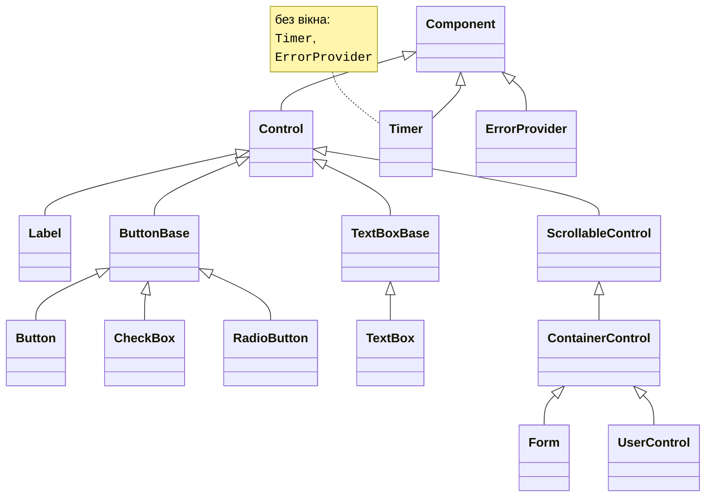
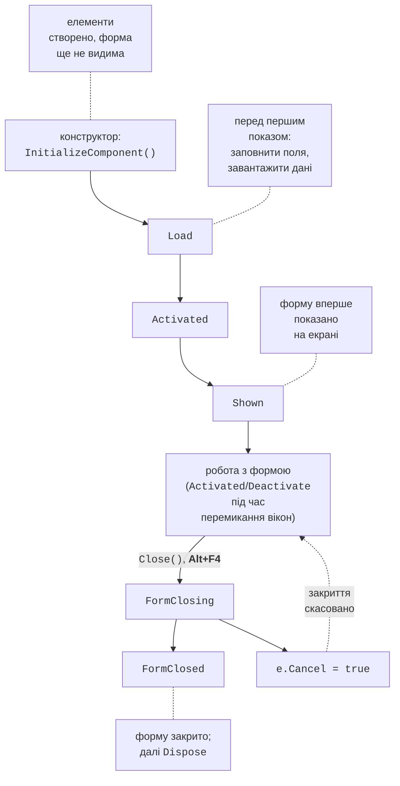
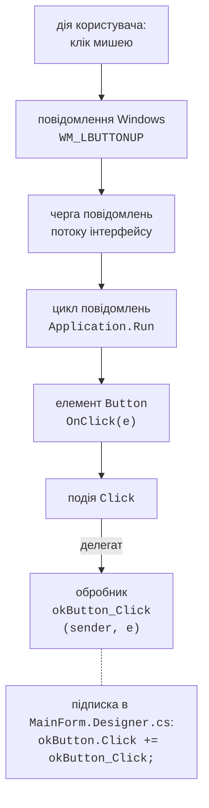

# Форми, елементи та події

## Класи `Control` і `Form`

### Ієрархія елементів керування

Усі елементи керування походять від класу `Control` (рис. 3.4). Він визначає спільні властивості (розташування, розмір, текст, кольори, шрифт), методи (`Show`, `Hide`, `Focus`, `Invalidate`) і події (`Click`, `MouseMove`, `KeyDown`, `Paint`). Кожен елемент керування є окремим вікном Windows і має **дескриптор вікна** (*window handle*), доступний через властивість `Handle`. Компоненти без вікна (`Timer`, `ErrorProvider`, діалоги) походять лише від `Component`. Форма (`Form`) теж є елементом керування: вона походить від `ContainerControl`, тому може містити інші елементи (колекція `Controls`) і керує фокусом введення між ними. Координати `Location` дочірнього елемента задаються в пікселях відносно батьківського (`Parent`), вісь *Y* напрямлена вниз.



Рис. 3.4. Ієрархія класів елементів керування (стрілка вказує на базовий клас) {.caption}

### Спільні властивості

Найуживаніші властивості класу `Control` наведено в табл. 3.2 (<https://learn.microsoft.com/dotnet/api/system.windows.forms.control>).

Таблиця 3.2. Спільні властивості елементів керування {.caption}

| **Властивість** | **Призначення** |
| --- | --- |
| `Name` | ім’я елемента (і поля класу форми) |
| `Text` | текст елемента: напис кнопки, вміст поля, заголовок форми |
| `Location`, `Left`, `Top` | положення відносно батьківського елемента |
| `Size`, `Width`, `Height` | розмір у пікселях |
| `BackColor`, `ForeColor` | колір тла й тексту: `Color.LightGreen` |
| `Font` | шрифт: `new Font("Segoe UI", 12F, FontStyle.Bold)` |
| `Enabled` | `false` – елемент видно, але він не реагує на дії користувача |
| `Visible` | `false` – елемент приховано |
| `TabIndex`, `TabStop` | порядок переходу клавішею **Tab** і участь у ньому |
| `Anchor`, `Dock` | прив’язка до країв батьківського елемента |
| `Tag` | довільний об’єкт, пов’язаний з елементом |

Порядок переходу між полями зручно перевірити й змінити командою *View → Tab Order*: конструктор показує номери `TabIndex` на елементах, і їх задають послідовним клацанням (<https://learn.microsoft.com/dotnet/desktop/winforms/controls/how-to-set-the-tab-order-on-windows-forms>).

Властивості форми визначають вигляд і поведінку вікна: `Text` – заголовок, `StartPosition` – початкове положення (`CenterScreen`, `CenterParent`), `FormBorderStyle` – рамка (`Sizable`, `FixedDialog`), `MinimizeBox` і `MaximizeBox` – кнопки згортання та розгортання, `MinimumSize` – найменший розмір, `AcceptButton` і `CancelButton` – кнопки, які натискаються клавішами **Enter** та **Esc**, `KeyPreview` – отримання клавіш формою раніше за елементи.

### Життєвий цикл форми

Під час створення, показу та закриття форма генерує події в чіткому порядку (рис. 3.5) (<https://learn.microsoft.com/dotnet/desktop/winforms/order-of-events-in-windows-forms>). В обробнику `Load` заповнюють поля й завантажують дані. В обробнику `FormClosing` властивість `e.Cancel = true` скасовує закриття, а `e.CloseReason` повідомляє причину (користувач, завершення роботи Windows, виклик `Application.Exit`). Після `FormClosed` головної форми застосунок завершується.



Рис. 3.5. Життєвий цикл форми {.caption}

Порядок подій легко побачити, якщо підписатися на них у конструкторі форми та виводити повідомлення у вікно *Output* налагоджувача методом `Debug.WriteLine` (простір імен `System.Diagnostics`):

```cs
public MainForm()
{
    InitializeComponent();
    Load += (sender, e) => Trace("Load");
    Activated += (sender, e) => Trace("Activated");
    Shown += (sender, e) => Trace("Shown");
    FormClosing += (sender, e) =>
        Trace($"FormClosing, причина: {e.CloseReason}");
    FormClosed += (sender, e) => Trace("FormClosed");
}

private static void Trace(string text) =>
    Debug.WriteLine($"{DateTime.Now:HH:mm:ss.fff} {text}");
```

Після запуску (**F5**) і закриття форми вікно *Output* містить рядки `Load`, `Activated`, `Shown`, `FormClosing, причина: UserClosing` і `FormClosed`. Застарілі події `Closing` і `Closed` у .NET 10 позначено атрибутом `Obsolete` (попередження WFDEV004): використовуйте `FormClosing` і `FormClosed`.

## Модель подій

Консольна програма сама визначає порядок дій: запитує дані, обчислює, виводить результат. Застосунок з графічним інтерфейсом **керується подіями** (*event-driven*): після запуску він чекає на дії користувача, а кожна дія (клацання, натискання клавіші, зміна тексту) спричиняє **подію** (*event*), на яку реагує **обробник події** (*event handler*) (<https://learn.microsoft.com/dotnet/desktop/winforms/forms/events>).

Шлях від клацання мишею до обробника показано на рис. 3.6. Windows надсилає повідомлення (`WM_LBUTTONDOWN`, `WM_LBUTTONUP`) у чергу потоку інтерфейсу. Цикл повідомлень, запущений методом `Application.Run`, вибирає повідомлення з черги й передає їх вікну кнопки. Кнопка перетворює повідомлення на виклик методу `OnClick`, який генерує подію `Click`, а подія через делегат викликає всі підписані обробники.



Рис. 3.6. Модель подій Windows Forms {.caption}

Усі обробники виконуються в **потоці інтерфейсу** (*UI thread*) по черзі. Поки обробник працює, цикл повідомлень стоїть: вікно не перемальовується й не реагує на клацання. Тому обробник має завершуватися швидко, а тривалі операції (завантаження з мережі, великі обчислення) виконують асинхронно (тема 5).

### Обробники подій

Подія в C# – член класу, оголошений з ключовим словом `event` і типом-делегатом. Більшість подій Windows Forms мають тип `EventHandler` або `EventHandler<TEventArgs>`, тому обробник має два параметри:

- `sender` – об’єкт, який згенерував подію (кнопка, поле, пункт меню);
- `e` – дані події: `EventArgs` (даних немає), `MouseEventArgs` (кнопка миші та координати `e.X`, `e.Y`), `KeyEventArgs` (клавіша `e.KeyCode`, модифікатори `e.Control`, `e.Shift`, `e.Alt`), `FormClosingEventArgs`, `CancelEventArgs` тощо.

Найпростіше створити обробник у конструкторі. Подвійне клацання на елементі створює обробник **події за замовчуванням**: `Click` для кнопки, `TextChanged` для поля введення, `Load` для форми. Для інших подій виділіть елемент, натисніть у вікні *Properties* кнопку *Events* і двічі клацніть на назві події (рис. 3.7). Випадний список поруч із назвою події дає змогу обрати вже наявний метод із сумісною сигнатурою (<https://learn.microsoft.com/dotnet/desktop/winforms/controls/how-to-add-an-event-handler>).


Рис. 3.7. Події кнопки у вікні *Properties* {.caption}

Конструктор додає підписку в `Designer.cs` і порожній метод `convertButton_Click` у `MainForm.cs`. Щоб видалити обробник, не досить стерти метод: у `Designer.cs` залишиться рядок підписки, і проєкт не скомпілюється. Очистіть подію у вікні *Properties* (контекстне меню назви події → *Reset*) або спочатку видаліть підписку.

### Підписка на події в коді

Обробники можна підписувати й у коді операцією `+=` (відписка – `-=`). Так зручно підключити один обробник до кількох елементів, використати лямбда-вираз або створити елемент під час виконання програми.

Делегат `EventHandler` оголошує параметр `object? sender`. Обробники, які створює конструктор, мають параметр `object sender`: їх підписано в `Designer.cs`, де перевірку допустимості `null` вимкнено для згенерованого коду. Якщо підписати такий метод у власному коді, компілятор видасть попередження CS8622, тому обробники, які підписуєте самі, оголошуйте з `object? sender`.

Приклад підписки в конструкторі форми:

```cs
public MainForm()
{
    InitializeComponent();
    // Один обробник для трьох кнопок.
    Button[] addButtons = [add1Button, add5Button, add10Button];
    foreach (Button b in addButtons)
    {
        b.Click += AddButton_Click;
    }
    // Лямбда-вираз як обробник.
    resetButton.Click += (sender, e) => totalLabel.Text = "0";
    // Координати миші передаються в MouseEventArgs.
    drawPanel.MouseMove += (sender, e) =>
        Text = $"X = {e.X}, Y = {e.Y}";
}

private void AddButton_Click(object? sender, EventArgs e)
{
    var button = (Button)sender!;  // кнопка, яку натиснули
    int step = int.Parse(button.Text);        // "+5" → 5
    int total = int.Parse(totalLabel.Text);
    totalLabel.Text = (total + step).ToString();
}
```

Кнопки мають написи `+1`, `+5`, `+10`, і спільний обробник визначає крок за написом кнопки `sender`. Після натискання кнопок «+5», «+10», «+1» напис `totalLabel` показує 16, а кнопка *Reset* скидає його до 0. Під час руху миші над панеллю `drawPanel` заголовок форми показує координати курсора. Клавіатуру обробляють подіями `KeyDown` і `KeyUp` (`KeyEventArgs`); якщо властивість форми `KeyPreview` дорівнює `true`, форма отримує клавіші раніше за елемент із фокусом.

## Основні елементи керування

Найуживаніші елементи керування з групи *Common Controls* панелі *Toolbox* наведено в табл. 3.3. Повний перелік – у документації <https://learn.microsoft.com/dotnet/desktop/winforms/controls/overview>.

Таблиця 3.3. Основні елементи керування {.caption}

| **Елемент** | **Призначення та основні властивості** | **Основна подія** |
| --- | --- | --- |
| `Label` | напис: `Text`, `AutoSize`, `TextAlign` | – |
| `TextBox` | поле введення: `Text`, `Multiline`, `ReadOnly`, `MaxLength`, `PlaceholderText`, `UseSystemPasswordChar` | `TextChanged` |
| `Button` | кнопка: `Text`, `DialogResult`, `Image` | `Click` |
| `CheckBox` | прапорець: `Checked`, `CheckState`, `ThreeState` | `CheckedChanged` |
| `RadioButton` | перемикач; перемикачі одного контейнера утворюють групу: `Checked` | `CheckedChanged` |
| `GroupBox`, `Panel` | контейнери з рамкою та заголовком або без них | – |
| `ComboBox` | випадний список: `Items`, `SelectedIndex`, `SelectedItem`, `DropDownStyle` | `SelectedIndexChanged` |
| `ListBox` | список: `Items`, `SelectedItem`, `SelectionMode` | `SelectedIndexChanged` |
| `NumericUpDown` | число з кнопками: `Value` (`decimal`), `Minimum`, `Maximum`, `DecimalPlaces`, `Increment` | `ValueChanged` |
| `DateTimePicker` | дата й час: `Value`, `MinDate`, `MaxDate`, `Format` | `ValueChanged` |
| `PictureBox` | зображення: `Image`, `ImageLocation`, `SizeMode` | `Click` |

Елементи зі списками (`ComboBox`, `ListBox`) зберігають у колекції `Items` будь-які об’єкти й показують для кожного результат методу `ToString()`. Властивість `DropDownStyle` зі значенням `DropDownList` забороняє вводити текст, який не входить до списку. Приклад налаштування елементів у конструкторі форми:

```cs
cityComboBox.DropDownStyle = ComboBoxStyle.DropDownList;
cityComboBox.Items.AddRange("London", "Madrid", "Brussels");
cityComboBox.SelectedIndex = 0;
cityComboBox.SelectedIndexChanged += (sender, e) =>
    visitedListBox.Items.Add(cityComboBox.SelectedItem!);

submitButton.Enabled = false;          // доступна лише за згоди
agreeCheckBox.CheckedChanged += (sender, e) =>
    submitButton.Enabled = agreeCheckBox.Checked;
```

Властивість `Text` поля введення завжди має тип `string`, тому число з неї отримують методом `TryParse` з перевіркою. Якщо потрібне число з відомого діапазону, зручніше `NumericUpDown`: його властивість `Value` вже має тип `decimal` і не виходить за межі `Minimum`–`Maximum`.

Статичний метод `MessageBox.Show(text, caption, buttons, icon)` показує модальне вікно з повідомленням, кнопками (`MessageBoxButtons.OK`, `YesNo`, `YesNoCancel`) і значком (`MessageBoxIcon.Warning`, `Question`, `Error`) та повертає `DialogResult` – кнопку, яку натиснув користувач (приклад – у текстовому редакторі нижче) (<https://learn.microsoft.com/dotnet/api/system.windows.forms.messagebox>).

**Мнемоніка** (*access key*) – символ `&` у властивості `Text`: напис `&Convert` показує підкреслену літеру *C* (після натискання **Alt**), і комбінація **Alt+C** натискає кнопку. Мнемоніка напису `Label` передає фокус наступному за `TabIndex` полю, тому напис `&Name:` перед полем введення дає змогу перейти до поля клавішами **Alt+N** (<https://learn.microsoft.com/dotnet/desktop/winforms/controls/how-to-create-access-keys-for-windows-forms-controls>). Щоб показати сам символ `&`, його подвоюють: `Save && Exit`.
