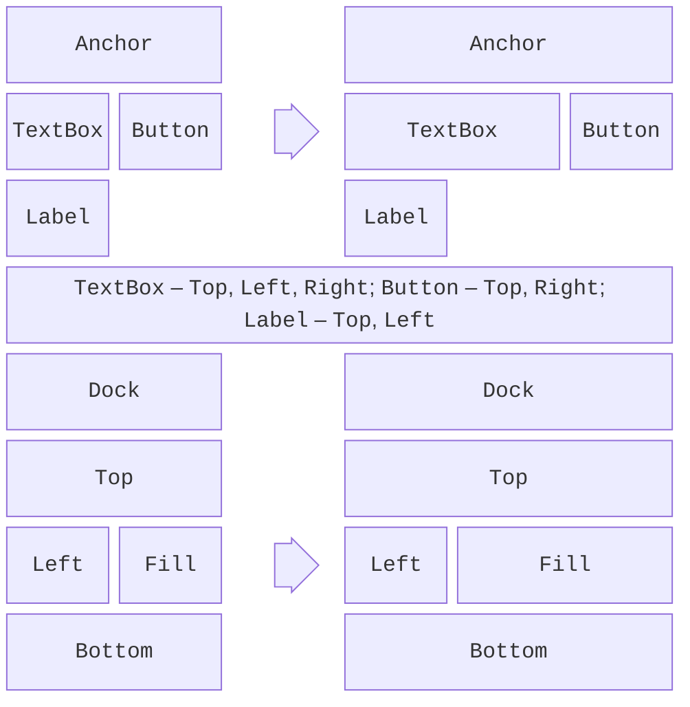
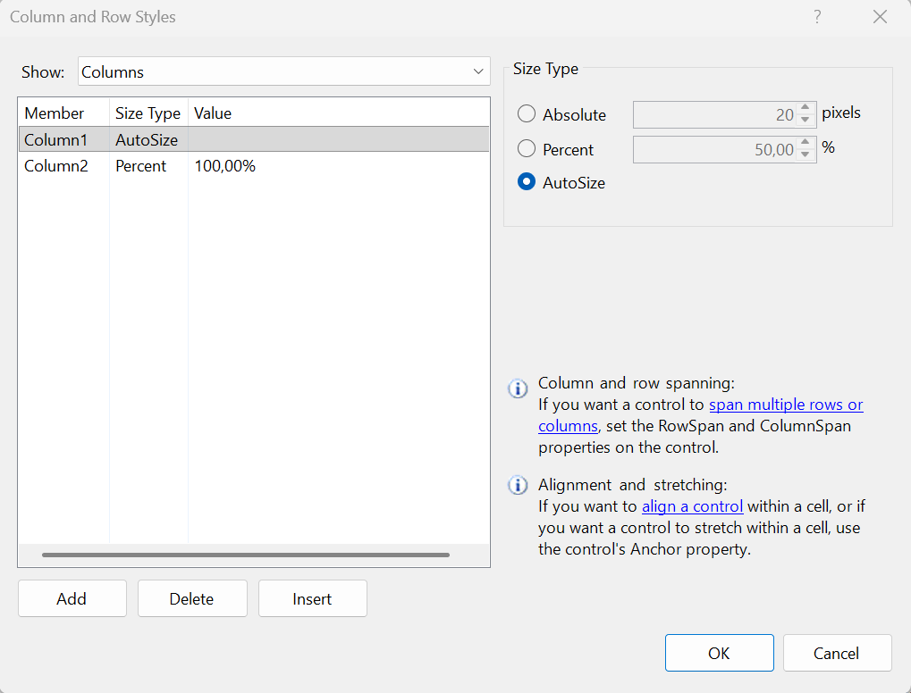

# Компонування та перевірка введення

## Компонування елементів

Розміщення елементів з фіксованими координатами просте, але після розгортання вікна елементи залишаються в лівому верхньому куті, а великий шрифт або інша мова інтерфейсу обрізають написи. Windows Forms має кілька засобів **компонування** (*layout*) (<https://learn.microsoft.com/dotnet/desktop/winforms/controls/layout>).

### Прив’язка `Anchor` і закріплення `Dock`

Властивість `Anchor` прив’язує елемент до країв батьківського елемента: під час зміни розміру форми відстань до прив’язаних країв не змінюється (рис. 3.8). За замовчуванням `Anchor = Top, Left`: елемент залишається на місці. Прив’язка `Top, Right` переміщує кнопку разом із правим краєм, а `Top, Left, Right` розтягує поле введення на всю ширину.

Властивість `Dock` закріплює елемент біля краю (`Top`, `Bottom`, `Left`, `Right`) або заповнює весь вільний простір (`Fill`). Так розміщують меню, панель інструментів і рядок стану (`Top`, `Bottom`) та головний вміст вікна (`Fill`). Закріплені елементи займають простір у порядку, зворотному до порядку в колекції `Controls` (*Z-order*), тому елемент із `Fill` має бути першим у колекції; якщо він перекриває панель, виконайте для нього команду *Bring to Front*.



Рис. 3.8. Прив’язка `Anchor` і закріплення `Dock` до та після зміни розміру форми {.caption}

Властивість `Margin` задає зовнішній відступ елемента від сусідів, а `Padding` – внутрішній відступ від рамки до вмісту. Властивості `MinimumSize` і `MaximumSize` обмежують розмір, а `AutoSize = true` підганяє розмір напису чи кнопки під текст.

### Панелі компонування

**Панелі компонування** (*layout panels*) самі розташовують дочірні елементи:

- `FlowLayoutPanel` – розміщує елементи один за одним у рядок або стовпець (`FlowDirection`) і переносить їх, коли не вистачає місця;
- `TableLayoutPanel` – таблиця з рядками й стовпцями; розмір рядка чи стовпця задають абсолютно (*Absolute*), у відсотках (*Percent*) або за вмістом (*AutoSize*). Елемент може займати кілька клітинок (`ColumnSpan`, `RowSpan`);
- `SplitContainer` – дві панелі з роздільником, який користувач пересуває мишею.

Рядки й стовпці `TableLayoutPanel` у конструкторі налаштовують через меню смарт-тегу (трикутник у правому верхньому куті панелі) → *Edit Rows and Columns…* (рис. 3.9). Ту саму форму «напис – поле» легко створити й у коді: перший стовпець підганяється під найдовший напис (`SizeType.AutoSize`), другий займає решту ширини (`SizeType.Percent`, 100 %), а елементи без явно заданих рядків заповнюють клітинки зліва направо й зверху вниз:

```cs
public LayoutForm()
{
    var table = new TableLayoutPanel
    {
        Dock = DockStyle.Fill,
        ColumnCount = 2,
        Padding = new Padding(10)
    };
    table.ColumnStyles.Add(new ColumnStyle(SizeType.AutoSize));
    table.ColumnStyles.Add(new ColumnStyle(SizeType.Percent, 100));
    AddRow("&Name:", new TextBox { Dock = DockStyle.Fill });
    AddRow("&Email:", new TextBox { Dock = DockStyle.Fill });
    AddRow("&Track:", new ComboBox { Dock = DockStyle.Fill });
    Controls.Add(table);

    void AddRow(string caption, Control control)
    {
        table.Controls.Add(new Label
        {
            Text = caption,
            AutoSize = true,
            Anchor = AnchorStyles.Left   // по центру рядка
        });
        table.Controls.Add(control);
    }
}
```

Якщо клієнтська область форми має ширину 300 пікселів, поля мають ширину 226 пікселів, а після розширення вікна до 520 пікселів – 430: написи залишаються на місці, а поля розтягуються.



Рис. 3.9. Налаштування рядків і стовпців `TableLayoutPanel` {.caption}

### Масштабування та висока роздільність

Сучасні монітори мають масштаб 125–200 %. Властивість форми `AutoScaleMode = Font` (значення конструктора за замовчуванням) масштабує форму й елементи пропорційно розміру системного шрифту, а `AutoScaleDimensions` зберігає розмір шрифту, з яким форму створено (для масштабу 100 % – `new SizeF(7F, 15F)`). Режим високої роздільності застосунку задає властивість проєкту `ApplicationHighDpiMode` (за замовчуванням `SystemAware`); значення `PerMonitorV2` перераховує розміри, коли вікно переносять на монітор з іншим масштабом (<https://learn.microsoft.com/dotnet/desktop/winforms/whats-new/net60#project-level-application-settings>). Панелі компонування й `AutoSize` роблять форму стійкою до зміни масштабу, тому для форм з великою кількістю полів вони кращі за фіксовані координати.

## Перевірка введених даних

Користувач може ввести в поле що завгодно, тому дані перевіряють перед використанням. Windows Forms має для цього події перевірки та компонент `ErrorProvider` (<https://learn.microsoft.com/dotnet/desktop/winforms/input-keyboard/validation>).

### Події `Validating` і `Validated`

Коли фокус залишає елемент (клавіша **Tab** або клацання на іншому елементі), генеруються події `Leave`, `Validating` і `Validated`. В обробнику `Validating` перевіряють значення й, якщо воно некоректне, присвоюють `e.Cancel = true`: фокус залишається в полі, а подія `Validated` не генерується.

Подію `Validating` генерує лише перехід до елемента, у якого `CausesValidation = true` (значення за замовчуванням). Для кнопки *Cancel* або *Help* задають `CausesValidation = false`, щоб користувач міг закрити форму, не виправляючи поле. Метод форми `ValidateChildren()` перевіряє всі елементи одразу й повертає `false`, якщо хоча б один не пройшов перевірку: його викликають перед збереженням або обчисленням.

### Компонент `ErrorProvider`

`ErrorProvider` показує біля елемента значок помилки, а текст помилки – у підказці під час наведення миші. Метод `SetError(control, message)` встановлює помилку, а порожній рядок її знімає. Один компонент обслуговує всі поля форми (<https://learn.microsoft.com/dotnet/api/system.windows.forms.errorprovider>).

### Приклад: конвертер температур

Форма містить напис `celsiusLabel` (*Temperature, °C:*), поле `celsiusTextBox`, кнопку `convertButton` (*Convert*, вона ж `AcceptButton` форми), напис результату `resultLabel` і компонент `errorProvider` на панелі компонентів. Подію `Validating` поля та подію `Click` кнопки підписано у вікні *Properties*. Код форми:

```cs
using System.ComponentModel;

namespace TemperatureConverter;

public partial class MainForm : Form
{
    private const double AbsoluteZero = -273.15;

    public MainForm()
    {
        InitializeComponent();
    }

    private void celsiusTextBox_Validating(object sender,
        CancelEventArgs e)
    {
        if (double.TryParse(celsiusTextBox.Text, out double c)
            && c >= AbsoluteZero)
        {
            errorProvider.SetError(celsiusTextBox, "");
        }
        else
        {
            errorProvider.SetError(celsiusTextBox,
                $"Enter a number not less than {AbsoluteZero}");
            e.Cancel = true;        // фокус залишається в полі
        }
    }

    private void convertButton_Click(object sender, EventArgs e)
    {
        if (!ValidateChildren())    // перевірити всі поля форми
        {
            return;
        }
        double celsius = double.Parse(celsiusTextBox.Text);
        double fahrenheit = celsius * 9 / 5 + 32;
        double kelvin = celsius - AbsoluteZero;
        resultLabel.Text = $"{fahrenheit:F1} °F    {kelvin:F2} K";
    }
}
```

Тип `CancelEventArgs` оголошено в просторі імен `System.ComponentModel`. Обробник кнопки спочатку викликає `ValidateChildren()`: так поле перевіряється й тоді, коли користувач натиснув **Enter**, не залишаючи поля.

З українськими регіональними налаштуваннями для введення `25` напис показує 77,0 °F і 298,15 K, для `36,6` – 97,9 °F і 309,75 K, для `-273,15` – −459,7 °F і 0,00 K. Для `abc`, `-300` і `36.6` біля поля з’являється значок помилки з підказкою `Enter a number not less than -273,15` (рис. 3.10): метод `double.TryParse` враховує регіональні налаштування, і число з крапкою для них некоректне.


Рис. 3.10. Помилка введення в конвертері температур {.caption}
