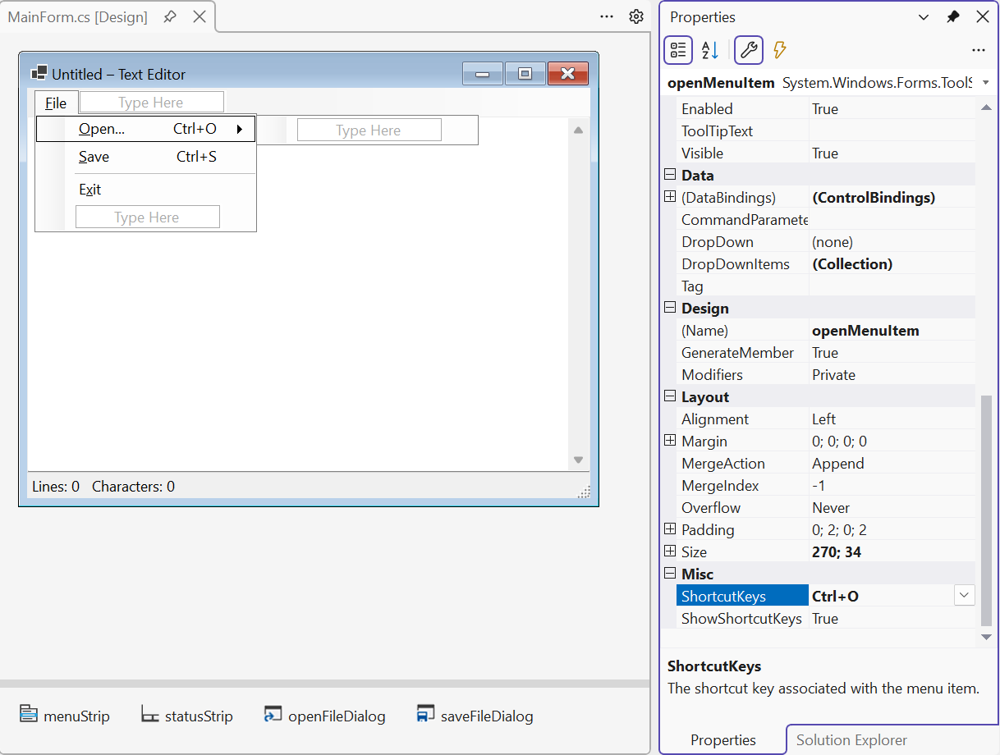

# Меню, діалоги й таблиці

## Меню, панелі інструментів і стандартні діалоги

### Меню та панелі

Команди застосунку розміщують у меню та на панелях з групи *Menus & Toolbars* панелі *Toolbox* (<https://learn.microsoft.com/dotnet/desktop/winforms/controls/menustrip-control-overview-windows-forms>):

- `MenuStrip` – головне меню у верхній частині форми; його пункти мають тип `ToolStripMenuItem` і можуть містити вкладені пункти (`DropDownItems`) та роздільники `ToolStripSeparator`;
- `ContextMenuStrip` – контекстне меню, яке з’являється після клацання правою кнопкою миші на елементі; його призначають властивістю `ContextMenuStrip` цього елемента;
- `ToolStrip` – панель інструментів з кнопками `ToolStripButton`, списками, полями введення;
- `StatusStrip` – рядок стану внизу форми з написами `ToolStripStatusLabel`.

Меню створюють у конструкторі: після розміщення `MenuStrip` на формі в полі *Type Here* вводять назви пунктів (рис. 3.11). Властивість `ShortcutKeys` пункту задає **клавіші швидкого доступу** (**Ctrl+O**, **Ctrl+S**), які працюють без відкриття меню, а `&` у назві – мнемоніку для навігації клавіатурою (*&File* відкривається клавішами **Alt+F**). Пункти меню й кнопки панелі мають подію `Click`, як і звичайні кнопки, тому один обробник можна підписати на обидва елементи.



Рис. 3.11. Створення головного меню в конструкторі {.caption}

### Стандартні діалоги

Для типових завдань Windows має **стандартні діалогові вікна**, які Windows Forms надає як компоненти (табл. 3.4). Метод `ShowDialog()` показує діалог модально й повертає `DialogResult.OK`, якщо користувач підтвердив вибір (<https://learn.microsoft.com/dotnet/desktop/winforms/controls/dialog-box-controls-and-components-windows-forms>).

Таблиця 3.4. Стандартні діалогові вікна {.caption}

| **Компонент** | **Призначення та результат** |
| --- | --- |
| `OpenFileDialog` | вибір файлу для відкриття: `FileName`, `FileNames` (`Multiselect`), `Filter` |
| `SaveFileDialog` | вибір імені файлу для збереження: `FileName`, `DefaultExt`, `OverwritePrompt` |
| `FolderBrowserDialog` | вибір папки: `SelectedPath` |
| `ColorDialog` | вибір кольору: `Color` |
| `FontDialog` | вибір шрифту: `Font` |

Властивість `Filter` задає пари «опис|шаблон», розділені символом `|`: `"Text files (*.txt)|*.txt|All files (*.*)|*.*"`.

### Приклад: простий текстовий редактор

Форма `MainForm` містить `MenuStrip` з меню *File* (пункти *Open…* з **Ctrl+O**, *Save* з **Ctrl+S**, роздільник і *Exit*), поле `editorTextBox` (`Multiline = true`, `Dock = Fill`, `ScrollBars = Vertical`), `StatusStrip` з написом `statusLabel`, компоненти `openFileDialog` і `saveFileDialog` з фільтром текстових файлів. Редактор пам’ятає шлях до файлу та ознаку незбережених змін, показує їх у заголовку вікна, а в рядку стану – кількість рядків і символів. Для стислості приклад не перехоплює винятки читання й запису файлів (`IOException`, `UnauthorizedAccessException`), які в реальному застосунку показують у `MessageBox`:

```cs
namespace TextEditor;

public partial class MainForm : Form
{
    private string? filePath;     // null – файл ще не збережено
    private bool isModified;

    public MainForm()
    {
        InitializeComponent();
        UpdateStatus();
    }

    private void openMenuItem_Click(object sender, EventArgs e)
    {
        if (!ConfirmDiscard()
            || openFileDialog.ShowDialog(this) != DialogResult.OK)
        {
            return;
        }
        string path = openFileDialog.FileName;
        editorTextBox.Text = File.ReadAllText(path);
        filePath = path;
        isModified = false;
        UpdateStatus();
    }

    private void saveMenuItem_Click(object sender, EventArgs e) =>
        Save();

    private void exitMenuItem_Click(object sender, EventArgs e) =>
        Close();                  // далі спрацює FormClosing

    private void editorTextBox_TextChanged(object sender, EventArgs e)
    {
        isModified = true;
        UpdateStatus();
    }

    private void MainForm_FormClosing(object sender,
        FormClosingEventArgs e)
    {
        e.Cancel = !ConfirmDiscard();
    }

    // true – можна продовжувати: змін немає, їх збережено
    // або користувач відмовився від них.
    private bool ConfirmDiscard()
    {
        if (!isModified)
        {
            return true;
        }
        DialogResult answer = MessageBox.Show(
            "Save changes to the document?", "Text Editor",
            MessageBoxButtons.YesNoCancel, MessageBoxIcon.Question);
        return answer == DialogResult.No
            || answer == DialogResult.Yes && Save();
    }

    private bool Save()
    {
        if (filePath is null)
        {
            if (saveFileDialog.ShowDialog(this) != DialogResult.OK)
            {
                return false;
            }
            filePath = saveFileDialog.FileName;
        }
        File.WriteAllText(filePath, editorTextBox.Text);
        isModified = false;
        UpdateStatus();
        return true;
    }

    private void UpdateStatus()
    {
        string name = Path.GetFileName(filePath) ?? "Untitled";
        Text = $"{name}{(isModified ? "*" : "")} – Text Editor";
        statusLabel.Text = $"Lines: {editorTextBox.Lines.Length}"
            + $"   Characters: {editorTextBox.TextLength}";
    }
}
```

Присвоювання `editorTextBox.Text` генерує подію `TextChanged`, яка позначає документ зміненим, тому ознаку `isModified` скидають уже після завантаження тексту. Пункт *Exit* лише закриває форму, а питання про збереження змін ставить обробник `FormClosing`, тому воно з’являється і після натискання кнопки закриття вікна чи **Alt+F4**. Метод `Save` запитує ім’я файлу лише для нового документа.

Після відкриття файлу `notes.txt` з двома рядками заголовок має вигляд `notes.txt – Text Editor`, а рядок стану – `Lines: 2` і `Characters: 23` (символи переходу на новий рядок теж враховуються). Після додавання третього рядка заголовок змінюється на `notes.txt* – Text Editor`. Спроба закрити вікно показує питання *Save changes to the document?* (рис. 3.12): *Cancel* залишає вікно відкритим, *Yes* зберігає файл і закриває вікно, *No* закриває без збереження.


Рис. 3.12. Питання про збереження змін у текстовому редакторі {.caption}

## Власні діалогові вікна, таблиці даних і таймер

### Модальні та немодальні форми

Застосунок може мати кілька форм. Нову форму додають командою *Project → Add Form (Windows Forms)…*, а показують двома способами:

- `form.Show()` – **немодально**: користувач може працювати з обома вікнами одночасно, метод повертає керування одразу;
- `form.ShowDialog(this)` – **модально**: вікно-власник недоступне, доки діалог не закрито, а метод повертає `DialogResult`.

Модальну форму закриває присвоювання її властивості `DialogResult` будь-якого значення, крім `None`. Кнопці можна задати властивість `DialogResult` у конструкторі: тоді її натискання закриває форму з цим результатом без жодного коду. Властивості форми `AcceptButton` і `CancelButton` пов’язують кнопки з клавішами **Enter** і **Esc**. Форма, показана методом `ShowDialog`, після закриття не знищується, тому її створюють в операторі `using`.

Дані передають у форму через параметри конструктора або властивості, а назад – через властивості чи змінений об’єкт після `DialogResult.OK`. Діалог не повинен звертатися до елементів головної форми напряму: так форми залишаються незалежними.

### Таблиця `DataGridView` і прив’язка даних

`DataGridView` показує дані у вигляді таблиці. Найпростіше прив’язати її до списку об’єктів: таблиця сама створює стовпці за відкритими властивостями класу. Для оновлення таблиці після зміни списку використовують `BindingList<T>` (простір імен `System.ComponentModel`): на відміну від `List<T>`, він повідомляє таблицю про додавання й видалення елементів. Проміжний компонент `BindingSource` відстежує поточний (виділений) рядок: властивості `Current` і `Position` (<https://learn.microsoft.com/dotnet/desktop/winforms/controls/bindingsource-component-overview>).

### Таймер

Компонент `System.Windows.Forms.Timer` генерує подію `Tick` через інтервал `Interval` (у мілісекундах), доки властивість `Enabled` дорівнює `true` (методи `Start` і `Stop`). Обробник `Tick` виконується в потоці інтерфейсу, тому в ньому можна змінювати елементи форми. Таймер не гарантує точності: якщо потік зайнятий, подія запізнюється, тому для вимірювання часу використовують `Stopwatch` або `DateTime.Now`, а таймер лише оновлює відображення (<https://learn.microsoft.com/dotnet/api/system.windows.forms.timer>). У .NET є й інші класи `Timer` (`System.Timers.Timer`, `System.Threading.Timer`), які викликають обробник в іншому потоці, тому в застосунку Windows Forms повне ім’я `System.Windows.Forms.Timer` уникає плутанини.

### Приклад: каталог книг

Головна форма містить панель `ToolStrip` з кнопками *Add* і *Edit*, таблицю `bookGrid` (`Dock = Fill`, `ReadOnly = true`, `SelectionMode = FullRowSelect`), компонент `bookBindingSource` і рядок стану з написом `countLabel`. Форма редагування `BookForm` має поля `titleTextBox`, `authorTextBox`, `yearNumeric` (1450–2100), `priceNumeric` (два знаки після коми), кнопки `okButton` і `cancelButton` (`DialogResult = Cancel`), `ErrorProvider`; `AcceptButton = okButton`, `CancelButton = cancelButton`, `FormBorderStyle = FixedDialog`. Клас `Book` (файл `Book.cs`) описує дані, а `BookForm` отримує книгу в конструкторі та змінює її лише після натискання *OK*:

```cs
namespace BookCatalog;

public class Book
{
    public string Title { get; set; } = "";
    public string Author { get; set; } = "";
    public int Year { get; set; }
    public decimal Price { get; set; }
}

public partial class BookForm : Form
{
    private readonly Book book;

    public BookForm(Book book)
    {
        InitializeComponent();
        this.book = book;
        Text = book.Title.Length == 0 ? "New Book" : "Edit Book";
        titleTextBox.Text = book.Title;
        authorTextBox.Text = book.Author;
        yearNumeric.Value = book.Year;
        priceNumeric.Value = book.Price;
    }

    private void okButton_Click(object sender, EventArgs e)
    {
        string title = titleTextBox.Text.Trim();
        if (title.Length == 0)
        {
            errorProvider.SetError(titleTextBox, "Enter the title");
            titleTextBox.Focus();
            return;           // форма залишається відкритою
        }
        book.Title = title;
        book.Author = authorTextBox.Text.Trim();
        book.Year = (int)yearNumeric.Value;
        book.Price = priceNumeric.Value;
        DialogResult = DialogResult.OK;  // закрити модальну форму
    }
}
```

Головна форма зберігає книги в `BindingList<Book>` і прив’язує таблицю через `BindingSource`. Обробник `editButton_Click` підписано і на кнопку *Edit*, і на подію `CellDoubleClick` таблиці: тип `DataGridViewCellEventArgs` є нащадком `EventArgs`, тому метод із параметром `EventArgs` підходить для обох подій. `BindingList<T>` не знає про зміну властивостей наявного об’єкта, тому після редагування таблицю оновлює виклик `ResetCurrentItem()`:

```cs
using System.ComponentModel;

namespace BookCatalog;

public partial class MainForm : Form
{
    private readonly BindingList<Book> books = new()
    {
        new() { Title = "Clean Code", Author = "Robert C. Martin",
                Year = 2008, Price = 890m },
        new() { Title = "C# 12 in a Nutshell",
                Author = "Joseph Albahari",
                Year = 2023, Price = 2150m }
    };

    public MainForm()
    {
        InitializeComponent();
        bookBindingSource.DataSource = books;
        bookGrid.DataSource = bookBindingSource;
        bookGrid.Columns["Price"]!.DefaultCellStyle.Format = "N2";
        books.ListChanged += (s, e) => UpdateStatus();
        UpdateStatus();
    }

    private void addButton_Click(object sender, EventArgs e)
    {
        var book = new Book { Year = DateTime.Today.Year };
        using var dialog = new BookForm(book);
        if (dialog.ShowDialog(this) == DialogResult.OK)
        {
            books.Add(book);
            bookBindingSource.Position = books.Count - 1;
        }
    }

    private void editButton_Click(object sender, EventArgs e)
    {
        if (bookBindingSource.Current is not Book book)
        {
            return;
        }
        using var dialog = new BookForm(book);
        if (dialog.ShowDialog(this) == DialogResult.OK)
        {
            bookBindingSource.ResetCurrentItem();
            UpdateStatus();
        }
    }

    private void UpdateStatus() =>
        countLabel.Text = $"Books: {books.Count}   "
            + $"Total: {books.Sum(b => b.Price):N2} UAH";
}
```

Таблиця отримує стовпці *Title*, *Author*, *Year*, *Price*, а рядок стану на початку показує `Books: 2` і `Total: 3 040,00 UAH`. Натискання *OK* у формі нової книги з порожньою назвою залишає форму відкритою й показує значок помилки. Після додавання книги Kobzar (Taras Shevchenko, 1840, 450,50) рядок стану показує `Books: 3` і `Total: 3 490,50 UAH`; якщо змінити ціну на 520 і натиснути *Cancel*, дані не змінюються, а після *OK* таблиця й підсумок оновлюються (`Total: 3 560,00 UAH`) (рис. 3.13). Видалення книги – виклик `books.Remove(book)` після підтвердження в `MessageBox`.


Рис. 3.13. Каталог книг і модальна форма редагування {.caption}

## Нові можливості .NET 9–10 і публікація

**Темний режим.** У .NET 9 Windows Forms отримала попередню підтримку темного режиму, а в .NET 10 метод `Application.SetColorMode` більше не є експериментальним. Його викликають у `Main` після `ApplicationConfiguration.Initialize()`. Аргумент `SystemColorMode.System` вмикає тему, обрану в налаштуваннях Windows, `Dark` – завжди темну тему, `Classic` (за замовчуванням) – світлу (<https://learn.microsoft.com/dotnet/desktop/winforms/whats-new/net100>).

**Асинхронні методи.** У .NET 9 з’явилися методи `Control.InvokeAsync`, `Form.ShowAsync`, `Form.ShowDialogAsync` і `TaskDialog.ShowDialogAsync`, а в .NET 10 методи показу форм і діалогів перестали бути експериментальними. Вони потрібні, коли обробник виконує тривалі операції з `async` і `await`; детально їх розглянуто в темі 5 (<https://learn.microsoft.com/dotnet/desktop/winforms/whats-new/net90>).

**Публікація.** Команда `dotnet publish` готує застосунок до передавання користувачам. Застосунок, **залежний від середовища** (*framework-dependent*), займає кілька файлів, але потребує встановленого *.NET Desktop Runtime* 10. **Автономний** (*self-contained*) застосунок містить середовище виконання, тому працює без встановлення .NET; параметр `PublishSingleFile` збирає його в один файл `.exe` (близько 110 МБ для прикладу конвертера температур) (<https://learn.microsoft.com/dotnet/core/deploying/>):

```powershell
dotnet publish -c Release
dotnet publish -c Release -r win-x64 --self-contained `
    -p:PublishSingleFile=true
```
