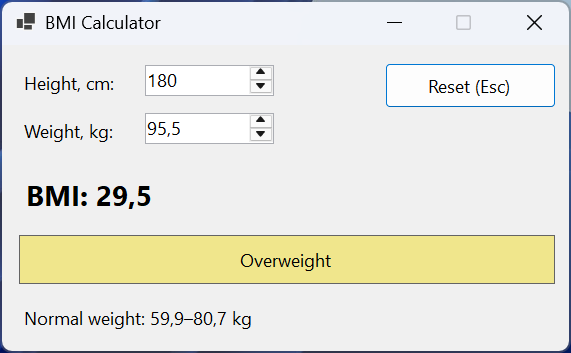
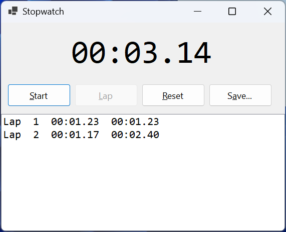
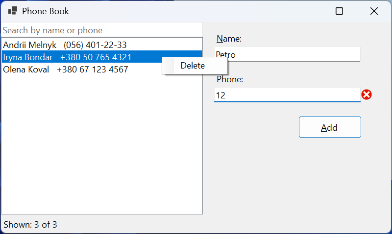

# Практика

## Приклад 1. Калькулятор індексу маси тіла

Створити застосунок Windows Forms, який обчислює індекс маси тіла (ІМТ) за зростом і масою: ІМТ = *m* / *h*<sup>2</sup>, де *m* – маса в кілограмах, *h* – зріст у метрах. Результат оновлюється одразу після зміни будь-якого значення; поруч показується категорія за класифікацією ВООЗ, позначена кольором тла, і діапазон нормальної маси для введеного зросту. Клавіша **Esc** повертає початкові значення.

Форма `MainForm` (*BMI Calculator*, `FormBorderStyle = FixedSingle`) містить написи *Height, cm:* і *Weight, kg:*, поля `heightNumeric` (100–250, значення 170) і `weightNumeric` (20–300, `DecimalPlaces = 1`, `Increment = 0,5`, значення 65), кнопку `resetButton` (*Reset (Esc)*), напис `bmiLabel` (шрифт 14 pt, жирний), напис `categoryLabel` (`BorderStyle = FixedSingle`, `TextAlign = MiddleCenter`) і напис `rangeLabel`. Властивість форми `CancelButton = resetButton`. У вікні *Properties* подію `ValueChanged` обох полів пов’язано з **одним** обробником `inputs_ValueChanged`: для другого поля його обирають у випадному списку події.

```cs
namespace BmiCalculator;

public partial class MainForm : Form
{
    private const decimal DefaultHeight = 170m, DefaultWeight = 65m;

    public MainForm()
    {
        InitializeComponent();
        ShowBmi();
    }

    // Один обробник для подій ValueChanged обох полів.
    private void inputs_ValueChanged(object sender, EventArgs e) =>
        ShowBmi();

    private void resetButton_Click(object sender, EventArgs e)
    {
        heightNumeric.Value = DefaultHeight;
        weightNumeric.Value = DefaultWeight;
    }

    private void ShowBmi()
    {
        double height = (double)heightNumeric.Value / 100;   // м
        double weight = (double)weightNumeric.Value;
        double bmi = weight / (height * height);

        var (category, color) = bmi switch
        {
            < 18.5 => ("Underweight", Color.LightSkyBlue),
            < 25 => ("Normal weight", Color.LightGreen),
            < 30 => ("Overweight", Color.Khaki),
            _ => ("Obesity", Color.LightCoral)
        };
        bmiLabel.Text = $"BMI: {bmi:F1}";
        categoryLabel.Text = category;
        categoryLabel.BackColor = color;

        double min = 18.5 * height * height;
        double max = 24.9 * height * height;
        rangeLabel.Text = $"Normal weight: {min:F1}–{max:F1} kg";
    }
}
```

Властивість `Value` елемента `NumericUpDown` має тип `decimal`, тому для обчислень у `double` потрібне явне приведення. Кортеж `(category, color)` отримує значення зі `switch`-виразу з реляційними шаблонами `< 18.5`, `< 25`, `< 30`; колір лише доповнює текст категорії. Кнопка `resetButton` є `CancelButton` форми, тому клавіша **Esc** натискає її, де б не був фокус.

Після запуску форма показує `BMI: 22,5`, категорію *Normal weight* і `Normal weight: 53,5–72,0 kg`. Для 180 см і 95,5 кг – `BMI: 29,5` і *Overweight* (норма 59,9–80,7 кг), для 165 см і 48 кг – `BMI: 17,6` і *Underweight*, для 175 см і 105 кг – `BMI: 34,3` і *Obesity* (рис. 3.14).



Рис. 3.14. Застосунок «Калькулятор ІМТ» {.caption}

## Приклад 2. Секундомір з колами

Створити застосунок «Секундомір», який запускає й зупиняє відлік часу кнопкою або клавішею **Space**, показує час у форматі `хх:сс.сс`, записує кола (час кола та загальний час) у список, скидає секундомір і зберігає список кіл у текстовий файл. Кнопки, недоступні в поточному стані, вимкнено.

Форма містить напис `timeLabel` (`Dock = Top`, шрифт Consolas 32 pt), панель `FlowLayoutPanel` (`Dock = Top`, `AutoSize = true`) з кнопками `startStopButton` (*Start*), `lapButton` (*Lap*), `resetButton` (*Reset*) і `saveButton` (*Save…*), список `lapsListBox` (`Dock = Fill`, шрифт Consolas), таймер `uiTimer` (`Interval = 50`) і `saveFileDialog` (`FileName = laps.txt`, фільтр текстових файлів). Властивість форми `KeyPreview = true`.

```cs
using System.Diagnostics;

namespace StopwatchApp;

public partial class MainForm : Form
{
    private const string TimeFormat = @"mm\:ss\.ff";
    private readonly Stopwatch stopwatch = new();
    private TimeSpan lastLap = TimeSpan.Zero;

    public MainForm()
    {
        InitializeComponent();
        UpdateButtons();
    }

    private void startStopButton_Click(object sender, EventArgs e)
    {
        if (stopwatch.IsRunning)
        {
            stopwatch.Stop();
            uiTimer.Stop();
        }
        else
        {
            stopwatch.Start();
            uiTimer.Start();
        }
        ShowTime();
        UpdateButtons();
    }

    private void lapButton_Click(object sender, EventArgs e)
    {
        TimeSpan total = stopwatch.Elapsed;
        TimeSpan lap = total - lastLap;
        lastLap = total;
        int number = lapsListBox.Items.Count + 1;
        string lapText = lap.ToString(TimeFormat);
        string totalText = total.ToString(TimeFormat);
        lapsListBox.Items.Add(
            $"Lap {number,2}  {lapText}  {totalText}");
        UpdateButtons();
    }

    private void resetButton_Click(object sender, EventArgs e)
    {
        stopwatch.Reset();
        uiTimer.Stop();
        lastLap = TimeSpan.Zero;
        lapsListBox.Items.Clear();
        ShowTime();
        UpdateButtons();
    }

    private void saveButton_Click(object sender, EventArgs e)
    {
        if (saveFileDialog.ShowDialog(this) != DialogResult.OK)
        {
            return;
        }
        File.WriteAllLines(saveFileDialog.FileName,
            lapsListBox.Items.Cast<string>());
        MessageBox.Show($"Saved {lapsListBox.Items.Count} laps.",
            Text, MessageBoxButtons.OK, MessageBoxIcon.Information);
    }

    private void uiTimer_Tick(object sender, EventArgs e) =>
        ShowTime();

    private void MainForm_KeyDown(object sender, KeyEventArgs e)
    {
        // KeyPreview = true: форма отримує клавіші раніше за кнопки.
        if (e.KeyCode == Keys.Space)
        {
            startStopButton.PerformClick();
            e.SuppressKeyPress = true;   // не передавати кнопці
        }
    }

    private void ShowTime() =>
        timeLabel.Text = stopwatch.Elapsed.ToString(TimeFormat);

    private void UpdateButtons()
    {
        startStopButton.Text =
            stopwatch.IsRunning ? "&Stop" : "&Start";
        lapButton.Enabled = stopwatch.IsRunning;
        saveButton.Enabled = lapsListBox.Items.Count > 0;
    }
}
```

Час вимірює клас `Stopwatch` (простір імен `System.Diagnostics`), а таймер лише 20 разів за секунду оновлює напис: якщо потік інтерфейсу на мить зайнятий, подія `Tick` запізниться, але виміряний час залишиться точним. Формат `mm\:ss\.ff` методу `TimeSpan.ToString` вимагає екранувати двокрапку й крапку, тому рядок формату записано як буквальний (`@`).

Клавіша **Space** зазвичай натискає кнопку, яка має фокус. Завдяки `KeyPreview = true` форма отримує подію `KeyDown` першою, а `e.SuppressKeyPress = true` не дає кнопці обробити ту саму клавішу вдруге. Мнемоніки працюють і без **Alt**, бо на формі немає полів введення тексту: клавіша **L** натискає кнопку *Lap*. Після запуску, двох кіл (приблизно через 1,4 і 2,1 с) і зупинки список містить рядки `Lap 1` і `Lap 2` з часом кола (`00:01.40`, `00:00.71`) і загальним часом (`00:01.40`, `00:02.12`). Кнопка *Save…* записує їх у файл і показує повідомлення *Saved 2 laps.*, а *Reset* очищає список і показує `00:00.00` (рис. 3.15).



Рис. 3.15. Застосунок «Секундомір» {.caption}

## Приклад 3. Телефонна книга

Створити застосунок «Телефонна книга», який зберігає контакти (ім’я та телефон) у файлі JSON у папці користувача, завантажує їх під час запуску й зберігає під час закриття. Список контактів відсортовано за іменем і фільтрується під час введення тексту пошуку. Новий контакт додається після перевірки полів; телефон може містити цифри, пробіли, дужки, дефіси й початковий `+` (від 7 до 20 символів). Контекстне меню списку видаляє контакт.

Форма містить `SplitContainer` (`Dock = Fill`). Ліва панель: поле пошуку `searchTextBox` (`Dock = Top`, `PlaceholderText = Search by name or phone`), список `contactsListBox` (`Dock = Fill`, `ContextMenuStrip = contactMenu`) і напис `countLabel` (`Dock = Bottom`). Права панель: поля `nameTextBox` і `phoneTextBox` з написами та кнопка `addButton` (*Add*, це `AcceptButton` форми); поля прив’язано `Anchor = Top, Left, Right`, кнопку – `Top, Right`. Контекстне меню `contactMenu` має пункт `deleteMenuItem` (*Delete*). Дані описує запис `Contact` наприкінці файлу:

```cs
using System.ComponentModel;
using System.Text.Encodings.Web;
using System.Text.Json;
using System.Text.RegularExpressions;

namespace PhoneBook;

public partial class MainForm : Form
{
    private static readonly JsonSerializerOptions JsonOptions = new()
    {
        WriteIndented = true,
        // «+» і кирилиця у файлі без послідовностей \uXXXX.
        Encoder = JavaScriptEncoder.UnsafeRelaxedJsonEscaping
    };
    private readonly string dataFile = Path.Combine(
        Environment.GetFolderPath(
            Environment.SpecialFolder.ApplicationData),
        "PhoneBook", "contacts.json");
    private List<Contact> contacts = [];

    public MainForm()
    {
        InitializeComponent();
    }

    [GeneratedRegex(@"^\+?[0-9 ()-]{7,20}$")]
    private static partial Regex PhoneRegex();

    private void MainForm_Load(object sender, EventArgs e)
    {
        try
        {
            if (File.Exists(dataFile))
            {
                string json = File.ReadAllText(dataFile);
                contacts = JsonSerializer
                    .Deserialize<List<Contact>>(json) ?? [];
            }
        }
        catch (Exception ex) when (ex is IOException
            or JsonException)
        {
            MessageBox.Show($"Cannot read contacts: {ex.Message}",
                Text, MessageBoxButtons.OK, MessageBoxIcon.Warning);
        }
        ShowContacts();
    }

    private void MainForm_FormClosed(object sender,
        FormClosedEventArgs e)
    {
        Directory.CreateDirectory(Path.GetDirectoryName(dataFile)!);
        File.WriteAllText(dataFile,
            JsonSerializer.Serialize(contacts, JsonOptions));
    }

    private void searchTextBox_TextChanged(object sender,
        EventArgs e) => ShowContacts();

    private void ShowContacts()
    {
        string filter = searchTextBox.Text.Trim();
        contactsListBox.BeginUpdate();
        contactsListBox.Items.Clear();
        foreach (Contact c in contacts.OrderBy(c => c.Name))
        {
            if (c.Name.Contains(filter,
                    StringComparison.CurrentCultureIgnoreCase)
                || c.Phone.Contains(filter))
            {
                contactsListBox.Items.Add(c);
            }
        }
        contactsListBox.EndUpdate();
        int shown = contactsListBox.Items.Count;
        countLabel.Text = $"Shown: {shown} of {contacts.Count}";
    }

    private void addButton_Click(object sender, EventArgs e)
    {
        string name = nameTextBox.Text.Trim();
        string phone = phoneTextBox.Text.Trim();
        bool nameOk = Check(nameTextBox, name.Length > 0,
            "Enter a name");
        bool phoneOk = Check(phoneTextBox,
            PhoneRegex().IsMatch(phone),
            "Use digits, spaces, ( ) and -, e.g. +380 67 123 4567");
        if (!nameOk || !phoneOk)
        {
            return;
        }
        contacts.Add(new Contact(name, phone));
        nameTextBox.Clear();
        phoneTextBox.Clear();
        nameTextBox.Focus();
        ShowContacts();
    }

    private bool Check(Control control, bool isValid, string message)
    {
        errorProvider.SetError(control, isValid ? "" : message);
        return isValid;
    }

    private void contactsListBox_MouseDown(object sender,
        MouseEventArgs e)
    {
        if (e.Button == MouseButtons.Right)
        {
            // Правий клік виділяє контакт під курсором.
            contactsListBox.SelectedIndex =
                contactsListBox.IndexFromPoint(e.Location);
        }
    }

    private void contactMenu_Opening(object sender,
        CancelEventArgs e) =>
        e.Cancel = contactsListBox.SelectedItem is null;

    private void deleteMenuItem_Click(object sender, EventArgs e)
    {
        if (contactsListBox.SelectedItem is Contact contact)
        {
            contacts.Remove(contact);
            ShowContacts();
        }
    }
}

public record Contact(string Name, string Phone)
{
    // ListBox показує елемент за допомогою ToString().
    public override string ToString() => $"{Name}   {Phone}";
}
```

Список на формі щоразу заповнюється заново методом `ShowContacts` з урахуванням фільтра; `BeginUpdate` і `EndUpdate` прибирають мерехтіння. Файл даних лежить у папці `%APPDATA%\PhoneBook`, яку повертає `Environment.GetFolderPath`: застосунок може не мати права запису в папку, де лежить `.exe`. Метод `Check` показує або знімає помилку `ErrorProvider` і повертає результат перевірки, тому обидва поля перевіряються одразу. Телефон перевіряє регулярний вираз `[GeneratedRegex]` (тема 2).

Контекстне меню відкривається правою кнопкою миші, але `ListBox` сам не виділяє елемент під курсором. Обробник `MouseDown` отримує координати в `MouseEventArgs` і виділяє елемент методом `IndexFromPoint`, який для порожнього місця повертає −1 (`ListBox.NoMatches`), і виділення знімається. Подія меню `Opening` скасовує показ меню, якщо контакт не виділено.

Спроба додати контакт з порожнім ім’ям і телефоном `abc` показує значки помилок біля обох полів, а телефон `12` відхиляється як закороткий. Після додавання трьох контактів напис показує `Shown: 3 of 3`. Пошук `an` залишає лише контакт Andrii Melnyk з телефоном (056) 401-22-33 (`Shown: 1 of 3`). Після видалення контакту через контекстне меню й закриття форми файл `contacts.json` містить масив із двох об’єктів з властивостями `Name` і `Phone`, наприклад `"Phone": "+380 67 123 4567"`, у рядках з відступами (`WriteIndented`). Без параметра `Encoder = JavaScriptEncoder.UnsafeRelaxedJsonEscaping` серіалізатор замінив би символ `+` і кириличні літери послідовностями `\uXXXX` (рис. 3.16).



Рис. 3.16. Застосунок «Телефонна книга» з контекстним меню {.caption}
