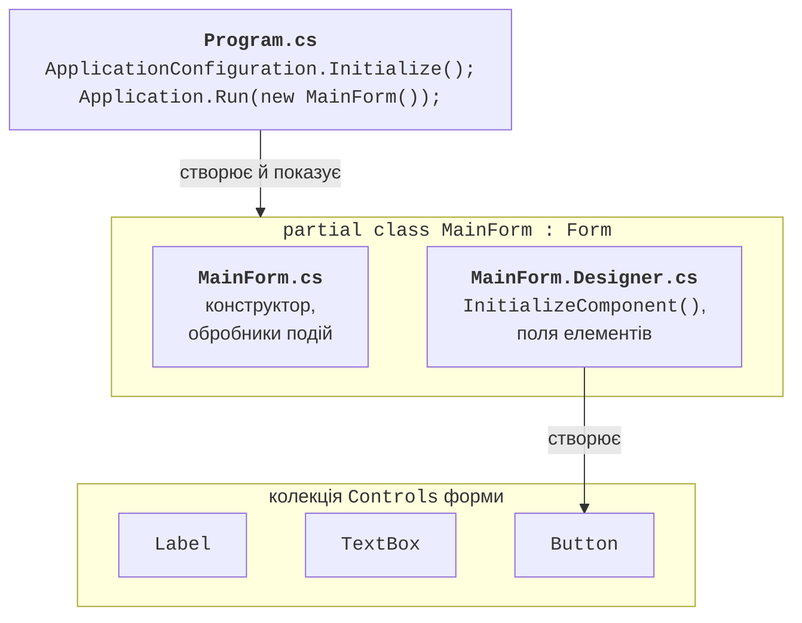
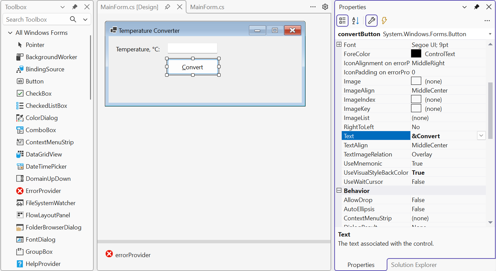

# Проєкт Windows Forms

## Технології настільних застосунків .NET

**Настільний застосунок** (*desktop application*) працює на комп’ютері користувача у власному вікні: текстовий редактор, касова програма, утиліта налаштування обладнання. На відміну від консольної програми, він має **графічний інтерфейс користувача** (*graphical user interface*, GUI): вікна, кнопки, поля введення, меню. Платформа .NET пропонує кілька технологій для таких застосунків (табл. 3.1).

Таблиця 3.1. Технології настільних застосунків .NET {.caption}

| **Технологія** | **Особливості** | **Платформи** |
| --- | --- | --- |
| Windows Forms | найпростіша модель: форми й елементи керування, візуальний конструктор, код інтерфейсу мовою C#; тонка обгортка над вікнами Windows | Windows |
| WPF | опис інтерфейсу мовою XAML, векторна графіка, стилі, прив’язка даних, патерн MVVM (теми 12–14) | Windows |
| .NET MAUI | один проєкт на XAML і C# для кількох платформ (тема 15) | Windows, Android, iOS, macOS |

**Windows Forms** (WinForms) – найстаріша з них: вона з’явилася разом із .NET Framework 1.0 у 2002 році. Сучасна версія працює на .NET, має відкритий код і розвивається разом із платформою: у .NET 10 вона підтримує темний режим, асинхронні методи показу форм, високу роздільність екранів. Windows Forms обирають для внутрішніх корпоративних програм, утиліт і навчальних проєктів: форму з кількома полями можна створити за лічені хвилини, а модель подій легко зрозуміти (<https://learn.microsoft.com/dotnet/desktop/winforms/overview/>).

Windows Forms працює **лише у Windows**. Тому цільовий фреймворк проєкту має суфікс платформи: `net10.0-windows`, а властивість `UseWindowsForms` підключає бібліотеки Windows Forms. Файл проєкту, створений шаблоном, виглядає так:

```xml
<Project Sdk="Microsoft.NET.Sdk">
  <PropertyGroup>
    <OutputType>WinExe</OutputType>
    <TargetFramework>net10.0-windows</TargetFramework>
    <Nullable>enable</Nullable>
    <UseWindowsForms>true</UseWindowsForms>
    <ImplicitUsings>enable</ImplicitUsings>
  </PropertyGroup>
</Project>
```

Тип виходу `WinExe` означає, що під час запуску застосунку не відкривається вікно консолі. Неявні директиви `using` (`ImplicitUsings`) для Windows Forms додають простори імен `System.Windows.Forms` і `System.Drawing`, тому класи `Form`, `Button`, `Point`, `Color` доступні без явних `using`.

## Проєкт Windows Forms і його структура

### Створення проєкту

Для роботи потрібне робоче навантаження *.NET desktop development* у Visual Studio 2026 (встановлюється через *Visual Studio Installer*). Проєкт створюють так (<https://learn.microsoft.com/dotnet/desktop/winforms/get-started/create-app-visual-studio>):

1. *File → New → Project…* або кнопка *Create a new project* у стартовому вікні.
2. У полі пошуку ввести `winforms`, обрати мову C# і шаблон *Windows Forms App* (рис. 3.1). Шаблон *Windows Forms App (.NET Framework)* призначений для старої платформи, його не обирають.
3. Задати назву проєкту (*Project name*) і розташування (*Location*), натиснути *Next*.
4. У вікні *Additional information* обрати *Framework*: *.NET 10.0 (Long Term Support)* і натиснути *Create*.


Рис. 3.1. Вибір шаблону *Windows Forms App* {.caption}

Той самий проєкт створює команда dotnet CLI `dotnet new winforms -n TemperatureConverter`, а запускає – `dotnet run` у папці проєкту.

### Файли проєкту

Шаблон створює три файли з кодом (рис. 3.2):

- `Program.cs` – точка входу: налаштовує застосунок і показує головну форму;
- `Form1.cs` – код форми, який пише програміст: конструктор, обробники подій, допоміжні методи;
- `Form1.Designer.cs` – код, який генерує конструктор форм: створення елементів керування та налаштування їхніх властивостей.

Файл `Form1.resx` (ресурси форми: зображення, локалізовані рядки) з’являється, коли формі потрібні ресурси, наприклад після вибору зображення для `PictureBox`. Форму одразу перейменовують на змістовну назву: у *Solution Explorer* файл `Form1.cs` перейменовують на `MainForm.cs`, і Visual Studio пропонує перейменувати також клас і всі посилання на нього.



Рис. 3.2. Структура застосунку Windows Forms {.caption}

Метод `Main` у файлі `Program.cs` після перейменування форми має такий вигляд:

```cs
namespace TemperatureConverter;

static class Program
{
    [STAThread]
    static void Main()
    {
        ApplicationConfiguration.Initialize();
        Application.Run(new MainForm());
    }
}
```

Атрибут `[STAThread]` потрібен для роботи буфера обміну, стандартних діалогів і перетягування. Метод `ApplicationConfiguration.Initialize()` генерується компілятором за властивостями проєкту та вмикає візуальні стилі Windows, сучасний спосіб виведення тексту й режим високої роздільності `SystemAware`. Метод `Application.Run` показує форму та запускає **цикл повідомлень** (*message loop*), який працює, доки головну форму не закрито. Тому рядки після `Application.Run` виконуються лише після закриття головного вікна.

Клас форми `MainForm` оголошено з модифікатором `partial` в обох файлах, тому компілятор об’єднує їх в один клас. Конструктор у `MainForm.cs` викликає метод `InitializeComponent`, скорочений вміст якого після розміщення на формі поля введення й кнопки має такий вигляд:

```cs
partial class MainForm
{
    private void InitializeComponent()
    {
        celsiusTextBox = new TextBox();
        convertButton = new Button();
        SuspendLayout();
        // … властивості celsiusTextBox
        convertButton.Location = new Point(122, 41);
        convertButton.Name = "convertButton";
        convertButton.Size = new Size(105, 27);
        convertButton.Text = "&Convert";
        convertButton.Click += convertButton_Click;
        // … властивості форми
        Controls.Add(celsiusTextBox);
        Controls.Add(convertButton);
        Text = "Temperature Converter";
        ResumeLayout(false);
    }

    private TextBox celsiusTextBox;
    private Button convertButton;
}
```

Кожен елемент керування – це **поле** класу форми. Метод `InitializeComponent` створює об’єкти, задає їхні властивості, підписує обробники подій (`+=`) і додає елементи в колекцію `Controls` форми. Виклики `SuspendLayout` і `ResumeLayout` призупиняють перерахунок розташування, доки не задано всі властивості.

## Конструктор форм Visual Studio

**Конструктор форм** (*Windows Forms Designer*) дає змогу створювати інтерфейс мишею (рис. 3.3). Він відкривається подвійним клацанням на файлі форми в *Solution Explorer* або клавішами **Shift+F7**; клавіша **F7** перемикає на код форми. Основні вікна конструктора:

- *Toolbox* (*View → Toolbox*, **Ctrl+Alt+X**) – панель елементів керування, згрупованих за категоріями (*Common Controls*, *Containers*, *Menus & Toolbars*, *Data*, *Components*, *Dialogs*). Елемент перетягують на форму або двічі клацають на ньому;
- *Properties* (*View → Properties Window*, **F4**) – властивості виділеного елемента. Кнопки у верхній частині вікна перемикають сортування за категоріями або за абеткою та режим подій (кнопка *Events* зі значком блискавки);
- *Document Outline* (*View → Other Windows → Document Outline*) – дерево елементів форми: у ньому зручно виділяти вкладені елементи й змінювати їхню вкладеність перетягуванням.



Рис. 3.3. Конструктор форм Visual Studio 2026 {.caption}

Невізуальні компоненти (`Timer`, `ErrorProvider`, `OpenFileDialog`) конструктор розміщує на панелі під формою (*component tray*). Для проєктів .NET конструктор працює в окремому процесі `DesignToolsServer.exe` (<https://learn.microsoft.com/dotnet/desktop/winforms/controls-design/designer-overview>).

Конструктор називає елементи `button1`, `textBox2`, і обробник `button3_Click` нічого не говорить про призначення кнопки. Тому одразу після розміщення елемента змініть властивість `(Name)`: прийнято стиль camelCase з назвою типу в кінці – `celsiusTextBox`, `convertButton`, `resultLabel`. Ім’я обробника конструктор утворює з імені елемента та події: `convertButton_Click`.

::: tip Увага
Не редагуйте файл `*.Designer.cs` вручну. Конструктор перезаписує його після кожної зміни форми, а код, який він не розуміє (цикли, умови, виклики власних методів), може зламати відкриття форми в конструкторі. Власний код пишіть у `MainForm.cs`, наприклад у конструкторі після `InitializeComponent()` або в обробнику події `Load`.
:::
