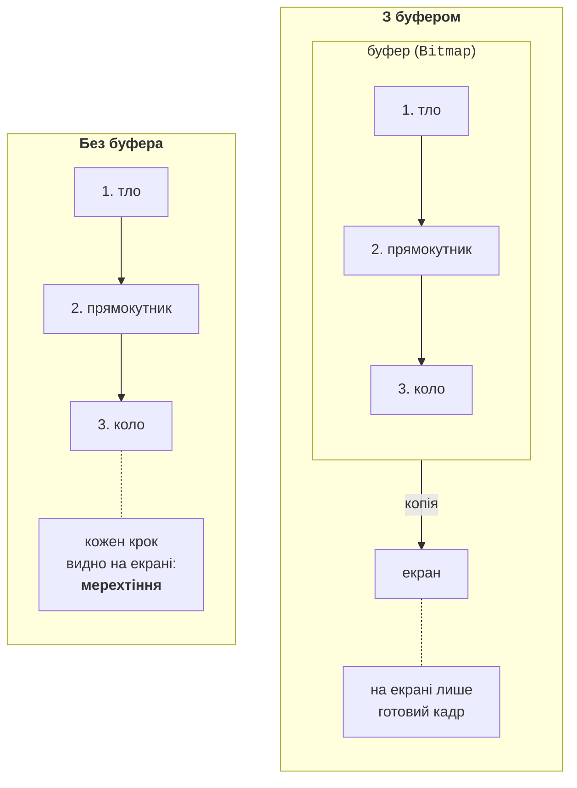

# Анімація та малювання мишею

## Анімація та подвійна буферизація

**Анімація** – це послідовність кадрів: через рівні проміжки часу програма змінює дані (кут стрілки, положення м’яча) і викликає `Invalidate()`. Для відліку часу у Windows Forms є компонент `System.Windows.Forms.Timer` (<https://learn.microsoft.com/dotnet/api/system.windows.forms.timer>). Його подія `Tick` виконується в потоці інтерфейсу кожні `Interval` мілісекунд, тому в обробнику можна безпечно змінювати поля форми й викликати `Invalidate()`. Точність таймера обмежена (документація називає 55 мс), тому для руху потрібно обчислювати положення за реальним часом (`DateTime.Now`, `Stopwatch`), а не рахувати кількість викликів `Tick`.

### Мерехтіння і його усунення

Звичайна форма малюється прямо на екрані: спочатку фон (`OnPaintBackground`), потім фігури одна за одною. Якщо малюнок складний і перемальовується часто, користувач бачить проміжні кадри – **мерехтіння** (*flicker*). **Подвійна буферизація** (*double buffering*) усуває його: усі операції виконуються в буфері в пам’яті, а на екран потрапляє готовий кадр однією операцією копіювання (рис. 4.6) (<https://learn.microsoft.com/dotnet/desktop/winforms/advanced/how-to-reduce-graphics-flicker-with-double-buffering-for-forms-and-controls>).



Рис. 4.6. Малювання без буфера та з подвійною буферизацією {.caption}

Стандартні елементи керування вже використовують подвійну буферизацію. Для форми або власного елемента її вмикають одним із двох способів:

```cs
// У конструкторі форми або нащадка Control.
DoubleBuffered = true;

// Або стилі для елемента, який повністю малює себе сам.
SetStyle(ControlStyles.OptimizedDoubleBuffer
    | ControlStyles.AllPaintingInWmPaint
    | ControlStyles.UserPaint, true);
```

Стиль `AllPaintingInWmPaint` вимикає окреме стирання фону (фон малюється разом з рештою в `OnPaint`), `UserPaint` – елемент малює себе сам, а не операційна система (<https://learn.microsoft.com/dotnet/api/system.windows.forms.controlstyles>). Властивість `DoubleBuffered` і метод `SetStyle` **захищені** (`protected`), тому для `Panel` чи іншого готового елемента потрібно створити нащадка, як у прикладі «Графічний редактор».

Буфер можна створити і самостійно: намалювати кадр у `Bitmap`, а в `OnPaint` лише скопіювати його методом `DrawImage`. Так роблять, коли малюнок накопичується (сліди пензля в редакторі) або коли його дорого малювати заново для кожного `WM_PAINT`.

### Приклад «Аналоговий годинник»

Годинник перемальовується таймером кожні 200 мс. Початок координат переноситься в центр циферблата, поділки малюються поворотами системи, а кожна стрілка – в тимчасово повернутій системі між `Save` і `Restore` (рис. 4.7). Стрілки відрізняються товщиною та довжиною: годинна найкоротша й найтовща, секундна найтонша й найдовша.

```cs
using System.Drawing.Drawing2D;

namespace Clock;

public class MainForm : Form
{
    private readonly System.Windows.Forms.Timer timer = new();

    public MainForm()
    {
        Text = "Analog Clock";
        ClientSize = new Size(360, 360);
        BackColor = Color.White;
        DoubleBuffered = true;       // без мерехтіння
        ResizeRedraw = true;
        timer.Interval = 200;        // мілісекунди
        timer.Tick += (sender, e) => Invalidate();
        timer.Start();
    }

    protected override void OnPaint(PaintEventArgs e)
    {
        base.OnPaint(e);
        DrawClock(e.Graphics, ClientSize, DateTime.Now);
    }

    protected override void Dispose(bool disposing)
    {
        if (disposing) timer.Dispose();
        base.Dispose(disposing);
    }
```

Повне ім’я `System.Windows.Forms.Timer` потрібне, бо в неявних `using` є ще класи `Timer` з просторів імен `System.Threading` і `System.Timers`, події яких виконуються в іншому потоці. Таймер звільняється в перевизначеному методі `Dispose` форми. Метод `DrawClock` отримує час параметром, тому його легко перевірити для будь-якого моменту:

```cs
public static void DrawClock(Graphics g, Size client,
    DateTime time)
{
    float r = Math.Min(client.Width, client.Height) / 2f - 10;
    if (r < 40) return;
    g.SmoothingMode = SmoothingMode.AntiAlias;
    // Початок координат – у центрі циферблата.
    g.TranslateTransform(client.Width / 2f, client.Height / 2f);

    using var rim = new Pen(Color.Black, 4);
    g.DrawEllipse(rim, -r, -r, 2 * r, 2 * r);
    DrawMarks(g, r);

    float hours = time.Hour % 12 + time.Minute / 60f;
    float minutes = time.Minute + time.Second / 60f;
    DrawHand(g, Color.Black, hours * 30, r * 0.5f, 8);
    DrawHand(g, Color.Black, minutes * 6, r * 0.75f, 5);
    DrawHand(g, Color.Firebrick, time.Second * 6, r * 0.85f, 2);
    g.FillEllipse(Brushes.Black, -6, -6, 12, 12);
}
```

Година відповідає 30° (360° / 12), хвилина і секунда – 6°. Годинна стрілка враховує хвилини, тому о 10:30 вона стоїть посередині між 10 і 11.

```cs
// 60 поділок: після кожної система повертається на 6°.
private static void DrawMarks(Graphics g, float r)
{
    using var thin = new Pen(Color.Black, 1);
    using var thick = new Pen(Color.Black, 4);
    for (int i = 0; i < 60; i++)
    {
        bool isHour = i % 5 == 0;
        float inner = isHour ? r - 18 : r - 9;
        g.DrawLine(isHour ? thick : thin, 0, -r + 3, 0, -inner);
        g.RotateTransform(6);
    }
}
```

Кожна стрілка малюється в тимчасово повернутій системі:

```cs
    private static void DrawHand(Graphics g, Color color,
        float angle, float length, float width)
    {
        GraphicsState state = g.Save();
        g.RotateTransform(angle);         // 0° – на цифру 12
        using var pen = new Pen(color, width);
        pen.StartCap = LineCap.Round;
        pen.EndCap = LineCap.Round;
        g.DrawLine(pen, 0, length * 0.15f, 0, -length);
        g.Restore(state);
    }
}
```

Після 60 поворотів на 6° система повертається у вихідне положення (360°), тому стрілки малюються відносно вертикалі. Цифри на циферблаті не можна малювати в поверненій системі: вони б лежали на боці; їхні центри обчислюють через `Math.Sin` і `Math.Cos`. Стрілка малюється вздовж від’ємної осі *y* (угору) з коротким «хвостом» за центром.


Рис. 4.7. Застосунок «Аналоговий годинник» {.caption}

## Інтерактивне малювання мишею

Під час руху миші над елементом керування генеруються події `MouseDown` (кнопку натиснуто), `MouseMove` (курсор рухається) і `MouseUp` (кнопку відпущено), а також `MouseClick`, `MouseDoubleClick` і `MouseWheel`. Параметр `MouseEventArgs e` містить координати курсора `e.X`, `e.Y` (`e.Location`) у системі координат **елемента** і кнопку `e.Button`. Координати відносно екрана повертає `Cursor.Position`, а переводять їх методами `PointToClient` і `PointToScreen`.

Малювання мишею зазвичай побудовано так:

1. `MouseDown` – створити нову фігуру з початковою точкою або знайти фігуру під курсором;
2. `MouseMove` з натиснутою кнопкою – змінити кінцеву точку фігури або перемістити вибрану фігуру та викликати `Invalidate()`;
3. `MouseUp` – завершити дію;
4. `Paint` – намалювати **всі** фігури зі списку.

Малюнок зберігається як **модель** – список об’єктів-фігур, а не як пікселі. Це дозволяє вибирати й переміщувати фігури, зберігати їх у файл і малювати в будь-якому масштабі.

### Приклад «Графічний редактор»

Редактор малює лінії, прямокутники й еліпси, дозволяє вибрати фігуру клацанням і перетягнути її, показує координати курсора в рядку стану, зберігає малюнок у PNG і показує попередній перегляд друку (рис. 4.8). Фігури утворюють ієрархію класів: базовий абстрактний клас `Shape` і нащадки, які описують власний контур `GraphicsPath` (файл `Shapes.cs`).

```cs
using System.Drawing.Drawing2D;

namespace Editor;

// Фігура задається двома точками: початком і кінцем руху миші.
public abstract class Shape
{
    public Point Start { get; set; }
    public Point End { get; set; }

    public Rectangle Bounds => Rectangle.FromLTRB(
        Math.Min(Start.X, End.X), Math.Min(Start.Y, End.Y),
        Math.Max(Start.X, End.X), Math.Max(Start.Y, End.Y));
```

Властивість `Bounds` нормалізує прямокутник: користувач може тягнути мишу в будь-якому напрямку, а ширина й висота завжди додатні. Малювання та перевірка влучання використовують контур, який створює нащадок:

```cs
// Кожен нащадок описує свій контур.
protected abstract GraphicsPath CreatePath();

public void Draw(Graphics g, Pen pen)
{
    using GraphicsPath path = CreatePath();
    g.DrawPath(pen, path);
}

// Влучання всередину фігури або поруч із її контуром.
public bool HitTest(Point point)
{
    using GraphicsPath path = CreatePath();
    using var zone = new Pen(Color.Black, 10);
    return path.IsVisible(point)
        || path.IsOutlineVisible(point, zone);
}
```

Для лінії `IsVisible` завжди повертає `False` (контур не має площі), тому працює перевірка `IsOutlineVisible` із пером завширшки 10 пікселів.

```cs
    public void Offset(int dx, int dy)
    {
        Start = new Point(Start.X + dx, Start.Y + dy);
        End = new Point(End.X + dx, End.Y + dy);
    }
}

public class LineShape : Shape
{
    protected override GraphicsPath CreatePath()
    {
        var path = new GraphicsPath();
        path.AddLine(Start, End);
        return path;
    }
}

public class RectangleShape : Shape
{
    protected override GraphicsPath CreatePath()
    {
        var path = new GraphicsPath();
        path.AddRectangle(Bounds);
        return path;
    }
}

public class EllipseShape : Shape
{
    protected override GraphicsPath CreatePath()
    {
        var path = new GraphicsPath();
        path.AddEllipse(Bounds);
        return path;
    }
}
```

Щоб додати новий вид фігури (трикутник, стрілку), достатньо ще одного нащадка `Shape`: код форми працює зі списком `List<Shape>` і не залежить від конкретних класів. Форма (файл `MainForm.cs`) створює панель інструментів `ToolStrip`, полотно і рядок стану `StatusStrip`:

```cs
using System.Drawing.Drawing2D;
using System.Drawing.Imaging;
using System.Drawing.Printing;

namespace Editor;

public enum Tool { Select, Line, Rectangle, Ellipse }

// Panel з подвійною буферизацією: властивість захищена.
public class Canvas : Panel
{
    public Canvas()
    {
        DoubleBuffered = true;
        BackColor = Color.White;
    }
}
```

Поля форми зберігають модель малюнка (список фігур) і стан взаємодії з мишею:

```cs
public class MainForm : Form
{
    private readonly List<Shape> shapes = [];
    private readonly Canvas canvas = new() { Dock = DockStyle.Fill };
    private readonly ToolStrip toolBar = new();
    private readonly ToolStripStatusLabel status = new();
    private Tool tool = Tool.Line;
    private Shape? drawing;       // фігура, яку зараз малюють
    private Shape? selected;      // вибрана фігура
    private Point lastPoint;      // попереднє положення миші
```

```cs
public MainForm()
{
    Text = "Paint Editor";
    ClientSize = new Size(700, 480);
    foreach (Tool t in Enum.GetValues<Tool>())
        toolBar.Items.Add(t.ToString(), null, (s, e) => tool = t);
    toolBar.Items.Add(new ToolStripSeparator());
    toolBar.Items.Add("Save PNG...", null, (s, e) => SavePng());
    toolBar.Items.Add("Print Preview...", null,
        (s, e) => ShowPrintPreview());
    var statusBar = new StatusStrip();
    statusBar.Items.Add(status);

    Controls.Add(canvas);     // Fill додається першим
    Controls.Add(toolBar);
    Controls.Add(statusBar);
    canvas.Paint += (s, e) => DrawShapes(e.Graphics, true);
    canvas.MouseDown += Canvas_MouseDown;
    canvas.MouseMove += Canvas_MouseMove;
    canvas.MouseUp += (s, e) => drawing = null;
}
```

Кнопки інструментів створюються циклом за значеннями перелічення `Tool`: лямбда-вираз кожної кнопки запам’ятовує своє значення `t`. Вибраний інструмент і координати курсора показуються в рядку стану. Елемент із `DockStyle.Fill` додається першим, щоб панелі, закріплені вгорі та внизу, не перекривали полотно. Обробники миші реалізують кроки, описані вище:

```cs
private void Canvas_MouseDown(object? sender, MouseEventArgs e)
{
    if (e.Button != MouseButtons.Left) return;
    lastPoint = e.Location;
    if (tool == Tool.Select)
    {
        // Верхня фігура – остання в списку, тому пошук з кінця.
        selected = shapes.LastOrDefault(
            s => s.HitTest(e.Location));
    }
    else
    {
        drawing = tool switch
        {
            Tool.Line => new LineShape(),
            Tool.Rectangle => new RectangleShape(),
            _ => new EllipseShape()
        };
        drawing.Start = drawing.End = e.Location;
        shapes.Add(drawing);
        selected = null;
    }
    canvas.Invalidate();
}
```

```cs
private void Canvas_MouseMove(object? sender, MouseEventArgs e)
{
    status.Text = $"{tool}   X: {e.X}, Y: {e.Y}";
    if (e.Button != MouseButtons.Left) return;
    if (drawing != null)
    {
        drawing.End = e.Location;          // розтягування
    }
    else if (selected != null)
    {
        selected.Offset(e.X - lastPoint.X, e.Y - lastPoint.Y);
        lastPoint = e.Location;            // перетягування
    }
    canvas.Invalidate();
}

private void DrawShapes(Graphics g, bool showSelection)
{
    g.SmoothingMode = SmoothingMode.AntiAlias;
    using var pen = new Pen(Color.Black, 3);
    foreach (Shape shape in shapes)
        shape.Draw(g, pen);                // поліморфний виклик

    if (!showSelection || selected == null) return;
    Rectangle r = selected.Bounds;
    using var frame = new Pen(Color.Gray);
    frame.DashStyle = DashStyle.Dash;
    g.DrawRectangle(frame, r);
    Point[] handles = [new(r.Left, r.Top), new(r.Right, r.Top),
        new(r.Left, r.Bottom), new(r.Right, r.Bottom)];
    foreach (Point p in handles)
        g.FillRectangle(Brushes.Black, p.X - 4, p.Y - 4, 8, 8);
}
```

Вибрана фігура позначається пунктирною рамкою і чорними квадратними маркерами в кутах. Під час збереження та друку маркери не потрібні, тому `DrawShapes` має параметр `showSelection`. Методи `SavePng`, `CreateDocument` і `ShowPrintPreview`, на які посилаються кнопки панелі інструментів, завершують клас `MainForm`; вони розглядаються в наступному розділі. Під час перевірки редактора намальовано прямокутник, еліпс і лінію; клацання поруч із лінією в режимі *Select* вибирає її, клацання на порожньому місці знімає вибір (рис. 4.8).


Рис. 4.8. Застосунок «Графічний редактор» {.caption}
