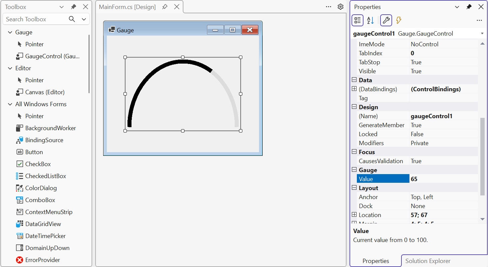

# Зображення, друк і власні елементи

## Зображення, експорт і друк

### Класи `Image` і `Bitmap`

Абстрактний клас `Image` описує зображення, а його нащадок **`Bitmap`** – растрове зображення з масивом пікселів (<https://learn.microsoft.com/dotnet/api/system.drawing.bitmap>). GDI+ читає формати BMP, PNG, JPEG, GIF, TIFF, ICO і записує BMP, PNG, JPEG, GIF, TIFF. Основні операції:

- `Image.FromFile(path)` або `new Bitmap(path)` – завантажити зображення з файлу;
- `new Bitmap(width, height)` – створити порожнє зображення (32 біти на піксель з прозорістю);
- `g.DrawImage(image, x, y)` – намалювати в натуральному розмірі; `g.DrawImage(image, rectangle)` – масштабувати в прямокутник;
- `g.InterpolationMode = InterpolationMode.HighQualityBicubic` – якісне масштабування (повільніше, ніж `NearestNeighbor`, яке зберігає чіткі пікселі для піксельної графіки);
- `bitmap.Save(path, ImageFormat.Png)` – зберегти у файл.

::: tip Увага
`Image.FromFile` тримає файл відкритим, доки зображення не звільнено: поки програма працює, цей файл не можна перезаписати або видалити. Якщо зображення потрібне довго, створюють копію в пам’яті (`new Bitmap(file)`) і одразу звільняють завантажене зображення.
:::

### Малювання в `Bitmap` і збереження в PNG

Метод `Graphics.FromImage(bitmap)` повертає `Graphics`, який малює в зображенні. Тим самим кодом, що малює на екрані, можна створити файл. Так зберігає малюнок графічний редактор: розміри `Bitmap` дорівнюють розмірам полотна, фон заливається білим (інакше він прозорий), а маркери вибору не малюються:

```cs
private void SavePng()
{
    using var dialog = new SaveFileDialog
    {
        Filter = "PNG image (*.png)|*.png",
        FileName = "drawing.png"
    };
    if (dialog.ShowDialog(this) != DialogResult.OK) return;

    using var bitmap = new Bitmap(canvas.Width, canvas.Height);
    using (Graphics g = Graphics.FromImage(bitmap))
    {
        g.Clear(Color.White);
        DrawShapes(g, false);              // без маркерів вибору
    }
    bitmap.Save(dialog.FileName, ImageFormat.Png);
}
```

Формат PNG зберігає зображення без втрат і підходить для схем і графіків; JPEG стискає з втратами і підходить для фотографій. Простір імен `System.Drawing.Imaging` потрібно підключити директивою `using`. Будь-який елемент керування можна також зберегти як зображення методом `control.DrawToBitmap(bitmap, rectangle)`.

### Робота з пікселями

Методи `GetPixel(x, y)` і `SetPixel(x, y, color)` читають і змінюють окремий піксель. Наприклад, перетворення в **відтінки сірого** обчислює яскравість кожного пікселя за зваженою сумою компонентів:

```cs
static Bitmap ToGray(Bitmap source)
{
    var result = new Bitmap(source.Width, source.Height);
    for (int y = 0; y < source.Height; y++)
    {
        for (int x = 0; x < source.Width; x++)
        {
            Color c = source.GetPixel(x, y);
            int gray = (int)(0.299 * c.R + 0.587 * c.G
                + 0.114 * c.B);
            result.SetPixel(x, y,
                Color.FromArgb(c.A, gray, gray, gray));
        }
    }
    return result;
}
```

Методи `GetPixel` і `SetPixel` прості, але повільні: кожен виклик перевіряє координати й блокує зображення. Для зображення 1920 × 1080 (понад 2 мільйони пікселів) цей метод на тестовому комп’ютері працював 0,76 с. Для швидкої обробки використовують метод `LockBits`, який надає прямий доступ до масиву байтів зображення (`BitmapData`), а після обробки викликають `UnlockBits` (<https://learn.microsoft.com/dotnet/api/system.drawing.imaging.bitmapdata>).

### Друк

Друк у Windows Forms побудовано на тій самій моделі подій, що й малювання у вікні. Клас **`PrintDocument`** (простір імен `System.Drawing.Printing`) описує документ; для кожної сторінки він генерує подію **`PrintPage`**, у якій програма малює сторінку через `e.Graphics` (<https://learn.microsoft.com/dotnet/api/system.drawing.printing.printdocument>). Параметр `PrintPageEventArgs e` містить:

- `e.Graphics` – «полотно» сторінки; одиниця за замовчуванням – 1/100 дюйма;
- `e.MarginBounds` – прямокутник сторінки без полів (за замовчуванням поля по 1 дюйму);
- `e.PageBounds` – уся сторінка;
- `e.HasMorePages` – установлюють `true`, якщо після цієї сторінки є ще одна: подія `PrintPage` виконається знову.

Графічний редактор створює документ з однією сторінкою. Малюнок переноситься в межі полів і за потреби зменшується так, щоб умістилися і ширина, і висота:

```cs
    private PrintDocument CreateDocument()
    {
        var document = new PrintDocument { DocumentName = "Drawing" };
        document.PrintPage += (sender, e) =>
        {
            Graphics g = e.Graphics!;
            Rectangle m = e.MarginBounds;      // поля сторінки
            float scale = Math.Min(1f, Math.Min(
                (float)m.Width / canvas.Width,
                (float)m.Height / canvas.Height));
            g.TranslateTransform(m.Left, m.Top);
            g.ScaleTransform(scale, scale);
            g.DrawRectangle(Pens.Black, 0, 0,
                canvas.Width, canvas.Height);
            DrawShapes(g, false);
            e.HasMorePages = false;            // одна сторінка
        };
        return document;
    }

    private void ShowPrintPreview()
    {
        using PrintDocument document = CreateDocument();
        using var preview = new PrintPreviewDialog
        {
            Document = document,
            ClientSize = new Size(800, 600)
        };
        preview.ShowDialog(this);
    }
}
```

Одиниця сторінки – 1/100 дюйма, тому полотно 700 пікселів завширшки на сторінці A4 (8,27 дюйма) з полями по 1 дюйму зменшується до ширини області – 627 одиниць. Щоб надрукувати документ на вибраному принтері, використовують діалог `PrintDialog`:

```cs
using var printDialog = new PrintDialog { Document = document };
if (printDialog.ShowDialog(this) == DialogResult.OK)
    document.Print();
```

Діалог **`PrintDialog`** дозволяє вибрати принтер, кількість копій і сторінки (<https://learn.microsoft.com/dotnet/api/system.windows.forms.printdialog>). Діалог **`PrintPreviewDialog`** показує сторінки на екрані перед друком (рис. 4.9): для цього йому достатньо присвоїти властивість `Document` і викликати `ShowDialog` (<https://learn.microsoft.com/dotnet/api/system.windows.forms.printpreviewdialog>). Щоб перевірити друк без паперу, у діалозі вибирають віртуальний принтер *Microsoft Print to PDF*.


Рис. 4.9. Попередній перегляд друку малюнка {.caption}

## Власний елемент керування

Якщо малюнок потрібен у кількох формах, його оформлюють як **власний елемент керування** (*custom control*): клас, похідний від `Control`, який малює себе в `OnPaint` (<https://learn.microsoft.com/dotnet/desktop/winforms/controls/custom>). Такий елемент має властивості та події, з’являється в панелі *Toolbox* після збирання проєкту і редагується у вікні *Properties* так само, як стандартні елементи.

Правила створення:

- у конструкторі ввімкнути стилі `UserPaint`, `AllPaintingInWmPaint`, `OptimizedDoubleBuffer` і `ResizeRedraw`;
- у сеттері кожної властивості, що впливає на вигляд, перевірити значення і викликати `Invalidate()`;
- для використання фону і шрифту брати властивості `BackColor`, `ForeColor` і `Font` елемента;
- позначити властивості атрибутами з простору імен `System.ComponentModel`: `[Category]` (група у вікні *Properties*), `[Description]` (підказка внизу вікна), `[DefaultValue]` (значення за замовчуванням: воно не записується у `Designer.cs` і показується звичайним, а не жирним шрифтом).

```cs
using System.ComponentModel;

namespace Gauge;

// Півкругла шкала: дуга, довжина якої пропорційна Value.
public class GaugeControl : Control
{
    private int value;

    public GaugeControl()
    {
        SetStyle(ControlStyles.UserPaint
            | ControlStyles.AllPaintingInWmPaint
            | ControlStyles.OptimizedDoubleBuffer
            | ControlStyles.ResizeRedraw, true);
    }

    [Category("Gauge")]
    [Description("Current value from 0 to 100.")]
    [DefaultValue(0)]
    public int Value
    {
        get => value;
        set { this.value = Math.Clamp(value, 0, 100); Invalidate(); }
    }

    protected override void OnPaint(PaintEventArgs e)
    {
        base.OnPaint(e);
        if (Width < 30 || Height < 30) return;
        var box = new Rectangle(10, 10, Width - 20, 2 * Height - 40);
        using var track = new Pen(Color.Gainsboro, 12);
        using var bar = new Pen(ForeColor, 12);
        e.Graphics.DrawArc(track, box, 180, 180);
        e.Graphics.DrawArc(bar, box, 180, 180f * value / 100);
    }
}
```

Шкала – товста світло-сіра дуга на 180° (верхня половина еліпса), поверх якої дуга кольору `ForeColor` (за замовчуванням чорного) займає частину, пропорційну значенню. У коді форми елемент використовується як будь-який інший: `var gauge = new GaugeControl { Value = 65 };`, а зміна `gauge.Value` одразу перемальовує шкалу.

::: tip Увага
У .NET 10 аналізатор Windows Forms перевіряє відкриті властивості елементів керування. Якщо властивість не має атрибута `[DefaultValue]`, `[DesignerSerializationVisibility]` або методу `ShouldSerializeValue`, збирання завершується помилкою WFO1000 *Property 'Value' does not configure the code serialization for its property content*. Атрибут показує конструктору форм, чи потрібно записувати значення у `Designer.cs`.
:::

Після збирання проєкту (**Ctrl+Shift+B**) елемент з’являється у вікні *Toolbox* у розділі, названому за проєктом (рис. 4.10). Його перетягують на форму, а властивість `Value` шукають у вікні *Properties* у групі *Gauge* (<https://learn.microsoft.com/dotnet/desktop/winforms/controls-design/how-to-create-usercontrol>).



Рис. 4.10. Власний елемент керування у *Toolbox* і вікні *Properties* {.caption}
