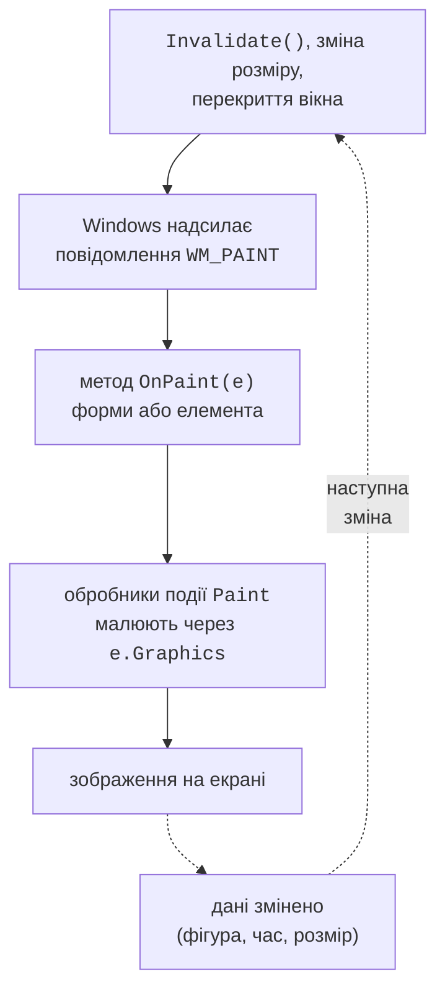
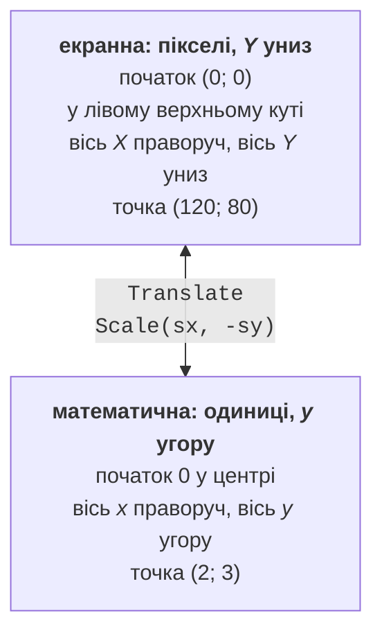
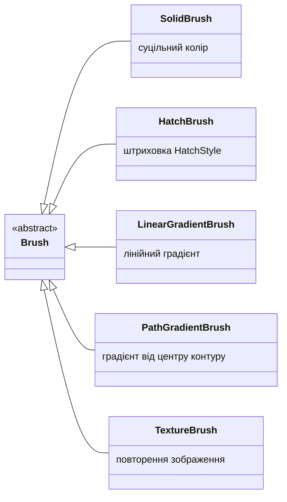

# Подія Paint, кольори та пера

## GDI+ і подія `Paint`

Елементи керування Windows Forms (кнопки, поля, таблиці) малюють себе самі. Коли потрібно показати те, чого немає серед готових елементів, – графік, діаграму, циферблат, ігрове поле, – програма малює сама. Для цього у Windows Forms використовується **GDI+** (*Graphics Device Interface*) – графічна підсистема Windows, яка малює лінії, фігури, текст і зображення на екрані, у растрових зображеннях і на принтері (<https://learn.microsoft.com/dotnet/desktop/winforms/advanced/graphics-and-drawing-in-windows-forms>).

Класи GDI+ зібрано в просторі імен `System.Drawing` (`Graphics`, `Pen`, `Brush`, `Font`, `Color`, `Point`, `Rectangle`, `Bitmap`) і вкладених просторах імен `System.Drawing.Drawing2D` (градієнти, штриховки, `GraphicsPath`, `Matrix`), `System.Drawing.Imaging` (формати зображень) та `System.Drawing.Printing` (друк). У проєкті Windows Forms простори імен `System.Drawing` і `System.Windows.Forms` підключені неявними директивами `using` (`<ImplicitUsings>enable</ImplicitUsings>`), решту підключають явно.

GDI+ – технологія **лише для Windows**. Починаючи з .NET 7, бібліотека `System.Drawing.Common` на інших операційних системах не працює: виклики спричиняють виняток `PlatformNotSupportedException` (<https://learn.microsoft.com/dotnet/core/compatibility/core-libraries/6.0/system-drawing-common-windows-only>). Для застосунків Windows Forms це не обмеження, бо вони й так працюють лише у Windows (цільова платформа `net10.0-windows`). Для обробки зображень у кросплатформних програмах (вебсервіси, Linux) Microsoft радить сторонні бібліотеки, наприклад SkiaSharp або ImageSharp.

### Клас `Graphics`

Усе малювання виконується через об’єкт класу **`Graphics`** – «полотно» з методами `DrawLine`, `FillRectangle`, `DrawString`, `DrawImage` тощо (<https://learn.microsoft.com/dotnet/api/system.drawing.graphics>). Об’єкт `Graphics` пов’язаний із певною поверхнею: вікном, растровим зображенням `Bitmap` або сторінкою принтера. Код малювання, який приймає параметр `Graphics`, однаково малює на всіх цих поверхнях: це використовується далі для збереження малюнка в PNG і для друку.

Методи `Graphics` утворюють дві групи: методи `Draw…` малюють **контур** фігури пером (`Pen`), а методи `Fill…` – **зафарбовують** її внутрішню частину пензлем (`Brush`).

### Подія `Paint` і метод `OnPaint`

Windows не зберігає зображення вікна. Коли вікно вперше з’являється, змінює розмір або його частину відкриває інше вікно, система надсилає вікну повідомлення `WM_PAINT`, і вікно має намалювати себе заново. У Windows Forms це повідомлення викликає метод `OnPaint`, який генерує подію **`Paint`** (рис. 4.1). Параметр `PaintEventArgs e` містить готовий об’єкт `e.Graphics` і прямокутник `e.ClipRectangle` – область, яку потрібно оновити (<https://learn.microsoft.com/dotnet/desktop/winforms/controls/custom-painting-drawing>).



Рис. 4.1. Цикл перемальовування вікна {.caption}

Малювати можна двома способами. У формі або в елементі керування, які створює сам програміст, перевизначають метод `OnPaint`:

```cs
public class MainForm : Form
{
    protected override void OnPaint(PaintEventArgs e)
    {
        base.OnPaint(e);                // викликати обробники Paint
        e.Graphics.DrawRectangle(Pens.Black, 20, 20, 200, 100);
        e.Graphics.DrawString("Hello, GDI+!", Font,
            Brushes.Black, 30, 55);
    }
}
```

До готового елемента (наприклад, `Panel` чи `PictureBox`) підписуються на подію `Paint`: `panel.Paint += Panel_Paint;`, а обробник `Panel_Paint(object? sender, PaintEventArgs e)` малює через `e.Graphics`. Виклик `base.OnPaint(e)` потрібен, щоб спрацювали обробники події `Paint`, підписані на цю форму. Код малювання має бути **швидким** і **не змінювати дані**: `OnPaint` викликається багато разів, наприклад під час кожної зміни розміру вікна.

### `Invalidate`, `Update` і `Refresh`

Коли дані змінилися (додано фігуру, минула секунда), зображення потрібно перемалювати. Метод `OnPaint` **ніколи не викликають напряму**: замість цього викликають один із методів елемента (<https://learn.microsoft.com/dotnet/api/system.windows.forms.control.invalidate>):

- `Invalidate()` – позначає весь елемент (або прямокутник `Invalidate(rect)`) як такий, що потребує перемальовування; Windows надішле `WM_PAINT`, коли черга повідомлень звільниться. Кілька викликів поспіль об’єднуються в одне малювання;
- `Update()` – негайно виконує малювання вже позначених областей;
- `Refresh()` – `Invalidate()` і `Update()` разом: перемальовує негайно.

У більшості випадків достатньо `Invalidate()`. Якщо зображення залежить від розміру вікна, установлюють властивість `ResizeRedraw = true`: тоді форма перемальовується повністю під час кожної зміни розміру, а не лише на новій смузі, що з’явилася.

::: tip Увага
Метод `CreateGraphics()` повертає `Graphics` для вікна, і малювати ним можна будь-де, наприклад в обробнику кнопки. Але таке зображення зникне під час першого ж перемальовування: згорнули вікно – малюнка немає. Правильний підхід: зберегти дані (список фігур, координати) у полях форми, викликати `Invalidate()` і малювати все в `OnPaint`.
:::

## Система координат і кольори

За замовчуванням GDI+ використовує **екранну систему координат** у пікселях: початок (0; 0) – у лівому верхньому куті клієнтської області, вісь *X* спрямована праворуч, вісь *Y* – **униз** (рис. 4.2). **Клієнтська область** (*client area*) – частина вікна без заголовка та рамки; її розміри повертають властивості `ClientSize` і `ClientRectangle`. Математична система координат (вісь *y* угору, початок у центрі) отримується перетвореннями, які розглядаються далі.



Рис. 4.2. Екранна та математична системи координат {.caption}

Для координат і розмірів є структури (табл. 4.1). Кожна має цілочисельний варіант і варіант із суфіксом `F` для дробових значень (`float`).

Таблиця 4.1. Структури координат і розмірів {.caption}

| **Структура** | **Призначення та приклад** |
| --- | --- |
| `Point`, `PointF` | точка: `new Point(120, 80)`, властивості `X`, `Y` |
| `Size`, `SizeF` | розмір: `new Size(640, 400)`, властивості `Width`, `Height` |
| `Rectangle`, `RectangleF` | прямокутник: `new Rectangle(x, y, width, height)`; `Left`, `Right`, `Top`, `Bottom`, `Contains(point)`, `Inflate(dx, dy)`, `IntersectsWith(r)` |

Усі ці типи є **структурами**, тобто типами-значеннями. Тому рядок `shape.Location.Offset(5, 5);` змінює **копію** точки, а не властивість: потрібно присвоїти нове значення, `shape.Location = new Point(x + 5, y + 5)`.

### Кольори

Колір задає структура `Color` з чотирма компонентами від 0 до 255: **альфа-канал** A (непрозорість) і червоний, зелений, синій (R, G, B). Готові кольори доступні як статичні властивості (`Color.Black`, `Color.DimGray`), довільні створюються методом `Color.FromArgb`: `Color.FromArgb(40, 40, 40)` – темно-сірий, `Color.FromArgb(96, Color.Gray)` – напівпрозорий сірий. Альфа-канал 255 означає повністю непрозорий колір, 0 – повністю прозорий; напівпрозора фігура змішується з тим, що вже намальовано під нею. Навчальні приклади цієї лекції використовують здебільшого чорний і відтінки сірого, а фігури розрізняються стилем лінії, штриховкою та підписами: такий малюнок читається і на екрані, і на чорно-білому друці.

## Пера, пензлі та звільнення ресурсів

### Перо `Pen`

**Перо** (*pen*) визначає, як малюється лінія або контур: колір, товщина `Width`, стиль штрихів `DashStyle`, форма кінців `StartCap` і `EndCap`, вигляд зламів `LineJoin`:

```cs
Point[] points = [new(20, 130), new(80, 30), new(140, 130),
                  new(200, 30), new(260, 130)];
using var pen = new Pen(Color.Black, 12);
pen.DashStyle = DashStyle.Solid;     // Dash, Dot, DashDot…
pen.LineJoin = LineJoin.Round;       // заокруглені злами
pen.StartCap = LineCap.Round;        // круглий початок
pen.EndCap = LineCap.ArrowAnchor;    // стрілка в кінці
g.DrawLines(pen, points);            // ламана з п’яти точок
```

Товщина пера задається в одиницях поточної системи координат: після масштабування (`ScaleTransform`) лінії також стають товщими або тоншими.

### Пензлі

**Пензель** (*brush*) визначає, як зафарбовується внутрішня частина фігури або символи тексту. Абстрактний клас `Brush` має п’ять нащадків (рис. 4.3):

- `SolidBrush` – суцільний колір;
- `HatchBrush` – штриховка з двох кольорів; візерунок задає перелічення `HatchStyle` (`DiagonalCross`, `Horizontal`, `Percent20` та ще кілька десятків);
- `LinearGradientBrush` – плавний перехід між двома кольорами вздовж прямої;
- `PathGradientBrush` – перехід від центру фігури до її контуру;
- `TextureBrush` – заповнення повторенням зображення (плиткою).



Рис. 4.3. Ієрархія класів пензлів GDI+ {.caption}

```cs
var box = new Rectangle(20, 20, 160, 100);
using var path = new GraphicsPath();
path.AddEllipse(box);
using var radial = new PathGradientBrush(path)
{
    CenterColor = Color.White,        // світлий центр
    SurroundColors = [Color.Black]    // темний край
};
g.FillEllipse(radial, box);
```

Градієнт у цьому прикладі описано через яскравість: центр еліпса світлий, краї темні. Так само працює і градієнт між двома будь-якими кольорами: пензель обчислює проміжні значення кожного компонента A, R, G, B.

### Звільнення ресурсів: `using` і `Dispose`

Пера, пензлі, шрифти, контури `GraphicsPath`, зображення та сам `Graphics` зберігають **некеровані ресурси** GDI+ (дескриптори операційної системи). Усі ці класи реалізують інтерфейс `IDisposable`: після використання для них потрібно викликати `Dispose()`. Найпростіше робити це оголошенням `using`, яке звільняє об’єкт у кінці блоку навіть у разі винятку:

```cs
using var pen = new Pen(Color.Black, 2);   // Dispose у кінці методу
using (var font = new Font("Segoe UI", 12))
{
    g.DrawString("Text", font, Brushes.Black, 10, 10);
}                                          // Dispose тут
```

Збирач сміття рано чи пізно звільнить і забуті об’єкти, але до того часу ресурси залишаються зайнятими; `OnPaint` виконується десятки разів за секунду, тому витік швидко вичерпує ліміт об’єктів GDI процесу. Два винятки:

- **не** звільняйте `e.Graphics` з `PaintEventArgs`: ним володіє Windows Forms;
- **не** звільняйте стандартні об’єкти `Pens.Black`, `Brushes.Gray`, `SystemBrushes.Control`: вони спільні для всієї програми.
