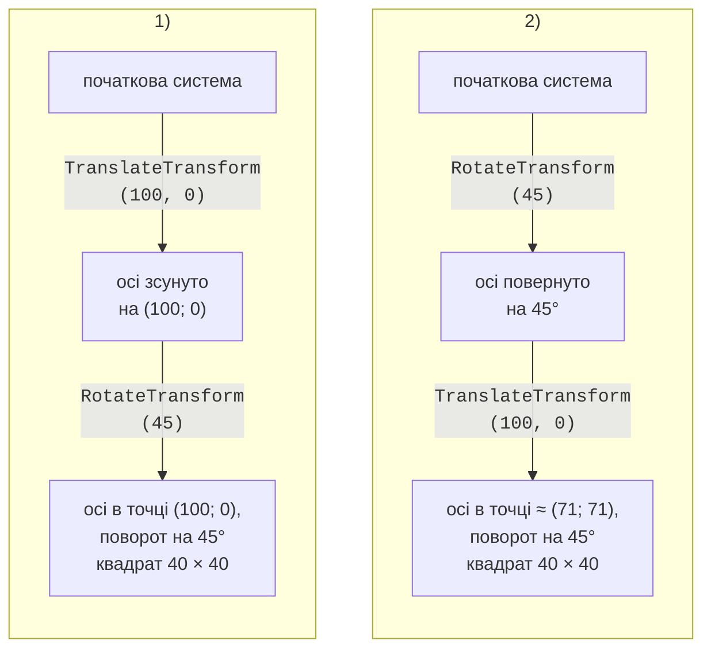

# Фігури, текст і перетворення

## Фігури

Основні методи `Graphics` для фігур наведено в табл. 4.2. Кожен метод `Draw…` має пару `Fill…`, крім ліній і кривих Безьє, які не мають внутрішньої частини. Усі методи мають перевантаження з цілими (`int`, `Point`, `Rectangle`) і дробовими (`float`, `PointF`, `RectangleF`) координатами.

Таблиця 4.2. Методи малювання фігур {.caption}

| **Метод** | **Що малює** |
| --- | --- |
| `DrawLine`, `DrawLines` | відрізок; ламану за масивом точок |
| `DrawRectangle`, `FillRectangle` | прямокутник (`x`, `y` – лівий верхній кут) |
| `DrawRoundedRectangle` | прямокутник із заокругленими кутами (розмір заокруглення `Size`) |
| `DrawEllipse`, `FillEllipse` | еліпс, вписаний у прямокутник; коло, якщо ширина дорівнює висоті |
| `DrawArc` | дугу еліпса: початковий кут і кут розгортання в градусах |
| `DrawPie`, `FillPie` | сектор еліпса (для кругових діаграм) |
| `DrawPolygon`, `FillPolygon` | замкнений многокутник за масивом точок |
| `DrawBezier` | криву Безьє за чотирма точками: початок, дві керувальні, кінець |
| `DrawCurve`, `DrawClosedCurve` | гладку криву (кардинальний сплайн) через усі точки |
| `DrawPath`, `FillPath` | складену фігуру `GraphicsPath` |
| `Clear(color)` | заливає всю поверхню кольором |

Кути в `DrawArc` і `DrawPie` відраховуються в градусах **за годинниковою стрілкою** від додатного напрямку осі *X* (від «трьох годин»), бо вісь *Y* спрямована вниз. Тому кут −90° означає напрямок угору.

За замовчуванням похилі лінії та кола мають «сходинки» на краях. Властивість `g.SmoothingMode = SmoothingMode.AntiAlias` вмикає **згладжування** (*anti-aliasing*): крайні пікселі частково зафарбовуються, і лінії виглядають рівними. Згладжування трохи сповільнює малювання, але для звичайних застосунків це непомітно.

Кожну фігуру спочатку зафарбовують пензлем (`Fill…`), а потім обводять пером (`Draw…`), щоб заливка не перекривала контур:

```cs
g.SmoothingMode = SmoothingMode.AntiAlias;
using var outline = new Pen(Color.Black, 2);
using var hatch = new HatchBrush(HatchStyle.DiagonalCross,
    Color.DimGray, Color.White);
var rect = new Rectangle(20, 20, 130, 90);
g.FillRectangle(hatch, rect);          // спочатку заливка
g.DrawRectangle(outline, rect);        // потім контур
g.FillPie(Brushes.LightGray, 180, 20, 90, 90, -90, 270);
g.DrawPie(outline, 180, 20, 90, 90, -90, 270);
```

Сектор починається від кута −90° (угору) і займає 270° за годинниковою стрілкою, тобто три чверті круга.

## Текст

Текст виводить метод `DrawString`: рядок, шрифт `Font`, пензель і точка або прямокутник (<https://learn.microsoft.com/dotnet/api/system.drawing.graphics.drawstring>). **Шрифт** задається назвою гарнітури, розміром у пунктах і стилем `FontStyle` (`Bold`, `Italic`, `Underline`, `Strikeout`, які можна поєднувати операцією `|`). Властивість форми `Font` – шрифт за замовчуванням, його не звільняють.

Якщо передати прямокутник, текст автоматично переноситься за словами, а об’єкт **`StringFormat`** задає вирівнювання та обрізання (<https://learn.microsoft.com/dotnet/api/system.drawing.stringformat>):

```cs
using var font = new Font("Segoe UI", 12);
var box = new RectangleF(20, 20, 180, 70);
using var format = new StringFormat
{
    Alignment = StringAlignment.Center,     // по горизонталі
    LineAlignment = StringAlignment.Center, // по вертикалі
    Trimming = StringTrimming.EllipsisWord  // «…», якщо не вмістився
};
g.DrawRectangle(Pens.Black, Rectangle.Round(box));
g.DrawString("GDI+ wraps long text inside the rectangle",
    font, Brushes.Black, box, format);
```

Значення `StringAlignment.Near` означає лівий (верхній) край, `Center` – центр, `Far` – правий (нижній) край. Щоб розташувати текст точно (по центру стовпчика діаграми, праворуч від осі), потрібно знати його розмір. Метод **`MeasureString`** повертає розмір рядка `SizeF` для заданого шрифту:

```cs
SizeF size = g.MeasureString("Hello, GDI+!", font);
float x = center.X - size.Width / 2;       // центр тексту в точці
float y = center.Y - size.Height / 2;
g.DrawString("Hello, GDI+!", font, Brushes.Black, x, y);
```

Для шрифту Segoe UI 12 пт рядок «Hello, GDI+!» має розмір 94,6 × 23,3 пікселя: `MeasureString` додає невеликі поля ліворуч і праворуч, тому текст, вирівняний за цим розміром, виглядає трохи зсунутим.

Windows Forms має й інший спосіб виведення тексту – клас **`TextRenderer`** з методами `DrawText` і `MeasureText` (<https://learn.microsoft.com/dotnet/api/system.windows.forms.textrenderer>). Він використовує старішу бібліотеку GDI, так само, як стандартні елементи керування, тому текст виглядає однаково з написами на кнопках і мітках. Практичне правило: `TextRenderer` – для тексту у власних елементах керування на екрані; `DrawString` – для малюнків, які зберігаються в `Bitmap`, друкуються або масштабуються перетвореннями (`TextRenderer` не підтримує поворот і масштабування `Graphics` і погано малює на прозорому `Bitmap`).

## Перетворення координат

Замість того щоб перераховувати координати кожної точки, можна змінити саму систему координат `Graphics`. Методи **перетворень** (*transformations*) (<https://learn.microsoft.com/dotnet/desktop/winforms/advanced/coordinate-systems-and-transformations>):

- `TranslateTransform(dx, dy)` – перенести початок координат;
- `RotateTransform(angle)` – повернути осі на кут у градусах (за годинниковою стрілкою);
- `ScaleTransform(sx, sy)` – змінити масштаб осей; від’ємний множник дзеркально відбиває вісь;
- `ResetTransform()` – повернути початкову систему.

Після перетворення всі методи малювання працюють у новій системі. Наприклад, циферблат годинника зручно малювати, коли початок координат у центрі: поділку малюють один раз угорі й повертають систему на 6°.

### Порядок перетворень

Кожен наступний виклик змінює **уже перетворену** систему. Тому порядок має значення (рис. 4.4):

1. `TranslateTransform(100, 0)`, потім `RotateTransform(45)`: початок переноситься в точку (100; 0), а потім осі повертаються навколо нового початку. Квадрат лежить у точці (100; 0), повернутий на 45°;
2. `RotateTransform(45)`, потім `TranslateTransform(100, 0)`: спочатку повертаються осі, а перенесення на 100 пікселів виконується вздовж **повернутої** осі *x*. Квадрат опиняється в точці (70,7; 70,7).



Рис. 4.4. Порядок перетворень координат: квадрат 40 × 40 у кінцевій системі {.caption}

### Клас `Matrix`, `Save` і `Restore`

Усі перетворення зберігаються в матриці 3 × 3 класу **`Matrix`** (<https://learn.microsoft.com/dotnet/api/system.drawing.drawing2d.matrix>). Поточну матрицю повертає і змінює властивість `g.Transform`. Об’єкт `Matrix` має ті самі методи `Translate`, `Rotate`, `Scale` і, крім того, метод `TransformPoints`, який перетворює масив точок. Так можна перевести математичні координати в пікселі, не змінюючи `Graphics`: лінії та текст при цьому не масштабуються і не відбиваються.

Якщо потрібно тимчасово змінити систему (повернути одну стрілку годинника), її стан запам’ятовують методом `g.Save()` і відновлюють методом `g.Restore(state)`:

```cs
GraphicsState state = g.Save();   // запам’ятати систему
g.RotateTransform(angle);
g.DrawLine(pen, 0, 0, 0, -length);
g.Restore(state);                 // повернути систему
```

::: tip Увага
Після `ScaleTransform(1, -1)` вісь *y* спрямована вгору, але текст і зображення теж відбиваються і малюються «догори дриґом», а товщина пера масштабується разом з осями. Тому графіки зручніше будувати так, як у прикладі «Графік функції»: перетворити точки матрицею, а малювати в екранній системі.
:::

### Приклад «Графік функції»

Застосунок будує графік функції *y* = sin(*x*) · *x* на відрізку [−10; 10] з осями та підписами. Під час зміни розміру вікна графік масштабується до нового розміру (рис. 4.5).

```cs
using System.Drawing.Drawing2D;

namespace Graph;

public class MainForm : Form
{
    // Видима частина математичної площини.
    private const float XMin = -10, XMax = 10;
    private const float YMin = -10, YMax = 10;

    public MainForm()
    {
        Text = "Function Graph: y = sin(x) * x";
        ClientSize = new Size(600, 500);
        MinimumSize = new Size(300, 250);
        BackColor = Color.White;
        DoubleBuffered = true;
        ResizeRedraw = true;
    }
```

Поле для графіка – клієнтська область без смуг по 30 пікселів з кожного боку, де розміщуються підписи поділок:

```cs
protected override void OnPaint(PaintEventArgs e)
{
    base.OnPaint(e);
    Rectangle area = ClientRectangle;
    area.Inflate(-30, -30);          // поля для підписів
    DrawGraph(e.Graphics, area);
}
```

Матриця переводить точку математичної площини в пікселі прямокутника `area`. Методи `Matrix` за замовчуванням застосовуються до точки у **зворотному** порядку виклику, так само як виклики `Graphics` на рис. 4.4: останнє перенесення виконується першим.

```cs
private static Matrix CreateMatrix(Rectangle area)
{
    float sx = area.Width / (XMax - XMin);
    float sy = area.Height / (YMax - YMin);
    var m = new Matrix();
    m.Translate(area.Left, area.Top);  // 3) до поля area
    m.Scale(sx, -sy);                  // 2) масштаб, Y угору
    m.Translate(-XMin, -YMax);         // 1) (XMin; YMax) у 0
    return m;
}
```

Метод `DrawGraph` обчислює точки кривої в математичних координатах і перетворює весь масив одним викликом `TransformPoints`:

```cs
public static void DrawGraph(Graphics g, Rectangle area)
{
    g.SmoothingMode = SmoothingMode.AntiAlias;
    using Matrix m = CreateMatrix(area);
    DrawAxes(g, m);

    const int Segments = 400;
    var points = new PointF[Segments + 1];
    for (int i = 0; i <= Segments; i++)
    {
        float x = XMin + (XMax - XMin) * i / Segments;
        points[i] = new PointF(x, MathF.Sin(x) * x);
    }
    m.TransformPoints(points);         // у пікселі
    using var pen = new Pen(Color.Black, 2.5f);
    g.DrawLines(pen, points);
}
```

Точка (−10; 10) потрапляє в лівий верхній кут поля, а (10; −10) – у правий нижній. Крива складається з 400 відрізків, чого досить, щоб вона виглядала гладкою. Осі, поділки та підписи малюються тим самим способом:

```cs
    private static void DrawAxes(Graphics g, Matrix m)
    {
        using var font = new Font("Segoe UI", 8);
        using var axis = new Pen(Color.Black, 1.5f);
        axis.EndCap = LineCap.ArrowAnchor;

        for (int v = -10; v <= 10; v += 2)   // поділки й підписи
        {
            if (v == 0) continue;
            PointF[] p = [new(v, 0), new(0, v)];
            m.TransformPoints(p);
            g.DrawLine(Pens.Black, p[0].X, p[0].Y - 3,
                p[0].X, p[0].Y + 3);
            g.DrawLine(Pens.Black, p[1].X - 3, p[1].Y,
                p[1].X + 3, p[1].Y);
            DrawLabel(g, v.ToString(), font, p[0].X, p[0].Y + 12);
            DrawLabel(g, v.ToString(), font, p[1].X - 14, p[1].Y);
        }

        PointF[] ends = [new(XMin, 0), new(XMax, 0),
                         new(0, YMin), new(0, YMax)];
        m.TransformPoints(ends);
        g.DrawLine(axis, ends[0], ends[1]);
        g.DrawLine(axis, ends[2], ends[3]);
        DrawLabel(g, "x", font, ends[1].X + 10, ends[1].Y);
        DrawLabel(g, "y", font, ends[3].X, ends[3].Y - 10);
    }

    // Текст із центром у точці (x; y).
    private static void DrawLabel(Graphics g, string text,
        Font font, float x, float y)
    {
        SizeF size = g.MeasureString(text, font);
        g.DrawString(text, font, Brushes.Black,
            x - size.Width / 2, y - size.Height / 2);
    }
}
```


Рис. 4.5. Застосунок «Графік функції» {.caption}

## Складені фігури: `GraphicsPath` і `Region`

Клас **`GraphicsPath`** (контур) об’єднує лінії, криві, фігури та навіть текст в одну фігуру (<https://learn.microsoft.com/dotnet/api/system.drawing.drawing2d.graphicspath>). Фігури додаються методами `AddLine`, `AddRectangle`, `AddRoundedRectangle`, `AddEllipse`, `AddArc`, `AddPolygon`, `AddBezier`, `AddString`; метод `CloseFigure` замикає поточну фігуру. Готовий контур малюють методами `DrawPath` і `FillPath`:

```cs
using var path = new GraphicsPath();
path.AddEllipse(20, 20, 100, 100);
path.AddRoundedRectangle(new Rectangle(140, 40, 120, 60),
    new Size(20, 20));
path.AddString("GDI+", FontFamily.GenericSansSerif,
    (int)FontStyle.Bold, 60, new Point(20, 120),
    StringFormat.GenericDefault);
using var hatch = new HatchBrush(HatchStyle.LargeCheckerBoard,
    Color.Gray, Color.White);
g.FillPath(hatch, path);             // одна заливка на всі фігури
g.DrawPath(Pens.Black, path);
```

Контур корисний не лише для малювання, а й для **перевірки влучання** (*hit testing*) – чи потрапив курсор миші у фігуру:

- `path.IsVisible(point)` – точка лежить усередині замкненої фігури;
- `path.IsOutlineVisible(point, pen)` – точка лежить на лінії контуру, намальованій пером `pen` (широке перо дає «зону захоплення» для тонких ліній);
- `path.GetBounds()` – прямокутник, що обмежує контур.

Для кола, вписаного в квадрат (20; 20)–(140; 140), `IsVisible(80, 80)` повертає `True`, а `IsVisible(25, 25)` – `False`: кут квадрата лежить поза колом, хоча й усередині прямокутника `GetBounds()`.

**Регіон** `Region` – область площини, яку можна будувати з прямокутників і контурів операціями `Union` (об’єднання), `Intersect` (перетин), `Exclude` (віднімання) і `Xor` (<https://learn.microsoft.com/dotnet/api/system.drawing.region>). Регіон використовують для **відсікання** (*clipping*): після присвоєння `g.Clip` малювання відбувається лише всередині регіону, решта ігнорується.

```cs
using var ellipse = new GraphicsPath();
ellipse.AddEllipse(20, 20, 220, 140);
using var region = new Region(ellipse);
region.Exclude(new Rectangle(100, 60, 60, 60)); // «дірка»
g.Clip = region;                        // малювати лише тут
for (int x = 0; x < 400; x += 8)
    g.DrawLine(Pens.Black, x, 0, x - 180, 180);
g.ResetClip();
g.DrawPath(Pens.Black, ellipse);
```

Похилі лінії заповнюють лише еліпс без квадратного отвору в центрі. Відсікання використовують, щоб графік не виходив за межі поля, щоб перемальовувати лише змінену частину або щоб створювати фігурні вікна (властивість форми `Region`).
