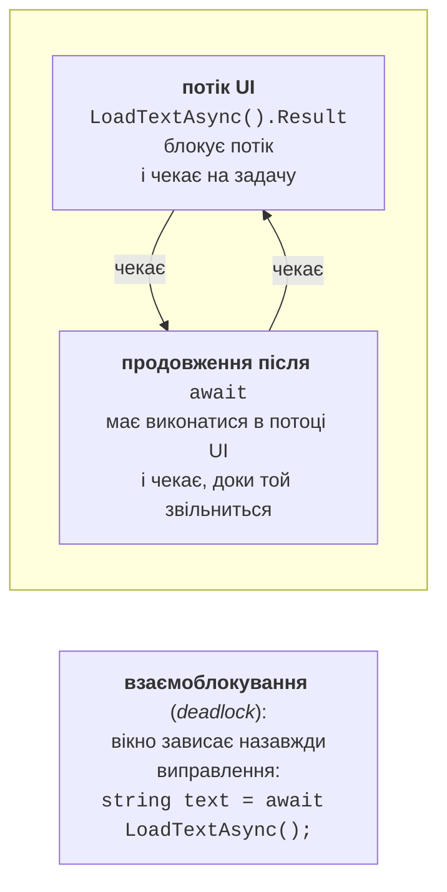
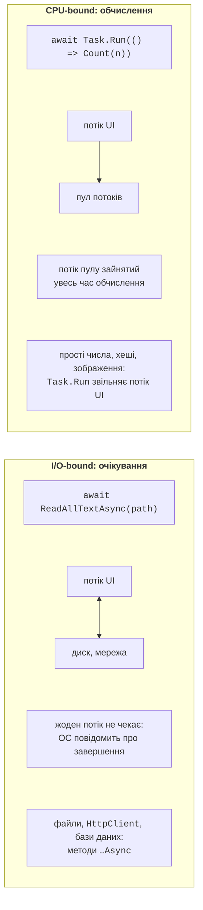
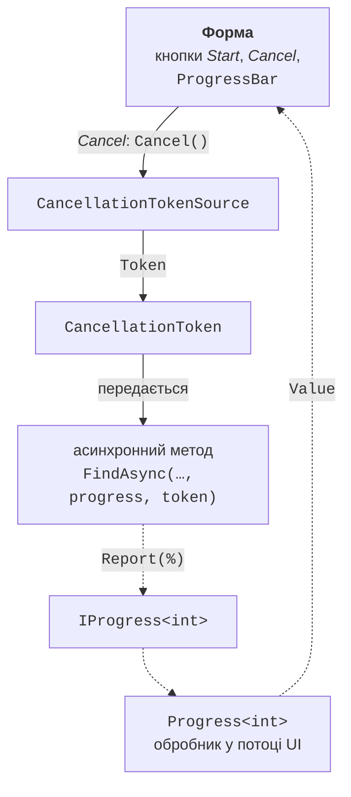

# Контекст, обчислення та скасування

## Контекст синхронізації

### Куди повертається `await`

Після `await` продовження обробника виконується в потоці інтерфейсу, хоча задача працювала деінде. Це забезпечує **контекст синхронізації** (*synchronization context*) – об’єкт класу, похідного від `SynchronizationContext`, який уміє передати делегат «своєму» потоку. Windows Forms встановлює для потоку інтерфейсу `WindowsFormsSynchronizationContext`: він ставить продовження в чергу повідомлень, і цикл повідомлень виконує його як звичайне повідомлення. Оператор `await` запам’ятовує поточний контекст (властивість `SynchronizationContext.Current`) і, якщо контекст є, відправляє продовження через нього (<https://learn.microsoft.com/dotnet/api/system.threading.synchronizationcontext>).

Консольна програма контексту синхронізації не має, тому продовження виконується в будь-якому потоці пулу. Це легко побачити, якщо вивести номер потоку до та після `await`:

```cs
Console.WriteLine(Where("before await"));
await Task.Delay(100);
Console.WriteLine(Where("after await"));
await Task.Delay(100);
Console.WriteLine(Where("after 2nd await"));

static string Where(string point)
{
    string context =
        SynchronizationContext.Current?.GetType().Name ?? "none";
    int thread = Environment.CurrentManagedThreadId;
    return $"{point}: thread {thread}, context {context}";
}
```

```
before await: thread 2, context none
after await: thread 5, context none
after 2nd await: thread 5, context none
```

Той самий метод `Where` в обробнику кнопки форми дає інший результат:

```cs
private async void threadsButton_Click(object sender, EventArgs e)
{
    List<string> log = [Where("before await")];
    await Task.Delay(100);
    log.Add(Where("after await"));
    int worker = await Task.Run(
        () => Environment.CurrentManagedThreadId);
    log.Add($"inside Task.Run: thread {worker}");
    await Task.Delay(100).ConfigureAwait(false);
    log.Add(Where("after ConfigureAwait(false)"));
    // Тут ми не в потоці UI: елементи керування – лише так:
    await logTextBox.InvokeAsync(
        () => logTextBox.Lines = [.. log]);
}
```

```
before await: thread 2, context WindowsFormsSynchronizationContext
after await: thread 2, context WindowsFormsSynchronizationContext
inside Task.Run: thread 6
after ConfigureAwait(false): thread 8, context none
```

Після звичайного `await` обробник залишився в потоці інтерфейсу (номер 2), делегат `Task.Run` працював у потоці пулу, а виклик `ConfigureAwait(false)` вимкнув повернення в контекст: продовження опинилося в потоці пулу, де звертатися до `logTextBox` напряму вже не можна.

### Звернення до елементів керування з іншого потоку

Елементи керування Windows Forms можна змінювати лише в потоці, який їх створив. Якщо код у `Task.Run` присвоює `resultLabel.Text`, під час налагодження виникає виняток `InvalidOperationException` з повідомленням *Cross-thread operation not valid: Control 'resultLabel' accessed from a thread other than the thread it was created on* (рис. 5.5). Без налагоджувача перевірка за замовчуванням вимкнена, але помилка від цього не зникає: такий код час від часу пошкоджує стан елемента або «зависає» (<https://learn.microsoft.com/dotnet/desktop/winforms/controls/how-to-make-thread-safe-calls>).


Рис. 5.5. Виняток під час звернення до елемента керування з іншого потоку {.caption}

Найкраще виправлення – не звертатися до форми з фонового коду: повернути результат із задачі й показати його після `await`, а проміжні дані передавати через `IProgress<T>` (розділ «Перебіг операції та скасування»). Якщо ж фоновому коду все-таки потрібен елемент керування, виклик передають у потік інтерфейсу:

- `control.Invoke(delegate)` – синхронно: фоновий потік чекає, доки потік інтерфейсу виконає делегат;
- `control.BeginInvoke(delegate)` – ставить делегат у чергу й не чекає;
- `await control.InvokeAsync(…)` (.NET 9+) – ставить делегат у чергу й повертає задачу, яку можна дочекатися; розглянуто в розділі «Асинхронні методи Windows Forms».

Властивість `control.InvokeRequired` повертає `true`, якщо поточний потік не є потоком елемента.

### `ConfigureAwait(false)` і взаємоблокування

Метод `task.ConfigureAwait(false)` означає «продовження не потребує контексту». Його пишуть у **бібліотеках** (класах, що не працюють з інтерфейсом): продовження виконується в потоці пулу, не займаючи чергу потоку інтерфейсу. У коді форми після `ConfigureAwait(false)` звертатися до елементів керування не можна, тому в обробниках подій його не використовують (<https://learn.microsoft.com/dotnet/api/system.threading.tasks.task.configureawait>).

Класична помилка – синхронно дочекатися асинхронного методу в потоці інтерфейсу:

```cs
private void loadButton_Click(object sender, EventArgs e)
{
    string text = LoadTextAsync().Result;   // взаємоблокування!
    statusLabel.Text = text;
}

private async Task<string> LoadTextAsync()
{
    await Task.Delay(500);
    return "Loaded";
}
```

Властивість `Result` блокує потік інтерфейсу, доки задача не завершиться. Задача ж завершиться лише тоді, коли її продовження після `await Task.Delay(500)` виконається в потоці інтерфейсу, а той заблокований. Обидві сторони чекають одна на одну вічно – виникає **взаємоблокування** (*deadlock*) (рис. 5.6). У тестовому запуску потік інтерфейсу залишався заблокованим і через 3 секунди, хоча затримка – лише 0,5 с. Якщо в `LoadTextAsync` написати `await Task.Delay(500).ConfigureAwait(false)`, блокування зникає, але потік інтерфейсу однаково стоїть 0,5 с. Правильне виправлення – «асинхронність до кінця» (*async all the way*): обробник стає `async void`, а замість `Result` – `await`.



Рис. 5.6. Взаємоблокування через `Result` у потоці інтерфейсу {.caption}

## Операції введення-виведення та обчислення

Для операцій введення-виведення .NET має справжні асинхронні методи: вони передають запит операційній системі й звільняють потік, а коли пристрій завершить роботу, задача отримує результат (рис. 5.7). Жоден потік не витрачається на очікування. Такі методи викликають напряму, без `Task.Run`:

- файли: `File.ReadAllTextAsync`, `File.WriteAllTextAsync`, `File.ReadAllLinesAsync`, `StreamReader.ReadLineAsync`, `Stream.ReadAsync`, `Stream.CopyToAsync` (<https://learn.microsoft.com/dotnet/standard/io/asynchronous-file-i-o>);
- мережа: `HttpClient.GetStringAsync`, `GetByteArrayAsync`, `GetStreamAsync` (<https://learn.microsoft.com/dotnet/api/system.net.http.httpclient>); REST-сервіси та JSON розглянуто в темі 10;
- бази даних: `ExecuteReaderAsync`, `ToListAsync` (теми 7–8).



Рис. 5.7. Операції введення-виведення та обчислення {.caption}

Приклад обробника, який завантажує сторінку й зберігає її у файл. Один об’єкт `HttpClient` створюють на весь застосунок (статичне поле), бо кожен новий клієнт відкриває нові мережеві з’єднання:

```cs
private static readonly HttpClient http = new();

private async void downloadButton_Click(object sender, EventArgs e)
{
    downloadButton.Enabled = false;
    try
    {
        string html = await http.GetStringAsync(urlTextBox.Text);
        await File.WriteAllTextAsync("page.html", html);
        statusLabel.Text = $"Saved {html.Length:N0} characters";
    }
    catch (HttpRequestException ex)
    {
        statusLabel.Text = $"Error: {ex.Message}";
    }
    finally
    {
        downloadButton.Enabled = true;
    }
}
```

Для адреси `https://learn.microsoft.com/dotnet/csharp/` напис показав `Saved 59 250 characters`, а для неіснуючої сторінки – `Error: Response status code does not indicate success: 404 (Not Found).` Копіювання великого файлу потоками виглядає так:

```cs
await using FileStream source = File.OpenRead(from);
await using FileStream target = File.Create(to);
await source.CopyToAsync(target, token);
```

Для **обчислень** асинхронних методів немає: процесор мусить виконати роботу в якомусь потоці. Тому в застосунку з інтерфейсом обчислення переносять у пул потоків через `await Task.Run(…)`, як у прикладі «Прості числа». `Task.Run` не пришвидшує обчислення, він лише звільняє потік інтерфейсу.

Бібліотечний метод, що обгортає синхронний код у `Task.Run` і називається `…Async`, – погана практика («async over sync»): він обманює того, хто викликає, і займає потік пулу. Бібліотека надає синхронний метод, а рішення про `Task.Run` приймає код інтерфейсу. І навпаки, якщо є асинхронна версія операції введення-виведення, використовуйте її, а не `Task.Run(() => File.ReadAllText(path))`.

## Перебіг операції та скасування

### `IProgress<T>` і `Progress<T>`

Щоб асинхронний метод повідомляв про перебіг, не знаючи нічого про форму, він приймає параметр інтерфейсу `IProgress<T>` з єдиним методом `Report(T value)`. Форма передає об’єкт класу `Progress<T>`, створений у потоці інтерфейсу з обробником:

```cs
var progress = new Progress<int>(p => progressBar.Value = p);
await ProcessAsync(files, progress);      // метод викликає Report
```

`Progress<T>` запам’ятовує контекст синхронізації в момент створення, тому обробник завжди виконується в потоці інтерфейсу, навіть якщо `Report` викликано з потоку пулу (<https://learn.microsoft.com/dotnet/api/system.progress-1>). Виклик `Report` не чекає на обробник: повідомлення ставиться в чергу. Звідси два наслідки: не викликайте `Report` тисячі разів за секунду (черга переповниться, інтерфейс гальмуватиме) і не покладайтеся на те, що останнє повідомлення оброблено до виходу з методу, тому підсумковий текст задають уже після `await`. Тип `T` може бути числом (відсоток) або записом з кількома полями: `record SearchProgress(int Percent, string File)`.

### Скасування: `CancellationTokenSource` і `CancellationToken`

Скасування в .NET **кооперативне**: операцію не зупиняють примусово, а просять зупинитися, і вона сама перевіряє прохання у зручних місцях (<https://learn.microsoft.com/dotnet/standard/threading/cancellation-in-managed-threads>). Учасники (рис. 5.8):

- `CancellationTokenSource` – джерело скасування у формі; метод `Cancel()` надсилає прохання, `CancelAfter(TimeSpan)` або конструктор `new CancellationTokenSource(TimeSpan)` задають тайм-аут; об’єкт реалізує `IDisposable`;
- `CancellationToken` – структура «лише для читання», яку отримують через властивість `Token` і передають в асинхронні методи параметром (за домовленістю – останнім, з назвою `cancellationToken` або `token`);
- асинхронний метод передає токен далі (`Task.Delay(ms, token)`, `ReadLineAsync(token)`, `Task.Run(…, token)`) або в циклі викликає `token.ThrowIfCancellationRequested()`.



Рис. 5.8. Скасування та звітування про перебіг {.caption}

Скасована операція завершується винятком `OperationCanceledException` (або його нащадком `TaskCanceledException`), а задача отримує стан `Canceled`. Обробник форми перехоплює цей виняток і показує «Canceled»: для користувача це не помилка. Наприклад, цикл із `Task.Delay(100, token)` і тайм-аутом 250 мс встигає виконати два кроки й завершується винятком `TaskCanceledException: A task was canceled.`, а обчислювальний цикл у `Task.Run` з `ThrowIfCancellationRequested` – `OperationCanceledException: The operation was canceled.`
