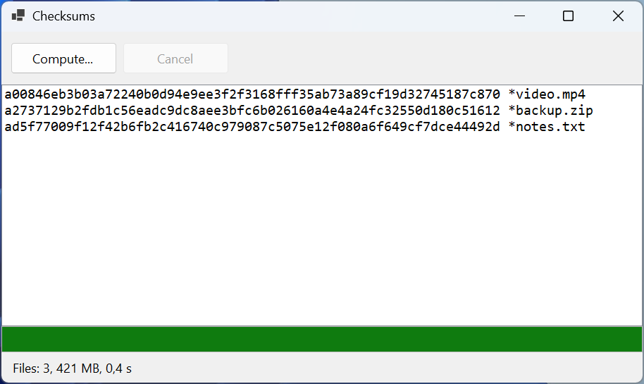

# Практика

Кожен приклад – проєкт *Windows Forms App* (.NET 10). Елементи керування розміщено в конструкторі форм, а їхні імена наведено в умові; обробники подій підписано у вікні *Properties*.

## Приклад 1. Контрольні суми файлів

Створити застосунок, який обчислює контрольні суми SHA-256 обраних файлів, не блокуючи інтерфейс. Індикатор показує перебіг за кількістю прочитаних байтів усіх файлів, кнопка *Cancel* зупиняє обчислення, а результат виводиться у форматі утиліти `sha256sum`: хеш, пробіл, `*` і ім’я файлу.

Форма містить панель `FlowLayoutPanel` з кнопками `computeButton` (*Compute…*) і `cancelButton` (*Cancel*), список `hashListBox` (`Dock = Fill`, шрифт Consolas), індикатор `progressBar`, напис `statusLabel` і компонент `openFileDialog` (`Multiselect = true`).

```cs
using System.Diagnostics;
using System.Security.Cryptography;

namespace Checksums;

public partial class MainForm : Form
{
    private const int BufferSize = 1024 * 1024;       // 1 МБ
    private CancellationTokenSource? cts;

    public MainForm()
    {
        InitializeComponent();
        cancelButton.Enabled = false;
    }

    private async void computeButton_Click(object sender, EventArgs e)
    {
        if (openFileDialog.ShowDialog(this) == DialogResult.OK)
        {
            await ComputeAsync(openFileDialog.FileNames);
        }
    }

    private void cancelButton_Click(object sender, EventArgs e) =>
        cts?.Cancel();

    private async Task ComputeAsync(string[] files)
    {
        long total = files.Sum(f => new FileInfo(f).Length);
        long done = 0;
        var progress = new Progress<int>(bytes =>
        {
            done += bytes;               // виконується в потоці UI
            progressBar.Value =
                (int)(done * 100 / Math.Max(total, 1));
        });
        hashListBox.Items.Clear();
        cts = new CancellationTokenSource();
        SetBusy(true);
        var watch = Stopwatch.StartNew();
        try
        {
            foreach (string file in files)
            {
                string hash = await Sha256Async(file, progress,
                    cts.Token);
                string name = Path.GetFileName(file);
                hashListBox.Items.Add($"{hash} *{name}");
            }
            double seconds = watch.Elapsed.TotalSeconds;
            statusLabel.Text = $"Files: {files.Length}, "
                + $"{total / BufferSize:N0} MB, {seconds:F1} s";
        }
        catch (OperationCanceledException)
        {
            statusLabel.Text = $"Canceled at {progressBar.Value} %";
        }
        catch (IOException ex)
        {
            statusLabel.Text = $"Error: {ex.Message}";
        }
        finally
        {
            cts.Dispose();
            cts = null;
            SetBusy(false);
        }
    }

    private static async Task<string> Sha256Async(string path,
        IProgress<int> progress, CancellationToken token)
    {
        await using var stream = new FileStream(path, FileMode.Open,
            FileAccess.Read, FileShare.Read, BufferSize,
            useAsync: true);
        using var sha = IncrementalHash.CreateHash(
            HashAlgorithmName.SHA256);
        byte[] buffer = new byte[BufferSize];
        int read;
        while ((read = await stream.ReadAsync(buffer, token)) > 0)
        {
            sha.AppendData(buffer, 0, read);
            progress.Report(read);
        }
        return Convert.ToHexStringLower(sha.GetHashAndReset());
    }

    private void SetBusy(bool busy)
    {
        computeButton.Enabled = !busy;
        cancelButton.Enabled = busy;
        if (busy)
        {
            progressBar.Value = 0;
            statusLabel.Text = "Computing...";
        }
    }
}
```

Файл читається асинхронно порціями по 1 МБ: параметр `useAsync: true` вмикає справжнє асинхронне введення-виведення Windows, а клас `IncrementalHash` обчислює хеш поступово, тому весь файл не завантажується в пам’ять. Метод `Report` викликається раз на мегабайт, а не на кожен байт. Змінна `done` змінюється лише в обробнику `Progress<int>`, тобто завжди в потоці інтерфейсу, тому синхронізація не потрібна. Логіку винесено в метод `ComputeAsync`, який повертає `Task`, а `async void` залишився лише в обробнику кнопки.

Для трьох файлів (300, 120 і 1 МБ) список містить рядки на кшталт `ac1af4da…8045a9a *video.mp4` (хеш має 64 шістнадцяткові цифри, тут скорочено), а рядок стану – `Files: 3, 421 MB, 0,6 s` (другий запуск, файли в кеші диска). Хеші збігаються зі значеннями `SHA256.HashData`. Натискання *Cancel* під час обчислення показує `Canceled at 41 %` (рис. 5.12).



Рис. 5.12. Застосунок «Контрольні суми файлів» {.caption}

## Приклад 2. Множина Мандельброта

Створити застосунок, який малює множину Мандельброта у фоновому потоці з відображенням перебігу. Клацання лівою кнопкою миші наближає зображення вдвічі навколо точки під курсором, правою – віддаляє. Якщо користувач клацає, поки кадр ще малюється, застарілий кадр скасовується. Точка *c* = *x* + *iy* належить множині (чорний колір), якщо послідовність *z* ← *z*<sup>2</sup> + *c* з *z* = 0 не виходить за коло радіуса 2 за 1000 кроків; решта точок мають відтінок сірого за кількістю кроків.

Форма містить `pictureBox` (`Dock = Fill`, подія `MouseClick`), індикатор `progressBar` і напис `statusLabel` (обидва `Dock = Bottom`).

```cs
using System.Diagnostics;

namespace Mandelbrot;

// Незмінна область площини: центр і розмір пікселя.
public record View(double X, double Y, double Scale);

public partial class MainForm : Form
{
    private const int MaxIterations = 1000;
    private View view = new(-0.5, 0, 0.004);
    private CancellationTokenSource? cts;

    public MainForm()
    {
        InitializeComponent();
        Shown += async (s, e) => await RenderAsync();
    }

    private async void pictureBox_MouseClick(object sender,
        MouseEventArgs e)
    {
        // Точка під курсором стає центром; ліва кнопка – наблизити.
        double x = view.X
            + (e.X - pictureBox.Width / 2.0) * view.Scale;
        double y = view.Y
            + (e.Y - pictureBox.Height / 2.0) * view.Scale;
        double zoom = e.Button == MouseButtons.Left ? 0.5 : 2;
        view = new View(x, y, view.Scale * zoom);
        await RenderAsync();
    }

    private async Task RenderAsync()
    {
        cts?.Cancel();                   // зупинити попередній кадр
        using var current = new CancellationTokenSource();
        cts = current;
        View frame = view;               // копія для фонового потоку
        Size size = pictureBox.ClientSize;
        var progress = new Progress<int>(p => progressBar.Value = p);
        var watch = Stopwatch.StartNew();
        try
        {
            Bitmap bitmap = await Task.Run(
                () => Draw(frame, size, progress, current.Token),
                current.Token);
            pictureBox.Image?.Dispose();
            pictureBox.Image = bitmap;
            statusLabel.Text = $"Scale {frame.Scale:E1}, "
                + $"{watch.ElapsedMilliseconds} ms";
        }
        catch (OperationCanceledException)
        {
            // Кадр застарів: уже малюється новий.
        }
        finally
        {
            if (cts == current)
            {
                cts = null;
            }
        }
    }

    private static Bitmap Draw(View v, Size size,
        IProgress<int> progress, CancellationToken token)
    {
        var bitmap = new Bitmap(size.Width, size.Height);
        try
        {
            for (int py = 0; py < size.Height; py++)
            {
                token.ThrowIfCancellationRequested();
                double y = v.Y + (py - size.Height / 2.0) * v.Scale;
                for (int px = 0; px < size.Width; px++)
                {
                    double x =
                        v.X + (px - size.Width / 2.0) * v.Scale;
                    int n = Iterations(x, y);
                    int c = n == MaxIterations ? 0 : 255 - n % 64 * 4;
                    bitmap.SetPixel(px, py, Color.FromArgb(c, c, c));
                }
                progress.Report((py + 1) * 100 / size.Height);
            }
            return bitmap;
        }
        catch
        {
            bitmap.Dispose();            // кадр не потрібен
            throw;
        }
    }

    private static int Iterations(double x, double y)
    {
        double zx = 0, zy = 0;
        int n = 0;
        while (n < MaxIterations && zx * zx + zy * zy <= 4)
        {
            (zx, zy) = (zx * zx - zy * zy + x, 2 * zx * zy + y);
            n++;
        }
        return n;
    }
}
```

Кожен кадр має власне джерело скасування `current`. Новий виклик `RenderAsync` скасовує попереднє джерело, і фонове малювання зупиняється на найближчому рядку пікселів (`ThrowIfCancellationRequested`), а його `await` завершується винятком `OperationCanceledException`, який просто ігнорується. Перевірка `cts == current` у `finally` не дає застарілому кадру обнулити джерело нового кадру.

Метод `Draw` статичний і отримує всі дані параметрами: область `View` – незмінний запис, скопійований до `Task.Run`. Якби фоновий код читав поле `view` форми, клацання під час малювання змінило б масштаб посеред кадру. Растрове зображення створюється у фоновому потоці, а в `PictureBox` потрапляє вже після `await`, у потоці інтерфейсу; попереднє зображення звільняється `Dispose`.

Для області 800 × 554 пікселі перший кадр малюється за `Scale 4,0E-003, 810 ms`. Після двох швидких клацань лівою кнопкою перший із двох нових кадрів скасовується, а напис показує лише останній: `Scale 1,0E-003, 1481 ms` (рис. 5.13).


Рис. 5.13. Застосунок «Множина Мандельброта» {.caption}

## Приклад 3. Пакетне зменшення фотографій

Створити застосунок, який зменшує всі фотографії `*.jpg` обраної папки до заданої ширини (пропорції зберігаються, менші фотографії не збільшуються) і зберігає їх у вкладену папку `small`. Одночасно обробляється не більше заданої кількості файлів. Пошкоджені файли не зупиняють роботу: наприкінці показується список помилок. Та сама кнопка під час роботи скасовує обробку.

Форма містить поле `folderTextBox`, поля `widthNumeric` (100–4000, значення 800) і `parallelNumeric` (1–16, значення 4), кнопку `startButton` (*Start*), список `errorsListBox`, індикатор `progressBar` і напис `statusLabel`. Обробку винесено в клас `PhotoResizer`:

```cs
using System.Collections.Concurrent;
using System.Drawing.Drawing2D;
using System.Drawing.Imaging;

namespace Resize;

public record ResizeReport(int Done, string[] Errors);

public static class PhotoResizer
{
    public static async Task<ResizeReport> ResizeAllAsync(
        string[] files, string outputFolder, int maxWidth,
        int maxParallel, IProgress<int> progress,
        CancellationToken token)
    {
        Directory.CreateDirectory(outputFolder);
        var errors = new ConcurrentBag<string>();
        int done = 0;
        var options = new ParallelOptions
        {
            MaxDegreeOfParallelism = maxParallel,
            CancellationToken = token
        };
        await Parallel.ForEachAsync(files, options,
            async (file, ct) =>
            {
                string name = Path.GetFileName(file);
                try
                {
                    string target = Path.Combine(outputFolder, name);
                    await ResizeAsync(file, target, maxWidth, ct);
                }
                catch (Exception ex) when (ex is IOException
                    or ArgumentException)
                {
                    errors.Add($"{name}: {ex.Message}");
                }
                progress.Report(Interlocked.Increment(ref done));
            });
        return new ResizeReport(done - errors.Count,
            [.. errors.Order()]);
    }

    private static async Task ResizeAsync(string source,
        string target, int maxWidth, CancellationToken token)
    {
        byte[] data = await File.ReadAllBytesAsync(source, token);
        using var input = new MemoryStream(data);
        using var original = new Bitmap(input);   // CPU-робота
        double k = Math.Min(1.0, (double)maxWidth / original.Width);
        int width = (int)(original.Width * k);
        int height = (int)(original.Height * k);
        using var result = new Bitmap(width, height);
        using (Graphics g = Graphics.FromImage(result))
        {
            g.InterpolationMode =
                InterpolationMode.HighQualityBicubic;
            g.DrawImage(original, 0, 0, width, height);
        }
        using var output = new MemoryStream();
        result.Save(output, ImageFormat.Jpeg);
        await File.WriteAllBytesAsync(target, output.ToArray(),
            token);
    }
}
```

Обробник кнопки форми:

```cs
private async void startButton_Click(object sender, EventArgs e)
{
    if (cts is not null)            // друге натискання – Cancel
    {
        cts.Cancel();
        return;
    }
    string folder = folderTextBox.Text;
    if (!Directory.Exists(folder))
    {
        MessageBox.Show("Folder not found.", Text);
        return;
    }
    string[] files = Directory.GetFiles(folder, "*.jpg");
    progressBar.Maximum = Math.Max(files.Length, 1);
    progressBar.Value = 0;
    var progress = new Progress<int>(n => progressBar.Value = n);
    errorsListBox.Items.Clear();
    cts = new CancellationTokenSource();
    startButton.Text = "&Cancel";
    var watch = Stopwatch.StartNew();
    try
    {
        ResizeReport report = await PhotoResizer.ResizeAllAsync(
            files, Path.Combine(folder, "small"),
            (int)widthNumeric.Value, (int)parallelNumeric.Value,
            progress, cts.Token);
        errorsListBox.Items.AddRange(report.Errors);
        statusLabel.Text = $"Resized: {report.Done}, errors: "
            + $"{report.Errors.Length}, "
            + $"{watch.ElapsedMilliseconds} ms";
    }
    catch (OperationCanceledException)
    {
        statusLabel.Text = "Canceled";
    }
    finally
    {
        cts.Dispose();
        cts = null;
        startButton.Text = "&Start";
    }
}
```

Поле `cts` класу форми (`private CancellationTokenSource? cts;`) водночас є ознакою «операція триває»: повторне натискання кнопки під час обробки не запускає другу обробку, а скасовує першу.

`Parallel.ForEachAsync` викликає тіло циклу в потоках пулу, тому декодування та масштабування зображень (обчислення) не займають потік інтерфейсу, а читання й запис файлів асинхронні. Тіло виконується в кількох потоках одночасно, тому спільні дані захищено: помилки збираються в потокобезпечну колекцію `ConcurrentBag<T>`, а лічильник збільшується атомарно методом `Interlocked.Increment`. Виняток пошкодженого файлу перехоплюється всередині тіла й не зупиняє цикл; скасування через `options.CancellationToken` зупиняє запуск нових файлів, і `ForEachAsync` кидає `OperationCanceledException`.

Для 40 фотографій 4000 × 3000 і двох пошкоджених файлів (текстовий і порожній) рядок стану показав `Resized: 40, errors: 2, 2951 ms` для одного потоку і `Resized: 40, errors: 2, 2315 ms` для чотирьох; список помилок містить `IMG_0041.jpg: Parameter is not valid.` та `IMG_0042.jpg: Parameter is not valid.`, а зменшені файли мають розмір 800 × 600 (рис. 5.14). Прискорення невелике, бо GDI+ усередині обробляє частину операцій послідовно: паралельність не пришвидшує код автоматично, її ефект слід вимірювати. Натискання *Cancel* посеред обробки показує `Canceled`.


Рис. 5.14. Застосунок «Пакетне зменшення фотографій» {.caption}
