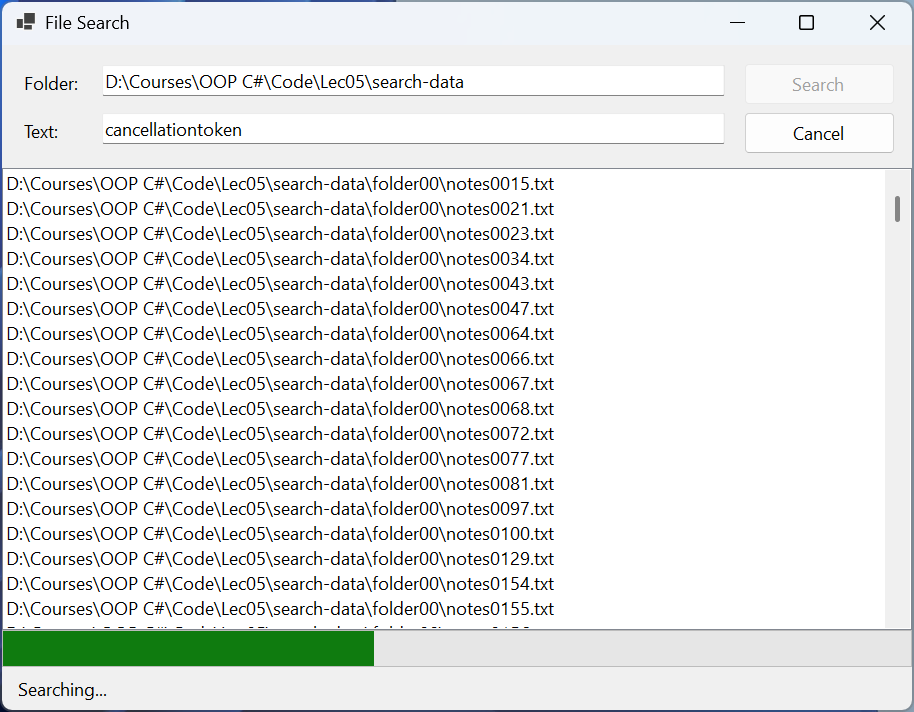

# Асинхронні потоки та кілька задач

## Асинхронні потоки даних

Метод, що повертає `Task<List<string>>`, віддає результати лише всі разом у кінці. Якщо результати з’являються поступово (рядки файлу, знайдені файли, повідомлення з мережі), зручніше **асинхронний потік** (*async stream*) – метод `async IAsyncEnumerable<T>`, який може одночасно використовувати `await` і `yield return`. Його перебирають циклом `await foreach`: кожна ітерація чекає наступного значення, не блокуючи потік (<https://learn.microsoft.com/dotnet/csharp/asynchronous-programming/generate-consume-asynchronous-stream>).

Токен скасування в асинхронний потік передають параметром з атрибутом `[EnumeratorCancellation]` (простір імен `System.Runtime.CompilerServices`). Тоді токен працює й тоді, коли його передано не у виклик методу, а через `stream.WithCancellation(token)`.

### Приклад «Пошук файлів»

Застосунок шукає в папці та її підпапках текстові файли `*.txt`, що містять заданий рядок без урахування регістру, показує знайдені файли одразу, відображає перебіг і дає змогу скасувати пошук. Пошук винесено в статичний клас `FileSearcher`, який нічого не знає про форму:

```cs
using System.Runtime.CompilerServices;

namespace FileSearch;

public static class FileSearcher
{
    // Повертає файли *.txt, що містять text, по одному,
    // щойно файл знайдено; percent – перебіг у відсотках.
    public static async IAsyncEnumerable<string> FindAsync(
        string folder, string text, IProgress<int>? percent,
        [EnumeratorCancellation] CancellationToken token = default)
    {
        string[] files = await Task.Run(() => Directory.GetFiles(
            folder, "*.txt", SearchOption.AllDirectories), token);
        for (int i = 0; i < files.Length; i++)
        {
            token.ThrowIfCancellationRequested();
            if (await ContainsAsync(files[i], text, token))
            {
                yield return files[i];
            }
            percent?.Report((i + 1) * 100 / files.Length);
        }
    }

    private static async Task<bool> ContainsAsync(
        string path, string text, CancellationToken token)
    {
        using var reader = new StreamReader(path);
        string? line;
        while ((line = await reader.ReadLineAsync(token)) is not null)
        {
            if (line.Contains(text,
                StringComparison.OrdinalIgnoreCase))
            {
                return true;
            }
        }
        return false;
    }
}
```

Метод `Directory.GetFiles` синхронний, а обхід великого дерева папок триває довго, тому його викликано в `Task.Run`. Файли читаються рядок за рядком асинхронним `ReadLineAsync`, і читання файлу припиняється на першому збігу.

Форма містить поля `folderTextBox` і `textTextBox`, кнопки `searchButton` (*Search*) і `cancelButton` (*Cancel*), список `resultsListBox` (`Dock = Fill`), індикатор `progressBar` і напис `statusLabel`; подію `FormClosing` форми пов’язано з обробником `MainForm_FormClosing`:

```cs
namespace FileSearch;

public partial class MainForm : Form
{
    private CancellationTokenSource? cts;

    public MainForm()
    {
        InitializeComponent();
        cancelButton.Enabled = false;
    }

    private async void searchButton_Click(object sender, EventArgs e)
    {
        resultsListBox.Items.Clear();
        progressBar.Value = 0;
        cts = new CancellationTokenSource();
        var progress = new Progress<int>(p => progressBar.Value = p);
        searchButton.Enabled = false;
        cancelButton.Enabled = true;
        statusLabel.Text = "Searching...";
        try
        {
            await foreach (string file in FileSearcher.FindAsync(
                folderTextBox.Text, textTextBox.Text, progress,
                cts.Token))
            {
                resultsListBox.Items.Add(file);
            }
            statusLabel.Text = $"Found: {resultsListBox.Items.Count}";
        }
        catch (OperationCanceledException)
        {
            statusLabel.Text =
                $"Canceled, found: {resultsListBox.Items.Count}";
        }
        catch (Exception ex) when (ex is IOException
            or UnauthorizedAccessException or ArgumentException)
        {
            statusLabel.Text = "Error";
            MessageBox.Show(ex.Message, Text,
                MessageBoxButtons.OK, MessageBoxIcon.Error);
        }
        finally
        {
            cts.Dispose();
            cts = null;
            searchButton.Enabled = true;
            cancelButton.Enabled = false;
        }
    }

    private void cancelButton_Click(object sender, EventArgs e) =>
        cts?.Cancel();

    private void MainForm_FormClosing(object sender,
        FormClosingEventArgs e) => cts?.Cancel();
}
```

Тіло `await foreach` виконується в потоці інтерфейсу, тому елемент додається в список напряму. Поле `cts` існує лише під час пошуку: кнопка *Cancel* і закриття форми скасовують поточну операцію, а `finally` звільняє джерело скасування. Скидання `progressBar.Value = 0` на початку потрібне, бо інакше після попереднього пошуку індикатор показував би 100 %.

Для перевірки створено 500 текстових файлів у 10 підпапках, 64 з них містять слово `CancellationToken`. Пошук рядка `cancellationtoken` показав `Found: 64` (за пів секунди, коли файли вже в кеші диска), а натискання *Cancel* на 40 % перебігу – `Canceled, found: 21` (рис. 5.9). Для неіснуючої папки `Directory.GetFiles` кидає `DirectoryNotFoundException` (нащадок `IOException`), і `await` передає його в обробник, який показує `MessageBox`.



Рис. 5.9. Пошук файлів із перебігом і скасуванням {.caption}

## Кілька задач одночасно

Незалежні операції вигідно запускати одночасно, а потім чекати на всі або на першу. Основні засоби наведено в табл. 5.2 (<https://learn.microsoft.com/dotnet/standard/asynchronous-programming-patterns/consuming-the-task-based-asynchronous-pattern>).

Таблиця 5.2. Засоби для роботи з кількома задачами {.caption}

| **Засіб** | **Призначення** |
| --- | --- |
| `Task.WhenAll(tasks)` | задача, що завершиться, коли завершаться всі; для `Task<T>` повертає масив результатів у порядку задач |
| `Task.WhenAny(tasks)` | задача, що завершиться разом із першою з задач; результат – сама ця задача |
| `Task.WhenEach(tasks)` | .NET 9+: `IAsyncEnumerable` задач у порядку їх завершення |
| `task.WaitAsync(timeout)` | чекати не довше заданого часу, інакше `TimeoutException` (сама операція при цьому не зупиняється) |
| `SemaphoreSlim` | обмежити кількість одночасних операцій: `await WaitAsync()` і `Release()` |
| `Parallel.ForEachAsync` | обробити колекцію кількома паралельними гілками з `MaxDegreeOfParallelism` |

Задача починає виконуватися в момент виклику методу, а `await` лише чекає на неї. Тому `await A(); await B();` виконує операції послідовно, а `Task a = A(); Task b = B(); await Task.WhenAll(a, b);` – одночасно. Приклади з трьома задачами, що завершуються через 300, 100 і 200 мс: `await Task.WhenAny(…)` повертає задачу на 100 мс (наприклад, найшвидше дзеркало сервера), а цикл `await foreach (Task<string> t in Task.WhenEach(tasks))` отримує результати в порядку B, C, A – так таблицю результатів заповнюють поступово.

Тайм-аут одного очікування задає `WaitAsync`, але зупинити саму операцію може лише токен: `new CancellationTokenSource(TimeSpan.FromSeconds(10))` скасовує все, що отримало його токен.

Необмежена кількість одночасних запитів перевантажує сервер і мережу, а одночасна обробка сотні великих зображень – пам’ять. `SemaphoreSlim(n)` – лічильник із `n` дозволами: `await gate.WaitAsync()` забирає дозвіл або асинхронно чекає на нього, `Release()` повертає дозвіл, тому одночасно працює не більше `n` операцій (<https://learn.microsoft.com/dotnet/api/system.threading.semaphoreslim>). Метод `Parallel.ForEachAsync` робить те саме для колекції, запускаючи тіло циклу в пулі потоків (<https://learn.microsoft.com/dotnet/api/system.threading.tasks.parallel.foreachasync>).

### Приклад «Завантаження сторінок»

Застосунок завантажує вебсторінки зі списку адрес одночасно, але не більше заданої кількості водночас, із загальним тайм-аутом, і показує таблицю з розміром, часом і станом кожної сторінки. Помилка однієї сторінки (наприклад, 404) не зупиняє інші:

```cs
using System.Diagnostics;

namespace Pages;

public record PageResult(string Url, int Kilobytes, long Ms,
    string Status);

public static class PageLoader
{
    private static readonly HttpClient http = new();

    public static async Task<PageResult[]> LoadAllAsync(
        IEnumerable<string> urls, int maxParallel,
        CancellationToken token)
    {
        using var gate = new SemaphoreSlim(maxParallel);
        Task<PageResult>[] tasks = urls
            .Select(url => LoadAsync(url, gate, token))
            .ToArray();                 // усі задачі запущено
        return await Task.WhenAll(tasks);
    }

    private static async Task<PageResult> LoadAsync(string url,
        SemaphoreSlim gate, CancellationToken token)
    {
        await gate.WaitAsync(token);    // не більше maxParallel
        var watch = Stopwatch.StartNew();
        try
        {
            byte[] data = await http.GetByteArrayAsync(url, token);
            return new PageResult(url, data.Length / 1024,
                watch.ElapsedMilliseconds, "OK");
        }
        catch (HttpRequestException ex)
        {
            string status = ex.StatusCode?.ToString() ?? ex.Message;
            return new PageResult(url, 0,
                watch.ElapsedMilliseconds, status);
        }
        finally
        {
            gate.Release();
        }
    }
}
```

Виклик `ToArray()` важливий: запит LINQ ледачий, і без нього задачі не були б створені до `WhenAll`. Форма містить багаторядкове поле адрес `urlsTextBox`, поля `parallelNumeric` (1–8) і `timeoutNumeric` (секунди), кнопку `loadButton`, таблицю `resultsGrid` і напис `statusLabel`. Обробник кнопки влаштовано так само, як у пошуку файлів: вимикає кнопку, створює `using var cts = new CancellationTokenSource(timeout)`, чекає `await PageLoader.LoadAllAsync(urls, parallel, cts.Token)`, присвоює масив результатів властивості `resultsGrid.DataSource` і показує підсумок; блок `catch (OperationCanceledException)` показує `Timeout: … s`, а `finally` вмикає кнопку.

`DataGridView` сам створює стовпці *Url*, *Kilobytes*, *Ms*, *Status* за властивостями запису. Для п’яти адрес (дві сторінки learn.microsoft.com, головні сторінки dotnet.microsoft.com і nuget.org та неіснуюча сторінка) після «розігріву» з’єднань напис показав `Loaded 4 of 5, 351 KB, 1 771 ms` для одного потоку і `Loaded 4 of 5, 351 KB, 558 ms` для чотирьох; рядок неіснуючої сторінки має стан `NotFound`. З тайм-аутом 1 с і одним потоком напис показав `Timeout: 1 s`. Розміри та час залежать від мережі та поточних версій сторінок.
