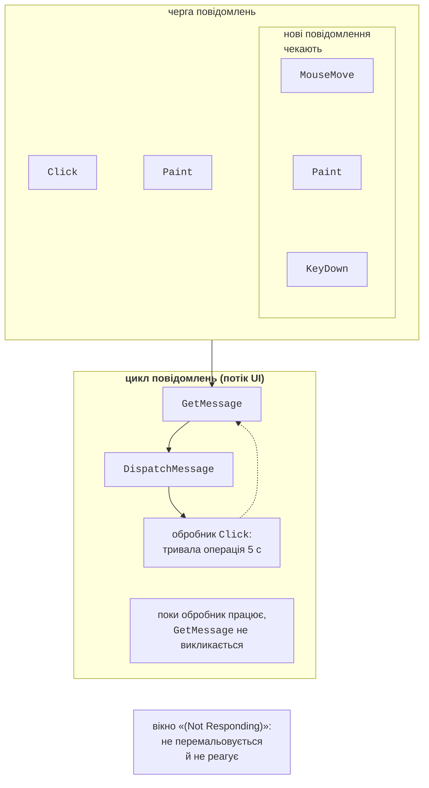
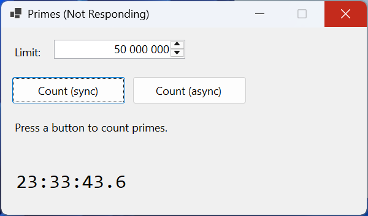
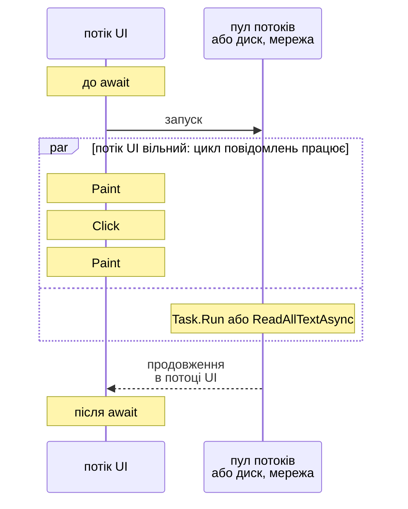
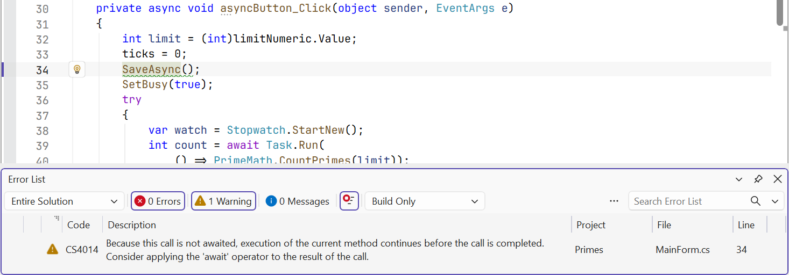

# Задачі, async і await

## Чому інтерфейс «зависає»

**Процес** (*process*) – запущена програма з власною пам’яттю. У процесі працює один або кілька **потоків** (*threads*) – послідовностей виконання коду, які операційна система по черзі надає ядрам процесора. Створення потоку дороге (пам’ять для стека, перемикання), тому .NET має **пул потоків** (*thread pool*) – набір готових робочих потоків, які виконують короткі завдання й повертаються в пул (<https://learn.microsoft.com/dotnet/standard/threading/the-managed-thread-pool>).

Застосунок Windows Forms має один **потік інтерфейсу** (*UI thread*): у ньому метод `Application.Run` запускає цикл повідомлень, створюються всі елементи керування й виконуються всі обробники подій (тема 3). Цикл вибирає з черги повідомлення (клацання, натискання клавіш, перемальовування) і викликає обробники по одному. Якщо обробник працює 5 секунд, усі ці 5 секунд повідомлення лише накопичуються в черзі (рис. 5.1).



Рис. 5.1. Тривалий обробник блокує цикл повідомлень потоку інтерфейсу {.caption}

Через кілька секунд Windows помічає, що вікно не обробляє повідомлення: заголовок отримує позначку «(Not Responding)», вміст стає блідим, а спроба закрити вікно пропонує завершити програму (рис. 5.2). Користувач не може навіть натиснути кнопку *Cancel*.



Рис. 5.2. Заблокований інтерфейс під час синхронної операції {.caption}

Операцію називають **синхронною** (*synchronous*), якщо код, що її викликав, чекає на завершення, і **асинхронною** (*asynchronous*), якщо виклик одразу повертає керування, а результат з’являється пізніше. Тривалі операції бувають двох видів:

- **операції введення-виведення** (*I/O-bound*) – читання файлу, запит до вебсервера чи бази даних: процесор майже не працює, програма чекає на пристрій або мережу;
- **обчислення** (*CPU-bound*) – пошук простих чисел, обробка зображень, хешування: процесор зайнятий увесь час.

В обох випадках потік інтерфейсу не повинен чекати. C# розв’язує це задачами `Task` і ключовими словами `async`/`await`; цей підхід називають **асинхронним шаблоном на основі задач** (*Task-based Asynchronous Pattern*, TAP) (<https://learn.microsoft.com/dotnet/csharp/asynchronous-programming/>).

## Задачі `Task` і `Task<T>`

**Задача** (*task*) – об’єкт, що представляє операцію, яка виконується зараз або завершиться пізніше. Клас `Task` (простір імен `System.Threading.Tasks`) описує операцію без результату, `Task<T>` – з результатом типу `T`. Задачу можна дочекатися, дізнатися її стан, отримати результат або виняток. Задачу не обов’язково виконує окремий потік: `Task.Delay(1000)` лише запускає системний таймер, а файлова задача чекає на сигнал від диска.

Основні способи отримати задачу:

- `Task.Run(() => …)` – поставити делегат у чергу пулу потоків (для обчислень);
- `Task.Delay(ms)` – задача, що завершиться через вказаний час (замість `Thread.Sleep`, який блокує потік);
- методи .NET, назви яких закінчуються на `Async`, наприклад `File.ReadAllTextAsync`, `HttpClient.GetStringAsync`, `Stream.CopyToAsync`;
- власні методи з модифікатором `async` (наступний розділ).

Стан задачі показує властивість `Status` (табл. 5.1). Властивості `IsCompleted`, `IsCompletedSuccessfully`, `IsFaulted` і `IsCanceled` перевіряють стан коротше.

Таблиця 5.1. Основні стани задачі {.caption}

| **Значення `TaskStatus`** | **Значення** |
| --- | --- |
| `WaitingForActivation` | задача чекає на зовнішню подію: таймер, введення-виведення, інші задачі (так виглядають задачі `async`-методів) |
| `WaitingToRun` | делегат `Task.Run` стоїть у черзі пулу потоків |
| `Running` | делегат виконується |
| `RanToCompletion` | задача успішно завершилася, результат доступний |
| `Faulted` | задача завершилася з винятком (властивість `Exception`) |
| `Canceled` | задачу скасовано через `CancellationToken` |

Наприклад, одразу після `Task.Run(…)` стан дорівнює `WaitingToRun`, після `await` – `RanToCompletion`, стан `Task.Delay(100)` – `WaitingForActivation`, задачі з винятком – `Faulted`.

Результат задачі можна отримати трьома способами: `await task`, властивістю `task.Result` або методом `task.Wait()`. Два останні **блокують** потік, що їх викликав, доки задача не завершиться. У потоці інтерфейсу це повертає нас до «зависання», а в поєднанні з `await` може призвести до взаємоблокування (розділ «Контекст синхронізації»). Крім того, `Wait()` і `Result` загортають виняток в `AggregateException`. Тому в застосунках з графічним інтерфейсом результат задачі отримують лише через `await`.

## Ключові слова `async` і `await`

### Як працює `await`

Модифікатор `async` дозволяє використовувати в методі оператор `await`. Оператор `await task` перевіряє, чи задача завершена. Якщо ні, метод **повертає керування** тому, хто його викликав, а решту методу, **продовження** (*continuation*), буде виконано після завершення задачі. Коли продовження починає працювати, `await` повертає результат задачі або кидає її виняток (<https://learn.microsoft.com/dotnet/csharp/asynchronous-programming/task-asynchronous-programming-model>).

Для обробника події це означає: код до першого `await` виконується в потоці інтерфейсу, потім обробник повертається в цикл повідомлень, і той обробляє перемальовування та клацання, а після завершення операції продовження знову виконується в потоці інтерфейсу (рис. 5.3). Жоден потік при цьому не «чекає» на задачу.



Рис. 5.3. Асинхронний обробник події на часовій шкалі {.caption}

Компілятор перетворює `async`-метод на **скінченний автомат** (*state machine*): прихований клас, який зберігає локальні змінні та номер кроку, а кожен `await` стає точкою, де метод може призупинитися й пізніше продовжитися. Тому код з `await` читається як звичайний послідовний код: цикли, `try`/`catch`, `using` працюють як завжди.

### Типи результату `async`-методу

`Async`-метод може повертати (<https://learn.microsoft.com/dotnet/csharp/asynchronous-programming/async-return-types>):

- `Task` – операція без результату: `async Task SaveAsync(…)`;
- `Task<T>` – операція з результатом: `async Task<int> CountAsync(…)`, а `return 42;` усередині задає результат задачі;
- `ValueTask` і `ValueTask<T>` – структури для методів, які часто завершуються без очікування (наприклад, беруть значення з кешу): вони економлять виділення пам’яті, але їх можна дочекатися лише один раз;
- `IAsyncEnumerable<T>` – асинхронний потік значень (розділ «Асинхронні потоки даних»);
- `void` – **лише для обробників подій**.

Метод `async void` неможливо дочекатися: той, хто його викликав, не знає, коли метод завершився, і не може перехопити його виняток. Обробник події має сигнатуру делегата `EventHandler`, яка повертає `void`, тому `private async void button_Click(…)` допустимий. Усі інші асинхронні методи повертають `Task` або `Task<T>` і мають суфікс `Async` у назві.

Якщо викликати метод, що повертає `Task`, і забути `await`, метод почне працювати, а код піде далі, не дочекавшись його завершення та пропустивши можливий виняток. Компілятор попереджає про це всередині `async`-методів попередженням CS4014 (рис. 5.4). Якщо задачу справді не потрібно чекати, її явно відкидають: `_ = SaveAsync();` (<https://learn.microsoft.com/dotnet/csharp/language-reference/compiler-messages/async-await-errors>).



Рис. 5.4. Попередження CS4014 про пропущений `await` {.caption}

### Приклад «Прості числа»

Форма містить поле `limitNumeric` (`NumericUpDown`, 2–100 000 000, значення 10 000 000, `ThousandsSeparator = true`), кнопки `syncButton` (*Count (sync)*) і `asyncButton` (*Count (async)*), написи `resultLabel` і `clockLabel` та таймер `clockTimer` з інтервалом 100 мс. Таймер показує поточний час і рахує свої спрацювання: якщо потік інтерфейсу вільний, за секунду таймер спрацьовує близько 10 разів. Обидві кнопки виконують ту саму обчислювальну роботу – підрахунок простих чисел перебором дільників:

```cs
using System.Diagnostics;

namespace Primes;

public partial class MainForm : Form
{
    private int ticks;       // скільки разів спрацював таймер

    public MainForm()
    {
        InitializeComponent();
        clockTimer.Start();  // Interval = 100 мс
    }

    private void clockTimer_Tick(object sender, EventArgs e)
    {
        ticks++;
        clockLabel.Text = DateTime.Now.ToString("HH:mm:ss.f");
    }

    private void syncButton_Click(object sender, EventArgs e)
    {
        int limit = (int)limitNumeric.Value;
        ticks = 0;
        var watch = Stopwatch.StartNew();
        int count = PrimeMath.CountPrimes(limit);  // UI заблоковано
        ShowResult(limit, count, watch.ElapsedMilliseconds);
    }

    private async void asyncButton_Click(object sender, EventArgs e)
    {
        int limit = (int)limitNumeric.Value;
        ticks = 0;
        SetBusy(true);
        try
        {
            var watch = Stopwatch.StartNew();
            int count = await Task.Run(
                () => PrimeMath.CountPrimes(limit));
            ShowResult(limit, count, watch.ElapsedMilliseconds);
        }
        finally
        {
            SetBusy(false);
        }
    }

    private void ShowResult(int limit, int count, long ms) =>
        resultLabel.Text = $"Primes up to {limit:N0}: {count:N0}"
            + $"\n{ms:N0} ms, timer ticks: {ticks}";

    private void SetBusy(bool busy)
    {
        syncButton.Enabled = !busy;
        asyncButton.Enabled = !busy;
        UseWaitCursor = busy;
    }
}

public static class PrimeMath
{
    public static int CountPrimes(int limit)
    {
        int count = 0;
        for (int n = 2; n <= limit; n++)
        {
            if (IsPrime(n))
            {
                count++;
            }
        }
        return count;
    }

    private static bool IsPrime(int n)
    {
        if (n % 2 == 0)
        {
            return n == 2;
        }
        for (int d = 3; (long)d * d <= n; d += 2)
        {
            if (n % d == 0)
            {
                return false;
            }
        }
        return true;
    }
}
```

Кнопка *Count (sync)* показує `Primes up to 10 000 000: 664 579` і `1 907 ms, timer ticks: 0`: під час підрахунку таймер не спрацював жодного разу, годинник зупинився, вікно не можна було перетягнути. Кнопка *Count (async)* дає той самий результат за `1 863 ms, timer ticks: 17`: обчислення виконував потік пулу, а потік інтерфейсу оновлював годинник і перемальовував вікно (час залежить від процесора).

Зверніть увагу на три правила, які повторюються в усіх прикладах лекції:

- значення елементів керування (`limitNumeric.Value`) читають **до** `Task.Run`: лямбда-вираз виконується в іншому потоці й не повинен звертатися до форми;
- на час операції кнопки вимикають, інакше повторне натискання запустить другу операцію, поки триває перша (**повторний вхід**, *reentrancy*);
- кнопки вмикають у блоці `finally`, щоб інтерфейс відновився й після винятку.
