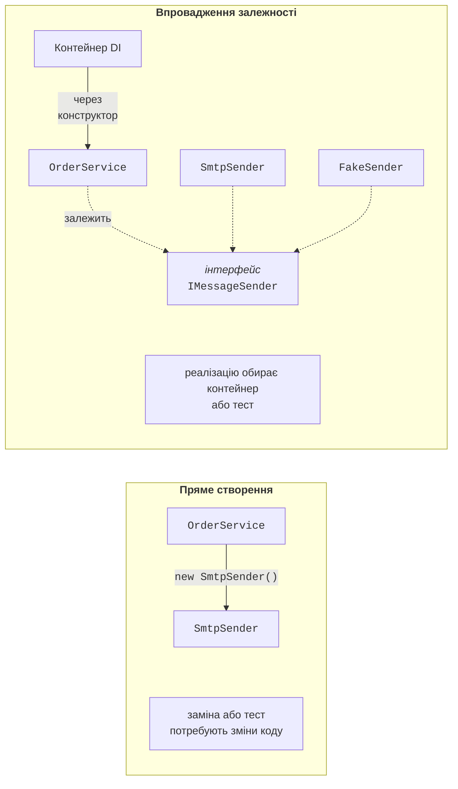
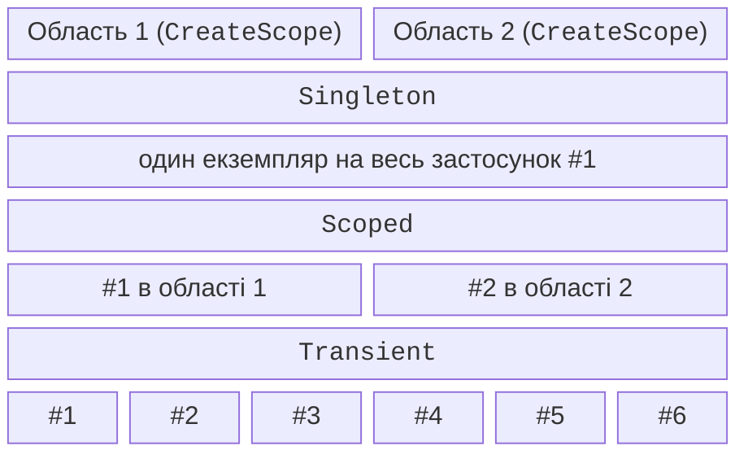

# Впровадження залежностей і контейнер

## Залежності та їх впровадження

Класи рідко працюють поодинці. Сервіс замовлень надсилає лист клієнтові, звіт читає дані з бази, форма звертається до сервісу збереження. Об’єкт, від якого залежить робота іншого об’єкта, називають **залежністю** (*dependency*). Найпростіше створити залежність прямо в класі:

```cs
public class OrderService
{
    private readonly SmtpSender sender = new("smtp.example.com");

    public void PlaceOrder(int id, string customer) =>
        sender.Send(customer, $"Замовлення {id} прийнято");
}
```

Такий код **сильно зв’язаний** (*tightly coupled*): `OrderService` знає конкретний клас, його конструктор і адресу сервера. Щоб надсилати SMS замість листів, доведеться змінювати `OrderService`; щоб перевірити його тестом, доведеться справді надсилати листи; а якщо `SmtpSender` сам потребує налаштувань і журналу, їх також створюватиме `OrderService`.

Розв’язок підказує **принцип інверсії залежностей** (*Dependency Inversion Principle*, літера D у SOLID): модулі верхнього рівня залежать від **абстракцій**, а не від конкретних класів. **Впровадження залежностей** (*dependency injection*, DI) – це прийом, за якого об’єкт **не створює** свої залежності, а отримує готові ззовні, найчастіше через параметри конструктора (*constructor injection*). Клас лише оголошує, що йому потрібно (рис. 6.1) (<https://learn.microsoft.com/dotnet/core/extensions/dependency-injection/overview>).



Рис. 6.1. Пряме створення залежності і її впровадження {.caption}

Об’єкти з’єднуються в одному місці на початку програми – **корені композиції** (*composition root*), зазвичай у `Program.cs`. Там же вирішується, яку реалізацію отримає кожен клас.

Протилежний підхід – **локатор служб** (*Service Locator*): клас сам звертається до глобального реєстру `ServiceLocator.Get<IMessageSender>()`. Такий код компілюється без явних залежностей у конструкторі, тому їх не видно ззовні, а помилка «сервіс не зареєстровано» проявляється лише під час виконання. Локатор служб вважають **антипатерном**; контейнер DI використовують лише в корені композиції.

### Приклад «Сервіс сповіщень»

Сервіс замовлень залежить від інтерфейсу `IMessageSender`. Програма з’єднує об’єкти трьома способами: вручну, контейнером і з фейковою реалізацією для перевірки. Контейнер підключається пакетом NuGet: `dotnet add package Microsoft.Extensions.DependencyInjection`.

```cs
using Microsoft.Extensions.DependencyInjection;

Console.OutputEncoding = System.Text.Encoding.UTF8;

// 1. Ручне впровадження: залежність передається в конструктор.
var manual = new OrderService(new EmailSender("shop@example.com"));
manual.PlaceOrder(1045, "olena@example.com");

// 2. Контейнер: реєстрація сервісів і автоматичне створення.
var services = new ServiceCollection();
services.AddSingleton<IMessageSender, SmsSender>();
services.AddTransient<OrderService>();

using ServiceProvider provider = services.BuildServiceProvider();
var orders = provider.GetRequiredService<OrderService>();
orders.PlaceOrder(1046, "+380671234567");

// 3. Фейкова реалізація для перевірки без реальних листів.
var fake = new FakeSender();
new OrderService(fake).PlaceOrder(1047, "test@example.com");
Console.WriteLine($"Фейк зберіг: {fake.Sent[0]}");

public interface IMessageSender
{
    void Send(string to, string text);
}

public class EmailSender(string from) : IMessageSender
{
    public void Send(string to, string text) =>
        Console.WriteLine($"E-mail {from} → {to}: {text}");
}

public class SmsSender : IMessageSender
{
    public void Send(string to, string text) =>
        Console.WriteLine($"SMS → {to}: {text}");
}

public class FakeSender : IMessageSender
{
    public List<string> Sent { get; } = [];
    public void Send(string to, string text) =>
        Sent.Add($"{to}: {text}");
}

// Сервіс залежить лише від інтерфейсу, а не від класу.
public class OrderService(IMessageSender sender)
{
    public void PlaceOrder(int id, string customer)
    {
        // ... збереження замовлення ...
        sender.Send(customer, $"Замовлення {id} прийнято");
    }
}
```

Клас `OrderService` оголошено з **первинним конструктором** (*primary constructor*) C# 12: параметр `sender` доступний у всіх методах. Контейнер бачить, що конструктор потребує `IMessageSender`, знаходить зареєстровану реалізацію `SmsSender` і створює обидва об’єкти сам. Код `OrderService` не змінювався жодного разу. Результат:

```
E-mail shop@example.com → olena@example.com: Замовлення 1045 прийнято
SMS → +380671234567: Замовлення 1046 прийнято
Фейк зберіг: test@example.com: Замовлення 1047 прийнято
```

## Контейнер `Microsoft.Extensions.DependencyInjection`

**Контейнер впровадження залежностей** (*DI container*) складається з двох частин. Колекція `IServiceCollection` (клас `ServiceCollection`) містить **реєстрації**: який тип запитують (*service type*), який клас створювати (*implementation type*) і скільки живе екземпляр. Метод `BuildServiceProvider` перетворює колекцію на **постачальника служб** `IServiceProvider`, що створює об’єкти та їхні залежності (табл. 6.1). У термінах DI **сервіс** – будь-який об’єкт, який надає функції іншим об’єктам, а не лише вебсервіс.

Таблиця 6.1. Реєстрація та отримання сервісів {.caption}

| **Виклик** | **Що реєструє або повертає** |
| --- | --- |
| `AddSingleton<IService, Impl>()` | один екземпляр на весь контейнер |
| `AddScoped<IService, Impl>()` | один екземпляр на область (*scope*) |
| `AddTransient<IService, Impl>()` | новий екземпляр для кожного запиту |
| `AddSingleton<Impl>()` | клас без інтерфейсу |
| `AddSingleton<IService>(sp => …)` | фабрика: об’єкт створює ваш код |
| `AddSingleton<IService>(obj)` | готовий об’єкт |
| `TryAddSingleton<…>()` | реєстрація, лише якщо тип ще не зареєстровано |
| `AddKeyedSingleton<…>(key)` | ключовий сервіс (також `AddKeyedScoped`, `…Transient`) |
| `GetService<T>()` | об’єкт або `null`, якщо тип не зареєстровано |
| `GetRequiredService<T>()` | об’єкт або виняток `InvalidOperationException` |
| `GetServices<T>()` | усі реалізації типу |

Контейнер обирає **відкритий** конструктор з найбільшою кількістю параметрів, які він може створити. Параметр, який неможливо розв’язати, дає помилку з назвою типу:

```
Unable to resolve service for type 'IMessageSender' while attempting
to activate 'OrderService'.
```

У Visual Studio цей виняток зупиняє налагоджувач у рядку `GetRequiredService` (рис. 6.2). Щоб знайти такі помилки одразу під час створення контейнера, передають параметр `new ServiceProviderOptions { ValidateOnBuild = true }`.


Рис. 6.2. Виняток через незареєстровану залежність {.caption}

### Кілька реалізацій і ключові сервіси

Один тип можна зареєструвати кілька разів. `GetRequiredService` повертає **останню** реєстрацію, а параметр `IEnumerable<T>` – усі в порядку реєстрації. Методи `TryAdd…` (простір імен `Microsoft.Extensions.DependencyInjection.Extensions`) нічого не додають, якщо тип уже зареєстровано, тому бібліотеки ними реєструють реалізації «за замовчуванням».

Коли потрібна **конкретна** з кількох реалізацій, використовують **ключові сервіси** (*keyed services*, .NET 8+): реєстрація має ключ (рядок, перелічення або інший об’єкт із коректним `Equals`), а параметр конструктора – атрибут `[FromKeyedServices]`. У фрагменті інтерфейс `IMessageSender` має властивість `Name` (`"email"` або `"sms"`):

```cs
var services = new ServiceCollection();
services.AddSingleton<IMessageSender, EmailSender>();
services.AddSingleton<IMessageSender, SmsSender>();
services.AddKeyedSingleton<IMessageSender, EmailSender>("email");
services.AddKeyedSingleton<IMessageSender, SmsSender>("sms");
services.AddTransient<Broadcast>();
services.AddTransient<Alarm>();
using var provider = services.BuildServiceProvider();

var last = provider.GetRequiredService<IMessageSender>();
var email = provider.GetRequiredKeyedService<IMessageSender>("email");
Console.WriteLine($"Останній: {last.Name}, за ключем: {email.Name}");
provider.GetRequiredService<Broadcast>().Run();
provider.GetRequiredService<Alarm>().Run();

public class Broadcast(IEnumerable<IMessageSender> senders)
{
    public void Run() =>
        Console.WriteLine($"Каналів: {senders.Count()}");
}

public class Alarm([FromKeyedServices("sms")] IMessageSender sender)
{
    public void Run() => Console.WriteLine($"Тривога: {sender.Name}");
}
```

```
Останній: sms, за ключем: email
Каналів: 2
Тривога: sms
```

Ключові й звичайні реєстрації не змішуються: `IEnumerable<IMessageSender>` містить лише дві звичайні. Спеціальний ключ `KeyedService.AnyKey` у виклику `GetKeyedServices<T>` повертає всі реалізації, зареєстровані з ключами (у .NET 10 одиночний `GetKeyedService` з `AnyKey` спричиняє виняток).

## Часи життя сервісів

**Час життя** (*lifetime*) визначає, коли контейнер створює новий екземпляр і коли звільняє його (рис. 6.3, <https://learn.microsoft.com/dotnet/core/extensions/dependency-injection/service-lifetimes>):

- **Singleton** – один екземпляр на весь контейнер: кеш, налаштування, лічильник;
- **Scoped** – один екземпляр на **область** (*scope*). Область створює `CreateScope()`; у вебзастосунку це один HTTP-запит, у фоновій службі – одна операція. Типовий приклад – контекст бази даних;
- **Transient** – новий екземпляр для кожного запиту: легкі об’єкти без стану.



Рис. 6.3. Часи життя сервісів у двох областях {.caption}

Контейнер звільняє створені ним об’єкти, що реалізують `IDisposable`: Scoped і Transient – під час звільнення області, Singleton – разом із контейнером. Об’єкт, переданий у реєстрацію готовим (`AddSingleton(obj)`), контейнер не звільняє.

### Приклад «Часи життя»

Кожен сервіс отримує номер екземпляра свого типу, а під час звільнення друкує його. Сервіс `Checkout` залежить від трьох сервісів з різними часами життя і запитується двічі в кожній із двох областей. Параметр `ValidateScopes` вмикає перевірку областей (див. далі).

```cs
using Microsoft.Extensions.DependencyInjection;

Console.OutputEncoding = System.Text.Encoding.UTF8;

var services = new ServiceCollection();
services.AddSingleton<Counter>();
services.AddScoped<Basket>();
services.AddTransient<PriceFormatter>();
services.AddTransient<Checkout>();

using (var provider = services.BuildServiceProvider(
           new ServiceProviderOptions { ValidateScopes = true }))
{
    for (int n = 1; n <= 2; n++)
    {
        Console.WriteLine($"Область {n}:");
        using IServiceScope scope = provider.CreateScope();
        IServiceProvider sp = scope.ServiceProvider;
        sp.GetRequiredService<Checkout>().Print();
        sp.GetRequiredService<Checkout>().Print();
    }
    Console.WriteLine("Кінець роботи контейнера");
}

// Базовий клас: номер екземпляра для кожного типу окремо.
public abstract class Tracked : IDisposable
{
    private static readonly Dictionary<string, int> Counts = [];
    public string Id { get; }

    protected Tracked()
    {
        string type = GetType().Name;
        Counts[type] = Counts.GetValueOrDefault(type) + 1;
        Id = $"{type}#{Counts[type]}";
    }

    public void Dispose() => Console.WriteLine($"  Dispose {Id}");
}

public class Counter : Tracked { }
public class Basket : Tracked { }
public class PriceFormatter : Tracked { }

public class Checkout(Counter counter, Basket basket,
    PriceFormatter formatter)
{
    public void Print() => Console.WriteLine(
        $"  {counter.Id}, {basket.Id}, {formatter.Id}");
}
```

Результат повністю відповідає рис. 6.3: `Counter` один на всю програму, `Basket` – свій в кожній області, `PriceFormatter` – новий для кожного `Checkout`. Під час виходу з блоку `using` області звільняються її Scoped- і Transient-об’єкти (у зворотному порядку створення), а Singleton – лише разом із контейнером:

```
Область 1:
  Counter#1, Basket#1, PriceFormatter#1
  Counter#1, Basket#1, PriceFormatter#2
  Dispose PriceFormatter#2
  Dispose PriceFormatter#1
  Dispose Basket#1
Область 2:
  Counter#1, Basket#2, PriceFormatter#3
  Counter#1, Basket#2, PriceFormatter#4
  Dispose PriceFormatter#4
  Dispose PriceFormatter#3
  Dispose Basket#2
Кінець роботи контейнера
  Dispose Counter#1
```

### Захоплена залежність і перевірка областей

Сервіс може залежати лише від сервісів, які живуть **не менше** за нього. Якщо Singleton отримує в конструкторі Scoped-сервіс, той «застрягає» в Singleton назавжди і фактично стає Singleton. Це називають **захопленою залежністю** (*captive dependency*). Помилка підступна: програма працює, але, наприклад, один контекст бази даних використовується всіма запитами одночасно.

```cs
services.AddScoped<Basket>();
services.AddSingleton<ReportCache>();   // помилка: Scoped у Singleton

public class ReportCache(Basket basket) { … }
```

Без перевірки обидві області отримують той самий кошик (однаковий `Guid`). Параметри `ValidateScopes = true` і `ValidateOnBuild = true` виявляють помилку під час створення контейнера, а запит Scoped-сервісу з кореневого постачальника (поза областю) – під час виклику:

```
Cannot consume scoped service 'Basket' from singleton 'ReportCache'.
Cannot resolve scoped service 'Basket' from root provider.
```

Універсальний хост (наступний розділ) вмикає обидві перевірки автоматично в середовищі *Development*. Якщо Singleton справді потребує Scoped-сервісу (наприклад, фонова служба – контексту бази даних), він отримує `IServiceScopeFactory` і створює область на кожну операцію.
