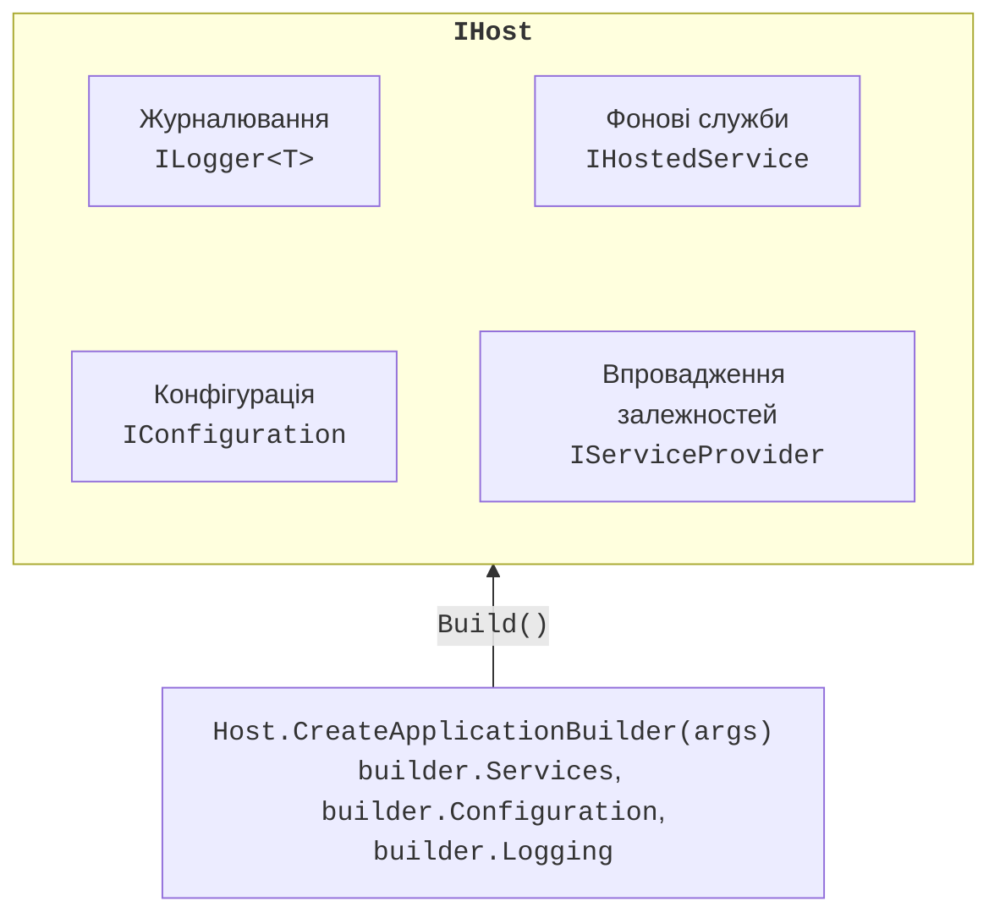
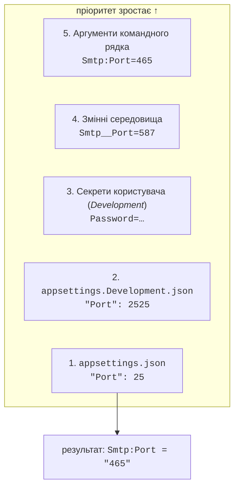
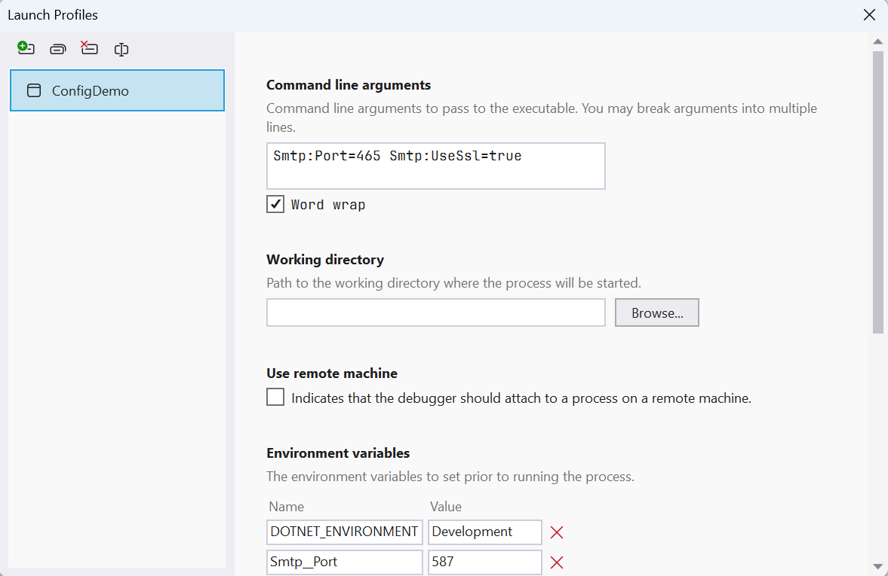
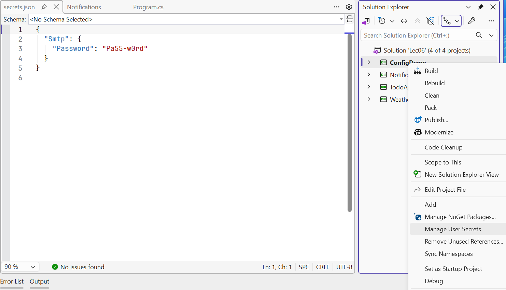

# Хост, конфігурація та параметри

## Універсальний хост .NET

Консольній програмі, крім DI, зазвичай потрібні конфігурація, журнал і коректне завершення. Усе це збирає разом **універсальний хост** (*.NET Generic Host*) – об’єкт `IHost` із пакета `Microsoft.Extensions.Hosting` (рис. 6.4, <https://learn.microsoft.com/dotnet/core/extensions/generic-host>). На ньому ж побудовано ASP.NET Core.



Рис. 6.4. Складові універсального хоста {.caption}

Метод `Host.CreateApplicationBuilder(args)` створює будівник із типовими налаштуваннями:

- коренева папка вмісту (*content root*) – поточна папка;
- конфігурація хоста зі змінних середовища з префіксом `DOTNET_` і аргументів командного рядка;
- конфігурація застосунку з `appsettings.json`, `appsettings.{Environment}.json`, секретів користувача (лише в *Development*), змінних середовища та командного рядка;
- постачальники журналу `Console`, `Debug`, `EventSource` і `EventLog` (лише Windows);
- перевірка областей і залежностей (`ValidateScopes`, `ValidateOnBuild`) у *Development*.

Будівник має властивості `Services`, `Configuration`, `Logging` і `Environment`. Метод `Build()` створює хост, а `Run()` або `await RunAsync()` запускає його і чекає завершення. Шаблон *Worker Service* (`dotnet new worker`) створює саме такий проєкт: `Program.cs` із хостом, клас `Worker`, файли `appsettings.json`, `appsettings.Development.json` і `Properties/launchSettings.json`.

**Фонова служба** (*hosted service*) реалізує `IHostedService` з методами `StartAsync` і `StopAsync` і реєструється методом `AddHostedService<T>()`. Зручніше успадкувати абстрактний клас `BackgroundService` і перевизначити один метод `ExecuteAsync(CancellationToken)`: токен скасовується, коли хост зупиняється.

Хост зупиняється, коли користувач натискає **Ctrl+C** (або процес отримує `SIGTERM`) чи код викликає `IHostApplicationLifetime.StopApplication()`. Хост скасовує токени фонових служб, викликає їхні `StopAsync`, звільняє контейнер і повертає керування з `Run`. Події `ApplicationStarted`, `ApplicationStopping` і `ApplicationStopped` цього ж інтерфейсу дають змогу виконати код на кожному етапі. Метод `Environment.Exit` коректного завершення не забезпечує.

## Конфігурація

**Конфігурація** (*configuration*) – це налаштування, які змінюють без перекомпіляції: адреси серверів, порти, інтервали, рівні журналу. Інтерфейс `IConfiguration` подає їх як пари «ключ – значення» з рядковими значеннями. Ієрархічні ключі розділяються двокрапкою: розділ `Smtp` із вкладеним ключем `Port` у JSON дає ключ `Smtp:Port`. Регістр у ключах не важливий (<https://learn.microsoft.com/dotnet/core/extensions/configuration>). Індексатор `config["Smtp:Host"]` повертає рядок або `null`, `GetValue<T>` перетворює значення на потрібний тип, `GetSection` повертає розділ, а `GetConnectionString("Shop")` читає ключ `ConnectionStrings:Shop`.

### Постачальники конфігурації та їх пріоритет

Значення надходять від **постачальників конфігурації** (*configuration providers*). Хост додає їх у певному порядку, і якщо ключ є в кількох джерелах, перемагає **пізніше доданий** (рис. 6.5, <https://learn.microsoft.com/dotnet/core/extensions/configuration-providers>). Так загальні налаштування лежать у `appsettings.json`, а окремий комп’ютер чи запуск їх перевизначає, нічого не змінюючи у файлах.



Рис. 6.5. Порядок пріоритету постачальників конфігурації {.caption}

- **Файли JSON** копіюються у вихідну папку (шаблон *Worker Service* робить це сам). Хост перечитує їх після збереження змін (`reloadOnChange`).
- **Середовище** (*environment*) задає змінна `DOTNET_ENVIRONMENT`: `Development`, `Staging`, `Production` (за замовчуванням). Від неї залежить, який файл `appsettings.{Environment}.json` завантажиться і чи будуть підключені секрети користувача. Перевірка в коді: `builder.Environment.IsDevelopment()`.
- **Змінні середовища** записують із подвійним підкресленням замість двокрапки: `Smtp__Port`. Двокрапка працює не на всіх платформах, а `__` підтримується всюди.
- **Аргументи командного рядка** мають вигляд `Smtp:Port=465`, `--Smtp:Port 465` або `/Smtp:Port 465`; в одній команді форми з `=` і з пробілом не змішують. Після `dotnet run` аргументи програми відокремлюють `--`.

Під час запуску з Visual Studio або командою `dotnet run` змінні середовища й аргументи беруться з профілю запуску `Properties/launchSettings.json`. Шаблон *Worker Service* задає в ньому `DOTNET_ENVIRONMENT=Development`. Профіль редагують у вікні *Debug → &lt;Project&gt; Debug Properties* (рис. 6.6); запущений напряму `.exe` цей файл не читає.



Рис. 6.6. Змінні середовища й аргументи в профілі запуску {.caption}

Програма `ConfigDemo` (шаблон *Worker Service*) друкує налаштування SMTP. У `appsettings.json` вузол `smtp.example.com`, порт 25 і `"UseSsl": false`, в `appsettings.Development.json` – вузол `localhost` і порт 2525:

```cs
HostApplicationBuilder builder = Host.CreateApplicationBuilder(args);
IConfiguration config = builder.Configuration;

string? host = config["Smtp:Host"];               // рядок або null
int port = config.GetValue<int>("Smtp:Port");     // перетворення типу
bool ssl = config.GetValue("Smtp:UseSsl", defaultValue: true);
IConfigurationSection smtp = config.GetSection("Smtp");
string password = smtp["Password"] ?? "(не задано)";

Console.WriteLine($"{builder.Environment.EnvironmentName}: " +
    $"{host}:{port}, SSL {ssl}, пароль {password}");
```

Чотири запуски в PowerShell і їхні результати (службові рядки `dotnet run` пропущено):

```powershell
dotnet run                          # профіль: Development
dotnet run --no-launch-profile      # без профілю: Production
$env:Smtp__Port = "587"; dotnet run
dotnet run -- Smtp:Port=465 Smtp:UseSsl=true
```

```
Development: localhost:2525, SSL False, пароль (не задано)
Production: smtp.example.com:25, SSL False, пароль (не задано)
Development: localhost:587, SSL False, пароль (не задано)
Development: localhost:465, SSL True, пароль (не задано)
```

Змінна середовища перекрила обидва файли, а командний рядок – ще й змінну середовища, яка залишалася заданою в тому самому вікні PowerShell.

## Секрети користувача

Паролі, ключі API та рядки підключення з паролями **не можна** записувати в `appsettings.json`: файл потрапляє в Git (тема 1), а видалений із наступного коміту секрет залишається в історії. На комп’ютері розробника секрети зберігає **менеджер секретів** (*Secret Manager*) (<https://learn.microsoft.com/aspnet/core/security/app-secrets>):

```powershell
dotnet user-secrets init        # додає <UserSecretsId> у .csproj
dotnet user-secrets set "Smtp:Password" "Pa55-w0rd"
dotnet user-secrets list        # Smtp:Password = Pa55-w0rd
dotnet user-secrets remove "Smtp:Password"
dotnet user-secrets clear
```

Секрети записуються у файл `%APPDATA%\Microsoft\UserSecrets\<UserSecretsId>\secrets.json` **поза** папкою проєкту, тому в репозиторій не потрапляють. Шаблон *Worker Service* уже містить `UserSecretsId`. У Visual Studio файл відкриває команда контекстного меню проєкту *Manage User Secrets* (рис. 6.7). Хост підключає секрети лише в середовищі *Development*: після `set` програма `ConfigDemo`, запущена з профілем, друкує `Development: localhost:2525, SSL False, пароль Pa55-w0rd`, а без профілю – `(не задано)`.



Рис. 6.7. Секрети користувача у Visual Studio {.caption}

::: tip Увага
Менеджер секретів **не шифрує** файл і призначений лише для розробки. На сервері секрети передають змінними середовища або спеціальними сховищами (наприклад, Azure Key Vault). Якщо секрет уже потрапив у Git, його вважають розкритим і змінюють.
:::

## Шаблон параметрів

Читати налаштування рядковими ключами незручно: опечатка в `"Smtp:Prot"` дає `null`, а тип перевіряється лише під час виконання. **Шаблон параметрів** (*options pattern*) зв’язує розділ конфігурації з класом, властивості якого мають ті самі назви (<https://learn.microsoft.com/dotnet/core/extensions/options>). Клас параметрів повинен мати відкритий конструктор без параметрів і властивості з `get` і `set`.

```cs
public class DiscountOptions
{
    public int Percent { get; set; }
}

builder.Services.Configure<DiscountOptions>(
    builder.Configuration.GetSection("Discount"));
// або з перевіркою (див. нижче):
builder.Services.AddOptions<DiscountOptions>()
    .Bind(builder.Configuration.GetSection("Discount"));
```

Сервіс отримує параметри через один із трьох інтерфейсів (табл. 6.2).

Таблиця 6.2. Інтерфейси шаблону параметрів {.caption}

| **Інтерфейс** | **Час життя** | **Значення після зміни файла** |
| --- | --- | --- |
| `IOptions<T>` | Singleton | не змінюється: `Value` читається один раз |
| `IOptionsSnapshot<T>` | Scoped | нове в кожній новій області; не можна у Singleton |
| `IOptionsMonitor<T>` | Singleton | завжди поточне `CurrentValue`, подія `OnChange` |

Програма читає знижку трьома способами, змінює `appsettings.json` під час роботи і через секунду читає знову:

```cs
var monitor = host.Services
    .GetRequiredService<IOptionsMonitor<DiscountOptions>>();
monitor.OnChange(o =>
    Console.WriteLine($"  OnChange: {o.Percent} %"));
var fixedValue = host.Services
    .GetRequiredService<IOptions<DiscountOptions>>();

Print("Старт");
File.WriteAllText("appsettings.json",
    """{ "Discount": { "Percent": 15 } }""");
await Task.Delay(1000);                  // файл перечитується
Print("Після зміни файла");

void Print(string title)
{
    using IServiceScope scope = host.Services.CreateScope();
    var snapshot = scope.ServiceProvider
        .GetRequiredService<IOptionsSnapshot<DiscountOptions>>();
    Console.WriteLine(
        $"{title}: IOptions {fixedValue.Value.Percent}, " +
        $"Snapshot {snapshot.Value.Percent}, " +
        $"Monitor {monitor.CurrentValue.Percent}");
}
```

```
Старт: IOptions 5, Snapshot 5, Monitor 5
  OnChange: 15 %
  OnChange: 15 %
Після зміни файла: IOptions 5, Snapshot 15, Monitor 15
```

Подія `OnChange` спрацювала двічі: система файлів повідомляє про запис файла кількома сповіщеннями, тому обробник має бути готовим до повторів.

### Перевірка параметрів

Неправильне значення в конфігурації краще виявити **під час запуску**, а не через годину роботи. `OptionsBuilder` підтримує три види перевірки:

- `ValidateDataAnnotations()` – атрибути `[Required]`, `[Range]`, `[RegularExpression]` з простору імен `System.ComponentModel.DataAnnotations` (пакет `Microsoft.Extensions.Options.DataAnnotations`);
- `Validate(o => умова, "повідомлення")` – довільне правило, наприклад зв’язок двох властивостей;
- клас, що реалізує `IValidateOptions<T>`, для складних правил.

Без додаткових викликів перевірка виконується під час першого звернення до `Value`, а виклик `ValidateOnStart()` переносить її на запуск хоста: хост не стартує й записує в журнал виняток `OptionsValidationException` зі списком усіх помилок. Приклад наведено в програмі «Погодний монітор» нижче.
