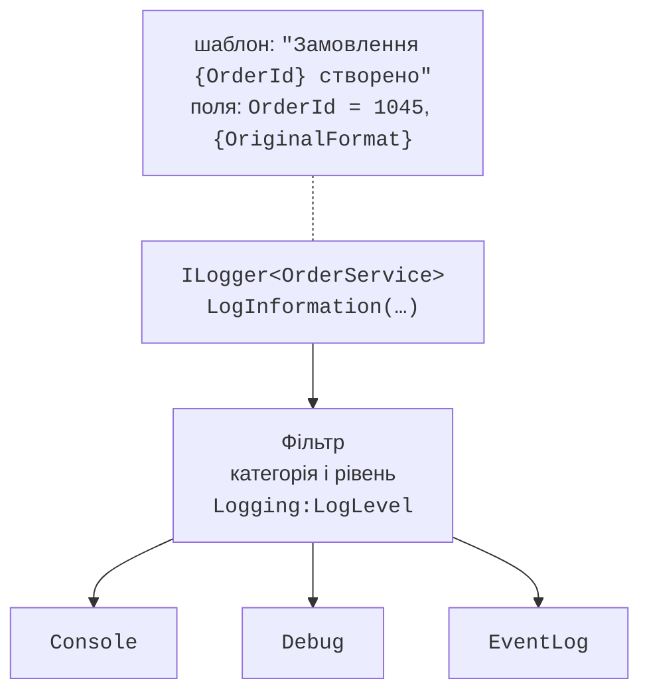
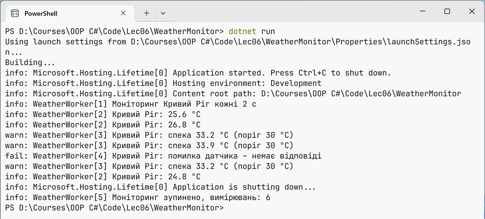

# Журналювання

## Журналювання

**Журнал** (*log*) – послідовність записів про події програми: запуск, виконані операції, попередження, помилки. На відміну від `Console.WriteLine`, журнал має рівні важливості, фільтри та кілька місць призначення, які налаштовують без зміни коду (<https://learn.microsoft.com/dotnet/core/extensions/logging/overview>).

Сервіс отримує журнал через конструктор як `ILogger<T>`. Параметр типу задає **категорію** – повне ім’я класу, наприклад `Shop.OrderService`. Кожен запис має **рівень** (табл. 6.3). Без налаштувань записуються рівні від `Information` і вище.

Таблиця 6.3. Рівні журналювання {.caption}

| **Рівень** | **Число** | **Метод** | **Коли використовувати** |
| --- | --- | --- | --- |
| `Trace` | 0 | `LogTrace` | найдетальніші дані, можуть містити чутливу інформацію |
| `Debug` | 1 | `LogDebug` | налагодження під час розробки |
| `Information` | 2 | `LogInformation` | звичайний перебіг роботи |
| `Warning` | 3 | `LogWarning` | незвичні події, які не зупиняють роботу |
| `Error` | 4 | `LogError` | помилка поточної операції |
| `Critical` | 5 | `LogCritical` | збій, що потребує негайної уваги |
| `None` | 6 | – | вимкнути журнал |

### Шаблони повідомлень

Першим аргументом методів `Log…` передають **шаблон повідомлення** (*message template*) з іменованими заповнювачами у фігурних дужках, а значення – наступними аргументами. Значення підставляються за **порядком**, а не за іменами. Постачальник отримує і готовий текст, і окремі поля: це **структуроване журналювання** (*structured logging*), у якому записи можна шукати й фільтрувати за полем `OrderId`, а не розбирати текст.

```cs
logger.LogInformation("Клієнт {Customer} оплатив {Amount} грн",
    customer, amount);                        // правильно
logger.LogInformation($"Клієнт {customer} оплатив {amount} грн");
// погано: поля втрачено, рядок будується навіть для вимкненого рівня
```

Для другого рядка аналізатор .NET видає попередження CA2254 (шаблон має бути сталим виразом). Виняток передають першим аргументом: `logger.LogError(ex, "Помилка замовлення {Id}", id)`. Числа й дати в тексті журналу форматуються з інваріантною культурою, тобто з крапкою: `1250.5`.

Метод `BeginScope` відкриває **область журналу**: її дані додаються до всіх записів усередині блоку `using`. Програма з фабрикою `LoggerFactory.Create` (пакет `Microsoft.Extensions.Logging.Console`) показує рівні, категорії, фільтр і область:

```cs
using ILoggerFactory factory = LoggerFactory.Create(logging =>
{
    logging.SetMinimumLevel(LogLevel.Debug);
    logging.AddFilter("Shop.Payments", LogLevel.Warning);
    logging.AddSimpleConsole(o => o.IncludeScopes = true);
});

ILogger orders = factory.CreateLogger("Shop.Orders");
ILogger payments = factory.CreateLogger("Shop.Payments");

int id = 1045;
decimal amount = 1250.5m;
orders.LogDebug("Перевірка кошика");
using (orders.BeginScope("Замовлення {OrderId}", id))
{
    orders.LogInformation("Клієнт {Customer} оплатив {Amount} грн",
        "Олена", amount);
    payments.LogInformation("Платіж {Amount} грн пройшов", amount);
    payments.LogWarning("Повторний платіж {Amount} грн", amount);
}
```

Категорія `Shop.Payments` пропускає лише попередження, тому інформаційний запис про платіж відфільтровано. Рядок `=> Замовлення 1045` – область:

```
dbug: Shop.Orders[0]
      Перевірка кошика
info: Shop.Orders[0]
      => Замовлення 1045
      Клієнт Олена оплатив 1250.5 грн
warn: Shop.Payments[0]
      => Замовлення 1045
      Повторний платіж 1250.5 грн
```

### Фільтри в конфігурації

У застосунку з хостом рівні задають у розділі `Logging` конфігурації. `LogLevel:Default` діє на всі категорії, назва категорії – на неї та всі категорії з цим префіксом (`Microsoft` охоплює `Microsoft.Hosting.Lifetime`), а вкладений розділ постачальника (`Console`, `Debug`) перекриває загальні правила для нього. Обирається найдовший збіг префікса:

```json
{
  "Logging": {
    "LogLevel": {
      "Default": "Information",
      "Microsoft": "Warning",
      "Microsoft.Hosting.Lifetime": "Information"
    },
    "Console": {
      "FormatterName": "simple",
      "FormatterOptions": { "SingleLine": true }
    }
  }
}
```

### Постачальники журналу

Записи, що пройшли фільтр, отримують усі підключені **постачальники** (*logging providers*) (рис. 6.8, <https://learn.microsoft.com/dotnet/core/extensions/logging/providers>):

- `Console` – вікно консолі; **форматувальники** `simple` (стандартний, параметри `SingleLine`, `TimestampFormat`, `IncludeScopes`), `json` і `systemd`;
- `Debug` – вікно *Output* Visual Studio через `System.Diagnostics.Debug`, лише коли під’єднано налагоджувач;
- `EventSource` – події трасування `Microsoft-Extensions-Logging` для інструмента `dotnet-trace`;
- `EventLog` – журнал Windows *Application* (переглядач подій). Він не успадковує загальних правил і за замовчуванням записує лише рівні від `Warning`.



Рис. 6.8. Конвеєр журналювання {.caption}

Метод `builder.Logging.ClearProviders()` прибирає типові постачальники, після чого додають потрібні: `AddConsole()`, `AddJsonConsole()`, `AddDebug()`. Форматувальник `json` записує кожен запис об’єктом JSON з полями `EventId`, `LogLevel`, `Category`, `Message` і `State`, де `State` містить окремі значення заповнювачів (`"Customer": "Олена"`, `"Amount": 1250.5`) і сам шаблон.

Вбудовані постачальники не записують журнал у файли. Для цього використовують сторонні бібліотеки, наприклад Serilog або NLog, які підключаються до того самого `ILogger<T>`.

### Генератор джерел `[LoggerMessage]`

Методи `LogInformation` щоразу розбирають шаблон і пакують числа в об’єкти. Для часто виконуваного коду рекомендовано **генератор джерел** (*source generator*): у `partial`-класі оголошують `partial`-метод з атрибутом `[LoggerMessage]`, у якому задано ідентифікатор події, рівень і шаблон. Реалізацію створює компілятор; параметри методу відповідають заповнювачам без урахування регістру (<https://learn.microsoft.com/dotnet/core/extensions/logging/source-generation>). Приклад оголошень – клас `WeatherWorker` нижче.

Екземплярний метод бере журнал з поля або параметра первинного конструктора типу `ILogger`; статичний метод отримує `ILogger` першим параметром. Метод повертає `void`, а параметр типу `Exception` передається як виняток запису. Помилки в шаблоні стають попередженнями компілятора.

### Приклад «Погодний монітор»

Консольний хост (шаблон *Worker Service*) періодично читає температуру з датчика, записує вимірювання в журнал і попереджає про спеку. Параметри монітора читаються з розділу `Weather` і перевіряються під час запуску. Датчик імітується: кожне п’яте вимірювання завершується тайм-аутом. `Program.cs`:

```cs
using System.ComponentModel.DataAnnotations;

Console.OutputEncoding = System.Text.Encoding.UTF8;

HostApplicationBuilder builder = Host.CreateApplicationBuilder(args);

builder.Services.AddOptions<WeatherOptions>()
    .Bind(builder.Configuration.GetSection(WeatherOptions.Section))
    .ValidateDataAnnotations()
    .ValidateOnStart();
builder.Services.AddSingleton<ITemperatureSensor, FakeSensor>();
builder.Services.AddHostedService<WeatherWorker>();

using IHost host = builder.Build();
await host.RunAsync();

public class WeatherOptions
{
    public const string Section = "Weather";

    [Required]
    public string City { get; set; } = "";

    [Range(1, 3600)]
    public int IntervalSeconds { get; set; } = 60;

    [Range(-50, 60)]
    public double AlertTemperature { get; set; } = 35;
}

public interface ITemperatureSensor
{
    double Read();
}

// Імітація датчика: кожне п’яте вимірювання – збій.
public class FakeSensor : ITemperatureSensor
{
    private readonly Random random = new(2026);
    private int count;

    public double Read()
    {
        if (++count % 5 == 0)
            throw new TimeoutException("немає відповіді");
        return 24 + random.NextDouble() * 10;
    }
}
```

Фонова служба `WeatherWorker.cs` отримує датчик, параметри та журнал через первинний конструктор:

```cs
using Microsoft.Extensions.Options;

public partial class WeatherWorker(
    ITemperatureSensor sensor,
    IOptions<WeatherOptions> options,
    ILogger<WeatherWorker> logger) : BackgroundService
{
    private int readings;

    protected override async Task ExecuteAsync(
        CancellationToken stoppingToken)
    {
        WeatherOptions o = options.Value;
        LogStarted(o.City, o.IntervalSeconds);
        while (!stoppingToken.IsCancellationRequested)
        {
            try
            {
                double t = sensor.Read();
                readings++;
                if (t >= o.AlertTemperature)
                    LogHeat(o.City, t, o.AlertTemperature);
                else
                    LogReading(o.City, t);
            }
            catch (TimeoutException ex)
            {
                LogSensorError(o.City, ex.Message);
            }
            await Task.Delay(TimeSpan.FromSeconds(o.IntervalSeconds),
                stoppingToken);
        }
    }

    public override Task StopAsync(CancellationToken token)
    {
        LogStopped(readings);
        return base.StopAsync(token);
    }

    [LoggerMessage(1, LogLevel.Information,
        "Моніторинг {City} кожні {Seconds} с")]
    private partial void LogStarted(string city, int seconds);

    [LoggerMessage(2, LogLevel.Information,
        "{City}: {Temperature:F1} °C")]
    private partial void LogReading(string city, double temperature);

    [LoggerMessage(3, LogLevel.Warning,
        "{City}: спека {Temperature:F1} °C (поріг {Limit} °C)")]
    private partial void LogHeat(string city, double temperature,
        double limit);

    [LoggerMessage(4, LogLevel.Error,
        "{City}: помилка датчика – {Error}")]
    private partial void LogSensorError(string city, string error);

    [LoggerMessage(5, LogLevel.Information,
        "Моніторинг зупинено, вимірювань: {Count}")]
    private partial void LogStopped(int count);
}
```

Файл `appsettings.json` містить розділ `Weather` із параметрами (місто «Кривий Ріг», інтервал 2 с, поріг 30 °C) і розділ `Logging`, показаний у пункті «Фільтри в конфігурації».

Коли користувач натискає **Ctrl+C**, `Task.Delay` отримує скасований токен і завершує цикл винятком `OperationCanceledException`, який хост очікує. Потім хост викликає `StopAsync`. Результат (довгі рядки категорії `Microsoft.Hosting.Lifetime` перенесено, шлях скорочено, див. також рис. 6.9):

```
info: Microsoft.Hosting.Lifetime[0]
      Application started. Press Ctrl+C to shut down.
info: Microsoft.Hosting.Lifetime[0] Hosting environment: Production
info: Microsoft.Hosting.Lifetime[0] Content root path: D:\Courses\OOP C#\Code\Lec06\…
info: WeatherWorker[1] Моніторинг Кривий Ріг кожні 2 с
info: WeatherWorker[2] Кривий Ріг: 25.6 °C
info: WeatherWorker[2] Кривий Ріг: 26.8 °C
warn: WeatherWorker[3] Кривий Ріг: спека 33.2 °C (поріг 30 °C)
warn: WeatherWorker[3] Кривий Ріг: спека 33.9 °C (поріг 30 °C)
fail: WeatherWorker[4] Кривий Ріг: помилка датчика – немає відповіді
warn: WeatherWorker[3] Кривий Ріг: спека 33.2 °C (поріг 30 °C)
info: WeatherWorker[2] Кривий Ріг: 24.8 °C
info: Microsoft.Hosting.Lifetime[0] Application is shutting down...
info: WeatherWorker[5] Моніторинг зупинено, вимірювань: 6
```



Рис. 6.9. Журнал погодного монітора в консолі {.caption}

У квадратних дужках після категорії стоїть ідентифікатор події з атрибута. Запуск із неправильними параметрами `dotnet run -- Weather:IntervalSeconds=0 Weather:City=` не стартує: запис `fail` категорії `Microsoft.Extensions.Hosting.Internal.Host` «Hosting failed to start» і необроблений виняток (рядки перенесено):

```
Unhandled exception. Microsoft.Extensions.Options.
OptionsValidationException: DataAnnotation validation failed for
'WeatherOptions' members: 'City' with the error: 'The City field is
required.'.; DataAnnotation validation failed for 'WeatherOptions'
members: 'IntervalSeconds' with the error: 'The field IntervalSeconds
must be between 1 and 3600.'.
```
