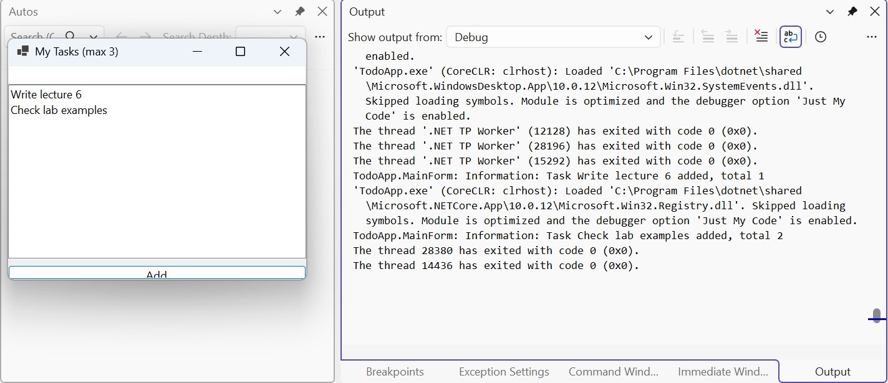

# DI у Windows Forms і тестованість

## Впровадження залежностей у Windows Forms

Шаблон *Windows Forms App* не містить хоста, але його легко додати: пакет `Microsoft.Extensions.Hosting` і кілька рядків у `Program.cs`. Форми реєструють як Transient, головну форму отримують із контейнера, а хост запускають до `Application.Run` і зупиняють після закриття форми (<https://learn.microsoft.com/dotnet/desktop/winforms/advanced/how-to-use-host-builder>).

### Приклад «Список завдань»

Застосунок зберігає завдання в сервісі `ITaskStore` (реалізація `MemoryTaskStore` на основі `List<string>`), назву вікна й ліміт завдань читає з розділу `Todo` файла `appsettings.json` у клас `TodoOptions` з властивостями `Title` і `MaxTasks`, а дії записує в журнал. Для `appsettings.json` у `.csproj` задано `CopyToOutputDirectory` = `PreserveNewest`. `Program.cs`:

```cs
using Microsoft.Extensions.DependencyInjection;
using Microsoft.Extensions.Hosting;

namespace TodoApp;

internal static class Program
{
    [STAThread]
    private static void Main(string[] args)
    {
        ApplicationConfiguration.Initialize();

        HostApplicationBuilder builder =
            Host.CreateApplicationBuilder(args);
        builder.Services.Configure<TodoOptions>(
            builder.Configuration.GetSection("Todo"));
        builder.Services.AddSingleton<ITaskStore, MemoryTaskStore>();
        builder.Services.AddTransient<MainForm>();

        using IHost host = builder.Build();
        host.Start();
        Application.Run(host.Services.GetRequiredService<MainForm>());
        host.StopAsync().GetAwaiter().GetResult();
    }
}
```

Головна форма `MainForm.cs` отримує сервіси через конструктор, як будь-який інший сервіс:

```cs
using Microsoft.Extensions.Logging;
using Microsoft.Extensions.Options;

namespace TodoApp;

public class MainForm : Form
{
    private readonly ITaskStore store;
    private readonly TodoOptions options;
    private readonly ILogger<MainForm> logger;
    private readonly TextBox input = new() { Dock = DockStyle.Top };
    private readonly ListBox list = new() { Dock = DockStyle.Fill };

    public MainForm(ITaskStore store, IOptions<TodoOptions> options,
        ILogger<MainForm> logger)
    {
        this.store = store;
        this.options = options.Value;
        this.logger = logger;

        Text = $"{this.options.Title} (max {this.options.MaxTasks})";
        ClientSize = new Size(360, 220);
        var add = new Button
        {
            Text = "Add",
            Dock = DockStyle.Bottom
        };
        add.Click += (s, e) => AddTask(input.Text.Trim());
        AcceptButton = add;
        Controls.AddRange([list, input, add]);
    }

    public void AddTask(string task)
    {
        if (task.Length == 0) return;
        if (store.Tasks.Count >= options.MaxTasks)
        {
            logger.LogWarning("Limit {Max} reached",
                options.MaxTasks);
            MessageBox.Show(this, "Task limit reached.", Text);
            return;
        }
        store.Add(task);
        list.Items.Add(task);
        input.Clear();
        logger.LogInformation("Task {Task} added, total {Count}",
            task, store.Tasks.Count);
    }
}
```

Розділ `Todo` задає назву «My Tasks» і ліміт 3, тому заголовок вікна – «My Tasks (max 3)». Після додавання завдання вікно *Output* Visual Studio (постачальник `Debug`) показує запис `TodoApp.MainForm: Information: Task Write lecture 6 added, total 1` (рис. 6.10).

Дочірні форми також реєструють як Transient, а головна форма отримує в конструкторі `IServiceProvider` і створює їх викликом `services.GetRequiredService<StatsForm>()` в операторі `using`: контейнер не звільняє Transient-об’єкти, отримані з кореневого постачальника, до завершення програми.



Рис. 6.10. Застосунок Windows Forms із хостом і журнал у вікні *Output* {.caption}

## Тестованість

Головна практична вигода DI – код легко перевіряти. Клас, що отримує всі залежності через конструктор, у модульному тесті створюють без контейнера, передаючи прості замінники:

- **фейк** (*fake*) – власна спрощена реалізація інтерфейсу, як `FakeSender` у першому прикладі;
- `NullLogger<T>.Instance` – журнал, який нічого не записує;
- `Options.Create(new DiscountOptions { Percent = 25 })` – готовий `IOptions<T>` без конфігурації;
- `TimeProvider` – абстракція часу (.NET 8+). Код запитує `time.GetUtcNow()` чи `time.GetLocalNow()` замість `DateTime.Now`; у програмі реєструють `TimeProvider.System`, а в тесті – `FakeTimeProvider` з пакета `Microsoft.Extensions.TimeProvider.Testing`, для якого час задають методами `SetUtcNow` і `Advance`.

Модульний тест із такими замінниками виконується за мілісекунди і не залежить від годинника комп’ютера; повний проєкт тестів наведено в лабораторній роботі. Якщо `new` конкретного класу захований усередині методу, замінити його в тесті неможливо, тому потрібна переробка коду.
