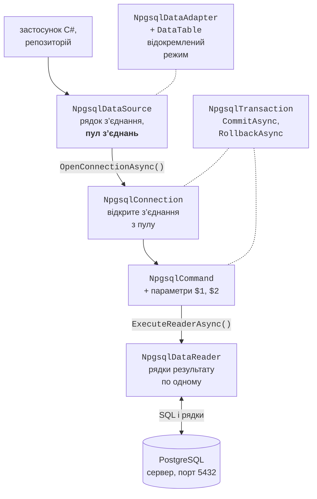

# Архітектура ADO.NET і команди

## Архітектура ADO.NET

**ADO.NET** – набір класів .NET для роботи з джерелами даних (<https://learn.microsoft.com/dotnet/framework/data/adonet/ado-net-overview>). Базові абстрактні класи простору імен `System.Data.Common` визначають спільний інтерфейс, а **постачальник даних** (*data provider*) для конкретної СКБД реалізує їх (табл. 7.2). Постачальники поширюються пакетами NuGet: Microsoft.Data.SqlClient (SQL Server), Microsoft.Data.Sqlite, MySqlConnector, **Npgsql** (PostgreSQL). Тому код для різних СКБД схожий: відрізняються префікси класів і діалект SQL.

Таблиця 7.2. Основні класи ADO.NET і постачальника Npgsql {.caption}

| **Базовий клас** | **Npgsql** | **Призначення** |
| --- | --- | --- |
| `DbDataSource` | `NpgsqlDataSource` | фабрика з’єднань і команд, пул з’єднань |
| `DbConnection` | `NpgsqlConnection` | з’єднання з сервером |
| `DbCommand` | `NpgsqlCommand` | команда SQL з параметрами |
| `DbParameter` | `NpgsqlParameter` | значення параметра команди |
| `DbDataReader` | `NpgsqlDataReader` | послідовне читання рядків результату |
| `DbTransaction` | `NpgsqlTransaction` | транзакція |
| `DbDataAdapter` | `NpgsqlDataAdapter` | заповнення `DataTable` і збереження змін |

ADO.NET має два режими роботи. У **підключеному** режимі програма відкриває з’єднання, виконує команду і читає результат, поки з’єднання відкрите (рис. 7.8). У **відокремленому** режимі дані копіюються в об’єкт `DataTable` у пам’яті, з’єднання закривається, а зміни пізніше зберігаються однією операцією. Об’єктно-реляційне відображення Entity Framework Core (тема 8) побудоване поверх постачальника ADO.NET.



Рис. 7.8. Архітектура ADO.NET із постачальником Npgsql {.caption}

### Пакет Npgsql

**Npgsql** – постачальник ADO.NET для PostgreSQL з відкритим кодом (<https://www.npgsql.org/doc/>). У вересні 2026 року актуальна версія пакета – 10.0.3 для .NET 8, 9 і 10 (<https://www.nuget.org/packages/Npgsql>). Пакет додають у *Solution Explorer*: контекстне меню проєкту *Manage NuGet Packages…*, вкладка *Browse*, пошук `Npgsql`, кнопка *Install* (рис. 7.9), або командою:

```powershell
dotnet add package Npgsql
```

::: info Знімок екрана
Visual Studio 2026: project context menu → Manage NuGet Packages… → Browse → "Npgsql"; package selected, version 10.0.3, Install button
:::

Рис. 7.9. Встановлення пакета Npgsql у Visual Studio {.caption}

### Рядок з’єднання і конфігурація

**Рядок з’єднання** (*connection string*) містить пари `ключ=значення`, розділені крапкою з комою (<https://www.npgsql.org/doc/connection-string-parameters.html>):

```
Host=localhost;Port=5432;Database=library;Username=library_app;
Password=Change-Me-2026
```

Рядок з’єднання з паролем **не можна** записувати в код або в `appsettings.json`, який потрапляє в Git. Як розглядалося в темі 6, під час розробки його зберігають у **секретах користувача** (*User Secrets*) – файлі `secrets.json` у профілі користувача поза текою проєкту (<https://learn.microsoft.com/aspnet/core/security/app-secrets>), а на сервері – у змінній середовища `ConnectionStrings__Library`. Секрети підключають пакетом `Microsoft.Extensions.Configuration.UserSecrets`:

```powershell
dotnet add package Microsoft.Extensions.Configuration.UserSecrets
dotnet add package `
    Microsoft.Extensions.Configuration.EnvironmentVariables
dotnet user-secrets init
$cs = "Host=localhost;Database=library;Username=library_app;" +
    "Password=Change-Me-2026"
dotnet user-secrets set "ConnectionStrings:Library" $cs
```

Метод `config.GetConnectionString("Library")` читає ключ `ConnectionStrings:Library`; якщо рядок не налаштовано, повертає `null`.

### `NpgsqlDataSource` і пул з’єднань

Відкриття фізичного з’єднання з сервером – дорога операція: мережне підключення, автентифікація, створення процесу на сервері. Тому Npgsql за замовчуванням використовує **пул з’єднань** (*connection pool*): коли програма закриває або звільняє `NpgsqlConnection`, фізичне з’єднання не закривається, а повертається в пул і використовується наступним відкриттям (<https://www.npgsql.org/doc/basic-usage.html>). Параметри пулу задають у рядку з’єднання: `Pooling` (за замовчуванням `true`), `Minimum Pool Size` (0), `Maximum Pool Size` (100), `Connection Idle Lifetime` (300 с – час, після якого зайві неактивні з’єднання закриваються).

Пул належить об’єкту **`NpgsqlDataSource`**, який створюється **один раз** на весь застосунок і є потокобезпечним.

Метод `dataSource.CreateCommand(sql)` створює команду, яка сама бере з’єднання з пулу й повертає його після виконання, а `await dataSource.OpenConnectionAsync()` відкриває з’єднання для кількох команд і транзакції.

Завдяки пулу правильний стиль роботи – відкривати з’єднання якомога пізніше і звільняти якомога раніше (`await using`), а не тримати одне з’єднання відкритим увесь час роботи програми.

## Виконання команд

### Методи `ExecuteNonQuery`, `ExecuteScalar`, `ExecuteReader`

Об’єкт `NpgsqlCommand` виконує SQL одним із трьох методів залежно від результату (табл. 7.3). Для кожного є асинхронна версія із суфіксом `Async`, яка не блокує потік під час очікування відповіді сервера (тема 5): у настільних застосунках інтерфейс не «зависає», а у вебсервісах потік обслуговує інші запити.

Таблиця 7.3. Методи виконання команд {.caption}

| **Метод** | **Повертає** | **Використання** |
| --- | --- | --- |
| `ExecuteNonQueryAsync` | `int` – кількість змінених рядків | `INSERT`, `UPDATE`, `DELETE`, DDL |
| `ExecuteScalarAsync` | `object?` – перше значення першого рядка | `count(*)`, `INSERT … RETURNING id` |
| `ExecuteReaderAsync` | `NpgsqlDataReader` | `SELECT` з багатьма рядками |

### Читання результатів

`NpgsqlDataReader` читає результат **послідовно, лише вперед**: метод `ReadAsync()` переходить до наступного рядка і повертає `false`, коли рядки закінчилися. Значення поточного рядка читають типізованими методами за номером стовпця (з 0): `GetInt32`, `GetInt64`, `GetString`, `GetDecimal`, `GetBoolean`, `GetDateTime` або універсальним `GetFieldValue<T>` (наприклад, `GetFieldValue<DateOnly>`). Номер стовпця за назвою повертає `GetOrdinal("title")`.

Якщо в клітинці `NULL`, типізовані методи генерують виняток `InvalidCastException`. Тому стовпці, які можуть бути порожніми, спочатку перевіряють методом `IsDBNull`. Так само `ExecuteScalarAsync` повертає `DBNull.Value`, якщо значення порожнє, і `null`, якщо рядків немає. Для передавання `NULL` у параметр використовують `DBNull.Value`.

Поки читач відкритий, з’єднання зайняте ним: іншу команду на тому самому з’єднанні не виконати. Тому читач звільняють одразу після читання (`await using`).

### Приклад «Каталог книг»

Консольний застосунок додає книгу, змінює кількість примірників, шукає книги за частиною назви та оформлює видачу. Увесь SQL для таблиці `books` зібрано в класі-**репозиторії** (*repository*): решта програми викликає методи `AddAsync`, `FindAsync` і не залежить від SQL. Проєкт – консольний застосунок .NET 10 з пакетами `Npgsql`, `Microsoft.Extensions.Configuration.UserSecrets` і `…EnvironmentVariables`. Книгу описує запис `public record Book(int Id, string Title, int? PubYear, string? Isbn, int Copies);` (файл `Book.cs`).

Репозиторій отримує `NpgsqlDataSource` через первинний конструктор. Параметри команд позиційні: `$1`, `$2` відповідають першому, другому доданому параметру (файл `BookRepository.cs`):

```cs
using Npgsql;

namespace Library;

// Репозиторій: увесь SQL для таблиці books в одному класі.
public class BookRepository(NpgsqlDataSource dataSource)
{
    public async Task<long> CountAsync()
    {
        await using NpgsqlCommand cmd =
            dataSource.CreateCommand("SELECT count(*) FROM books");
        return (long)(await cmd.ExecuteScalarAsync())!;
    }

    public async Task<int> AddAsync(string title, int? pubYear,
        string? isbn, int copies)
    {
        await using NpgsqlCommand cmd = dataSource.CreateCommand("""
            INSERT INTO books (title, pub_year, isbn, copies)
            VALUES ($1, $2, $3, $4)
            RETURNING id
            """);
        cmd.Parameters.AddWithValue(title);
        cmd.Parameters.AddWithValue((object?)pubYear ?? DBNull.Value);
        cmd.Parameters.AddWithValue((object?)isbn ?? DBNull.Value);
        cmd.Parameters.AddWithValue(copies);
        return (int)(await cmd.ExecuteScalarAsync())!;
    }
```

Функція `count(*)` повертає `bigint`, тому результат приводиться до `long`. Сирий рядковий літерал `"""…"""` зберігає багаторядковий SQL без екранування.

```cs
public async Task<int> UpdateCopiesAsync(int id, int copies)
{
    await using NpgsqlCommand cmd = dataSource.CreateCommand(
        "UPDATE books SET copies = $1 WHERE id = $2");
    cmd.Parameters.AddWithValue(copies);
    cmd.Parameters.AddWithValue(id);
    return await cmd.ExecuteNonQueryAsync();  // к-сть рядків
}
```

Метод `ExecuteNonQueryAsync` повертає 0, якщо книги з таким `id` немає: так програма дізнається, що змінювати було нічого. Метод `DeleteAsync` з командою `DELETE FROM books WHERE id = $1` пишуть так само. Пошук читає рядки в список об’єктів `Book`:

```cs
    public async Task<List<Book>> FindAsync(string text)
    {
        await using NpgsqlCommand cmd = dataSource.CreateCommand("""
            SELECT id, title, pub_year, isbn, copies
            FROM books
            WHERE title ILIKE $1
            ORDER BY title
            """);
        cmd.Parameters.AddWithValue($"%{text}%");
        await using NpgsqlDataReader reader =
            await cmd.ExecuteReaderAsync();
        var books = new List<Book>();
        while (await reader.ReadAsync())
        {
            books.Add(new Book(
                reader.GetInt32(0),
                reader.GetString(1),
                reader.IsDBNull(2) ? null : reader.GetInt32(2),
                reader.IsDBNull(3) ? null : reader.GetString(3),
                reader.GetFieldValue<int>(4)));
        }
        return books;
    }
}
```

Файл `Program.cs` читає рядок з’єднання з конфігурації, створює один `NpgsqlDataSource` і перехоплює помилки бази даних. Клас `LoanService` розглядається в розділі «Транзакції».

```cs
using Library;
using Microsoft.Extensions.Configuration;
using Npgsql;

IConfiguration config = new ConfigurationBuilder()
    .AddUserSecrets<Program>()
    .AddEnvironmentVariables()
    .Build();
string connectionString = config.GetConnectionString("Library")
    ?? throw new InvalidOperationException(
        "Connection string 'Library' is not configured.");

await using NpgsqlDataSource dataSource =
    NpgsqlDataSource.Create(connectionString);
var books = new BookRepository(dataSource);
var loans = new LoanService(dataSource);
```

```cs
try
{
    Console.WriteLine($"Books: {await books.CountAsync()}");
    int id = await books.AddAsync("Code Complete", 2004,
        "978-0735619678", 2);
    Console.WriteLine($"Added book {id}");
    Console.WriteLine(
        $"Updated: {await books.UpdateCopiesAsync(id, 5)}");
    foreach (Book b in await books.FindAsync("code"))
    {
        Console.WriteLine(
            $"{b.Id,3} {b.Title,-15} {b.PubYear,5} {b.Copies,3}");
    }

    long loanId = await loans.IssueAsync(id, readerId: 3, days: 14);
    Console.WriteLine($"Loan {loanId} issued");
    await loans.IssueAsync(bookId: 4, readerId: 3, days: 14);
}
catch (InvalidOperationException ex)
{
    Console.Error.WriteLine(ex.Message);
}
catch (PostgresException ex)
    when (ex.SqlState == PostgresErrorCodes.UniqueViolation)
{
    Console.Error.WriteLine($"Duplicate: {ex.ConstraintName}");
}
catch (NpgsqlException ex)
{
    Console.Error.WriteLine($"Database error: {ex.Message}");
}
```

Результат першого запуску після скрипту «Бібліотека»: пошук «code» без урахування регістру знаходить дві книги, а книга 4 (*Clean Architecture*) не має вільних примірників:

```
Books: 5
Added book 6
Updated: 1
  3 Clean Code       2008   1
  6 Code Complete    2004   5
Loan 6 issued
Book 4 is not available.
```

Помилку, яку повідомляє сервер, представляє виняток `PostgresException` (нащадок `NpgsqlException`) з кодом `SqlState` і назвою обмеження `ConstraintName`: повторний запуск програми спричинить порушення унікальності ISBN (код `23505`, константа `PostgresErrorCodes.UniqueViolation`) і виведе `Duplicate: books_isbn_key`. Якщо сервер не запущено, програма виводить:

```
Database error: Failed to connect to 127.0.0.1:5432
```
