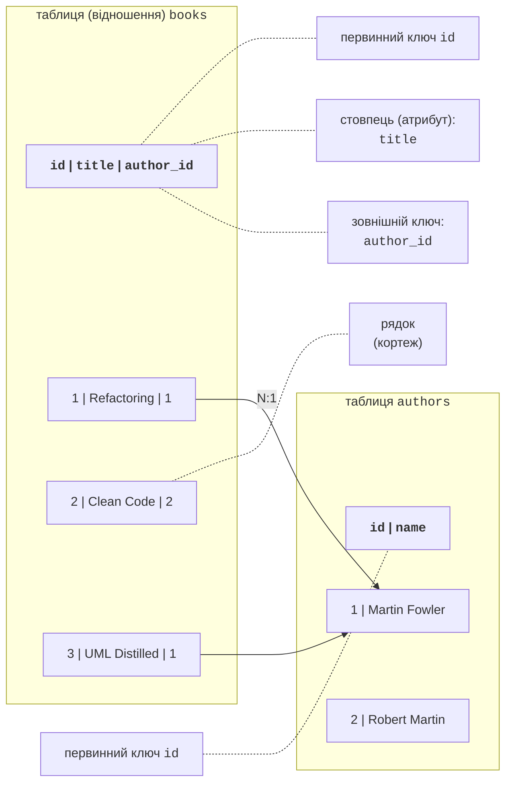
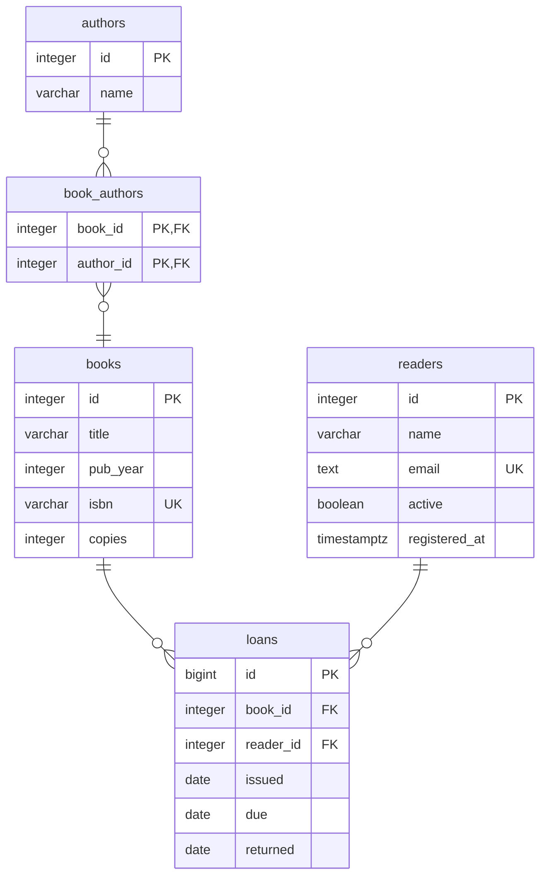
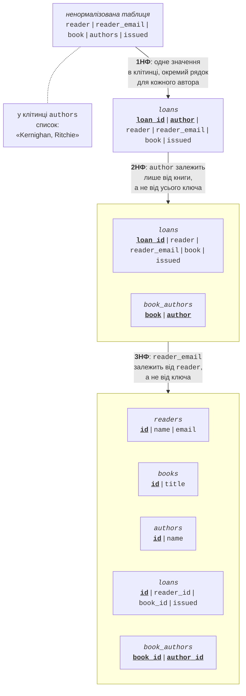

# Реляційна модель і PostgreSQL

## Бази даних і реляційна модель

Майже кожен застосунок зберігає дані: товари магазину, оцінки студентів, книги бібліотеки. Поки даних мало, їх можна записувати у текстові файли, наприклад CSV. Але коли з даними одночасно працюють багато користувачів, записів мільйони, а помилка під час збереження не повинна зіпсувати інформацію, потрібна база даних. **База даних** (*database*) – упорядкований набір пов’язаних даних, а **система керування базами даних**, СКБД (*database management system, DBMS*) – програма, яка зберігає ці дані на диску, виконує запити, контролює доступ і не допускає суперечностей. Поширені СКБД: PostgreSQL, Microsoft SQL Server, MySQL, Oracle Database, SQLite.

Більшість СКБД є **реляційними**: дані зберігаються в таблицях, а запити записуються мовою **SQL** (*Structured Query Language*). У цій лекції використовується вільна СКБД **PostgreSQL** (<https://www.postgresql.org/docs/current/>).

### Таблиці, рядки та стовпці

**Реляційна модель** (*relational model*) описує дані як набір **таблиць**, або **відношень** (*relation*) (рис. 7.1). Кожна таблиця має назву і фіксований набір **стовпців**, або **атрибутів** (*column, attribute*); кожен стовпець має тип даних (ціле число, рядок, дата). **Рядок**, або **кортеж** (*row, tuple*), описує один об’єкт: одну книгу, одного автора. Порядок рядків у таблиці не визначений: якщо потрібен певний порядок, його задають у запиті.



Рис. 7.1. Основні поняття реляційної моделі {.caption}

### Ключі

**Первинний ключ** (*primary key*) – стовпець або кілька стовпців, значення яких однозначно визначають рядок. Первинний ключ не може повторюватися і не може бути порожнім. Найчастіше це **сурогатний ключ** – ціле число `id`, яке СКБД генерує сама. **Природний ключ** – значення з предметної області (номер ISBN, email), але такі значення іноді змінюються, тому їх позначають обмеженням унікальності, а первинним ключем залишають `id`. Ключ із кількох стовпців називають **складеним** (*composite key*).

**Зовнішній ключ** (*foreign key*) – стовпець, значення якого посилається на первинний ключ іншої таблиці. На рис. 7.1 стовпець `author_id` таблиці `books` містить `id` автора: СКБД не дозволить записати номер автора, якого не існує, і не дасть видалити автора, на якого посилаються книги.

### Зв’язки між таблицями

Зовнішні ключі утворюють **зв’язки** (*relationships*) трьох видів:

- **один до багатьох** (1:N) – найпоширеніший: один читач має багато видач, кожна видача належить одному читачеві. Зовнішній ключ розміщують у таблиці на боці «багато» (`loans.reader_id`);
- **один до одного** (1:1) – рядку однієї таблиці відповідає не більше одного рядка іншої (користувач і його профіль). Реалізується зовнішнім ключем з обмеженням унікальності;
- **багато до багатьох** (N:M) – книга має кілька авторів, автор пише кілька книг. Реляційна модель не зберігає списки в клітинках, тому створюють **проміжну таблицю** (`book_authors`) з двома зовнішніми ключами; зв’язок N:M розкладається на два зв’язки 1:N.

### Цілісність даних

**Цілісність даних** (*data integrity*) – відповідність даних правилам предметної області. СКБД перевіряє їх під час кожної зміни і відхиляє команду, яка порушує правило:

- **цілісність сутностей** – кожен рядок має унікальний непорожній первинний ключ;
- **посилальна цілісність** (*referential integrity*) – зовнішній ключ посилається на наявний рядок;
- **доменна цілісність** – значення відповідає типу й обмеженням стовпця (`NOT NULL`, `CHECK`, `UNIQUE`): рік видання не може бути від’ємним, email не повторюється.

Перевірки в базі даних не замінюють перевірок у програмі (зручне повідомлення користувачеві), але гарантують правильність даних, навіть якщо їх змінює інша програма або адміністратор.

## Проєктування бази даних

### ER-діаграма

Проєктування починають з предметної області: які об’єкти (сутності) є в системі, які в них властивості і як вони пов’язані. Результат зображують **ER-діаграмою** (*entity-relationship diagram*): сутність – прямокутник зі списком атрибутів, зв’язок – лінія з позначками кратності. На рис. 7.2 показано базу даних «Бібліотека», яка використовується в прикладах лекції: автори й книги пов’язані через `book_authors` (N:M), читачі отримують книги (таблиця `loans`). Позначки: PK – первинний ключ, FK – зовнішній ключ, UQ – унікальне значення.



Рис. 7.2. ER-діаграма бази даних «Бібліотека» {.caption}

### Нормалізація

Таблиця, у якій повторюються ті самі дані, спричиняє **аномалії**: якщо email читача записано в кожній видачі, то після зміни email його доведеться виправляти в багатьох рядках, а пропущений рядок залишиться з неправильним значенням. **Нормалізація** (*normalization*) – розбиття таблиць так, щоб кожен факт зберігався один раз. Для більшості застосунків достатньо перших трьох нормальних форм (рис. 7.3):

1. **Перша нормальна форма** (1НФ): кожна клітинка містить одне значення, немає списків і груп, що повторюються. Список авторів «Kernighan, Ritchie» розбивають на окремі рядки.
2. **Друга нормальна форма** (2НФ): таблиця в 1НФ, і кожен неключовий стовпець залежить від **усього** первинного ключа, а не від його частини. Автор залежить лише від книги, а не від видачі, тому пара «книга – автор» переходить в окрему таблицю.
3. **Третя нормальна форма** (3НФ): таблиця в 2НФ, і неключові стовпці не залежать один від одного (немає транзитивних залежностей). Email залежить від читача, а не від видачі, тому дані читача переходять у таблицю `readers`, а видача зберігає лише `reader_id`.



Рис. 7.3. Нормалізація таблиці видач до третьої нормальної форми {.caption}

Коротке правило 3НФ: кожен неключовий стовпець описує «ключ, увесь ключ і нічого, крім ключа». Іноді для швидкості звітів дані свідомо дублюють (**денормалізація**), але в навчальних проєктах схему доводять до 3НФ.

## СКБД PostgreSQL та інструменти

**PostgreSQL** – вільна об’єктно-реляційна СКБД з відкритим кодом, яка працює у Windows, Linux і macOS. Нова основна (*major*) версія виходить щороку й підтримується п’ять років; другорядні (*minor*) версії з виправленнями виходять щокварталу. У вересні 2026 року актуальна версія – **PostgreSQL 18** (випуск 18.6), яка підтримується до листопада 2030 року; PostgreSQL 19 перебуває на етапі бета-тестування (<https://www.postgresql.org/support/versioning/>).

### Встановлення у Windows

Для Windows проєкт PostgreSQL рекомендує інтерактивний інсталятор від компанії EDB (<https://www.postgresql.org/download/windows/>). Під час встановлення:

1. на сторінці *Select Components* залишити *PostgreSQL Server*, *pgAdmin 4* (графічний клієнт) і *Command Line Tools* (`psql`); *Stack Builder* для лабораторних робіт не потрібен;
2. у полі *Password* задати пароль суперкористувача `postgres` і запам’ятати його;
3. залишити порт **5432** (стандартний порт PostgreSQL) і локаль за замовчуванням.

Сервер установлюється як служба Windows (*postgresql-x64-18*) і запускається разом із системою. Суперкористувач `postgres` має всі права, тому для застосунку створюють окрему роль і базу даних, власником якої вона є. Власник бази може створювати в ній таблиці:

```sql
CREATE ROLE library_app LOGIN PASSWORD 'Change-Me-2026';
CREATE DATABASE library OWNER library_app;
```

### Клієнт командного рядка `psql`

`psql` – консольний клієнт PostgreSQL (<https://www.postgresql.org/docs/current/app-psql.html>). Його запускають з меню *Start* (*SQL Shell (psql)*) або з теки `bin` встановленого сервера:

```powershell
cd "C:\Program Files\PostgreSQL\18\bin"
.\psql.exe -U library_app -d library
```

Команди SQL у `psql` завершуються крапкою з комою. Службові **метакоманди** починаються зі зворотної похилої риски: `\l` – список баз даних, `\c library` – підключитися до бази, `\dt` – список таблиць, `\d books` – структура таблиці, `\i 'D:/Courses/OOP C#/Code/Lec07/library.sql'` – виконати файл зі скриптом, `\q` – вихід.

### pgAdmin і DataGrip

Разом із сервером установлюється **pgAdmin 4** (<https://www.pgadmin.org/docs/>) – вебклієнт для адміністрування: дерево серверів і баз даних, редактор запитів *Query Tool*, резервне копіювання. У курсі основним інструментом є **JetBrains DataGrip** (<https://www.jetbrains.com/datagrip/>) – середовище для роботи з різними СКБД з автодоповненням SQL, перевіркою запитів і побудовою діаграм. З жовтня 2025 року DataGrip безкоштовний для некомерційного використання, зокрема навчання (<https://blog.jetbrains.com/datagrip/2025/10/01/datagrip-is-now-free-for-non-commercial-use/>): ліцензія активується через обліковий запис JetBrains Account, а надсилання анонімної статистики використання за такої ліцензії вимкнути не можна. Студенти можуть також отримати безкоштовний освітній пакет JetBrains Student Pack (<https://www.jetbrains.com/community/education/>).

Підключення до бази даних створюють у вікні *Database Explorer*: *+ → Data Source → PostgreSQL*, у полях *Host*, *Port*, *User*, *Password*, *Database* вводять параметри (замість пароля можна вибрати *Authentication: pgpass* – тоді DataGrip бере пароль із файлу `%APPDATA%\postgresql\pgpass.conf`, як і `psql`), під час першого підключення DataGrip пропонує завантажити драйвер, а кнопка *Test Connection* перевіряє з’єднання (рис. 7.4). Запити пишуть у консолі (*New → Query Console*) і виконують комбінацією **Ctrl+Enter** (<https://www.jetbrains.com/help/datagrip/postgresql.html>).


Рис. 7.4. Підключення до PostgreSQL у DataGrip {.caption}

### Типи даних

Кожен стовпець має тип (<https://www.postgresql.org/docs/current/datatype.html>). Основні типи PostgreSQL і відповідні типи .NET, які повертає постачальник Npgsql, наведено в табл. 7.1.

Таблиця 7.1. Основні типи даних PostgreSQL {.caption}

| **Тип PostgreSQL** | **Значення** | **Тип .NET** |
| --- | --- | --- |
| `integer` | ціле число від −2 147 483 648 до 2 147 483 647 | `int` |
| `bigint` | ціле число 8 байтів | `long` |
| `numeric(p, s)` | точне десяткове число: `p` цифр, з них `s` після коми (гроші) | `decimal` |
| `double precision` | наближене дробове число | `double` |
| `varchar(n)`, `text` | рядок до `n` символів; рядок без обмеження довжини | `string` |
| `boolean` | `true` або `false` | `bool` |
| `date` | дата без часу | `DateOnly`, `DateTime` |
| `timestamptz` | момент часу; зберігається в UTC | `DateTime` (UTC) |

Для сурогатних ключів використовують **стовпець ідентичності** `integer GENERATED ALWAYS AS IDENTITY` (або `bigint` для великих таблиць): СКБД сама призначає наступне число, а спроба вставити значення вручну спричиняє помилку (<https://www.postgresql.org/docs/current/ddl-identity-columns.html>). Застарілий тип `serial` у нових схемах не використовують.
