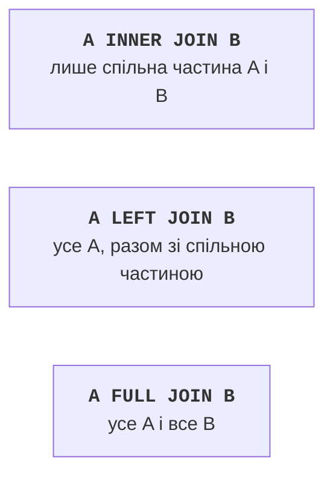

# Мова SQL: таблиці та запити

## Створення таблиць: DDL

Команди SQL поділяють на групи: **DDL** (*Data Definition Language*) створює й змінює структуру (`CREATE`, `ALTER`, `DROP`), **DML** (*Data Manipulation Language*) змінює дані (`INSERT`, `UPDATE`, `DELETE`), запити `SELECT` читають дані, а команди керування транзакціями (`BEGIN`, `COMMIT`, `ROLLBACK`) об’єднують інші команди в одне ціле. Ключові слова SQL не чутливі до регістру, але їх прийнято писати великими літерами. Назви таблиць і стовпців пишуть малими літерами через підкреслення (`pub_year`): назви з великими літерами PostgreSQL перетворює на малі, якщо не взяти їх у подвійні лапки. Рядкові значення беруть в **одинарні** лапки: `'Clean Code'`.

### Приклад «Бібліотека»

Скрипт створює таблиці бази даних з рис. 7.2 (файл `library.sql`, виконується в `psql` командою `\i` або в консолі DataGrip). Команда `DROP TABLE IF EXISTS` на початку дозволяє виконувати скрипт повторно.

```sql
DROP TABLE IF EXISTS loans, book_authors, readers, books, authors;

CREATE TABLE authors (
    id   integer GENERATED ALWAYS AS IDENTITY PRIMARY KEY,
    name varchar(100) NOT NULL
);

CREATE TABLE books (
    id       integer GENERATED ALWAYS AS IDENTITY PRIMARY KEY,
    title    varchar(200) NOT NULL,
    pub_year integer CHECK (pub_year BETWEEN 1450 AND 2100),
    isbn     varchar(17) UNIQUE,
    copies   integer NOT NULL DEFAULT 1 CHECK (copies >= 0)
);

-- Зв’язок N:M: складений первинний ключ із двох зовнішніх.
CREATE TABLE book_authors (
    book_id   integer REFERENCES books (id) ON DELETE CASCADE,
    author_id integer REFERENCES authors (id) ON DELETE RESTRICT,
    PRIMARY KEY (book_id, author_id)
);
```

```sql
CREATE TABLE readers (
    id            integer GENERATED ALWAYS AS IDENTITY PRIMARY KEY,
    name          varchar(100) NOT NULL,
    email         text NOT NULL UNIQUE,
    active        boolean NOT NULL DEFAULT true,
    registered_at timestamptz NOT NULL DEFAULT now()
);

CREATE TABLE loans (
    id        bigint GENERATED ALWAYS AS IDENTITY PRIMARY KEY,
    book_id   integer NOT NULL REFERENCES books (id),
    reader_id integer NOT NULL REFERENCES readers (id),
    issued    date NOT NULL DEFAULT CURRENT_DATE,
    due       date NOT NULL,
    returned  date,
    CHECK (due >= issued)
);

CREATE INDEX ix_loans_reader_id ON loans (reader_id);
```

Порядок команд важливий: таблиця, на яку посилається зовнішній ключ, створюється раніше, а видаляється пізніше. Коментар у SQL починається з двох дефісів `--`.

### Обмеження

**Обмеження** (*constraints*) описують правила цілісності (<https://www.postgresql.org/docs/current/ddl-constraints.html>):

- `PRIMARY KEY` – первинний ключ (унікальний і не `NULL`); складений ключ записують окремим рядком `PRIMARY KEY (book_id, author_id)`;
- `REFERENCES таблиця (стовпець)` – зовнішній ключ. Дія `ON DELETE` визначає, що відбувається під час видалення батьківського рядка: `NO ACTION` або `RESTRICT` (за замовчуванням – заборонити), `CASCADE` (видалити й залежні рядки), `SET NULL` (очистити посилання);
- `NOT NULL` – значення обов’язкове; `UNIQUE` – значення не повторюються;
- `CHECK (умова)` – довільна умова для рядка; `DEFAULT` – значення, якщо його не вказано в `INSERT`.

Під час видалення книги її рядки в `book_authors` видаляються автоматично (`CASCADE`), а автора, у якого є книги, видалити не можна (`RESTRICT`). Обмеженням можна дати назву (`CONSTRAINT ck_books_title CHECK (…)`): вона з’являється в повідомленні про помилку.

### Зміна структури та індекси

Структуру наявної таблиці змінює команда `ALTER TABLE`, а видаляє – `DROP`:

```sql
ALTER TABLE readers ADD COLUMN phone varchar(20);
ALTER TABLE books RENAME COLUMN copies TO in_stock;
DROP TABLE loans;               -- таблицю з даними, назавжди
```

**Індекс** (*index*) – допоміжна структура (зазвичай B-дерево), яка дозволяє знаходити рядки без перегляду всієї таблиці, як предметний покажчик у книзі. PostgreSQL автоматично створює індекси для первинних ключів і обмежень `UNIQUE`, але **не** для зовнішніх ключів. Тому індекс `ix_loans_reader_id` у скрипті прискорює пошук видач читача. Індекси сповільнюють `INSERT` і `UPDATE`, тому їх створюють для стовпців, за якими часто шукають, з’єднують і сортують.

Після виконання скрипту DataGrip будує діаграму схеми за зовнішніми ключами: контекстне меню схеми `public` у *Database Explorer* – *Diagrams → Show Diagram* (рис. 7.5).

::: info Знімок екрана
DataGrip: right-click schema public → Diagrams → Show Diagram; tables authors, books, book\_authors, readers, loans with foreign-key links
:::

Рис. 7.5. Діаграма схеми бази даних у DataGrip {.caption}

## Зміна та вибірка даних

### `INSERT`, `UPDATE`, `DELETE`

Команда `INSERT` додає рядки. Стовпці ідентичності та стовпці зі значенням `DEFAULT` не вказують. Пропозиція `RETURNING` повертає значення вставлених рядків, наприклад згенеровані `id`:

```sql
INSERT INTO authors (name)
VALUES ('Brian Kernighan'), ('Dennis Ritchie'),
       ('Martin Fowler'), ('Robert Martin');

INSERT INTO books (title, pub_year, isbn, copies)
VALUES ('The C Programming Language', 1988, '978-0131103627', 2),
       ('Refactoring', 2018, '978-0134757599', 3),
       ('Clean Code', 2008, '978-0132350884', 1),
       ('Clean Architecture', 2017, '978-0134494166', 0),
       ('UML Distilled', 2003, '978-0321193681', 2);

INSERT INTO book_authors (book_id, author_id)
VALUES (1, 1), (1, 2), (2, 3), (3, 4), (4, 4), (5, 3);
```

```sql
INSERT INTO readers (name, email)
VALUES ('Olena Kovalenko', 'olena@example.com'),
       ('Petro Shevchenko', 'petro@example.com'),
       ('Iryna Bondar', 'iryna@example.com')
RETURNING id, name;

INSERT INTO loans (book_id, reader_id, issued, due, returned)
VALUES (1, 1, '2026-09-01', '2026-09-15', '2026-09-10'),
       (2, 1, '2026-09-05', '2026-09-19', NULL),
       (3, 2, '2026-09-02', '2026-09-16', NULL),
       (2, 2, '2026-09-10', '2026-09-24', NULL),
       (5, 1, '2026-09-12', '2026-09-26', NULL);
```

Для команди з `RETURNING` `psql` спочатку виводить таблицю з `id` і `name` трьох нових читачів (1, 2, 3), а потім назву команди й кількість рядків: `INSERT 0 3`.

Команда `UPDATE` змінює стовпці рядків, які задовольняють умову `WHERE`, а `DELETE` видаляє рядки:

```sql
UPDATE books
SET copies = copies + 1
WHERE id = 3;

DELETE FROM readers
WHERE active = false AND id NOT IN (SELECT reader_id FROM loans);
```

::: tip Увага
`UPDATE` і `DELETE` **без** `WHERE` змінюють або видаляють **усі** рядки таблиці. Перед виконанням такої команди корисно запустити `SELECT` з тією самою умовою і переконатися, що вибрано саме потрібні рядки.
:::

### Запит `SELECT`

Запит `SELECT` повертає таблицю-результат. Його пропозиції записують у визначеному порядку (<https://www.postgresql.org/docs/current/queries-table-expressions.html>):

```sql
SELECT title, pub_year               -- які стовпці
FROM books                           -- з якої таблиці
WHERE title ILIKE '%clean%' AND pub_year >= 2010  -- які рядки
ORDER BY pub_year DESC               -- порядок
LIMIT 10 OFFSET 0;                   -- 10 рядків, пропустити 0
```

- `SELECT *` вибирає всі стовпці; у програмах краще перелічувати потрібні стовпці явно. Псевдонім стовпця задає `AS`: `count(*) AS loans`;
- умови `WHERE` поєднують операторами `AND`, `OR`, `NOT`; є також `BETWEEN a AND b`, `IN (1, 2, 3)`, `LIKE` (шаблон з `%` – будь-які символи, `_` – один символ) та `ILIKE` – розширення PostgreSQL, яке ігнорує регістр;
- `ORDER BY` сортує за зростанням (`ASC`) або спаданням (`DESC`); `LIMIT` і `OFFSET` вибирають «сторінку» результату (пагінація).

**`NULL`** означає «значення невідоме». Будь-яке порівняння з `NULL`, навіть `NULL = NULL`, дає не `true`, а `NULL`, тому рядок не потрапляє в результат. Перевіряють `NULL` лише операторами `IS NULL` та `IS NOT NULL`: умова `returned = NULL` не знаходить жодного рядка, а `returned IS NULL` знаходить неповернуті книги.

### Агрегатні функції та групування

**Агрегатні функції** обчислюють одне значення для набору рядків: `count(*)` – кількість рядків, `count(стовпець)` – кількість не-`NULL` значень, `sum`, `avg`, `min`, `max`. Запит `SELECT count(*), min(pub_year), max(pub_year) FROM books` повертає 5, 1988 і 2018.

Пропозиція `GROUP BY` розбиває рядки на групи з однаковими значеннями, і агрегатні функції обчислюються для кожної групи. У списку `SELECT` можуть бути лише стовпці групування та агрегати. `WHERE` відбирає рядки **до** групування, а `HAVING` – групи **після** нього:

```sql
SELECT a.name, count(*) AS books
FROM authors AS a
JOIN book_authors AS ba ON ba.author_id = a.id
GROUP BY a.name
HAVING count(*) > 1
ORDER BY a.name;
```

```
     name      | books
---------------+-------
 Martin Fowler |     2
 Robert Martin |     2
(2 rows)
```

### З’єднання таблиць

Дані, розкладені нормалізацією на кілька таблиць, збирають разом **з’єднанням** (*join*) (рис. 7.6). Умову з’єднання записують після `ON`, а таблицям дають короткі псевдоніми:

- `INNER JOIN` (або просто `JOIN`) – лише пари рядків, для яких виконується умова;
- `LEFT JOIN` – усі рядки лівої таблиці; якщо пари немає, стовпці правої таблиці містять `NULL`; `RIGHT JOIN` – навпаки;
- `FULL JOIN` – усі рядки обох таблиць.



Рис. 7.6. Типи з’єднань таблиць: сіра область – рядки результату {.caption}

Список книг з авторами з’єднує три таблиці через проміжну `book_authors`:

```sql
SELECT b.title, a.name AS author, b.pub_year
FROM books AS b
JOIN book_authors AS ba ON ba.book_id = b.id
JOIN authors AS a ON a.id = ba.author_id
ORDER BY b.title, a.name;
```

```
           title            |     author      | pub_year
----------------------------+-----------------+----------
 Clean Architecture         | Robert Martin   |     2017
 Clean Code                 | Robert Martin   |     2008
 Refactoring                | Martin Fowler   |     2018
 The C Programming Language | Brian Kernighan |     1988
 The C Programming Language | Dennis Ritchie  |     1988
 UML Distilled              | Martin Fowler   |     2003
(6 rows)
```

Кількість видач кожного читача рахує `LEFT JOIN`, щоб у звіт потрапила й читачка без видач. Функція `count(l.id)` не рахує `NULL`, тому для неї виходить 0, а `FILTER` рахує лише рядки, що задовольняють умову (рис. 7.7):

```sql
SELECT r.name,
       count(l.id) AS loans,
       count(l.id) FILTER (WHERE l.returned IS NULL) AS on_hand
FROM readers AS r
LEFT JOIN loans AS l ON l.reader_id = r.id
GROUP BY r.id, r.name
ORDER BY loans DESC, r.name;
```

```
       name       | loans | on_hand
------------------+-------+---------
 Olena Kovalenko  |     3 |       2
 Petro Shevchenko |     2 |       2
 Iryna Bondar     |     0 |       0
(3 rows)
```

::: info Знімок екрана
DataGrip query console with the SELECT … LEFT JOIN … GROUP BY query above, result grid with 3 rows below, database tree on the left
:::

Рис. 7.7. Виконання запиту в консолі DataGrip {.caption}

### Підзапити

**Підзапит** – запит `SELECT` у дужках усередині іншого запиту. Він може повертати одне значення (`WHERE copies = (SELECT max(copies) FROM books)`) або набір значень для `IN` і `EXISTS`. Наприклад, умова `WHERE id NOT IN (SELECT book_id FROM loans)` вибирає книги, яких ще ніхто не брав (*Clean Architecture*). Прострочені видачі на 20 вересня 2026 року (різниця двох дат – ціле число днів):

```sql
SELECT r.name, b.title, l.due,
       DATE '2026-09-20' - l.due AS days_late
FROM loans AS l
JOIN readers AS r ON r.id = l.reader_id
JOIN books AS b ON b.id = l.book_id
WHERE l.returned IS NULL AND l.due < DATE '2026-09-20'
ORDER BY days_late DESC;
```

```
       name       |    title    |    due     | days_late
------------------+-------------+------------+-----------
 Petro Shevchenko | Clean Code  | 2026-09-16 |         4
 Olena Kovalenko  | Refactoring | 2026-09-19 |         1
(2 rows)
```

Замість фіксованої дати в застосунку використовують `CURRENT_DATE`. Умова `NOT IN` працює правильно, лише якщо підзапит не повертає `NULL` (стовпець `loans.book_id` має `NOT NULL`); в інших випадках надійніше `NOT EXISTS`.
