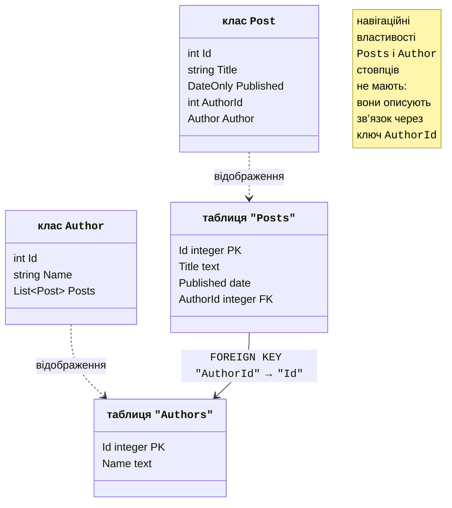
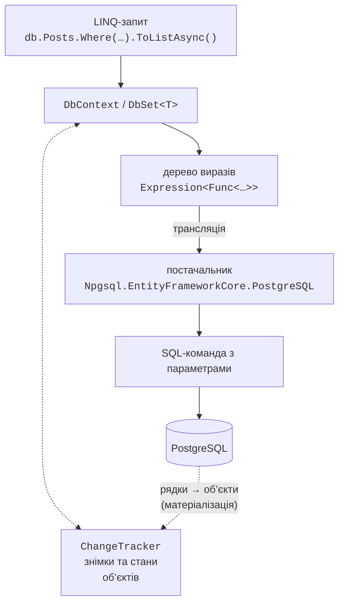
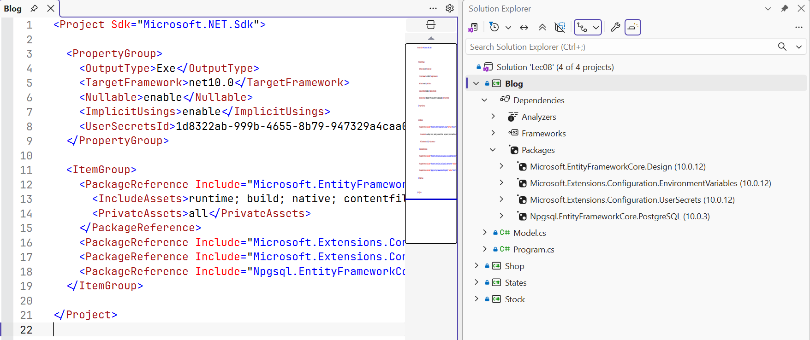
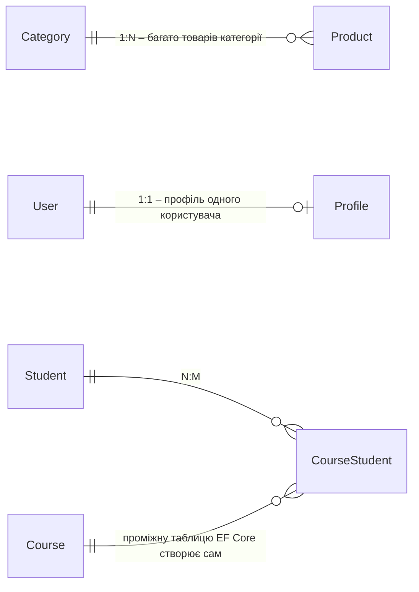

# Контекст даних і модель

## ORM і Entity Framework Core

У темі 7 програма працювала з PostgreSQL через ADO.NET: писала SQL-команди, передавала параметри і вручну перетворювала рядки `NpgsqlDataReader` в об’єкти. Такий код повторюється для кожної таблиці, а помилка в назві стовпця виявляється лише під час виконання.

Об’єктна та реляційна моделі влаштовані по-різному, і цю різницю називають **невідповідністю моделей** (*object-relational impedance mismatch*): об’єкти посилаються один на одного, а таблиці – через значення ключів; колекція `List<Post>` не має відповідника-стовпця; у класів є успадкування, у таблиць його немає; об’єкт має ідентичність у пам’яті, рядок – первинний ключ. **ORM** (*object-relational mapping*, об’єктно-реляційне відображення) – бібліотека, яка долає цю різницю: класи відображаються на таблиці, властивості – на стовпці, посилання – на зовнішні ключі (рис. 8.1), а програміст пише запити мовою C#.



Рис. 8.1. Відображення класів на таблиці {.caption}

**Entity Framework Core** (EF Core) – ORM від Microsoft з відкритим кодом (<https://learn.microsoft.com/ef/core/>). Поточна версія EF Core 10 (листопад 2025) має довгострокову підтримку (LTS) до листопада 2028 року і працює лише на .NET 10. EF Core підтримує різні СКБД через **постачальників** (*database providers*): SQL Server, SQLite, Azure Cosmos DB від Microsoft, а PostgreSQL – через пакет `Npgsql.EntityFrameworkCore.PostgreSQL` від розробників Npgsql (<https://www.npgsql.org/efcore/>).

Порівняння способів доступу до даних:

- **ADO.NET** – повний контроль над SQL і найменші накладні витрати, але багато одноманітного коду;
- **micro-ORM** (наприклад, бібліотека Dapper) – SQL пише програміст, а бібліотека лише перетворює рядки результату в об’єкти;
- **EF Core** – SQL генерується з LINQ-запитів, зміни об’єктів відстежуються і зберігаються одним викликом, схема бази даних створюється і змінюється міграціями.

EF Core підтримує два підходи. У підході **code-first** (спочатку код) програміст пише класи, а EF Core створює за ними таблиці. У підході **database-first** (спочатку база даних) база вже існує, і класи генеруються з неї командою `dotnet ef dbcontext scaffold`. У лекції використовується code-first.

### Як працює EF Core

Застосунок звертається до властивостей `DbSet<T>` об’єкта **контексту** `DbContext` (рис. 8.2). LINQ-запит до `DbSet<T>` не виконується відразу: компілятор C# зберігає його як **дерево виразів** (*expression tree*) – об’єкт, що описує умову `p => p.Price < 1000` як дані, а не як скомпільований код. Постачальник транслює дерево в SQL діалекту PostgreSQL, виконує команду через Npgsql і **матеріалізує** результат – створює об’єкти з рядків. Контекст запам’ятовує завантажені об’єкти в **трекері змін** (`ChangeTracker`), щоб потім зберегти їхні зміни командами `INSERT`, `UPDATE` і `DELETE`.



Рис. 8.2. Архітектура Entity Framework Core {.caption}

## Встановлення та контекст даних

Для роботи з PostgreSQL у проєкт (консольний застосунок .NET 10) додають пакети:

```powershell
dotnet add package Npgsql.EntityFrameworkCore.PostgreSQL
dotnet add package Microsoft.EntityFrameworkCore.Design
$cfg = "Microsoft.Extensions.Configuration"
dotnet add package "$cfg.UserSecrets"
dotnet add package "$cfg.EnvironmentVariables"
```

Пакет постачальника (версія 10.0.3) сам підключає `Microsoft.EntityFrameworkCore`, `Microsoft.EntityFrameworkCore.Relational` і `Npgsql`. Пакет `…Design` потрібен лише інструментам командного рядка, у програму він не потрапляє. У Visual Studio пакети шукають у вікні *Manage NuGet Packages* (рис. 8.3). Для міграцій встановлюють **інструмент** `dotnet-ef` (<https://learn.microsoft.com/ef/core/cli/dotnet>):

```powershell
dotnet tool install --global dotnet-ef   # або update
dotnet ef --version                      # 10.0.12
```



Рис. 8.3. Пакети EF Core у проєкті {.caption}

Базу даних для кожного прикладу створюють окремо в `psql` або DataGrip від імені `postgres` і роблять її власником роль `library_app` з теми 7: `CREATE DATABASE blog_ef OWNER library_app;`. Таблиці створить EF Core. Рядок з’єднання, як і в темі 7, зберігають у секретах користувача:

```powershell
dotnet user-secrets init
$cs = "Host=localhost;Database=blog_ef;" +
      "Username=library_app;Password=Change-Me-2026"
dotnet user-secrets set "ConnectionStrings:Blog" $cs
```

### `DbContext` і `DbSet<T>`

Клас **контексту** успадковує `DbContext` і представляє сеанс роботи з базою даних (<https://learn.microsoft.com/ef/core/dbcontext-configuration/>). Його властивості `DbSet<T>` відповідають таблицям: через них виконують запити й додають об’єкти. Метод `OnConfiguring` вибирає постачальника і рядок з’єднання, метод `OnModelCreating` уточнює модель. Класи, які EF Core відображає на таблиці, називають **сутностями** (*entities*). Модель блогу (файл `Model.cs`):

```cs
using Microsoft.EntityFrameworkCore;
using Microsoft.Extensions.Configuration;

namespace Blog;

public class Author
{
    public int Id { get; set; }
    public string Name { get; set; } = "";
    public List<Post> Posts { get; } = [];
}

public class Post
{
    public int Id { get; set; }
    public string Title { get; set; } = "";
    public DateOnly Published { get; set; }
    public int AuthorId { get; set; }             // зовнішній ключ
    public Author Author { get; set; } = null!;   // навігація
}

public class BlogContext : DbContext
{
    public DbSet<Author> Authors => Set<Author>();
    public DbSet<Post> Posts => Set<Post>();

    // Рядок з’єднання: секрети користувача або змінна середовища
    private static readonly string? ConnectionString =
        new ConfigurationBuilder()
            .AddUserSecrets<BlogContext>()
            .AddEnvironmentVariables()
            .Build()
            .GetConnectionString("Blog");

    protected override void OnConfiguring(
        DbContextOptionsBuilder options) =>
        options.UseNpgsql(ConnectionString);
}
```

Контекст створюють на **одну логічну операцію** і звільняють: `await using var db = new BlogContext();`. У застосунках із впровадженням залежностей (тема 6) контекст отримує параметри через конструктор `BlogContext(DbContextOptions<BlogContext> options) : DbContext(options)` і реєструється методом `services.AddDbContext<BlogContext>(o => o.UseNpgsql(connectionString))`.

## Модель: угоди, анотації та Fluent API

### Угоди

EF Core будує модель за **угодами** (*conventions*) – правилами, які не потребують налаштувань (<https://learn.microsoft.com/ef/core/modeling/>):

- таблиця називається як властивість `DbSet<T>` (`Posts`), стовпець – як властивість;
- властивість `Id` або `<Клас>Id` є **первинним ключем**; ключ типу `int` генерується базою даних (у PostgreSQL – стовпець `GENERATED BY DEFAULT AS IDENTITY`);
- властивість-посилання на іншу сутність (`Author`) або колекція (`Posts`) – **навігаційна властивість**, а `AuthorId` – **зовнішній ключ** зв’язку;
- з увімкненими **nullable reference types** (`<Nullable>enable</Nullable>`) тип `string` стає стовпцем `NOT NULL`, а `string?` – стовпцем, що допускає `NULL`; так само `int` і `int?`.

Типи C# відображаються на типи PostgreSQL (табл. 8.1). Npgsql не змінює регістр назв, тому таблиці мають назви `"Posts"`, `"Authors"` у лапках: у `psql` їх пишуть також у лапках, `SELECT * FROM "Posts";`.

Таблиця 8.1. Відображення типів C# на типи PostgreSQL {.caption}

| **Тип C#** | **Тип PostgreSQL** | **Примітка** |
| --- | --- | --- |
| `int`, `long` | `integer`, `bigint` | ключ – з `IDENTITY` |
| `string` | `text` | з `[MaxLength(n)]` – `character varying(n)` |
| `decimal` | `numeric` | з `[Precision(10, 2)]` – `numeric(10,2)` |
| `bool`, `double` | `boolean`, `double precision` |  |
| `DateOnly`, `TimeOnly` | `date`, `time` |  |
| `DateTime` | `timestamp with time zone` | лише значення з `Kind = Utc` |
| `Guid`, `byte[]` | `uuid`, `bytea` |  |

### Анотації та Fluent API

Якщо угод недостатньо, модель уточнюють двома способами. **Анотації даних** (*data annotations*) – атрибути з просторів імен `System.ComponentModel.DataAnnotations` і `Microsoft.EntityFrameworkCore` над класами та властивостями. **Fluent API** – виклики методів `ModelBuilder` в `OnModelCreating` (табл. 8.2). Fluent API вміє все, що вміють атрибути, і більше (складені ключі, індекси з кількох стовпців, обмеження `CHECK`), а за конфлікту налаштувань має пріоритет.

Таблиця 8.2. Анотації даних і відповідні методи Fluent API {.caption}

| **Анотація** | **Fluent API і призначення** |
| --- | --- |
| `[Key]` | `HasKey(p => p.Code)` – первинний ключ з іншою назвою |
| `[Required]` | `Property(p => p.Name).IsRequired()` – `NOT NULL` |
| `[MaxLength(200)]` | `HasMaxLength(200)` – `character varying(200)` |
| `[Precision(10, 2)]` | `HasPrecision(10, 2)` – `numeric(10,2)` |
| `[Column("title")]`, `[Table("books")]` | `HasColumnName("title")`, `ToTable("books")` |
| `[NotMapped]` | `Ignore(p => p.Total)` – властивість без стовпця |
| `[Index(nameof(Name), IsUnique = true)]` | `HasIndex(t => t.Name).IsUnique()` |
| `[Timestamp]` | `IsRowVersion()` – токен паралельності |
| – | `ToTable(t => t.HasCheckConstraint(…))`, `HasDefaultValueSql("now()")` |

Налаштування однієї сутності зручно винести в окремий клас, що реалізує `IEntityTypeConfiguration<T>` з методом `Configure(EntityTypeBuilder<T> b)`; усі такі класи збірки підключає один виклик `model.ApplyConfigurationsFromAssembly(typeof(ShopContext).Assembly)` в `OnModelCreating`.

Практичне правило: прості обмеження (`[MaxLength]`, `[Precision]`) пишуть атрибутами, бо вони видні поруч із властивістю, а індекси, зв’язки й обмеження бази даних – через Fluent API.

## Зв’язки між сутностями

Зв’язок описується навігаційними властивостями та зовнішнім ключем (<https://learn.microsoft.com/ef/core/modeling/relationships>). Основні види зв’язків показано на рис. 8.4.



Рис. 8.4. Зв’язки між сутностями {.caption}

- **Один до багатьох** (1:N): `Category` має колекцію `List<Product> Products`, а `Product` – ключ `CategoryId` і посилання `Category`. Ключ `int` означає **обов’язковий** зв’язок, `int?` – необов’язковий.
- **Один до одного** (1:1): `User` має посилання `Profile? Profile`, а `Profile` – ключ `UserId` і посилання `User`. Залежною є сутність із зовнішнім ключем.
- **Багато до багатьох** (N:M): `Student` має `List<Course> Courses`, а `Course` – `List<Student> Students`. Проміжну таблицю `CourseStudent` зі складеним ключем EF Core створює сам. Якщо в зв’язку потрібні власні дані (оцінка, дата запису), створюють явну сутність `Enrollment` з двома зв’язками 1:N (зв’язок **з корисним навантаженням**, *payload*).

Зв’язки, які не виводяться за угодами, налаштовують методами `HasOne`/`HasMany` і `WithOne`/`WithMany`:

```cs
model.Entity<Session>()
    .HasOne(s => s.Hall)          // сеанс має один зал
    .WithMany(h => h.Sessions)    // зал має багато сеансів
    .HasForeignKey(s => s.HallId)
    .OnDelete(DeleteBehavior.Restrict);
```

**Каскадне видалення** (*cascade delete*): для обов’язкового зв’язку EF Core за замовчуванням створює `ON DELETE CASCADE` – видалення категорії видаляє і її товари; для необов’язкового ключ залежних об’єктів, завантажених у контекст, отримує `NULL`. Поведінку змінюють методом `OnDelete`: `Restrict` забороняє видаляти головний рядок, поки є залежні (<https://learn.microsoft.com/ef/core/saving/cascade-delete>).

Об’єкт-значення без власного ключа (адреса, діапазон дат) моделюють як **складний тип** (*complex type*): `model.Entity<Customer>().ComplexProperty(c => c.Address);` або атрибут `[ComplexType]` над класом. Його властивості стають стовпцями `Address_City`, `Address_Street` таблиці власника. Старіший механізм **власних типів** (*owned types*, `OwnsOne`) має прихований ключ і поводиться як сутність; для нових моделей документація радить складні типи (<https://learn.microsoft.com/ef/core/modeling/complex-types>).
