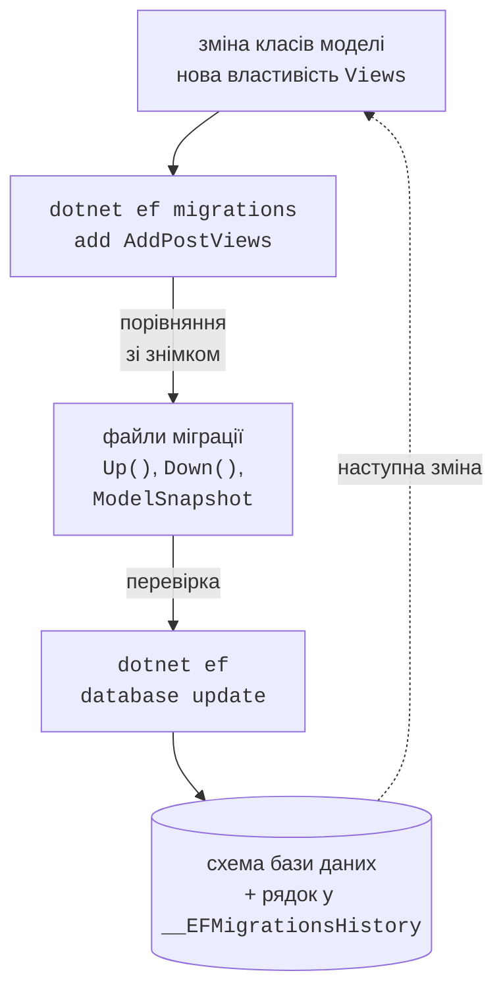
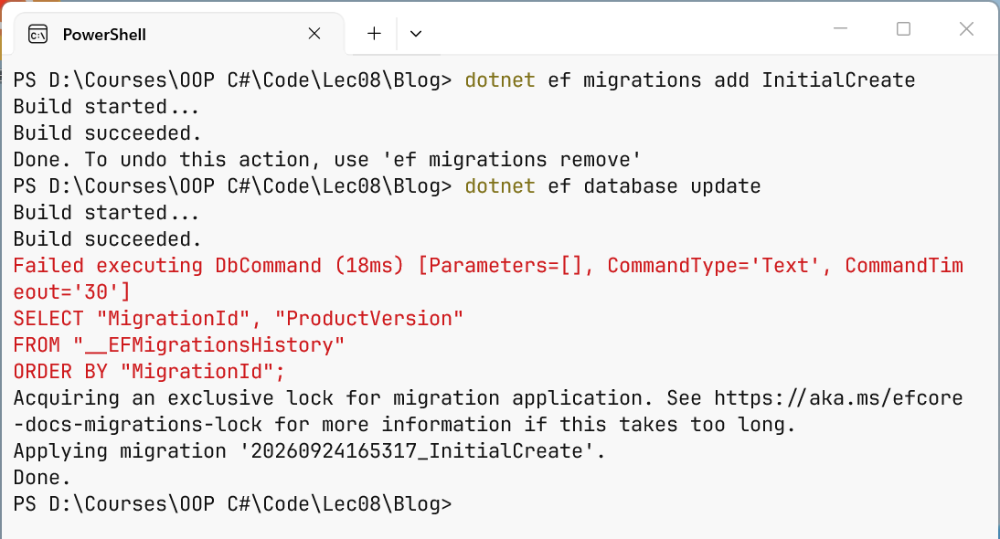
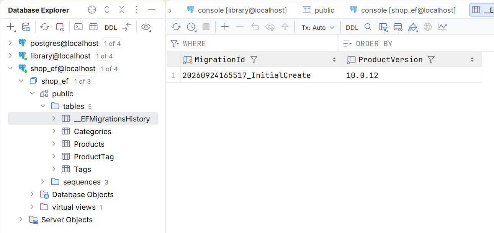

# Міграції та запити LINQ

## Міграції

**Міграція** – клас C# з методами `Up` (застосувати зміну схеми) і `Down` (скасувати її), який EF Core генерує, порівнюючи поточну модель із **знімком моделі** (`ModelSnapshot`) після попередньої міграції (рис. 8.5, <https://learn.microsoft.com/ef/core/managing-schemas/migrations/>).



Рис. 8.5. Робота з міграціями {.caption}

Команди виконують у теці проєкту:

- `dotnet ef migrations add InitialCreate` – створити міграцію в теці `Migrations`;
- `dotnet ef database update` – застосувати всі нові міграції до бази даних;
- `dotnet ef database update AddPostViews` – перейти до вказаної міграції (зайві скасовуються методами `Down`);
- `dotnet ef migrations remove` – видалити останню, ще не застосовану міграцію;
- `dotnet ef migrations list` – список міграцій;
- `dotnet ef migrations script` – SQL-скрипт для адміністратора бази даних;
- `dotnet ef dbcontext scaffold "<рядок з’єднання>" Npgsql.EntityFrameworkCore.PostgreSQL -o Models` – згенерувати контекст і класи з наявної бази (database-first).

У Visual Studio ті самі дії виконують командами `Add-Migration` і `Update-Database` у вікні *Package Manager Console* (пакет `Microsoft.EntityFrameworkCore.Tools`).

Для моделі блогу `dotnet ef migrations add InitialCreate` виводить `Build started...`, `Build succeeded.` і `Done. To undo this action, use 'ef migrations remove'` та створює три файли: `20260924165317_InitialCreate.cs`, `…Designer.cs` і `BlogContextModelSnapshot.cs`. Команда `dotnet ef database update` застосовує міграцію (рис. 8.6). Червоний рядок `Failed executing DbCommand` під час першого запуску не є помилкою: EF Core шукає таблицю історії, якої ще немає, і далі сам її створює. Після `Done.` в базі даних з’являються таблиці `"Authors"`, `"Posts"` і службова таблиця `"__EFMigrationsHistory"` зі стовпцями `MigrationId` і `ProductVersion`, де записано застосовані міграції (рис. 8.7).



Рис. 8.6. Створення та застосування міграції {.caption}

Команда `dotnet ef migrations script` не підключається до бази даних і показує SQL міграції (фрагмент):

```sql
CREATE TABLE "Posts" (
    "Id" integer GENERATED BY DEFAULT AS IDENTITY,
    "Title" text NOT NULL,
    "Published" date NOT NULL,
    "AuthorId" integer NOT NULL,
    CONSTRAINT "PK_Posts" PRIMARY KEY ("Id"),
    CONSTRAINT "FK_Posts_Authors_AuthorId" FOREIGN KEY ("AuthorId")
        REFERENCES "Authors" ("Id") ON DELETE CASCADE
);
CREATE INDEX "IX_Posts_AuthorId" ON "Posts" ("AuthorId");
```

Після додавання до класу `Post` властивості `public int Views { get; set; }` команда `dotnet ef migrations add AddPostViews` генерує міграцію:

```cs
protected override void Up(MigrationBuilder migrationBuilder)
{
    migrationBuilder.AddColumn<int>(
        name: "Views",
        table: "Posts",
        type: "integer",
        nullable: false,
        defaultValue: 0);
}

protected override void Down(MigrationBuilder migrationBuilder)
{
    migrationBuilder.DropColumn(name: "Views", table: "Posts");
}
```

Міграцію завжди **переглядають** перед застосуванням: перейменування властивості EF Core бачить як видалення стовпця і створення нового, тобто втрату даних; у такому разі код міграції виправляють на `RenameColumn`. Міграції зберігаються в Git разом із кодом.



Рис. 8.7. Таблиці, створені міграцією {.caption}

**Початкові дані.** Незмінні довідкові дані (зали кінотеатру, статуси) задають у моделі методом `HasData` з явними ключами: вони потрапляють у міграцію командами `InsertData`. Для решти даних документація радить методи `UseSeeding` і `UseAsyncSeeding` у налаштуваннях контексту: їх викликають `database update`, `Migrate` та `EnsureCreated` (<https://learn.microsoft.com/ef/core/modeling/data-seeding>).

### Приклад «Блог»

Програма додає автора з двома дописами, читає дописи, змінює і видаляє один із них (файл `Program.cs`, модель – у файлі `Model.cs` вище):

```cs
using Blog;
using Microsoft.EntityFrameworkCore;

await using var db = new BlogContext();

// Create: автор і два дописи одним SaveChangesAsync
var author = new Author { Name = "Olena Koval" };
author.Posts.Add(new Post
    { Title = "EF Core basics", Published = new(2026, 9, 1) });
author.Posts.Add(new Post
    { Title = "Migrations", Published = new(2026, 9, 8) });
db.Authors.Add(author);
int saved = await db.SaveChangesAsync();
Console.WriteLine($"Saved rows: {saved}, author Id: {author.Id}");

// Read: дописи автора, відсортовані за датою
var posts = await db.Posts
    .Where(p => p.Author.Name == "Olena Koval")
    .OrderBy(p => p.Published)
    .ToListAsync();
foreach (var p in posts)
    Console.WriteLine($"{p.Id}. {p.Title} ({p.Published:d})");

// Update: змінити властивість і зберегти
var post = await db.Posts.SingleAsync(p => p.Title == "Migrations");
post.Title = "EF Core migrations";
await db.SaveChangesAsync();

// Delete
db.Posts.Remove(post);
await db.SaveChangesAsync();
Console.WriteLine($"Posts left: {await db.Posts.CountAsync()}");
```

Результат першого запуску на порожній базі:

```
Saved rows: 3, author Id: 1
1. EF Core basics (01.09.2026)
2. Migrations (08.09.2026)
Posts left: 1
```

Метод `Add` додає весь граф об’єктів: автора і дописи з його колекції. `SaveChangesAsync` виконує три команди `INSERT`, повертає кількість змінених рядків і записує згенеровані ключі у властивості `Id` та `AuthorId`. Умова `p.Author.Name == …` перетворюється на `JOIN` таблиць `"Posts"` і `"Authors"`. Для зміни не потрібен окремий метод: контекст сам виявляє, що властивість `Title` завантаженого об’єкта змінилася.

## Запити LINQ to Entities

Запит до `DbSet<T>` має тип `IQueryable<T>` і будується методами LINQ (тема дисципліни «ООП»): `Where`, `OrderBy`/`ThenBy`, `Select`, `Skip`/`Take`, `Count`, `Sum`, `Max`, `GroupBy`, `Any` (<https://learn.microsoft.com/ef/core/querying/>). Виконання **відкладене**: SQL надсилається лише тоді, коли потрібен результат, – під час виклику `ToListAsync`, `FirstOrDefaultAsync`, `SingleAsync`, `CountAsync`, `AnyAsync` або під час обходу `await foreach`. Тому запит можна складати поступово:

```cs
IQueryable<Product> query = db.Products;
if (onlyInStock)
    query = query.Where(p => p.Stock > 0);      // ще не виконано
query = query.OrderBy(p => p.Price);
List<Product> list = await query.ToListAsync(); // один SELECT
```

Різниця між `IQueryable<T>` та `IEnumerable<T>` принципова: методи `IQueryable<T>` додаються до SQL-запиту, а методи `IEnumerable<T>` виконуються в пам’яті. Після `AsEnumerable()` або `ToList()` наступний `Where` фільтрує вже завантажені рядки, тобто з бази читається вся таблиця.

### Проєкції, пагінація і групування

**Проєкція** `Select` у запис або анонімний тип читає лише потрібні стовпці і повертає об’єкти, які не відстежуються. **Пагінацію** виконують парою `Skip`/`Take` завжди після `OrderBy`, інакше порядок рядків не визначений. Метод `ToQueryString()` показує SQL, не виконуючи запит; для запиту другої сторінки

```cs
var page = db.Products
    .OrderBy(p => p.Price)
    .Skip((pageNo - 1) * PageSize).Take(PageSize)
    .Select(p => new { p.Name, Category = p.Category.Name, p.Price });
Console.WriteLine(page.ToQueryString());
```

постачальник Npgsql генерує такий SQL:

```sql
-- @p='2'
SELECT p0."Name", c."Name" AS "Category", p0."Price"
FROM (
    SELECT p."CategoryId", p."Name", p."Price"
    FROM "Products" AS p
    ORDER BY p."Price"
    LIMIT @p OFFSET @p
) AS p0
INNER JOIN "Categories" AS c ON p0."CategoryId" = c."Id"
ORDER BY p0."Price"
```

Значення змінних C# стають **параметрами** (`@p`), а не частиною тексту SQL, тому SQL-ін’єкція неможлива. `GroupBy` з агрегатами `Count`, `Sum`, `Max` у `Select` транслюється в `GROUP BY` з функціями `count(*)`, `sum`, `max`, тож рахує сервер, а не програма.

Рядкові методи також транслюються: `p.Name.Contains(text)` дає `LIKE`, а функція PostgreSQL `ILIKE` (без урахування регістру) доступна як `EF.Functions.ILike(p.Name, $"%{text}%")`.

### Трансляція і обчислення на клієнті

Не кожен вираз C# можна перетворити на SQL. Якщо у `Where` викликати власний метод `Rules.IsLong(v.Minutes)`, EF Core кидає виняток `InvalidOperationException` з повідомленням *The LINQ expression … could not be translated* і порадою переписати запит або явно перейти до обчислень у пам’яті через `AsEnumerable()` (<https://learn.microsoft.com/ef/core/querying/client-eval>). Виняток – **останній** `Select`: у ньому такий виклик дозволено, EF Core читає потрібні стовпці і викликає метод для кожного рядка вже в програмі (**обчислення на клієнті**, *client evaluation*).

### Журнал SQL

Щоб бачити всі команди, які виконує контекст, у `OnConfiguring` вмикають **простий журнал** (*simple logging*, <https://learn.microsoft.com/ef/core/logging-events-diagnostics/simple-logging>):

```cs
options.UseNpgsql(ConnectionString)
    .LogTo(Console.WriteLine, LogLevel.Information)
    .EnableSensitiveDataLogging();   // значення параметрів
```

Для кожної команди в консоль виводиться повідомлення `Executed DbCommand` з часом виконання, параметрами і текстом SQL (рис. 8.8). Метод `EnableSensitiveDataLogging` показує значення параметрів замість `?`; його вмикають лише під час розробки, бо в журнал потрапляють дані користувачів. Простір імен `LogLevel` – `Microsoft.Extensions.Logging`.


Рис. 8.8. SQL-запити, згенеровані EF Core {.caption}
