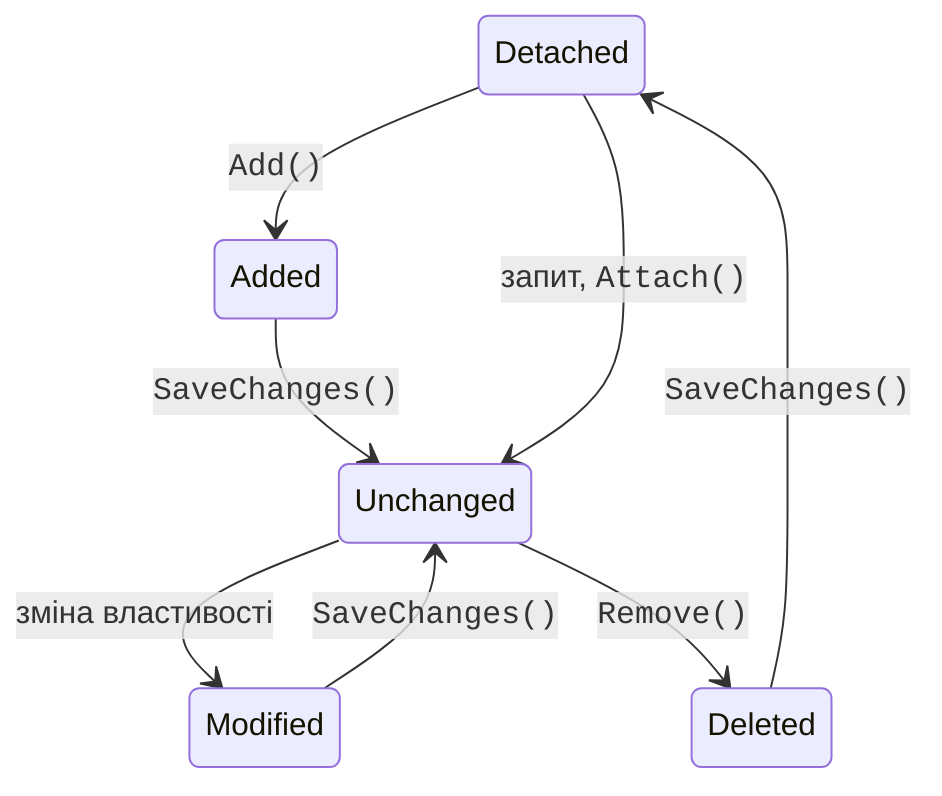
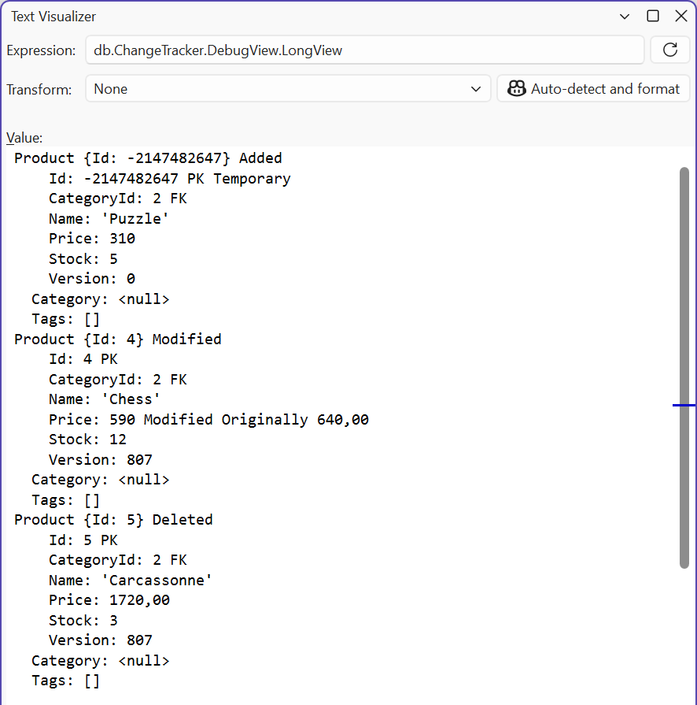

# Пов’язані дані та відстеження змін

## Завантаження пов’язаних даних

Запит `db.Categories.ToListAsync()` читає лише таблицю категорій: колекції `Products` залишаються порожніми. Пов’язані дані завантажують трьома способами (<https://learn.microsoft.com/ef/core/querying/related-data/>).

**Жадібне завантаження** (*eager loading*) – методи `Include` і `ThenInclude` додають до запиту `JOIN`. Усередині `Include` можна фільтрувати й сортувати колекцію:

```cs
var categories = await db.Categories
    .Include(c => c.Products.Where(p => p.Stock > 0))
    .ThenInclude(p => p.Tags)
    .ToListAsync();
```

**Явне завантаження** (*explicit loading*) – дочитати зв’язок уже завантаженого об’єкта: `await db.Entry(category).Collection(c => c.Products).LoadAsync();` або `db.Entry(product).Reference(p => p.Category).LoadAsync()`.

**Ліниве завантаження** (*lazy loading*) завантажує зв’язок автоматично під час першого звернення до властивості. Для нього потрібні пакет `Microsoft.EntityFrameworkCore.Proxies`, виклик `UseLazyLoadingProxies()` і `virtual` навігаційні властивості (<https://learn.microsoft.com/ef/core/querying/related-data/lazy>). Зручність оманлива:

```cs
// Антиприклад: 1 запит категорій + по запиту на кожну категорію
foreach (var c in await db.Categories.ToListAsync())
    Console.WriteLine($"{c.Name}: {c.Products.Count}");
```

Для трьох категорій журнал показує чотири команди `SELECT`, для тисячі – тисячу й одну. Це **проблема N+1 запитів**: кількість звернень до сервера зростає разом із кількістю даних, і кожне додає мережну затримку. Тому в курсі ліниве завантаження не використовується: пов’язані дані завантажують явно через `Include`, а для звітів пишуть **проєкцію**, яка обчислює все в одному запиті: `db.Categories.Select(c => new { c.Name, Count = c.Products.Count })`.

**Розділені запити.** Кілька `Include` колекцій в одному запиті перемножують рядки результату («декартовий вибух»): категорія з 100 товарами, у кожного з яких 5 тегів, дає 500 рядків. Метод `AsSplitQuery()` виконує окремий `SELECT` для кожної колекції (<https://learn.microsoft.com/ef/core/querying/single-split-queries>).

### Приклад «Інтернет-магазин»

Модель магазину містить зв’язки 1:N (категорія – товари) і N:M (товари – теги); таблиці створює міграція `InitialCreate`, база даних `shop_ef`, ключ секретів `ConnectionStrings:Shop` (файл `Model.cs`):

```cs
using System.ComponentModel.DataAnnotations;
using Microsoft.EntityFrameworkCore;
using Microsoft.Extensions.Configuration;

namespace Shop;

public class Category
{
    public int Id { get; set; }
    [MaxLength(100)]
    public required string Name { get; set; }
    public List<Product> Products { get; } = [];      // 1:N
}

public class Product
{
    public int Id { get; set; }
    [MaxLength(200)]
    public required string Name { get; set; }
    [Precision(10, 2)]
    public decimal Price { get; set; }
    public int Stock { get; set; }
    public int CategoryId { get; set; }
    public Category Category { get; set; } = null!;
    public List<Tag> Tags { get; } = [];              // N:M
    [Timestamp]
    public uint Version { get; set; }                 // xmin
}

public class Tag
{
    public int Id { get; set; }
    [MaxLength(50)]
    public required string Name { get; set; }
    public List<Product> Products { get; } = [];      // N:M
}
```

```cs
public class ShopContext : DbContext
{
    public DbSet<Category> Categories => Set<Category>();
    public DbSet<Product> Products => Set<Product>();
    public DbSet<Tag> Tags => Set<Tag>();

    // Рядок з’єднання: секрети користувача або змінна середовища
    private static readonly string? ConnectionString =
        new ConfigurationBuilder()
            .AddUserSecrets<ShopContext>()
            .AddEnvironmentVariables()
            .Build()
            .GetConnectionString("Shop");

    protected override void OnConfiguring(
        DbContextOptionsBuilder options) =>
        options.UseNpgsql(ConnectionString);

    protected override void OnModelCreating(ModelBuilder model)
    {
        model.Entity<Tag>().HasIndex(t => t.Name).IsUnique();
        model.Entity<Product>().ToTable(t => t.HasCheckConstraint(
            "CK_Products_Stock", "\"Stock\" >= 0"));
    }
}
```

Міграція створює таблиці `"Categories"`, `"Products"`, `"Tags"` і проміжну таблицю `"ProductTag"` зі стовпцями `"ProductsId"`, `"TagsId"` і складеним первинним ключем. Властивість `Version` стовпця не отримує: вона відображається на системний стовпець PostgreSQL `xmin` (розділ «Транзакції та паралельний доступ»). Програма заповнює порожню базу і виконує три запити (файл `Program.cs`):

```cs
using Microsoft.EntityFrameworkCore;
using Shop;

await using var db = new ShopContext();
if (!await db.Categories.AnyAsync())
{
    var sale = new Tag { Name = "sale" };
    var hit = new Tag { Name = "hit" };
    var books = new Category { Name = "Books" };
    var games = new Category { Name = "Games" };
    Product P(string name, decimal price, int stock, Category c,
        params Tag[] tags)
    {
        var p = new Product
        {
            Name = name, Price = price, Stock = stock, Category = c
        };
        p.Tags.AddRange(tags);
        return p;
    }
    db.Products.AddRange(
        P("C# in Depth", 1250m, 4, books, hit),
        P("Clean Code", 890.5m, 0, books, sale),
        P("Pro EF Core", 1490m, 7, books),
        P("Chess", 640m, 12, games, sale, hit),
        P("Carcassonne", 1720m, 3, games));
    await db.SaveChangesAsync();
}
```

```cs
// 1:N – категорії з товарами, відсортованими за ціною
var categories = await db.Categories
    .OrderBy(c => c.Name)
    .Include(c => c.Products.OrderBy(p => p.Price))
    .ThenInclude(p => p.Tags.OrderBy(t => t.Name))
    .AsNoTracking()
    .ToListAsync();
foreach (var c in categories)
{
    Console.WriteLine($"{c.Name}:");
    foreach (var p in c.Products)
    {
        var tags = string.Join(", ", p.Tags.Select(t => t.Name));
        Console.WriteLine($"  {p.Name,-12} {p.Price,9:N2} {tags}");
    }
}

// Проєкція в DTO і пагінація: друга сторінка по 2 товари
const int PageSize = 2;
int pageNo = 2;
List<ProductRow> page = await db.Products
    .OrderBy(p => p.Price)
    .Skip((pageNo - 1) * PageSize)
    .Take(PageSize)
    .Select(p => new ProductRow(p.Name, p.Category.Name, p.Price))
    .ToListAsync();
Console.WriteLine($"Page {pageNo}: " +
    string.Join("; ", page.Select(r => $"{r.Name} ({r.Category})")));

// Групування й агрегати виконуються в базі даних
var stats = await db.Products
    .GroupBy(p => p.Category.Name)
    .Select(g => new
    {
        Category = g.Key,
        Count = g.Count(),
        InStock = g.Sum(p => p.Stock),
        MaxPrice = g.Max(p => p.Price)
    })
    .OrderBy(s => s.Category)
    .ToListAsync();
foreach (var s in stats)
    Console.WriteLine($"{s.Category}: {s.Count} products, " +
        $"{s.InStock} in stock, max {s.MaxPrice:N2}");

record ProductRow(string Name, string Category, decimal Price);
```

Результат:

```
Books:
  Clean Code      890,50 sale
  C# in Depth   1 250,00 hit
  Pro EF Core   1 490,00
Games:
  Chess           640,00 hit, sale
  Carcassonne   1 720,00
Page 2: C# in Depth (Books); Pro EF Core (Books)
Books: 3 products, 11 in stock, max 1 490,00
Games: 2 products, 15 in stock, max 1 720,00
```

Перший запит транслюється в один `SELECT` з двома `LEFT JOIN` (категорії – товари – теги через `"ProductTag"`) і сортуванням `ORDER BY c."Name", c."Id", s0."Price", …`: EF Core додає ключі до сортування, щоб зібрати рядки назад у колекції. Для додавання тегів до товару достатньо `p.Tags.AddRange(tags)`: рядки проміжної таблиці EF Core вставляє сам. `AsNoTracking()` пришвидшує запит, дані якого лише показуються (розділ «Відстеження змін»).

## Відстеження змін

Контекст зберігає для кожного завантаженого або доданого об’єкта **запис** (*entry*) зі станом і знімком початкових значень властивостей (<https://learn.microsoft.com/ef/core/change-tracking/>). Стан описує перелічення `EntityState` (рис. 8.9):

- `Detached` – об’єкт контекстом не відстежується;
- `Added` – новий, під час збереження буде `INSERT`;
- `Unchanged` – завантажений і не змінений;
- `Modified` – змінено хоча б одну властивість, буде `UPDATE` лише змінених стовпців;
- `Deleted` – позначений методом `Remove`, буде `DELETE`.



Рис. 8.9. Стани сутностей у `ChangeTracker` {.caption}

`SaveChangesAsync` викликає `ChangeTracker.DetectChanges()`, порівнює поточні значення зі знімками, виконує команди **в одній транзакції** і переводить записи в стан `Unchanged` (видалені – у `Detached`). Метод `Update(entity)` позначає як `Modified` **усі** властивості об’єкта, створеного поза контекстом (наприклад, отриманого з форми), а `Attach(entity)` – додає його як `Unchanged`. Стан запису можна прочитати і змінити: `db.Entry(product).State`, початкове значення властивості – `db.Entry(product).Property(p => p.Price).OriginalValue`. Текстовий опис усіх записів дає властивість `db.ChangeTracker.DebugView.LongView`, її зручно переглядати в налагоджувачі (рис. 8.10).



Рис. 8.10. Стан відстеження змін у налагоджувачі {.caption}

**Запити без відстеження.** Знімки й записи потребують пам’яті та часу. Для даних, які лише показуються, використовують `AsNoTracking()` (<https://learn.microsoft.com/ef/core/querying/tracking>); змінити такі об’єкти через `SaveChanges` не вийде, бо контекст про них не знає.

**Пакетні операції.** Щоб змінити або видалити тисячі рядків, не варто завантажувати їх в пам’ять. Методи `ExecuteUpdateAsync` і `ExecuteDeleteAsync` одразу виконують одну команду `UPDATE` або `DELETE` за умовою запиту, минаючи `ChangeTracker` (<https://learn.microsoft.com/ef/core/saving/execute-insert-update-delete>). В EF Core 10 параметр `ExecuteUpdateAsync` – звичайний лямбда-вираз, тому в ньому можна писати `if` і додавати `SetProperty` за умовою. Завантажені раніше об’єкти про такі зміни не дізнаються.

### Приклад «Стани сутностей»

Програма працює з базою `shop_ef` після прикладу «Інтернет-магазин» і показує стани записів до і після збереження, запит без відстеження та пакетні операції:

```cs
using Microsoft.EntityFrameworkCore;
using Shop;

await using var db = new ShopContext();

var chess = await db.Products.SingleAsync(p => p.Name == "Chess");
Console.WriteLine($"Loaded: {db.Entry(chess).State}");

chess.Price = 590m;                                  // Modified
var puzzle = new Product
    { Name = "Puzzle", Price = 310m, Stock = 5,
      CategoryId = chess.CategoryId };
db.Products.Add(puzzle);                             // Added
var old = await db.Products
    .SingleAsync(p => p.Name == "Carcassonne");
db.Products.Remove(old);                             // Deleted

db.ChangeTracker.DetectChanges();       // оновити стани
Console.Write(db.ChangeTracker.DebugView.ShortView);
var price = db.Entry(chess).Property(p => p.Price);
Console.WriteLine($"Price: {price.OriginalValue} -> " +
    $"{price.CurrentValue}");

int saved = await db.SaveChangesAsync();
Console.WriteLine($"Saved: {saved}; Chess: {db.Entry(chess).State}" +
    $", Carcassonne: {db.Entry(old).State}, Puzzle Id: {puzzle.Id}");

// Запит без відстеження: об’єкти не потрапляють у ChangeTracker
db.ChangeTracker.Clear();
var all = await db.Products.AsNoTracking().ToListAsync();
Console.WriteLine($"Read {all.Count} products, tracked: " +
    $"{db.ChangeTracker.Entries().Count()}");

// Пакетні операції: один SQL-запит, без завантаження об’єктів
int updated = await db.Products
    .Where(p => p.Category.Name == "Books")
    .ExecuteUpdateAsync(s =>
        s.SetProperty(p => p.Price, p => p.Price * 0.9m));
int deleted = await db.Products
    .Where(p => p.Stock == 0)
    .ExecuteDeleteAsync();
Console.WriteLine($"Updated: {updated}, deleted: {deleted}");
```

Результат:

```
Loaded: Unchanged
Product {Id: -2147482642} Added FK {CategoryId: 2}
Product {Id: 4} Modified FK {CategoryId: 2}
Product {Id: 5} Deleted FK {CategoryId: 2}
Price: 640,00 -> 590
Saved: 3; Chess: Unchanged, Carcassonne: Detached, Puzzle Id: 6
Read 5 products, tracked: 0
Updated: 3, deleted: 1
```

Новий об’єкт до збереження має **тимчасовий** від’ємний ключ, а після `SaveChangesAsync` – справжній, згенерований базою. `DebugView` сам не викликає `DetectChanges`, тому без явного виклику зміна ціни ще не видна. Початкове значення `640,00` прочитане зі стовпця `numeric(10,2)` і зберігає два знаки після коми. Пакетне оновлення змінило три книги, а `ExecuteDeleteAsync` видалив товар із нульовим залишком.
