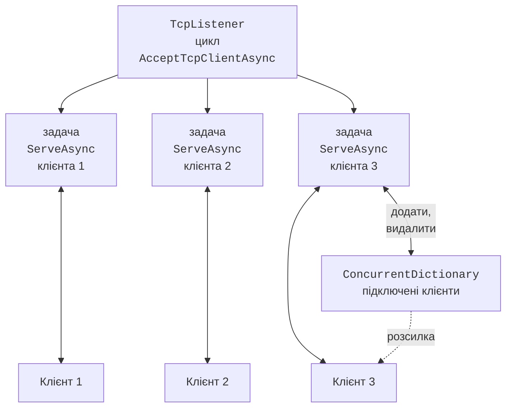
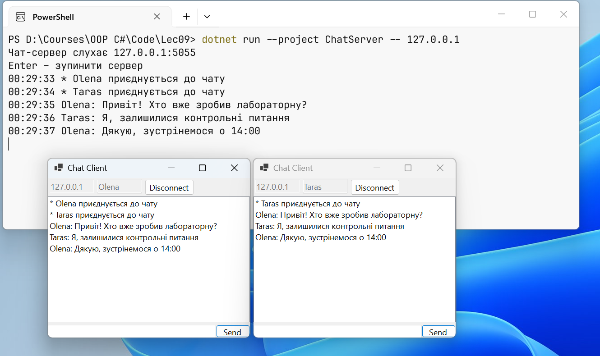
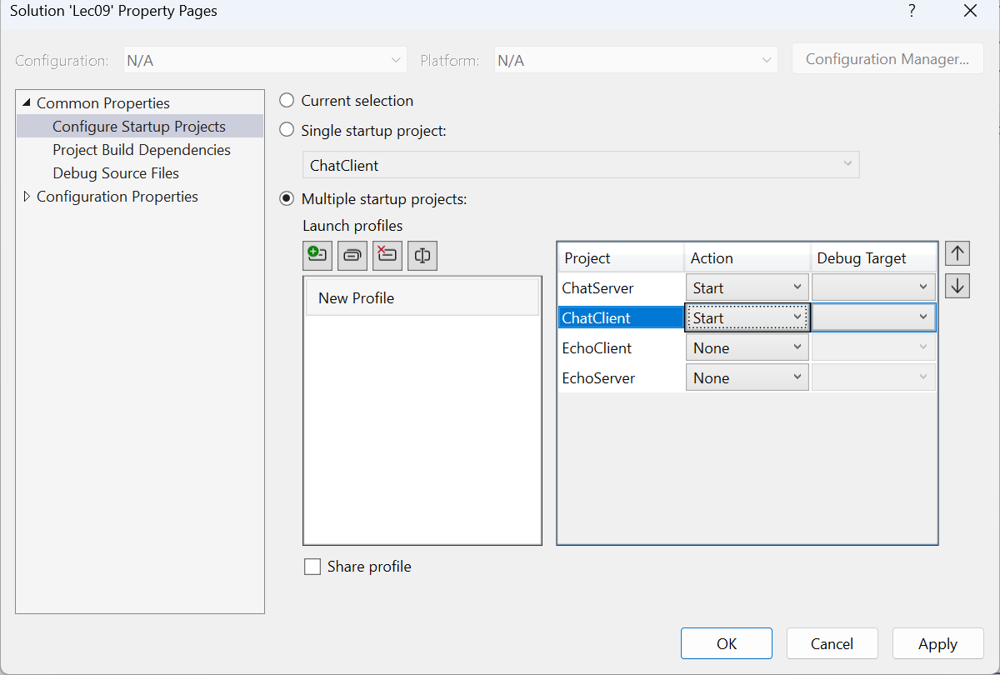

# Обслуговування кількох клієнтів

## Обслуговування кількох клієнтів

Ехо-сервер обслуговує клієнтів по черзі. Щоб обслуговувати їх одночасно, цикл прийому для кожного клієнта запускає окрему **асинхронну задачу** і, не чекаючи її завершення, приймає наступного (рис. 9.7). Асинхронна задача не займає потік, поки чекає на дані, тому один сервер обслуговує сотні з’єднань.

Задачі клієнтів виконуються паралельно в різних потоках пулу, тому спільні дані потребують захисту:

- колекцію підключених клієнтів зберігають у `ConcurrentDictionary<TKey, TValue>` (<https://learn.microsoft.com/dotnet/api/system.collections.concurrent.concurrentdictionary-2>), який безпечно змінювати з кількох потоків;
- в один `NetworkStream` не можна одночасно писати з двох задач: байти двох повідомлень перемішаються. Запис серіалізують блокуванням; для асинхронного коду – `SemaphoreSlim`, бо всередині `lock` не можна використовувати `await`.



Рис. 9.7. Сервер, що обслуговує кількох клієнтів {.caption}

**Коректне завершення** (*graceful shutdown*) сервера: припинити прийом нових з’єднань, повідомити клієнтів, дочекатися завершення їхніх задач і закрити сокети. Сигнал зупинки передають **токеном скасування** `CancellationToken` (<https://learn.microsoft.com/dotnet/standard/threading/cancellation-in-managed-threads>): методи `AcceptTcpClientAsync(token)` і `ReadLineAsync(token)` після виклику `Cancel()` спричиняють `OperationCanceledException`. Клієнт завершує роботу так само коректно: `Shutdown(SocketShutdown.Send)` повідомляє серверу, що запитів більше не буде (сервер прочитає кінець потоку), після чого клієнт дочитує відповіді й закриває сокет.

### Приклад «Чат»

Сервер чату приймає будь-яку кількість клієнтів. Перший рядок від клієнта – ім’я, кожен наступний – повідомлення, яке сервер розсилає всім. Адресу прослуховування можна задати аргументом: без аргументу сервер слухає всі інтерфейси (під час першого запуску з’явиться запит брандмауера), а з аргументом `127.0.0.1` – лише цей комп’ютер. Клавіша **Enter** у вікні сервера зупиняє його.

```cs
using System.Collections.Concurrent;
using System.Net;
using System.Net.Sockets;
using System.Text;

Console.OutputEncoding = Encoding.UTF8;

// Адреса з аргументу; без аргументу – усі мережні інтерфейси.
IPAddress address = args.Length > 0
    ? IPAddress.Parse(args[0]) : IPAddress.Any;
var clients = new ConcurrentDictionary<int, StreamWriter>();
var sendLock = new SemaphoreSlim(1, 1);
var tasks = new List<Task>();
int lastId = 0;

using var stop = new CancellationTokenSource();
_ = Task.Run(() => { Console.ReadLine(); stop.Cancel(); });

var listener = new TcpListener(address, 5055);
listener.Start();
Console.WriteLine($"Чат-сервер слухає {listener.LocalEndpoint}");
Console.WriteLine("Enter – зупинити сервер");
try
{
    while (true)
    {
        TcpClient client =
            await listener.AcceptTcpClientAsync(stop.Token);
        int id = Interlocked.Increment(ref lastId);
        tasks.Add(ServeAsync(id, client, stop.Token));
    }
}
catch (OperationCanceledException)
{
    listener.Stop();        // нові з’єднання більше не приймаються
}
await Task.WhenAll(tasks);  // дочекатися завершення всіх клієнтів
Console.WriteLine("Сервер зупинено");

async Task ServeAsync(int id, TcpClient client,
    CancellationToken token)
{
    using (client)
    {
        NetworkStream stream = client.GetStream();
        var reader = new StreamReader(stream, Encoding.UTF8);
        var writer = new StreamWriter(stream, new UTF8Encoding(false))
        {
            AutoFlush = true,
            NewLine = "\n"
        };
        string? name = null;
        try
        {
            // Перший рядок від клієнта – ім’я користувача.
            name = (await reader.ReadLineAsync(token))?.Trim();
            if (name is null || name.Length is 0 or > 20) return;
            clients[id] = writer;
            await BroadcastAsync($"* {name} приєднується до чату");

            string? line;
            while ((line = await reader.ReadLineAsync(token)) != null)
            {
                if (line.Length > 500) line = line[..500];
                await BroadcastAsync($"{name}: {line}");
            }
        }
        catch (OperationCanceledException)
        {
            await writer.WriteLineAsync("* Сервер зупиняється");
        }
        catch (IOException)
        {
            // З’єднання розірвано без коректного закриття.
        }
        finally
        {
            if (clients.TryRemove(id, out _))
            {
                await BroadcastAsync($"* {name} виходить із чату");
            }
        }
    }
}

async Task BroadcastAsync(string message)
{
    Console.WriteLine($"{DateTime.Now:HH:mm:ss} {message}");
    await sendLock.WaitAsync();     // один запис у мережу за раз
    try
    {
        foreach ((int id, StreamWriter writer) in clients)
        {
            try
            {
                await writer.WriteLineAsync(message);
            }
            catch (Exception ex)
                when (ex is IOException or ObjectDisposedException)
            {
                clients.TryRemove(id, out _);
            }
        }
    }
    finally
    {
        sendLock.Release();
    }
}
```

Метод `Interlocked.Increment` атомарно збільшує лічильник ідентифікаторів. Вираз `line[..500]` обрізає задовге повідомлення. Задача `ServeAsync` завершується, коли клієнт закриває з’єднання (`ReadLineAsync` повертає `null`), коли з’єднання розривається (`IOException`) або коли сервер зупиняється; у всіх випадках блок `finally` видаляє клієнта зі словника і повідомляє інших.

Клієнт – застосунок Windows Forms (рис. 9.8). Проєкт створено шаблоном *Windows Forms App*, файли `Form1.cs` і `Form1.Designer.cs` видалено, а `Program.cs` запускає `new ChatForm()`. Форму побудовано в коді:

```cs
using System.Net.Sockets;
using System.Text;

namespace ChatClient;

public class ChatForm : Form
{
    private readonly TextBox hostBox = new() { Text = "127.0.0.1" };
    private readonly TextBox nameBox = new()
    {
        PlaceholderText = "Name"
    };
    private Button connectButton = new()
    {
        Text = "Connect", AutoSize = true
    };
    private ListBox messages = new() { Dock = DockStyle.Fill };
    private TextBox inputBox = new() { Dock = DockStyle.Fill };
    private readonly Button sendButton = new()
    {
        Text = "Send", Dock = DockStyle.Right, Enabled = false
    };
    private TcpClient? client;
    private StreamWriter? writer;
    private CancellationTokenSource? cts;

    public ChatForm()
    {
        Text = "Chat Client";
        AutoScaleDimensions = new SizeF(96, 96); // розміри для 100 %
        AutoScaleMode = AutoScaleMode.Dpi;       // масштаб під DPI
        ClientSize = new Size(460, 360);
        var top = new FlowLayoutPanel
        {
            Dock = DockStyle.Top, AutoSize = true
        };
        top.Controls.AddRange([hostBox, nameBox, connectButton]);
        var bottom = new Panel
        {
            Dock = DockStyle.Bottom, Height = 28
        };
        bottom.Controls.AddRange([inputBox, sendButton]);
        Controls.AddRange([messages, bottom, top]);
        AcceptButton = sendButton;      // Enter надсилає рядок

        connectButton.Click += async (_, _) => await ConnectAsync();
        sendButton.Click += async (_, _) => await SendAsync();
        FormClosing += (_, _) => Disconnect();
    }

    private async Task ConnectAsync()
    {
        if (client != null)
        {
            Disconnect();
            return;
        }
        connectButton.Enabled = false;
        try
        {
            client = new TcpClient();
            await client.ConnectAsync(hostBox.Text, 5055);
            NetworkStream stream = client.GetStream();
            writer = new StreamWriter(stream, new UTF8Encoding(false))
            {
                AutoFlush = true,
                NewLine = "\n"
            };
            await writer.WriteLineAsync(nameBox.Text);
            cts = new CancellationTokenSource();
            SetConnected(true);
            _ = ReceiveAsync(new StreamReader(stream), cts.Token);
        }
        catch (SocketException ex)
        {
            Disconnect();
            messages.Items.Add($"* {ex.Message}");
        }
        connectButton.Enabled = true;
    }

    // await не блокує потік інтерфейсу, а продовження виконується
    // в ньому ж, тому ListBox можна змінювати без Invoke.
    private async Task ReceiveAsync(StreamReader reader,
        CancellationToken token)
    {
        try
        {
            string? line;
            while ((line = await reader.ReadLineAsync(token)) != null)
            {
                messages.Items.Add(line);
                messages.TopIndex = messages.Items.Count - 1;
            }
            messages.Items.Add("* Connection closed by server");
        }
        catch (Exception) when (token.IsCancellationRequested)
        {
            return;                 // користувач сам відключився
        }
        catch (IOException ex)
        {
            messages.Items.Add($"* Connection lost: {ex.Message}");
        }
        Disconnect();
    }

    private async Task SendAsync()
    {
        if (writer is null || inputBox.Text.Length == 0) return;
        try
        {
            await writer.WriteLineAsync(inputBox.Text);
            inputBox.Clear();
        }
        catch (IOException)
        {
            Disconnect();
        }
    }

    private void Disconnect()
    {
        cts?.Cancel();
        client?.Dispose();          // закриває сокет і потік
        client = null;
        writer = null;
        SetConnected(false);
    }

    private void SetConnected(bool connected)
    {
        connectButton.Text = connected ? "Disconnect" : "Connect";
        hostBox.Enabled = nameBox.Enabled = !connected;
        sendButton.Enabled = connected;
    }
}
```

Цикл прийому `ReceiveAsync` запускається без `await` і працює, доки відкрите з’єднання. Кожен `await` звільняє потік інтерфейсу, тому вікно реагує на введення, а продовження після `await` виконується знову в потоці інтерфейсу (контекст синхронізації Windows Forms), і елементи керування можна змінювати без `Invoke`. Натискання *Disconnect* скасовує токен і закриває `TcpClient`.

Для перевірки сервер запущено з аргументом `127.0.0.1`, а до нього підключено два клієнти (Olena і Taras); Taras надіслав повідомлення і відключився. Вікно Olena містить ті самі повідомлення без часу, а журнал сервера містить рядки з часом на кшталт `14:23:32 Olena: Привіт! Хто вже зробив лабораторну?` і `14:23:33 * Taras виходить із чату`.

Якщо натиснути **Enter** у вікні сервера, поки клієнти підключені, кожен клієнт отримує `* Сервер зупиняється` і `* Connection closed by server`, а сервер виводить `Сервер зупинено` лише після завершення всіх задач клієнтів.



Рис. 9.8. Два клієнти чату Windows Forms і консоль сервера {.caption}

Щоб запускати сервер і клієнт однією командою у Visual Studio 2026, додайте обидва проєкти в одне рішення, у контекстному меню рішення оберіть *Configure Startup Projects…*, позначте *Multiple startup projects* і встановіть для обох проєктів дію *Start* (рис. 9.9) (<https://learn.microsoft.com/visualstudio/ide/how-to-set-multiple-startup-projects>). Сервер має бути першим у списку. Другий екземпляр клієнта запускають командою *Debug → Start New Instance* у контекстному меню проєкту.



Рис. 9.9. Одночасний запуск сервера та клієнта {.caption}
