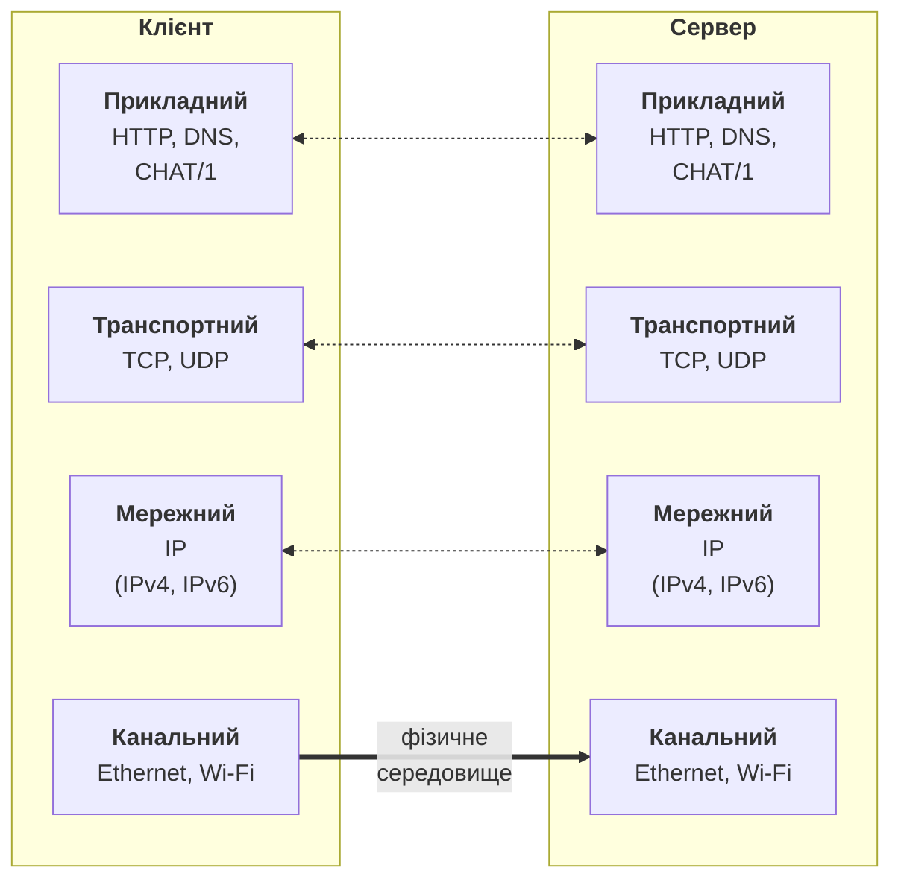
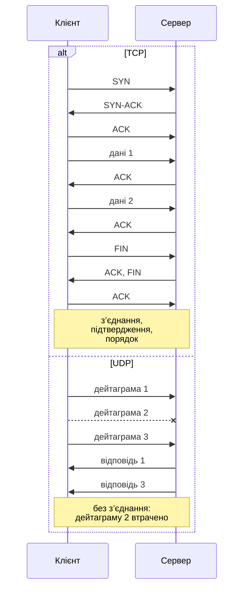
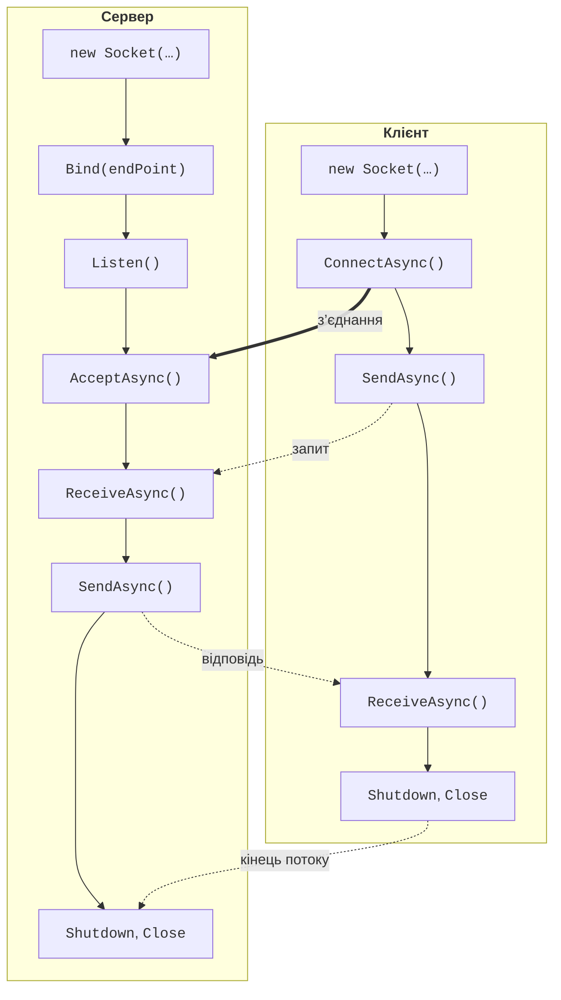

# Мережі, TCP, UDP і Socket

## Основи мереж

Мережний застосунок складається щонайменше з двох програм, що обмінюються даними. **Сервер** (*server*) чекає на запити й обслуговує їх, **клієнт** (*client*) звертається до сервера. Так працюють браузер і вебсервер, поштова програма й поштовий сервер, мережна гра. Програми можуть працювати на різних комп’ютерах або на одному: для навчання зручно запускати сервер і клієнт на одному комп’ютері в двох вікнах терміналу.

### Стек протоколів TCP/IP

**Протокол** (*protocol*) – набір правил обміну даними: формат повідомлень, їх порядок і реакція на помилки. Мережні протоколи утворюють **стек** із рівнів. Навчальна модель OSI має сім рівнів, а в Інтернеті використовується простіша модель TCP/IP із чотирьох рівнів (рис. 9.1):

- **канальний** – передає кадри в межах однієї мережі (Ethernet, Wi-Fi);
- **мережний** – доставляє пакети між мережами за IP-адресами (протокол IP);
- **транспортний** – передає дані між програмами за номерами портів (TCP, UDP);
- **прикладний** – протоколи конкретних застосунків (HTTP, DNS і власні протоколи).



Рис. 9.1. Стек протоколів TCP/IP {.caption}

Кожен рівень користується послугами нижчого: програма передає дані транспортному рівню, той ділить їх на сегменти, мережний рівень упаковує сегменти в IP-пакети і так далі. На комп’ютері отримувача дані піднімаються стеком угору. Програміст C# працює на межі прикладного й транспортного рівнів: його програма формує прикладні повідомлення, а доставку виконують операційна система та мережне обладнання.

### IP-адреси

**IP-адреса** (*IP address*) ідентифікує мережний інтерфейс комп’ютера. Використовуються дві версії:

- **IPv4** – 32-бітова адреса, записана чотирма числами 0–255: `192.168.1.20`;
- **IPv6** – 128-бітова адреса, записана шістнадцятковими групами: `2001:db8::15`.

Особливі адреси: `127.0.0.1` (IPv6: `::1`) – **петлева адреса** (*loopback*) «цей комп’ютер», дані до неї не виходять у мережу; `0.0.0.0` (`::`) у сервері означає «усі мережні інтерфейси»; `255.255.255.255` – широкомовна адреса локальної мережі. Адреси `10.x.x.x`, `172.16–31.x.x` і `192.168.x.x` є приватними: їх використовують у домашніх і навчальних мережах. У .NET адресу описує клас `IPAddress`, а пару «адреса + порт» – клас `IPEndPoint`.

### Порти

**Порт** (*port*) – число від 0 до 65 535, яке визначає програму на комп’ютері: на одній IP-адресі можуть одночасно працювати вебсервер, поштовий сервер і чат. Порти 0–1023 закріплені за відомими службами (HTTP – 80, HTTPS – 443, DNS – 53), 1024–49 151 можна реєструвати для застосунків, а 49 152–65 535 операційна система видає клієнтам тимчасово. Реєстр портів веде IANA (<https://www.iana.org/assignments/service-names-port-numbers/service-names-port-numbers.xhtml>). Приклади лекції використовують порти 5050–5070: вони не зайняті стандартними службами. Один порт одного протоколу на одній адресі може слухати лише одна програма.

### Доменні імена та DNS

Людям зручніше пам’ятати імена (`learn.microsoft.com`), ніж адреси. Перетворення імені на адреси виконує служба **DNS** (*Domain Name System*), а в .NET – клас `Dns` (<https://learn.microsoft.com/dotnet/api/system.net.dns>):

```cs
using System.Net;

IPAddress[] addresses = await Dns.GetHostAddressesAsync("localhost");
foreach (IPAddress address in addresses)
{
    Console.WriteLine($"{address,-24} {address.AddressFamily}");
}
```

Програма виводить дві адреси: `::1` (`InterNetworkV6`) і `127.0.0.1` (`InterNetwork`). Для сайту метод повертає одну або кілька адрес, які залежать від місця запиту.

## Протоколи TCP і UDP

Транспортний рівень пропонує два основні протоколи (рис. 9.2).

**TCP** (*Transmission Control Protocol*, <https://www.rfc-editor.org/rfc/rfc9293>) встановлює **з’єднання** (*connection*) трьома повідомленнями SYN, SYN-ACK, ACK (**трійне рукостискання**), нумерує байти, підтверджує отримання, повторно надсилає втрачені дані й віддає їх отримувачу в правильному порядку. Для програми з’єднання TCP виглядає як двонапрямлений **потік байтів**, подібний до файлу.

**UDP** (*User Datagram Protocol*, <https://www.rfc-editor.org/rfc/rfc768>) з’єднання не встановлює: програма надсилає окремі **дейтаграми** (*datagrams*), кожна з яких доходить цілою, але може загубитися, продублюватися або прийти не в тому порядку. Зате UDP швидкий, не має затримок на встановлення з’єднання і підтримує широкомовне розсилання. TCP використовують веб, пошта, передавання файлів і чати, UDP – DNS, потокове відео й звук, ігри, пошук у мережі.



Рис. 9.2. Обмін даними за протоколами TCP і UDP {.caption}

## Клас `Socket`

**Сокет** (*socket*) – об’єкт операційної системи, через який програма надсилає й отримує дані мережею. У .NET його представляє клас `Socket` із простору імен `System.Net.Sockets` (<https://learn.microsoft.com/dotnet/api/system.net.sockets.socket>). Конструктор приймає три параметри: сімейство адрес `AddressFamily` (`InterNetwork` – IPv4, `InterNetworkV6` – IPv6), тип сокета `SocketType` (`Stream` – потік, `Dgram` – дейтаграми) і протокол `ProtocolType` (`Tcp`, `Udp`).

Життєвий цикл сокетів TCP показано на рис. 9.3, а основні методи – у табл. 9.1. Сервер **прив’язує** (*bind*) сокет до адреси й порту, переводить його в режим **прослуховування** (*listen*) і **приймає** (*accept*) з’єднання: для кожного клієнта метод `AcceptAsync` повертає новий сокет, а слухаючий сокет чекає наступних клієнтів. Клієнт створює сокет і **підключається** (*connect*) до адреси й порту сервера; власний порт клієнта вибирає операційна система.



Рис. 9.3. Життєвий цикл сокетів сервера та клієнта {.caption}

Таблиця 9.1. Основні методи класу `Socket` {.caption}

| **Метод** | **Призначення** |
| --- | --- |
| `Bind(EndPoint)` | прив’язати сокет до локальної адреси й порту |
| `Listen(backlog)` | почати прослуховування; `backlog` – довжина черги ще не прийнятих з’єднань |
| `AcceptAsync()` | дочекатися клієнта й отримати сокет для обміну з ним |
| `ConnectAsync(EndPoint)` | підключитися до сервера |
| `SendAsync(buffer)` | надіслати байти; повертає кількість надісланих байтів |
| `ReceiveAsync(buffer)` | отримати доступні байти (від 1 до розміру буфера); 0 – співрозмовник закрив з’єднання |
| `Shutdown(SocketShutdown)` | повідомити, що надсилання (`Send`), приймання (`Receive`) або обидва завершено |
| `Close()`, `Dispose()` | звільнити сокет |

Усі операції очікування мають асинхронні версії, що повертають `Task` або `ValueTask` і приймають `CancellationToken`. Асинхронний код (тема 5) не блокує потік, поки дані йдуть мережею, тому в серверах і застосунках з інтерфейсом використовують саме їх. Найпростіший ехо-сервер на «голих» сокетах повертає клієнту всі отримані байти:

```cs
using System.Net;
using System.Net.Sockets;
using System.Text;

Console.OutputEncoding = Encoding.UTF8;

using var listener = new Socket(AddressFamily.InterNetwork,
    SocketType.Stream, ProtocolType.Tcp);
listener.Bind(new IPEndPoint(IPAddress.Loopback, 5050));
listener.Listen(backlog: 10);
Console.WriteLine($"Сервер слухає {listener.LocalEndPoint}");

var buffer = new byte[4096];
while (true)
{
    using Socket handler = await listener.AcceptAsync();
    int received;
    // ReceiveAsync повертає 0, коли клієнт закрив з’єднання.
    while ((received = await handler.ReceiveAsync(buffer)) > 0)
    {
        await handler.SendAsync(buffer.AsMemory(0, received));
    }
    handler.Shutdown(SocketShutdown.Both);
}
```

Метод `ReceiveAsync` повертає **стільки байтів, скільки вже надійшло**, а не стільки, скільки надіслав клієнт одним викликом: одне надсилання може прийти частинами, а кілька надсилань – разом. Результат 0 означає, що клієнт завершив надсилання. Оператор `using` закриває сокет навіть у разі винятку. Детальний опис роботи з `Socket`: <https://learn.microsoft.com/dotnet/fundamentals/networking/sockets/socket-services>.
