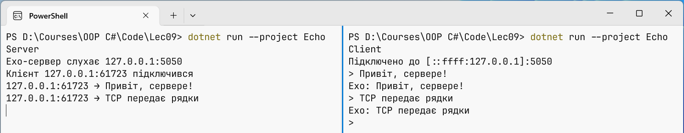
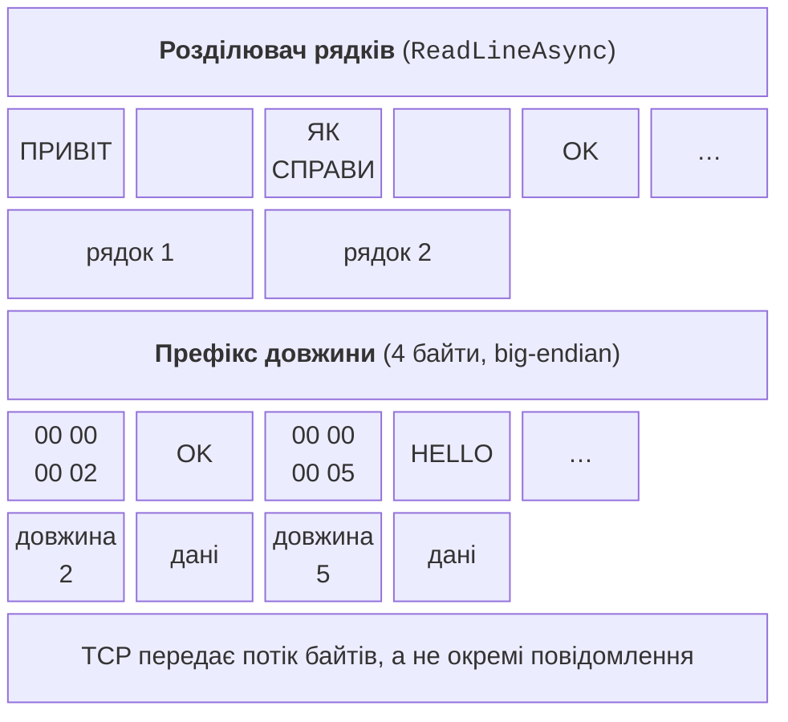

# TCP: клієнт, сервер і протокол

## Класи `TcpListener`, `TcpClient` і `NetworkStream`

Для TCP у .NET є зручніші класи-обгортки над `Socket` (<https://learn.microsoft.com/dotnet/fundamentals/networking/sockets/tcp-classes>):

- `TcpListener` – сервер: `Start()` виконує `Bind` і `Listen`, `AcceptTcpClientAsync()` приймає клієнта, `Stop()` припиняє прослуховування;
- `TcpClient` – з’єднання: `ConnectAsync(host, port)` підключається за іменем або адресою, `GetStream()` повертає потік, а властивість `Client` дає доступ до внутрішнього `Socket`;
- `NetworkStream` – потік (`Stream`) поверх сокета: `ReadAsync`, `WriteAsync`, `ReadExactlyAsync` та інші звичні методи потоків.

Потік можна «обгорнути» класами `StreamReader` і `StreamWriter` і обмінюватися рядками тексту. Текст передається байтами, тому обидві сторони мають використовувати одне **кодування** – UTF-8. Дві деталі легко пропустити:

- `StreamWriter` за замовчуванням буферизує дані; без `AutoFlush = true` або виклику `FlushAsync` рядок не піде в мережу, і обидві програми чекатимуть одна на одну;
- `new StreamWriter(stream, Encoding.UTF8)` на початку запису надсилає **BOM** – три байти `EF BB BF`, які опиняться на початку першого рядка співрозмовника. Об’єкт `new UTF8Encoding(false)` пише UTF-8 без BOM.

Властивість `NewLine = "\n"` робить розділювач рядків однаковим на всіх ОС (у Windows за замовчуванням `"\r\n"`); `ReadLineAsync` розпізнає обидва варіанти.

### Приклад «Ехо-сервер»

Сервер приймає клієнтів по одному, читає рядки і повертає кожен рядок із префіксом `Ехо:`. Сервер слухає лише петлеву адресу, тож до нього можна підключитися тільки з цього комп’ютера.

```cs
using System.Net;
using System.Net.Sockets;
using System.Text;

Console.OutputEncoding = Encoding.UTF8;

var listener = new TcpListener(IPAddress.Loopback, 5050);
listener.Start();
Console.WriteLine($"Ехо-сервер слухає {listener.LocalEndpoint}");

while (true)
{
    // Очікування наступного клієнта (по одному за раз).
    using TcpClient client = await listener.AcceptTcpClientAsync();
    EndPoint? remote = client.Client.RemoteEndPoint;
    Console.WriteLine($"Клієнт {remote} підключився");

    NetworkStream stream = client.GetStream();
    var reader = new StreamReader(stream, Encoding.UTF8);
    var writer = new StreamWriter(stream, new UTF8Encoding(false))
    {
        AutoFlush = true,   // надсилати кожен рядок одразу
        NewLine = "\n"
    };

    string? line;
    while ((line = await reader.ReadLineAsync()) != null)
    {
        Console.WriteLine($"{remote} → {line}");
        await writer.WriteLineAsync($"Ехо: {line}");
    }
    Console.WriteLine($"Клієнт {remote} відключився");
}
```

Клієнт надсилає введені рядки і виводить відповіді; порожній рядок завершує роботу:

```cs
using System.Net.Sockets;
using System.Text;

Console.OutputEncoding = Encoding.UTF8;

using var client = new TcpClient();
await client.ConnectAsync("127.0.0.1", 5050);
Console.WriteLine($"Підключено до {client.Client.RemoteEndPoint}");

NetworkStream stream = client.GetStream();
var reader = new StreamReader(stream, Encoding.UTF8);
var writer = new StreamWriter(stream, new UTF8Encoding(false))
{
    AutoFlush = true,
    NewLine = "\n"
};

while (true)
{
    Console.Write("> ");
    string? text = Console.ReadLine();
    if (string.IsNullOrEmpty(text))
    {
        break;                      // порожній рядок – вихід
    }
    await writer.WriteLineAsync(text);
    string? answer = await reader.ReadLineAsync();
    if (answer is null)
    {
        Console.WriteLine("Сервер закрив з’єднання");
        break;
    }
    Console.WriteLine(answer);
}
```

Запустіть сервер і клієнт у двох вкладках Windows Terminal (рис. 9.4) або командою `dotnet run` у двох папках проєктів. Результат клієнта (введені рядки після `>`):

```
Підключено до [::ffff:127.0.0.1]:5050
> Привіт, сервере!
Ехо: Привіт, сервере!
> TCP передає рядки
Ехо: TCP передає рядки
>
```



Рис. 9.4. Ехо-сервер і клієнт у двох панелях Windows Terminal {.caption}

Конструктор `TcpClient()` створює сокет IPv6 у **подвійному режимі** (*dual mode*), який обслуговує й IPv4, тому адреса сервера показана як IPv4-адреса, відображена в IPv6: `[::ffff:127.0.0.1]`. Сервер виводить у журнал рядки на кшталт `127.0.0.1:64104 → Привіт, сервере!`: порт клієнта 64 104 видала операційна система. Поки перший клієнт підключений, другий чекає в черзі `Listen`: цикл сервера обслуговує клієнтів по черзі. Як обслуговувати клієнтів одночасно, розглянуто далі.

## Адреса прослуховування і брандмауер Windows

Адреса, яку слухає сервер, визначає, хто може підключитися:

- `IPAddress.Loopback` (`127.0.0.1`) – лише програми на цьому комп’ютері;
- `IPAddress.Any` (`0.0.0.0`) – усі мережні інтерфейси IPv4: сервер доступний у локальній мережі;
- `IPAddress.IPv6Any` з `listener.Server.DualMode = true` – IPv4 та IPv6 одночасно.

Клієнт, що підключається до імені `localhost`, спочатку пробує адресу `::1`. Якщо сервер слухає лише `127.0.0.1`, ця спроба відхиляється, і в Windows з’єднання встановлюється приблизно на 2 с пізніше. Тому в клієнтах прикладів записано `"127.0.0.1"`.

**Брандмауер Windows** (*Windows Firewall*) за замовчуванням блокує вхідні з’єднання (<https://learn.microsoft.com/windows/security/operating-system-security/network-security/windows-firewall/rules>). Коли програма вперше починає слухати мережний (не петлевий) інтерфейс і для неї немає правила, Windows показує вікно *Windows Security Alert* (рис. 9.5). Користувач з правами адміністратора може дозволити доступ у приватних (*Private networks*) або публічних мережах. Якщо закрити вікно кнопкою *Cancel* або не мати прав адміністратора, створюються **блокувальні** правила, і клієнти з інших комп’ютерів не підключаться, хоча на цьому комп’ютері все працює. Такі правила можна переглянути й видалити в *Windows Security → Firewall & network protection → Allow an app through firewall*. Петлевий інтерфейс брандмауер не перевіряє.

::: info Знімок екрана
First run of ChatServer bound to 0.0.0.0: Windows Security Alert, Private networks checked
:::

Рис. 9.5. Запит брандмауера Windows під час першого запуску сервера {.caption}

::: tip Порада
Під час розроблення слухайте `IPAddress.Loopback`. Адресу `IPAddress.Any` використовуйте, коли клієнти справді працюють на інших комп’ютерах, і дозволяйте доступ лише в приватних мережах.
:::

## Межі повідомлень у потоці TCP

TCP передає **потік байтів**, а не повідомлення: якщо клієнт двічі надіслав по 10 байтів, сервер може отримати 20 байтів одним викликом `ReadAsync` або 3 і 17. Тому прикладний протокол має визначати, де закінчується кожне повідомлення. Поширені два способи (рис. 9.6):

- **розділювач** (*delimiter*) – повідомлення закінчується символом `\n`; так працюють текстові протоколи (SMTP, FTP, Redis) і `ReadLineAsync`. Сам текст не повинен містити розділювача;
- **префікс довжини** (*length prefix*) – перед повідомленням передається його довжина фіксованим числом байтів; отримувач читає рівно стільки байтів. Так передають двійкові дані й файли.



Рис. 9.6. Визначення меж повідомлень у потоці TCP {.caption}

Багатобайтові числа в мережних протоколах зазвичай записують у **мережному порядку байтів** (*big-endian*): старший байт першим. Процесори x86 і ARM зберігають числа у зворотному порядку (*little-endian*), тому для запису використовують методи `BinaryPrimitives.WriteInt32BigEndian`, `ReadInt64BigEndian` та інші з простору імен `System.Buffers.Binary` (<https://learn.microsoft.com/dotnet/api/system.buffers.binary.binaryprimitives>). Щоб прочитати рівно *n* байтів, використовують `ReadExactlyAsync`: він повторює читання, доки буфер не заповниться, або спричиняє `EndOfStreamException`, якщо з’єднання закрилося раніше. Методи надсилання й читання повідомлення з префіксом довжини:

```cs
// Повідомлення: 4 байти довжини (big-endian), потім байти UTF-8.
static async Task WriteMessageAsync(Stream stream, string text)
{
    byte[] data = Encoding.UTF8.GetBytes(text);
    byte[] prefix = new byte[4];
    BinaryPrimitives.WriteInt32BigEndian(prefix, data.Length);
    await stream.WriteAsync(prefix);
    await stream.WriteAsync(data);
}

static async Task<string> ReadMessageAsync(Stream stream)
{
    byte[] prefix = new byte[4];
    await stream.ReadExactlyAsync(prefix);   // рівно 4 байти
    int length = BinaryPrimitives.ReadInt32BigEndian(prefix);
    if (length is < 0 or > 1_000_000)        // захист від 2 ГБ
    {
        throw new InvalidDataException($"довжина {length}");
    }
    byte[] data = new byte[length];
    await stream.ReadExactlyAsync(data);
    return Encoding.UTF8.GetString(data);
}
```

Для повідомлень `OK` і `HELLO` у мережу йдуть байти `00 00 00 02` `4F 4B` `00 00 00 05` `48 45 4C 4C 4F` (перевірено виведенням `Convert.ToHexString`). Отримувач перевіряє довжину: без обмеження зловмисник міг би надіслати число 2 000 000 000 і змусити програму виділити 2 ГБ пам’яті. Так само передають файли: заголовок містить ім’я та розмір файлу, за ним ідуть байти вмісту. Ім’я файлу від клієнта пропускають через `Path.GetFileName`, щоб запис `..\..\x.exe` не вийшов за межі папки сервера.

Структуровані дані зручно передавати у форматі **JSON**: один об’єкт серіалізується в один рядок (формат *JSON Lines*), і межі повідомлень знову визначає `\n` (<https://learn.microsoft.com/dotnet/standard/serialization/system-text-json/overview>):

```cs
var options = new JsonSerializerOptions
{
    Encoder = JavaScriptEncoder.UnsafeRelaxedJsonEscaping
};
var message = new ChatMessage("Олена", "Привіт!", 2);

// Відправник: один об’єкт JSON – один рядок.
string json = JsonSerializer.Serialize(message, options);
await writer.WriteLineAsync(json);

// Отримувач: рядок → об’єкт.
string? line = await reader.ReadLineAsync();
ChatMessage? received = line is null
    ? null : JsonSerializer.Deserialize<ChatMessage>(line);

record ChatMessage(string From, string Text, int Room);
```

Рядок JSON має вигляд `{"From":"Олена","Text":"Привіт!","Room":2}`. Без кодувальника `UnsafeRelaxedJsonEscaping` серіалізатор записує кирилицю кодами `\u041E…`: це коректний JSON, але довший і нечитабельний.

## Прикладний протокол

Коли клієнт і сервер пишуть різні люди, правила обміну потрібно описати документом – **прикладним протоколом**. Опис протоколу містить:

- **спосіб виділення повідомлень**: рядки UTF-8 з `\n`, префікс довжини або JSON Lines;
- **команди** клієнта та їх аргументи: `ADD 2 3`, `QUIT`;
- **відповіді** з кодами стану, як у протоколах SMTP і HTTP: `1xx` – інформація, `2xx` – успіх, `4xx` – помилка в запиті, `5xx` – помилка сервера (табл. 9.2);
- **стани сесії**: які команди допустимі до входу (`HELLO`, `LOGIN`) і після нього;
- **обмеження**: максимальна довжина рядка чи файлу, кількість з’єднань, тайм-аут бездіяльності;
- **версію протоколу** в привітанні (`CALC/1.0`), щоб старий клієнт і новий сервер могли домовитися або коректно відмовити.

Таблиця 9.2. Коди відповідей навчального протоколу CALC/1.0 {.caption}

| **Код** | **Значення** | **Приклад** |
| --- | --- | --- |
| 100 | сервер готовий, повідомляє версію протоколу | `100 CALC/1.0 готовий` |
| 200 | команду виконано | `200 6.5` |
| 400 | неправильний формат команди | `400 формат: SUB число число` |
| 403 | команда недопустима в цьому стані сесії | `403 спочатку HELLO CALC/1.0` |
| 404 | невідома команда | `404 невідома команда «SQRT»` |
| 413 | повідомлення завелике, з’єднання закривається | `413 рядок довший за 100` |
| 505 | версія протоколу не підтримується | `505 підтримується лише CALC/1.0` |

Числові коди зручні програмам, текст після коду – людям. Для чисел у протоколі використовують інваріантну культуру (`CultureInfo.InvariantCulture`): сервер з українськими налаштуваннями і клієнт з англійськими мають однаково розуміти `2.5`. Повну реалізацію протоколу CALC/1.0 наведено в лабораторній роботі.
